# Mac へのインストールと起動方法

[<< 戻る](../)

## Anaconda インストーラのダウンロード

Anaconda をインストールするためのファイル（インストーラと言います）をダウンロードします。
↓ こちらのページを開きましょう。
**[https://www.anaconda.com/products/individual](https://www.google.com/url?q=https://www.anaconda.com/products/individual&sa=D&ust=1599674854553000&usg=AOvVaw2kk1sZ9WfmyqVmYTO4TH0F)**

下の方まで画面をスクロールするとダウンロードボタンが並んでいます。MacOS 用のうち、Graphical Installer の方をダウンロードします。
この際、かなりの容量をダウンロードするため、通信料やハードディスクの残り容量には気を付けてください。
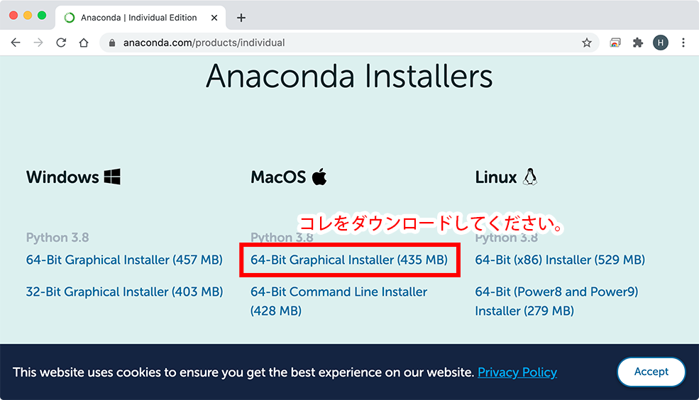

## Anaconda のインストール

Anaconda のインストーラがダウンロード出来たら、実行して Anaconda をインストールします。
ダウンロードしたファイルは「ダウンロード」フォルダに保存されているはずですので、ダウンロードフォルダを開いてみましょう。

**ダウンロードフォルダの開き方**

Dock に Finder のアイコン  があると思い間ますので、クリックします。  Finder のウインドウが開くので、左の一覧から「ダウンロード」を探し、クリックします。  

ダウンロードフォルダには先ほどダウンロードしたファイルがあるかと思いますので、ダブルクリックしてインストールを開始しましょう。

以下、インストールの流れになります。

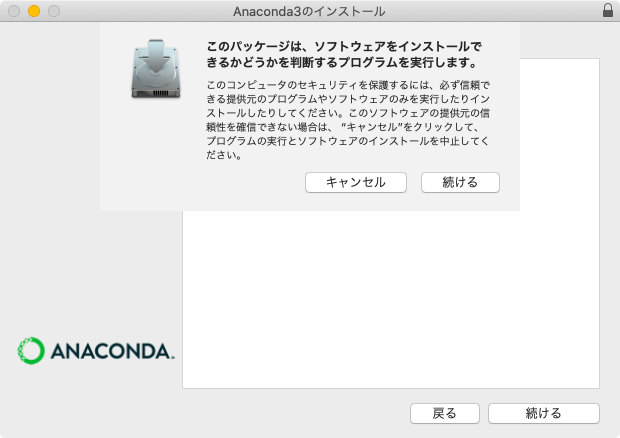
続ける をクリック

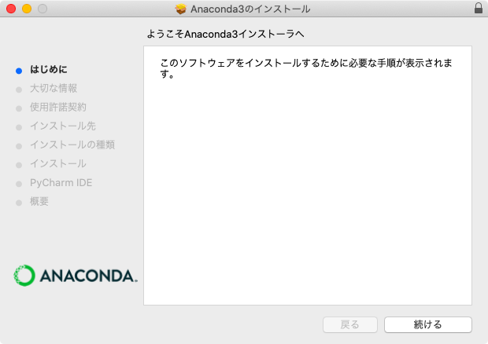
続ける をクリック

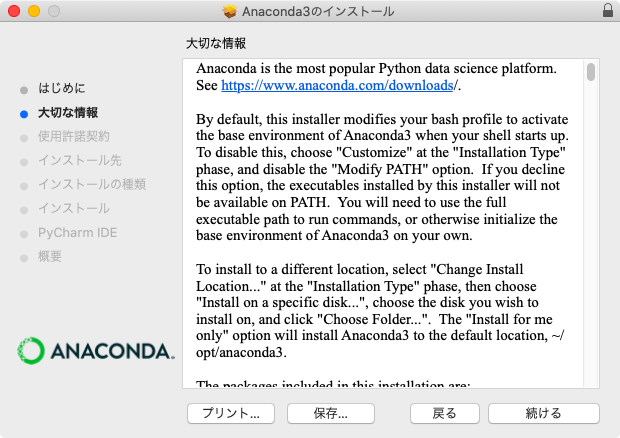
続ける をクリック

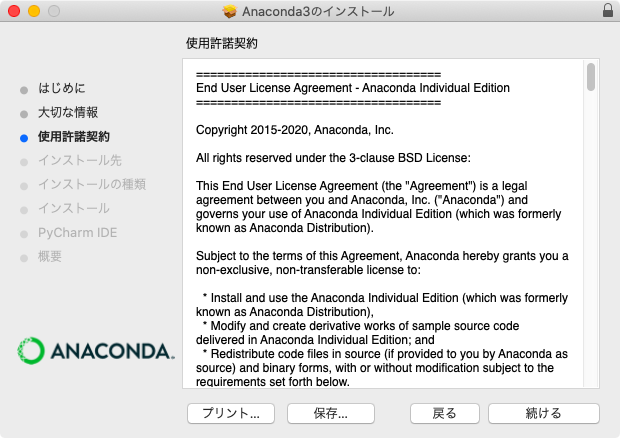
続ける をクリック

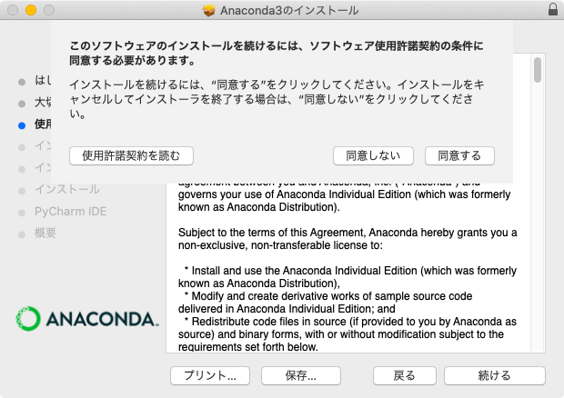
同意する をクリック

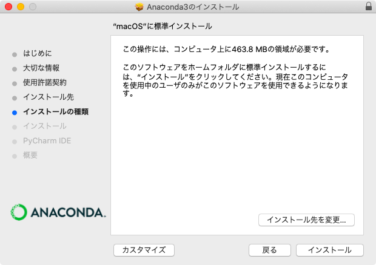
インストール をクリック

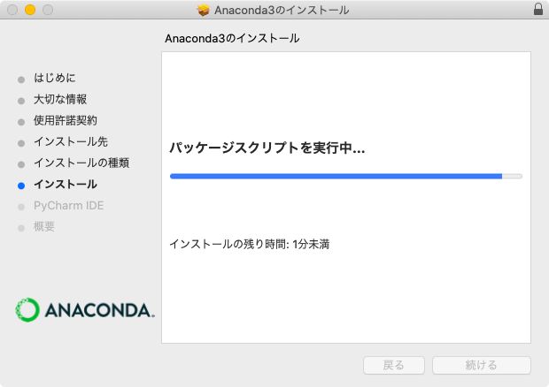
インストールが進んでいきます

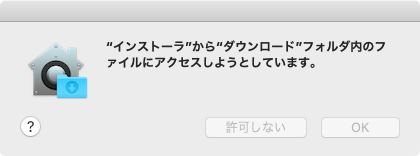
途中で何かの警告が出た場合は OK をクリック

続ける をクリック

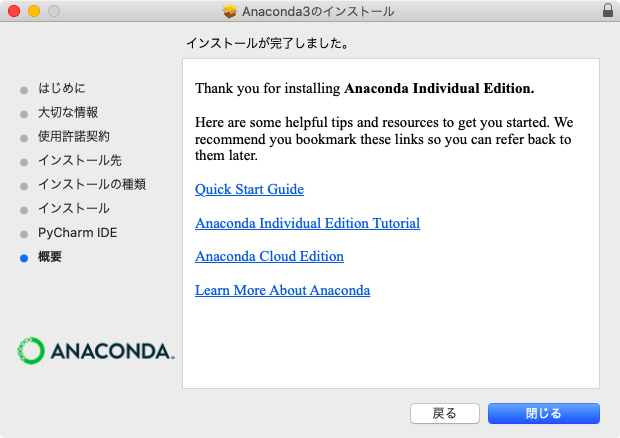
閉じる をクリック

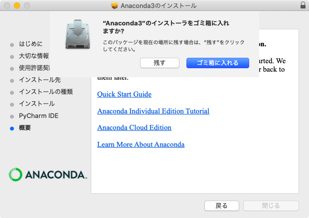
ゴミ箱に入れる をクリック

これでインストールは完了です。

## Spyderを立ち上げてみよう

Anaconda のインストールが無事に終了したら、早速 Spyder を立ち上げてみましょう。
まずは以下のように操作し、Anaconda を立ち上げます。

Dock に Finder のアイコン  があると思いますので、クリックします。

Finder のウインドウが開くので、アプリケーション → Anaconda-Navigator を探し、ダブルクリックします。
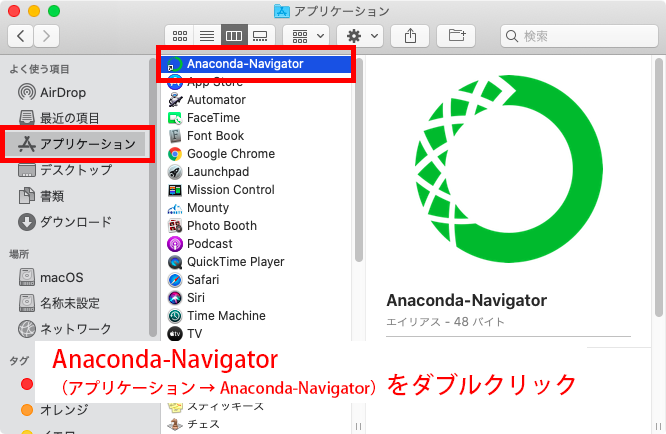

Anaconda-Navigator が起動する際に以下のような表示が出た場合は「OK, and don’t show again」をクリックしておきましょう。
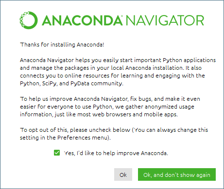

以下のような、Anaconda Navigatorをアップデートできますというメッセージが表示された場合は、ひとまずNo（もしくは、No, Don't show again）でアップデートしないでおいてください。
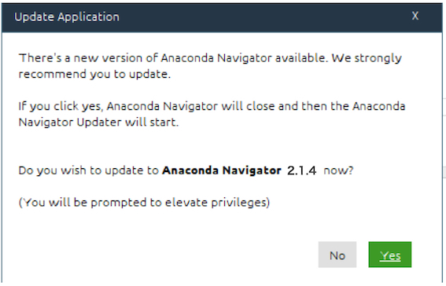

続いて Spyder を立ち上げます。
パネルがたくさん並んでいますので、「Spyder」のパネルを探し、「Launch」ボタンをクリックしてください。
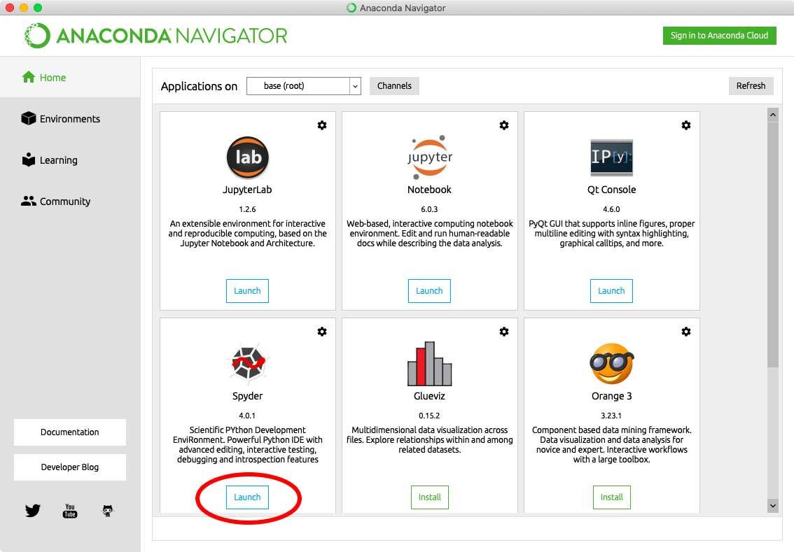

しばらくすると Spyder のウインドウが立ち上がるのですが… 最初の立ち上げの際にはいくつかのメッセージが表示されるかと思います。
その場合は以下のように対応しておいてください。

|  | このようなメッセージが何度か表示される場合があります。OKをクリックしておいてください。 |
| -------------------------- | ------------------------------------------------------------ |
| 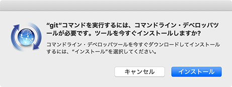 | インストールしてください。                                   |
| 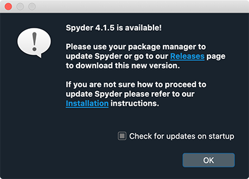 | Spyderをアップデートできますよ！というメッセージが出るかもしれませんが、アップデートで動作が不安定になることもあるので、**アップデートせずに、**Anacondaをインストールしたデフォルトのままにしておく方が安心です。 |
| 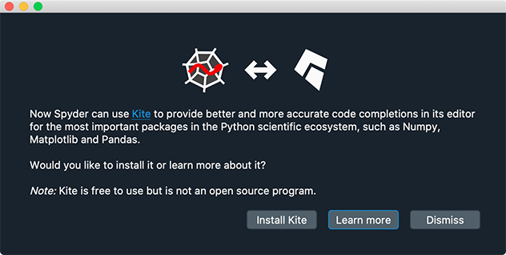  | Kiteという、入力補完機能をインストールできますよ！というメッセージが出た場合は、インストールしてもよいようですが、とりあえずは無視（Dismiss）をクリックしておいてください。 |

そしてこちらが Spyder の画面になります。

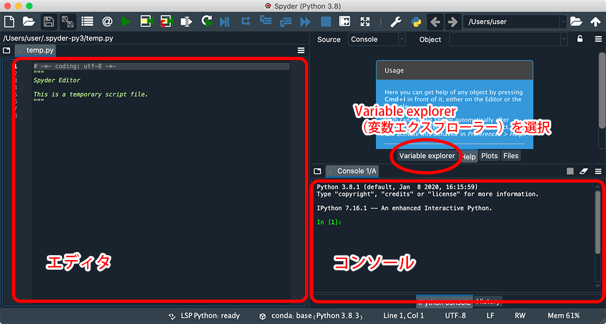

画面の左側は「エディタ」と呼び、 Python の命令（コード）を入力します。
画面右側上段は「変数エクスプローラー」「ヘルプ」「プロット」「ファイル」を選択して表示させることが出来ます。「変数エクスプローラー」を選択しておきましょう。
画面右側下段は「コンソール」と呼ばれ、プログラムの実行結果やエラーメッセージなどが表示されます。

## 日本語化

Mac版の Spyder は、最初はおそらく英語表記になっていると思います。
以下の手順で日本語表記にしておきましょう（英語がいい人はそのままでOKです）。

まず、Spyder の画面上部にある工具アアイコン  をクリックします。

すると設定ウインドウが開くので、右側の「Advanced settings タブ」で Language を日本語にし、OKをクリックします。
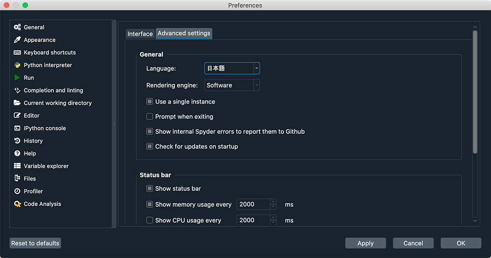

「Spyder を再起動してね」というメッセージが表示されるので、Yesをクリックします。
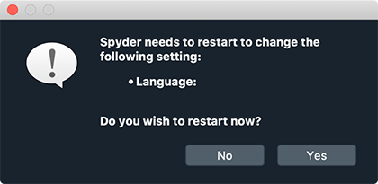

以上で日本語化が出来たと思います。

[<< 戻る](../)