# Mac へのインストールと起動方法

[<< 戻る](../)

## Anaconda インストーラのダウンロード

Anaconda をインストールするためのファイル（インストーラと言います）をダウンロードします。
↓ こちらのページを開きます。

https://www.anaconda.com/products/distribution

下の方まで画面をスクロールするとダウンロードボタンが並んでいます。
MacOS 用のうち、Graphical Installer の方をダウンロードします。
この際、かなりの容量をダウンロードするため、通信料やハードディスクの残り容量には気を付けてください。

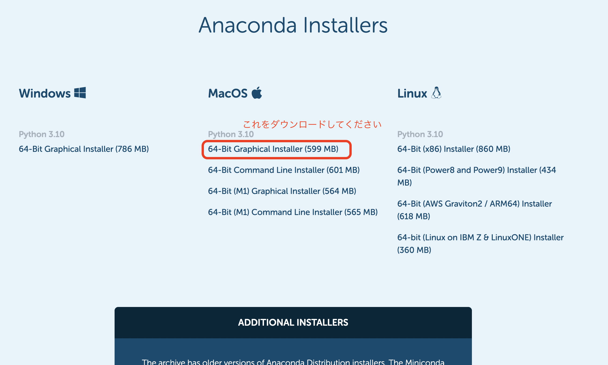

## Anaconda のインストール

Anaconda のインストーラがダウンロード出来たら、実行して Anaconda をインストールします。
ダウンロードしたファイルは「ダウンロード」フォルダに保存されているはずですので、ダウンロードフォルダを開いてみましょう。

**ダウンロードフォルダの開き方**

Dock に Finder のアイコン  があると思い間ますので、クリックします。  Finder のウインドウが開くので、左の一覧から「ダウンロード」を探し、クリックします。 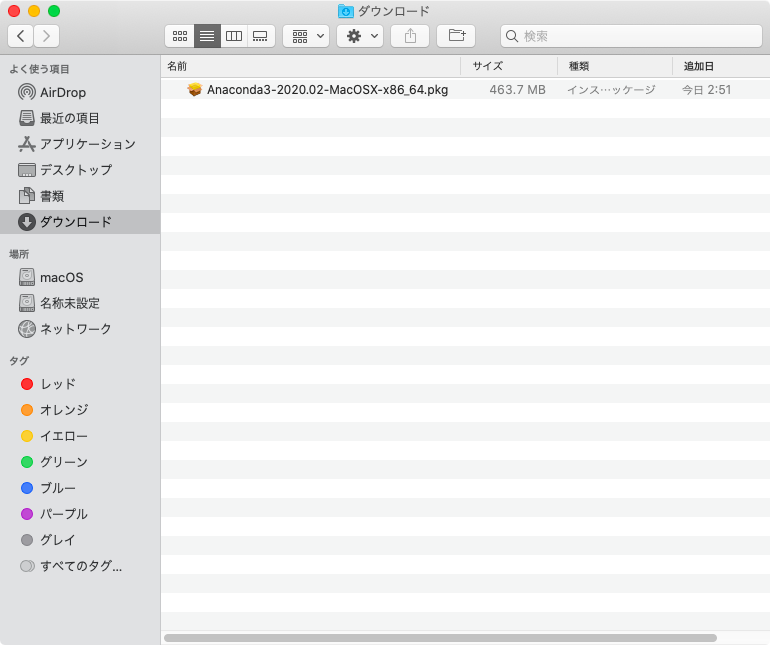 

ダウンロードフォルダには先ほどダウンロードしたファイルがあるはずなので、ダブルクリックしてインストールを開始しましょう。

以下、インストールの流れになります。

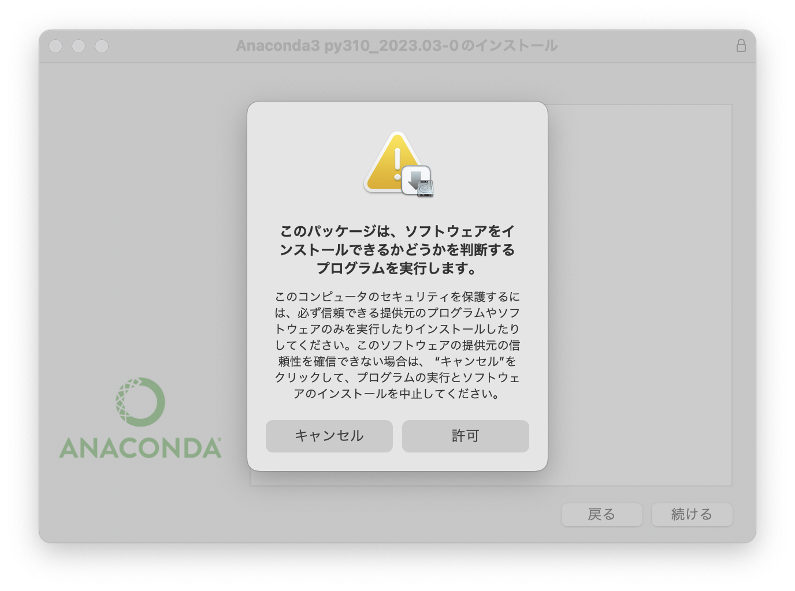
許可をクリック

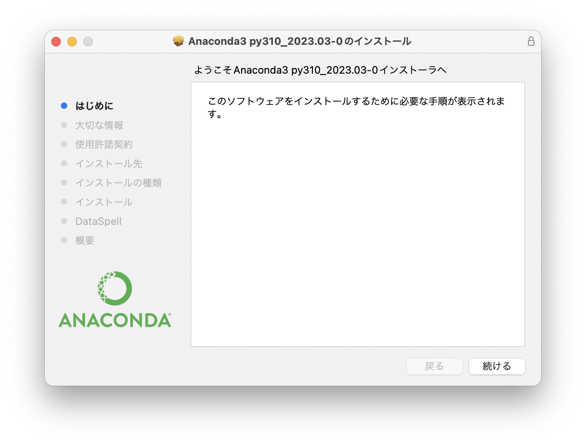
続ける をクリック

次の「使用許諾契約」も「続ける」 をクリック

同意するをクリック

インストール をクリック

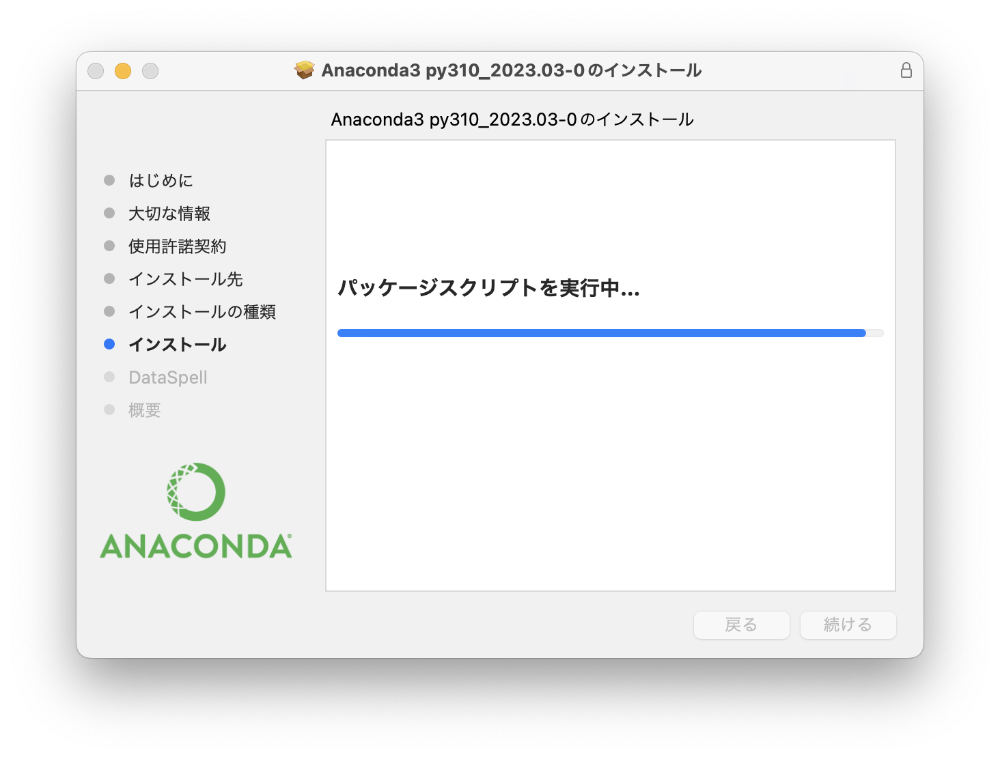
インストールが進んでいきます

途中で何かの警告が出た場合は OK をクリック

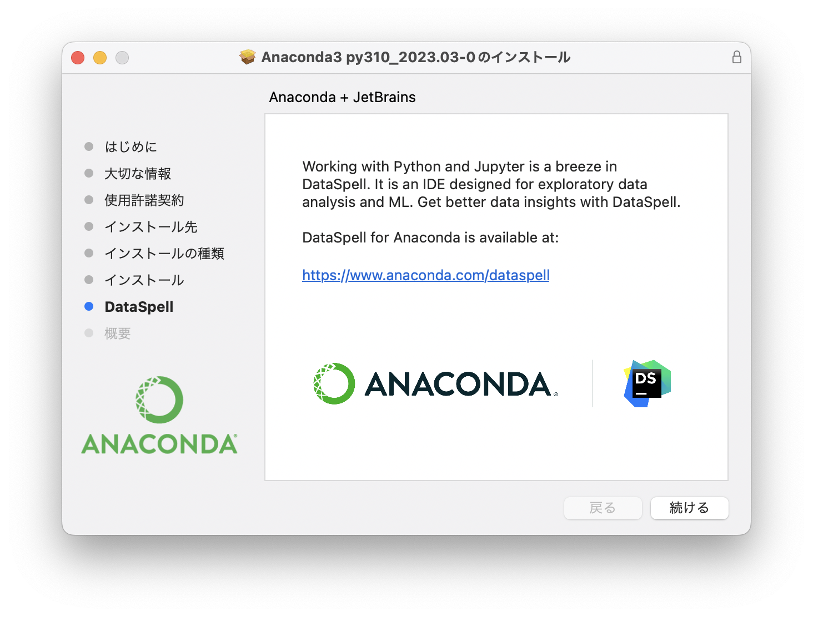
続ける をクリック

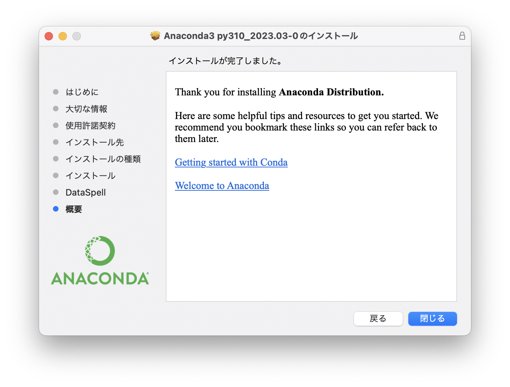
閉じる をクリック

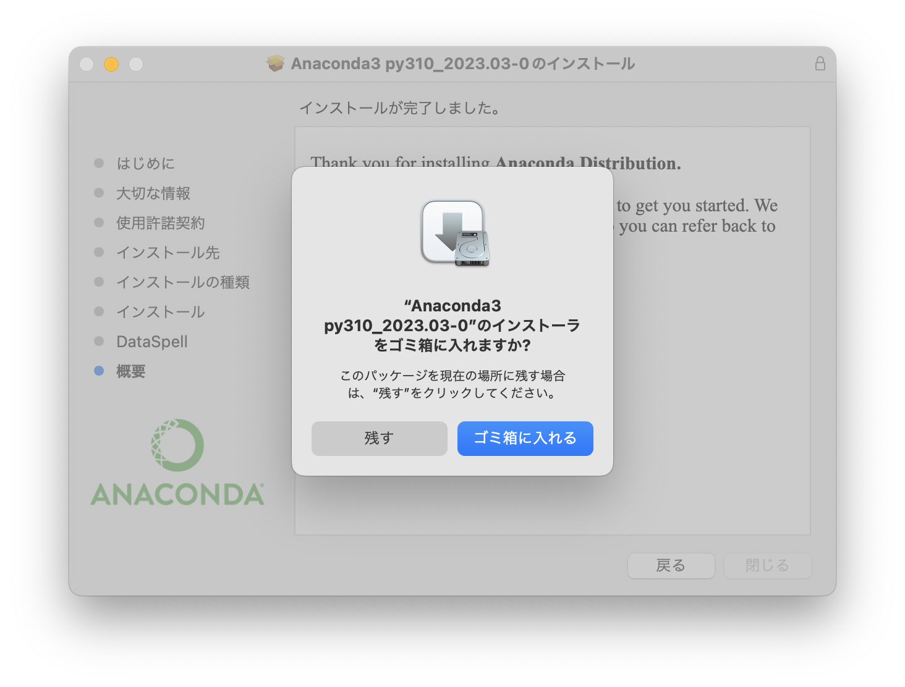
インストーラファイル自体はもう必要ないので、ゴミ箱に入れる をクリック

これでインストールは完了です。

## Spyderを立ち上げてみよう

Anaconda のインストールが無事に終了したら、早速 Spyder を立ち上げてみましょう。
まずは以下のように操作し、Anaconda を立ち上げます。

Dock に Finder のアイコン  があると思いますので、クリックします。

Finder のウインドウが開くので、アプリケーション → Anaconda-Navigator を探し、ダブルクリックします。起動には少し時間がかかる場合もあるので、待ちます。

Anaconda-Navigator が起動する際に以下のような表示が出た場合は「OK, and don’t show again」をクリックしておきましょう。

以下のような、Anaconda Navigatorをアップデートできますというメッセージが表示された場合は、ひとまずNo（もしくは、No, Don't show again）でアップデートしないでおいてください。

続いて Spyder を立ち上げます。
パネルがたくさん並んでいますので、「Spyder」のパネルを探し、「Launch」ボタンをクリックしてください。

しばらくすると Spyder のウインドウが立ち上がるのですが… 最初の立ち上げの際にはいくつかのメッセージが表示されるかと思います。
その場合は以下のように対応しておいてください。

| 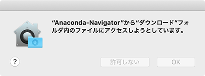                                   | このようなメッセージが何度か表示される場合があります。OKをクリックしておいてください。 |
| ------------------------------------------------------------ | ------------------------------------------------------------ |
|                                    | インストールしてください。                                   |
| 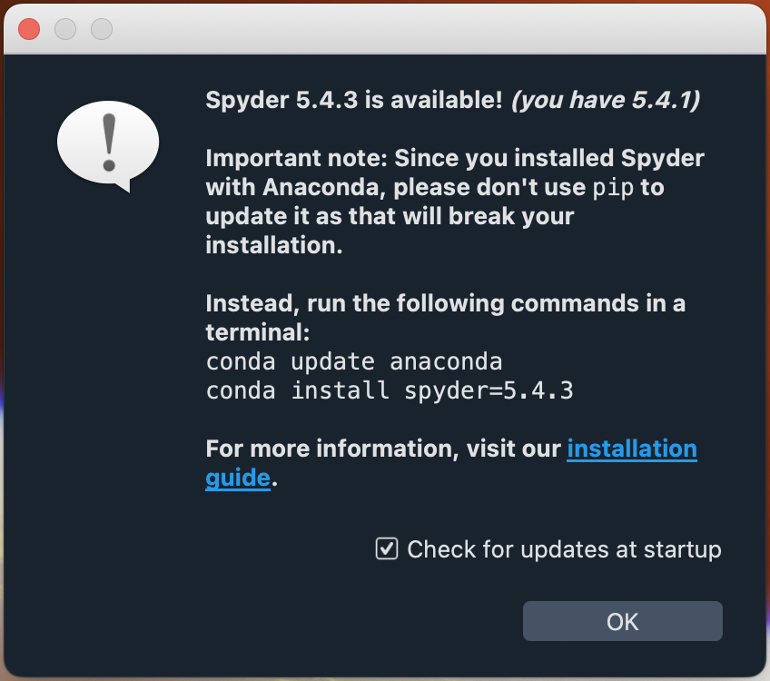 | Spyderをアップデートできますよ！というメッセージが出るかもしれませんが、アップデートで動作が不安定になることもあるので、**アップデートせずに、**Anacondaをインストールしたデフォルトのままにしておく方が安心です。  「Check for updates at startup」のチェックボックスを外して「OK」を押すことで、アップデートをお勧めするこのメッセージが次回から表示されなくなります。 |
|                                     | Kiteという、入力補完機能をインストールできますよ！というメッセージが出た場合は、インストールしてもよいようですが、とりあえずは無視（Dismiss）をクリックしておいてください。 |

そしてこちらが Spyder の画面になります。

画面の左側は「エディタ」と呼び、 Python の命令（コード）を入力します。
画面右側上段は「変数エクスプローラー」「ヘルプ」「プロット」「ファイル」を選択して表示させることが出来ます。「変数エクスプローラー」を選択しておきましょう。
画面右側下段は「コンソール」と呼ばれ、プログラムの実行結果やエラーメッセージなどが表示されます。

## 日本語化

Mac版の Spyder は、最初はおそらく英語表記になっていると思います。
以下の手順で日本語表記にしておきましょう（英語がいい人はそのままでOKです）。

まず、Spyder の画面上部にある工具アアイコン  をクリックします。

すると設定ウインドウが開くので、左側のメニューの「Application」を選択したら、右側の「Advanced settings」タブで Language を日本語にし、OKをクリックします。
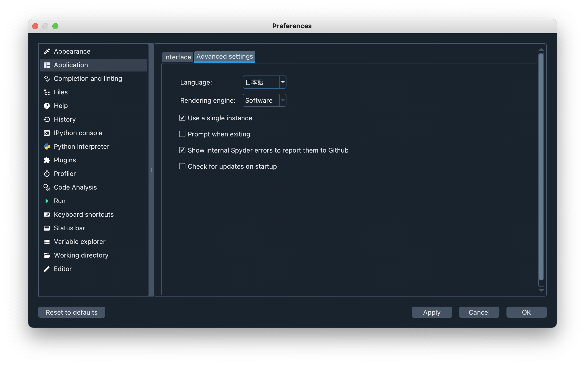

「Spyder を再起動してね」というメッセージが表示されるので、Yesをクリックします。

以上で日本語化が出来たと思います。

[<< 戻る](../)