# Windowsへのインストールと起動方法

[<< 戻る](../)

## Anaconda のインストール、32bit版？64bit版？

まずは自分が使用している Windows が 32bit版であるか 64bit版 であるかの確認をしましょう。
以下の図を参考に、スタートボタンを右クリックし、表示されたメニューから「システム」をクリックします。
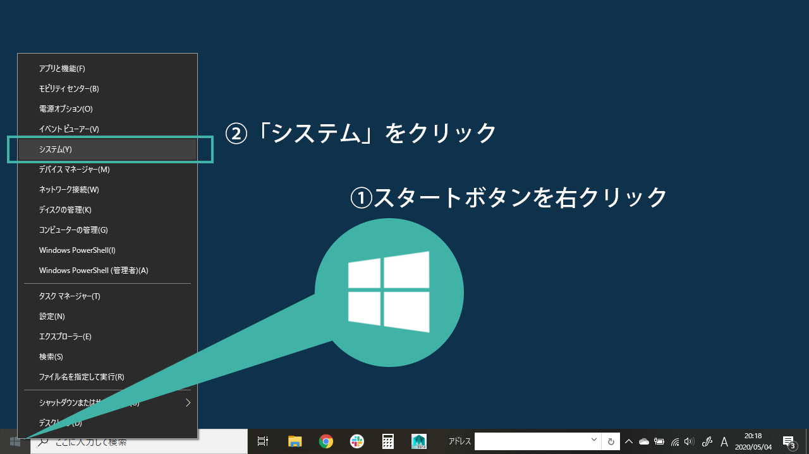

すると以下のようなウインドウが立ち上がるので、「システムの種類」という項目が「64 ビット」であるか「32 ビット」であるかを確認しておきましょう。
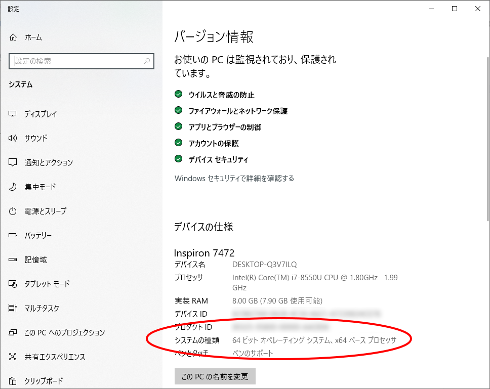

## Anaconda インストーラのダウンロード

Anaconda をインストールするためのファイル（インストーラと言います）をダウンロードします。
↓ こちらのページを開きましょう。
**[https://www.anaconda.com/products/individual](https://www.google.com/url?q=https://www.anaconda.com/products/individual&sa=D&ust=1599450832459000&usg=AOvVaw1dcpi8kcj4RMKCaPbnxaYk)**

下の方まで画面をスクロールするとダウンロードボタンが並んでいます。Windows 用 のうち、**先ほどチェックしたビット数のものをダウンロードします**。
この際、かなりの容量をダウンロードするため、通信料やハードディスクの残り容量には気を付けてください。

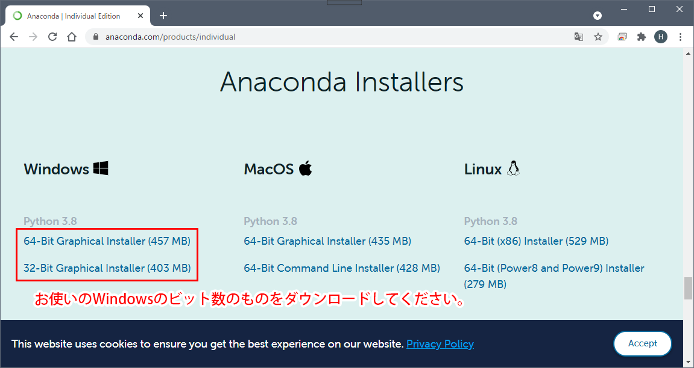

## Anaconda のインストール

Anaconda のインストーラがダウンロード出来たら、実行して Anaconda をインストールします。
ダウンロードしたファイルは「ダウンロード」フォルダに保存されているはずですので、ダウンロードフォルダを開いてみましょう。
ダウンロードフォルダを開くには様々な方法がありますが、分からない場合は以下を試してみてください。

**ダウンロードフォルダの開き方**

タスクバーにフォルダっぽいアイコンがあるかと思いますので、クリックしましょう。 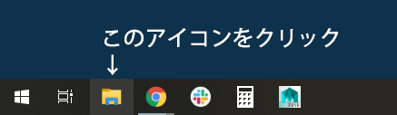

エクスプローラーが開くので、下図を参考にしてダウンロードフォルダを開きましょう。 
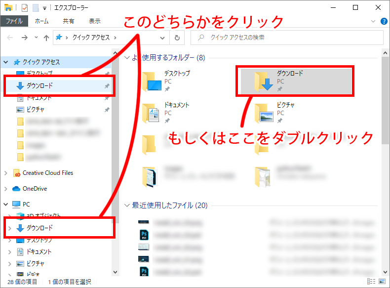 

ダウンロードフォルダには先ほどダウンロードしたファイルがあるかと思いますので、ダブルクリックしてインストールを開始しましょう。

以下、インストールの流れになります。

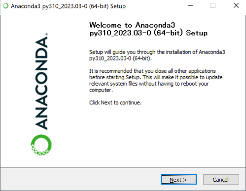
Next をクリック。

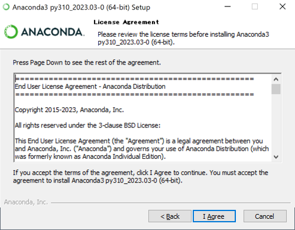
I Agree をクリック。

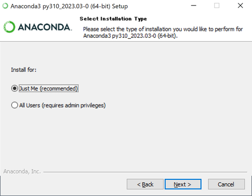
Next をクリック。

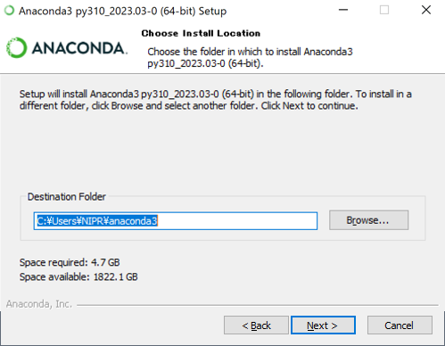
Next をクリック。

Install をクリック。

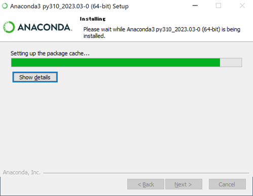
インストールには多少時間がかかります･･･

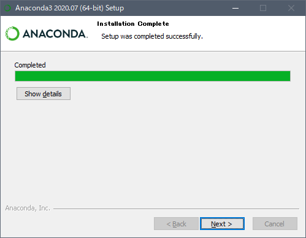
Next をクリック。

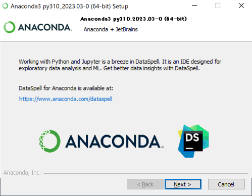
Next をクリック。

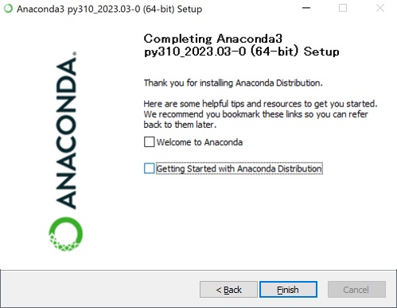
チェックを外し、Finish をクリック。

これでインストールは完了です。

## Spyderを立ち上げてみよう

Anaconda のインストールが無事に終了したら、早速 Spyder を立ち上げてみましょう。
まずは以下のように操作し、Anaconda を立ち上げます。

スタートボタンをクリックすると、スタートメニューが表示されます。
スタートメニュー左側で「Anaconda3 (〇-bit)」の中にある「Anaconda Navigator (Anaconda3)」をクリックします。
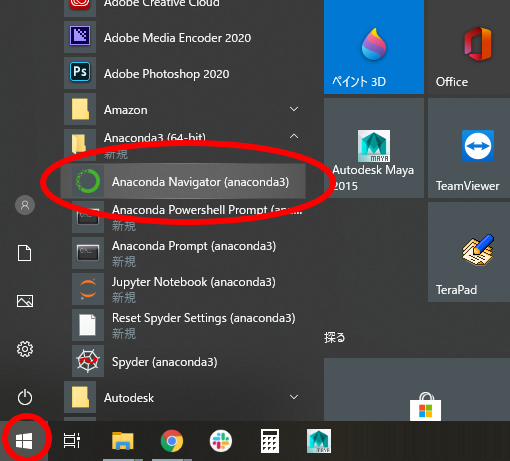

しばらくすると Anaconda-Navigator が立ち上がります。
Anaconda-Navigator が起動する際に以下のような表示が出た場合は「OK, and don’t show again」をクリックしておきましょう。
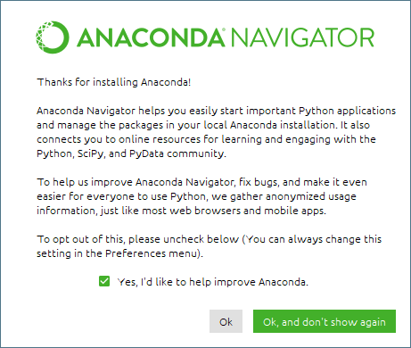

以下のような、Anaconda Navigatorをアップデートできますというメッセージが表示された場合は、ひとまずNo（もしくは、No, Don't show again）でアップデートしないでおいてください。
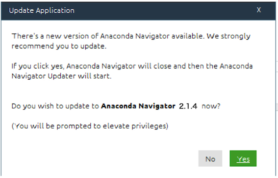

続いて Spyder を立ち上げます。
パネルがたくさん並んでいますので、「Spyder」のパネルを探し、「Launch」ボタンをクリックしてください。
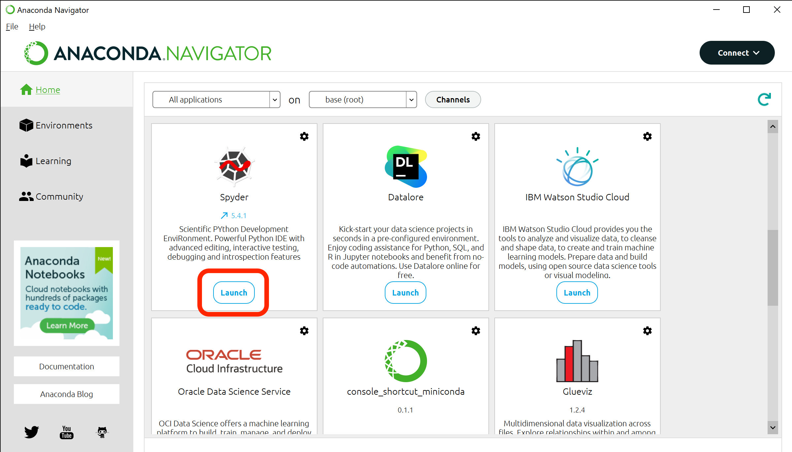

しばらくすると以下のような Spyder のウインドウが立ち上がります。

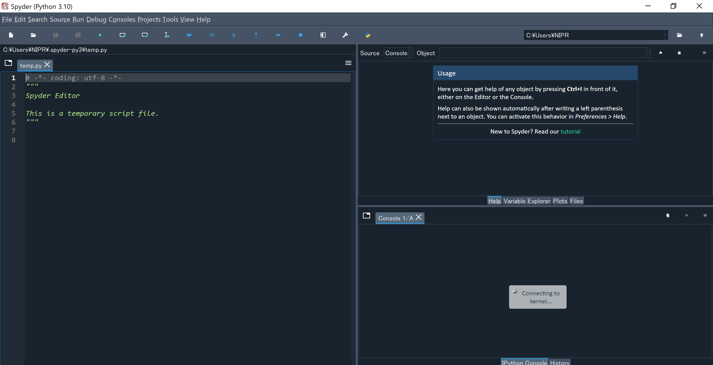

画面の左側は「エディタ」と呼び、 Python の命令（コード）を入力します。
画面右側上段は「変数エクスプローラー」「ヘルプ」「プロット」「ファイル」を選択して表示させることが出来ます。「変数エクスプローラー」を選択しておきましょう。
画面右側下段は「コンソール」と呼ばれ、プログラムの実行結果やエラーメッセージなどが表示されます。

もし以下のようなメッセージが表示されたら、とりあえず無視を選択しておきましょう。
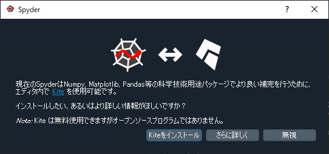

以下のようなSpyderをアップデートできますよ！というメッセージが出るかもしれませんが、アップデートで動作が不安定になることもあるので、**アップデートせずに、**Anacondaをインストールしたデフォルトのままにしておく方が安心です。このメッセージはOKボタンを押して閉じておけば大丈夫です。
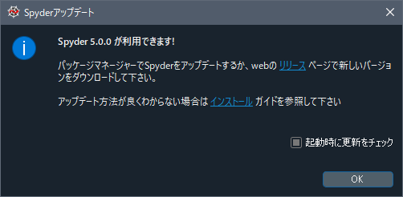

[<< 戻る](../)