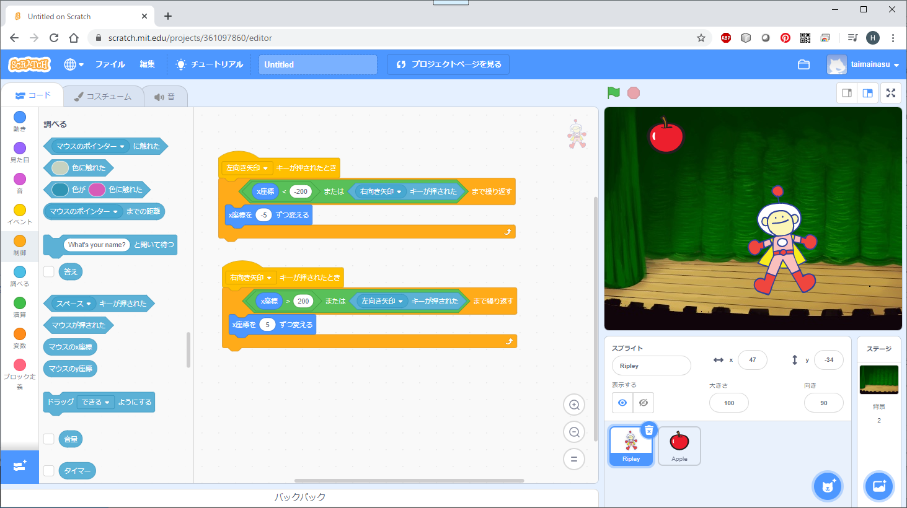
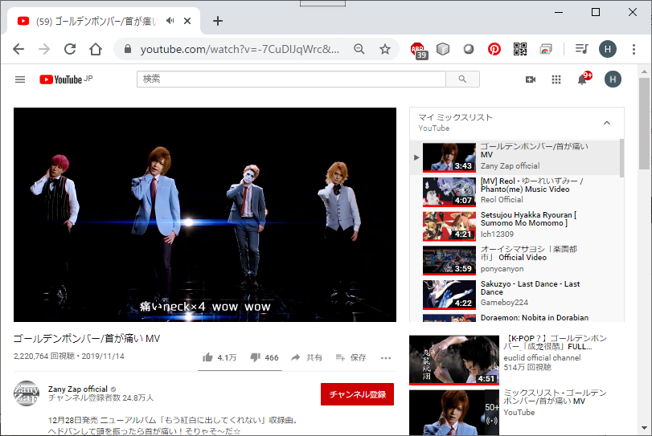

# イントロダクション（パイソンとは？）

[< 戻る](../)

<iframe width="560" height="315" src="https://www.youtube.com/embed/gITzI64BJQA?rel=0" title="YouTube video player" frameborder="0" allow="accelerometer; autoplay; clipboard-write; encrypted-media; gyroscope; picture-in-picture" allowfullscreen></iframe>

## プログラミング言語のランキングを見てみよう！

世の中にはものすごく多くのプログラミング言語が存在しています（英語版 Wikipedia でプログラミング言語の一覧を表示してみると、およそ 700種類！）。Python もたくさんあるプログラミング言語のうちの一つです。
まずは、どのプログラミング言語が人気があるのかを見てみましょう。

2019年度版人気プログラミング言語ランキング（IEEE Spectrum による発表）
[https://news.mynavi.jp/article/20190927-900049/](https://www.google.com/url?q=https://news.mynavi.jp/article/20190927-900049/&sa=D&ust=1589040629249000)

米国の電気工学技術の学会誌である「IEEE Spectrum」が発表するランキングということで、研究開発やエンジニアリング分野におけるランキングとなっています。

他にもプログラミング言語の人気度に関するランキングで「TIOBE Index」というものがありますが、こちらのランキングでも近年、 Python は常に上位にランキングされています。

[https://www.tiobe.com/tiobe-index/](https://www.google.com/url?q=https://www.tiobe.com/tiobe-index/&sa=D&ust=1589040629252000)

※ 2020年4月の TIOBE Index

### POINT

- パイソンはC言語やJAVAと並んで、近年とても注目されているプログラミング言語

- 世の中にはとてもたくさんのプログラミング言語があり、それぞれに得意分野（ゲーム開発にはこの言語がよい、など）がある

- プログラミング言語の種類は数多だが、 どの言語も基本部分は同じ

## どのプログラミング言語を勉強すればいいの？

プログラミング言語の基本部分はどの言語でも同じ、ではあるのですが、例えばゲームを作り たい場合は C++ や C#、WEBデザイナーになりたい場合は JacaScript や PHP といった具合に、 それぞれの言語には得意分野があります 。どの言語を勉強すればよいか？と迷ってしまった時は、「プログラミングで何をしたいか？」で考えましょう。また、 初心者の場合は難易度も考慮して勉強する言語を決めた方がよい かと思いま す。

以下が目的で分類したプログラミング言語一覧です。また、それぞれの言語の難易度（私の主観によるものです）を示してあります。

| 目的                      | 学ぶべきプログラミング言語                                   | 難易度                                                |
| ------------------------- | ------------------------------------------------------------ | ----------------------------------------------------- |
| ゲームを作りたい          | C# C++ JavaScript  HLSL（シェーダプログラム用の言語） GLSL（シェーダプログラム用の言語） | ★★★ ★★★★ ★☆☆  ★★☆ ★★☆        |
| メディアアートを 作りたい | Processing言語（JAVA風）  openFrameworks（C++風）  Arduino言語（C言語風） | ★★☆ ★★★ ★★☆                                 |
| 3DCGデザイナーに なりたい | Python（様々な3DCGソフトで使用できる）  MELスクリプト（C言語風 Maya で使用する）  MAXScript（3dsMax で使用する） | ★☆☆  ★☆☆  ★☆☆                               |
| WEBデザイナーに なりたい  | JavaScript  PHP  Python  Ruby  Perl  Java | ★☆☆  ★☆☆  ★☆☆  ★☆☆  ★☆☆  ★★★ |
| AIを扱いたい              | Python                                                       | ★☆☆                                                   |
| スマホアプリを 作りたい   | Java  C#  Swift  Objrctive-C                  | ★★★  ★★★  ★★★  ★★★                     |

### ビジュアルプログラミング言語

本講義の趣旨からは少し離れてしまいますが、ビジュアルプログラミング言語と呼ばれるプログラミング言語があります。
主にプログラミング初心者や子供の教育向けに工夫されたプログラミングの手法です。

一般的なプログラミング言語が文字で命令（コード）を記述していくのに対し、ビジュアルプログラミング言語は主にマウスによる操作で組み立てていくことでプログラミングを行います。
ブロック状に用意された命令を組み立てていくタイプや、フローチャートのように命令を線でつないでいくタイプがあります。比較的簡単かつ迅速にプログラミングを行い、リアルタイムで実行結果の確認が可能なため、子供の教育以外にもデザイナー向けのツール（メディアアート制作のためのツールなど）に組み込まれているものもあります。
ただし、複雑なプログラミングやプログラムの実行速度はあまり期待できません。

Scratch と呼ばれるビジュアルプログラミング言語
[https://scratch.mit.edu/](https://www.google.com/url?q=https://scratch.mit.edu/&sa=D&ust=1589040629274000)
子供の教育用に広く使われています。WEBブラウザ上で実行することが可能なため、とても手軽にプログラミングの勉強が行えます。
命令を実行していく流れなどは一般的なプログラミング言語と同じですので、Scratch を入口として学習を始めるのもよいかもしれません。無料で出来ますので、興味があったら是非やってみてください。

vvvv と呼ばれるビジュアルプログラミング言語（vvvv公式ページ [https://vvvv.org/](https://www.google.com/url?q=https://vvvv.org/&sa=D&ust=1589040629276000)  より）
リアルタイムな映像制作を得意とするビジュアルプログラミング言語です。
私は使用したことはありませんが、ある程度複雑な映像の制作も行えるようです。

### POINT

- それぞれのプログラミング言語には得意分野がある

- どのプログラミング言語を勉強するかは、プログラミングで何をしたいか？で考える

- 初心者の場合、難易度も考慮した上でどの言語にするかを決めた方がよい

- ビジュアルプログラミング言語は教育用としてよく用いられている

## なぜ Python を勉強するの？

たくさんの言語がありますが、前述したとおりプログラムは記述の仕方が異なるだけで基本的には同じようなことをやっています。例えば私たちの言葉に日本語や英語、スペイン語などの様々な言語があるようなものです。したがって、一つの言語を習得することでその他の言語も比較的簡単に習得することができます。
本講義で Python を勉強するのは、習得しやすい Python でプログラミングの基礎を理解するため、となります。基礎さえ分かってしまえばその他の言語の習得も割と短時間で可能なため、Python の学習が各々が本当にやりたいことへの近道になってもらえればと思っています。

### Python の特徴

Pythonの特徴を簡単に示すと以下のようになります。

- 文法がシンプルで読みやすい

- ライブラリ（追加できる機能）が豊富

Pythonは比較的初心者向けの言語であるにも関わらず、多くの機能を扱うことが出来ます。学習する時間は短いのに、様々な分野のプログラムを作ることが出来ます。特に、最近ニュースなどでよく耳にする「人工知能」「機械学習」といった機能を搭載したソフトウェアの開発を行うには Python 一択と言われるほど、機械学習のためのライブラリが充実しています。

### Python が開発に用いられた有名ソフトウェアの例

- YouTube
  
  
  
- Blender
  
  
  
- Instagram
  
  
  
- Dropbox
  
  

### デザイナーでも役立つ Python の技術

Maya、Cinema4D、Houdini、Blender といった3DCG系のソフトウェアの多くで、Python を使用することが出来ます。例えばゲームフィールドのような広大な地形モデルに草や木、石ころなどのモデルを配置しようと思った場合、手動で配置していたら何日もかかってしまいます。こういう時には Python を使うことで、ほんの一瞬で同じ作業を行うことが出来ます。
私も元々はプログラミングなどやったこともない3DCGデザイナーをしていましたが、プログラミングを少し覚えることで、飛躍的に生産効率とクオリティが上がりました。
3DCG系ソフトウェアの勉強として、プログラミング（スクリプティング）は後回しにされがちです。また、制作の現場でもプログラミングが出来る、もしくは理解のあるデザイナーはまだまだ少ないようです。プログラミングを少しでも習得しておくことで仕事の効率だけでなく、仕事の幅も大きく広がります。

↓Mayaで、一瞬で草むらをつくる（金曜日のプログラミング入門授業担当の中山先生提供）

<iframe width="560" height="315" src="https://www.youtube.com/embed/-jcNQX1vKyc?rel=0" title="YouTube video player" frameborder="0" allow="accelerometer; autoplay; clipboard-write; encrypted-media; gyroscope; picture-in-picture" allowfullscreen></iframe>

### POINT

- Python は文法がシンプルで、比較的習得しやすい

- 様々なアプリケーション制作にも用いられている

- 3DCGソフトの多くは Python が使用できるため、Python を学習することでCG制作の効率を上げることができる

## この授業で習得してほしいこと

この授業で是非習得してほしいのは次の5つです。

**変数**

プログラミングでは文字列や数値など、様々なデータを扱いますが、変数というのはそれらを入れておく箱のようなものです。 中学校や高校の数学の授業で「変数」が出てきましたが、プログラミングで言うところの「変数」も、とりあえずはそのようなものだと考えておいてよいです。

**順次処理**

順次処理とは順番に物事を処理していく、ということです。 例えば「朝起きて」→「朝ご飯を食べて」→「登校」… というように１日の生活の流れは決まっていて、我々は決まった流れに沿って行動します。 コンピュータがプログラムを実行する際も、書かれた命令を順番にこなしていきます。

**条件分岐**

ある条件によって次に処理する命令を変化させる、というものです。 我々の生活で例えると、「もし雨が降ったら」→「傘を持って行く」のような感じです。

**繰り返し**

学校では1時間目から6時間目くらいまで、授業を繰り返し受けます。授業内容はそれぞれ違うものですが、「授業」は「授業」です。 このように繰り返し何かの作業を行うことはコンピュータが得意としています。例えば画像処理をする際などはコンピュータは数百万回の繰り返し処理を一瞬でこなしています。

**関数**

コーヒーメーカーは材料を入れてメニューを選ぶと完成したコーヒーが出力されます。この場合、コーヒーメーカーが「関数」に相当します。 例えば占いのプログラムを作ったとします。この場合自分の誕生日（材料）を入力し、コンピュータがなんやかんや処理して運勢を出力します。この「なんやかんや」の部分は通常「関数」としてまとめておきます。関数としてまとめておくと、他のアプリケーションにも占い機能を追加したいと思った際には組み込みやすくて便利ですね。

先述した通り、プログラミング言語はたくさんありますが、どのプログラミング言語でも基本部分は同じです。この5つはどのプログラミング言語でも必ず出てきますので、是非習得しておきましょう。

それでは次は Python を学習するための開発環境のインストールを行いましょう。トップページから「開発環境のインストール」を選択してください。

[< 戻る](../)