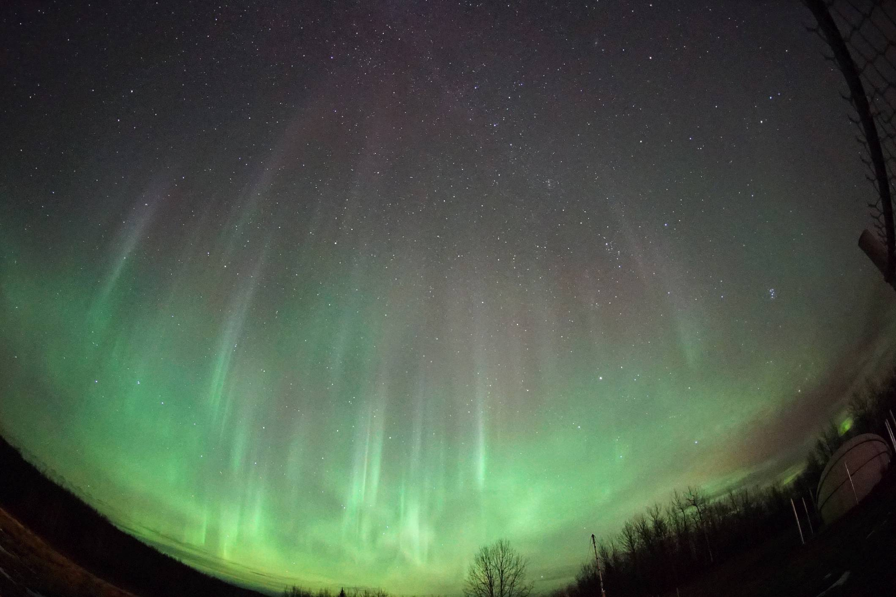
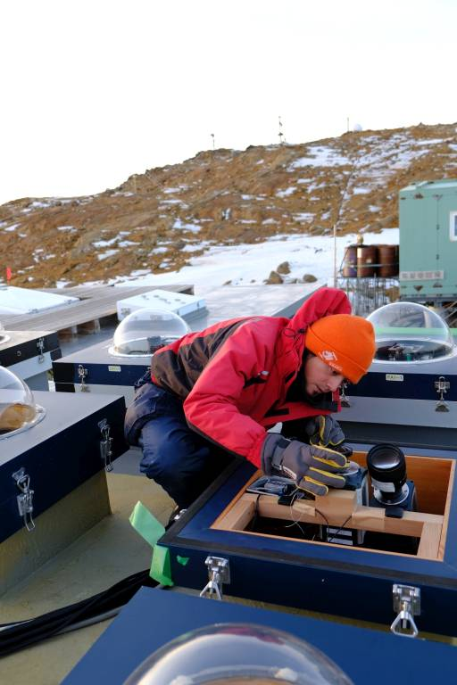

# はじめに

## 自己紹介

内田　ヘルベルト陽仁（あきひと）

- 宇宙航空研究開発機構（JAXA）で、人工衛星のデータを処理したり、データを公開するシステムを開発。
- その前は、オーロラの研究をしていました。アイスランドや南極へ観測に行ったり、観測データを分析したり。
- ギター、電子工作、植物が好き。

（左）オーロラ＠カナダ・アサバスカ、（右）観測用のカメラを設置中＠南極・昭和基地

## 授業の進め方

- オンデマンド型の授業
- 週の前半に、次回の授業のWebテキストをアップ
- テキストに沿って、各自で進める
- 分からない事があったら、授業の時間中は、Teamsの掲示板／個人のチャットで聞いてください
  （授業時間以外であれば、土曜日中であれば出来る限り早く返事をします）

## 課題と出席について

- Webテキストの最後に課題、期限は２週間後の授業日まで。
  （今回は初回なので、課題は無し）
- 課題の提出＝出席とカウントします
- 評価は、課題の提出状況と内容
