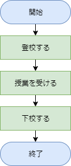
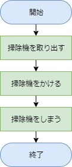
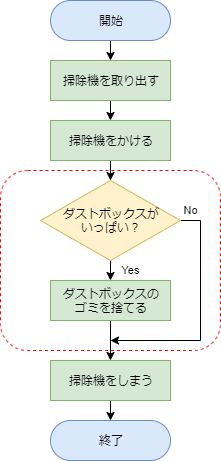
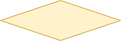
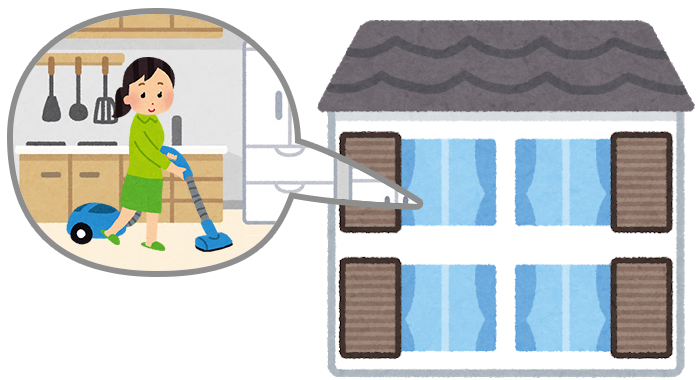
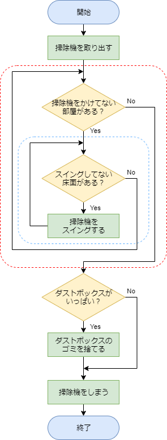
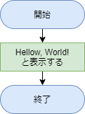
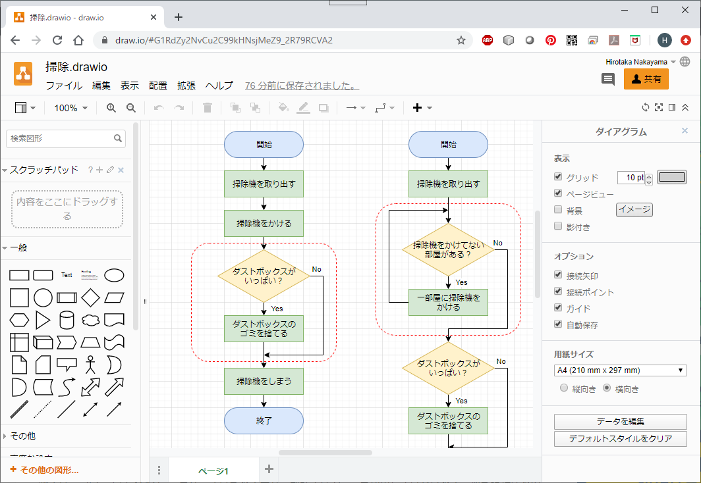

# フローチャートのすゝめ

[< 戻る](../)


## フローチャートって？

「フローチャート」とは、プログラミングにおける設計図に相当するものです。

何かをスムーズに組み立て、作り上げていくためには最初にきちんとした設計を行うことが大切です。例えば料理を作るためには「レシピ」を考える必要があります。また、動画を制作をする場合は「絵コンテ」という設計図を書きます。フローチャートでは、どのような処理をどのような順序で行うかの流れを表現します。少し面倒に感じるかもしれませんが、まずフローチャートを書いて整理しておくことで、ミスや機能の付け忘れを防ぎ、結果としてプログラミングの速度が上がります。

人に見せるようなちゃんとしたフローチャートは書けなくても大丈夫です。あくまで自分が理解できる程度の簡単なものでよいので、プログラミングの前にはまずフローチャートを書く癖をつけるようにしましょう。


## フローチャートの例を見てみよう

プログラミングに限らず、あるひとまとまりの作業を行う時に取る行動をフローチャートとして書くことが出来ます。



例えばこれは、「学校に行って帰る」という一連の流れをフローチャートとして表現したものです。

このように各行動をブロックで分け、線で繋いで表現することで、どういう流れで行動していくかということが直感的に伝わります。
それでは他の例を見つつ、フローチャートの書き方を覚えていきましょう。

次の例は「部屋を掃除する」です。


このようにとてもシンプルなフローチャートになりました。
まずは掃除機を取り出します。その次に掃除機をかけ、掃除機を片づけて終了です。

どちらにも共通して「開始」と「終了」というブロックがあります。どのようなフローチャートを書く場合でも、両端が丸いブロックで「開始」と「終了」を記述しましょう。また、「掃除機を取り出す」「掃除機をかける」「掃除機をしまう」というそれぞれの行動（処理）は長方形のブロック内にそれぞれ記述し、行動の順番にならべて線で繋ぎます。

このように 上から順に命令を実行していくことを「**順次処理**」 といいます。

では、このフローチャートに、「掃除機のダストボックスがいっぱいになっていたらゴミを捨てる」という行動を追加してみます。


赤い点線で囲われた箇所を見てみましょう。ひし形のブロックで「ダストボックスがいっぱい？」と書かれています。もしいっぱいになっていたらYesの矢印に進み、「ダストボックスのゴミを捨てる」という行動を取って終了となります。いっぱいになっていなかったらNoの矢印に進み、そのまま終了となります。

このように次に行う行動（処理）が条件によって分岐する場合は、ひし形のブロック内に条件を記述します。この条件に Yes か No という2択の判断を下して次の処理に移るため、ひし形ブロックから出る矢印は２つとなります。矢印には Yes か No の添え字をしておきましょう。

この 「**条件分岐**」はプログラムにおいてとても重要 となります。

新しくひし形のブロックが出てきましたが、本授業で覚えるフローチャートのブロックは次の３つだけです。この組み合わせで様々な処理を行うプログラムのフローチャートを書くことが出来ます。
（本格的なフローチャートを作成するにはさらに様々な種類のブロックを使用しますが、本授業ではこの３つでOKです。）

---


**両端の丸いブロック （開始/終了）**
フローチャートの始まりと終わりに使う記号です。 「開始」「終了」などと記述しましょう。


**長方形 （処理）**
フローチャート作成で最も使われる記号です。 処理内容を簡潔に記述します。


**ひし形 （条件分岐）**
処理が条件によって分岐する場合に使う記号です。答えがYesかNoとなる条件を簡潔に記述します。

---

もう少し詳しいフローチャートにしてみましょう。

例えば、掃除機をかける部屋が4部屋あったとします。その場合、一つの部屋に掃除機をかける、という行動（処理）を4回繰り返すことになります。


この繰り返しの行動をフローチャートに書くと、次のようになります。


赤い点線で囲われた箇所を見てみます。掃除機をかけていない部屋があるかないかという条件によって、その次に行う行動（処理）が分岐しています。
4部屋あるうち、まだ1部屋も掃除機をかけていないとします。すると「掃除機をかけていない部屋がある？」に対する答えはYesですので、「一部屋に掃除機をかける」という行動（処理）を行います。これで残りの部屋数は3部屋ですね。
矢印をたどると、再び「掃除機をかけていない部屋がある？」という条件分岐にたどり着きます。まだ3部屋に掃除機をかけていませんので再びYesの矢印に進み、一部屋に掃除機をかけます。
これを4回繰り返すと、全ての部屋に掃除機をかけたことになります。したがって、条件分岐のひし形ブロックからNoの矢印に進み、次の行動（処理）に移ることが出来ます。

この 「**繰り返し（ループ）**」もプログラムにおいてものすごく重要 となります。

ここまでフローチャートが書けるようになればまずは十分なのですが、もう少し頑張れる人は更なる発展系を見てみましょう（次で終わりです！）。今までの「一部屋に掃除機をかける」という表現を、「部屋の床面全部に掃除機をスイングさせる」という表現に置き換えてあります。


赤い点線の箇所を「なんだこれは！？」と感じるかも知れませんが、落ち着いて順に矢印をたどってみましょう。
まず、掃除を開始したての時は4部屋あるうちのどの部屋も掃除していませんので、最初のひし形ブロック「掃除機をかけていない部屋がある？」の答えはYesです。
するとすぐに水色の点線内のひし形ブロックにたどり着きます。
このひし形ブロックの条件は「スイングしていない床面がある？」となっています。まだ掃除機のスイングが完璧でない場合は完璧になるまで繰り返しスイングさせましょう。
完璧になったらようやく1部屋目は掃除終了です。水色の点線内のひし形ブロックから、Noの矢印に進みましょう。
まだ3部屋残っていますので、再びたどり着くひし形ブロック「掃除機をかけていない部屋がある？」の答えはYesです。
再び完璧にスイングして次の部屋･･･という風に4部屋全てを掃除します。

このフローチャートでは、1つ目の繰り返し（赤い点線部分）の中に2つ目の繰り返し（青い点線部分）が入っています。

これを「**２重ループ**」と呼び、プログラミングにおいてよく使う手法の一つです。本授業では画像を扱うことが多くなりますが、その際に２重ループを使用しますので、まずは「２重ループ」という言葉だけでも覚えておいてください。


## ハロー・ワールドのフローチャートは…
先ほど「開発環境のインストール」でコンソールに“Hello, World!”と表示するコードを書いてみました。

[ハロー・ワールドのコード]

```
print("Hello, World!")
```


ハロー・ワールドをフローチャートにするとどうなるでしょうか？


ハロー・ワールドは実行すると文字を表示する、ごく簡単なコードです。「文字を表示する」という処理1つしかありませんので、「処理」を示す長方形ブロックは1つとなります。開始と終了のブロックを追加して、フローチャートの完成です。


## フローチャートって何で書けばいいの？

紙とペンで十分です。

フローチャートの目的はプログラムの構造を明確にし、スムーズにプログラミングを進められるようにすることです。私の場合は主に一人でプログラミングを行っているため、自分さえちゃんと理解できればよいですので、紙とペンで雑に書くことが多いです。

しかし、先ほど例として示したようなちゃんとしたフローチャートを書く場合は Draw.io というサイトがとても便利です。無料で会員登録などもせずに使用出来る上、とても高機能でフローチャート以外にも様々な図を描くことができます。



Draw.io ( [https://www.draw.io/](https://www.google.com/url?q=https://www.draw.io/&sa=D&ust=1589762005359000) )
Chrome, Edge, Safari といった主要なWEBブラウザ上で使用できます。


## POINT
- フローチャートとは、プログラミングにおける設計図


- まずは  、  、  の３つだけでフローチャートを書くようにする


-  はフローチャートの始まりと終わりのブロック


-  はコンピュータにさせる処理を簡単に書いておくブロック


-  は処理が分岐する場合に条件を書いておくブロック


- 手書きで十分だが、こだわりたい場合は Draw.io などのサービスがお勧め


[< 戻る](../)