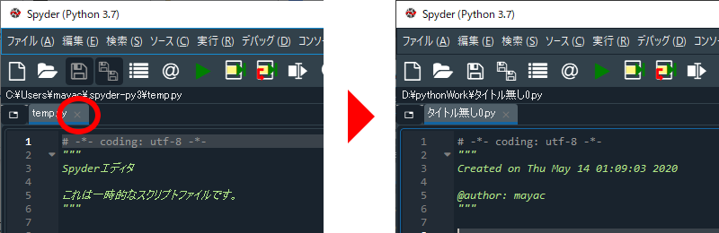

# プログラミングの準備

[< 戻る](../)

## 拡張子を表示しておこう

### 拡張子ってなあに？

例えば「abc」という名前のファイルがあったとします。

もし拡張子もアイコンも表示されていない場合はそのファイルが何のファイルであるのかは一目では分かりません。ところが拡張子が表示されていれば、一目でそのファイルの種類が分かります。

もし「abc**.jpg**」となっていれば画像ですし、「abc**.mp4**」なら映像、「abc**.pdf**」なら文書、などなど…
そして「abc**.py**」となっていれば、そのファイルは Python のファイルです。

拡張子が表示されていると、そのファイルが何の種類のファイルなのかがすぐに分かります。

### 拡張子を表示する

本授業では画像処理を行います。画像処理させる画像ファイルを読み込む際には Python のコード内で画像ファイル名を記述するのですが、その際は必ず拡張子まで記述する必要があります。

お使いのパソコンや Mac で拡張子を表示していない場合は表示をONにし、拡張子を含めたファイル名がパッと分かるようにしておきましょう。

---

**Windows10 の場合：**

１：何でもよいので、フォルダを開きます。

２：ウインドウ上部にある「表示」タブをクリックします。

３：「ファイル名拡張子」にチェックを入れます。

**Mac の場合：**

１：Finder の環境設定を選択します。

２：Finder 環境設定の「詳細」タブを選択し、「すべてのファイル名拡張子を表示」にチェックを入れます。

---

## 自分の作業ディレクトリを作ろう

### 作業ディレクトリってなあに？

- Python のファイルを保存しておくディレクトリ

- 画像処理をする場合、処理前、処理後の画像ファイルを保存しておくディレクトリ
※ディレクトリ＝フォルダ ですので「作業フォルダ」と読んでも大丈夫です。

例えばフォトショップで絵を描いたり、Mayaで3DCGモデリングしたらファイルに保存するように、Python もコードを記述したらファイルに保存しておきます。この際、「作業ディレクトリ」を決めておかないとせっかく記述したパイソンのファイルをどこに保存したのかが分からなくなってしまいます。

また、本授業では画像処理行いますが、処理をさせる画像の読み込み先も処理後の画像を保存する先も、特に指定しなければ作業ディレクトリとなっています。

さらに、例えば1つのパソコンや Mac を複数人で使用する場合は、Python のファイルを保存する際に適当に保存してしまうと誰のファイルかが分からなくなってしまうため、各自の作業ディレクトリ（フォルダ）を作成し、その中に Python のファイルを保存するようにしましょう。

### Spyder を起動して現在の作業ディレクトリを確認

Anaconda-Navigator を立ち上げ、一覧から Spyder を探し、Launch ボタンをクリックして Spyder を起動しましょう。
すると画面の左上と右上の2か所にパスが表示されています。

まず右上のパスを見てみましょう。
こちらが現在設定されている作業ディレクトリのパスとなります。

**Windowsの場合は`¥`(または`\`)マーク、Macの場合は`/`マークで、ディレクトリの中のディレクトリという階層構造が表示されているので、この表記にも慣れてください。**

続いて左上のパスを見てみましょう。
これは現在開かれている Pythonファイル（temp.py）のパスとなります。

### 自分の作業ディレクトリを割り当てよう

画面上部のメニュー「ツール」から「設定」をクリックします。

Mac版のものにはメニューが表示されていませんので、画面上部の工具アイコンをクリックします。

設定ウインドウが表示されるので、以下の図を参考にクリックしていきます。

「ディレクトリを選択」ウインドウが表示されるので、作業ディレクトリにしたいディレクトリを選択します。

**Windowsの場合：**

**Macの場合：**

この際、**選択するディレクトリやパスには、日本語が含まれないようにしましょう**。

×  `D:\内田\パイソンWork`

〇  `D:\uchida\pythonWork`

設定ウインドウ右下の「OK」ボタンをクリックします。

Spyder を 再起動 します。
再起動後の画面右上のパスが、今設定したものになっているでしょうか？

## 不要なファイルを閉じ、新規ファイルを開こう

現在開かれている Pythonファイル（以下の例だと「`temp.py`」）は使用しないため、× をクリックして閉じておきましょう。するとすぐに「`タイトル無し0.py`」という新しい Pythonファイルが作られます。

この「`タイトル無し0.py`」はまだ保存されていませんので、保存アイコンをクリックして保存しておきましょう。

その際、先ほど指定した作業ディレクトリが保存先になっているはずです。保存名は何でも構いませんが、ここでは「`test2_1.py`」という名前で保存してみました。こちらも半角で名前を付けるようにしてください。

### POINT

本授業で Python のプログラミングをする場合は、最初に必ず以下のことをしましょう！ 

- 現在の作業ディレクトリを確認

- 作業ディレクトリが自分のものではない場合、自分のものを割り当てる

- 開かれているファイルを閉じ、新しく作られたファイルを自分のディレクトリに保存 

## まずはPythonの記述ルールを５つ覚えよう

全てのプログラミング言語にはそれぞれの記述の方法（文法）があります。色々な言語で共通しているものもあれば、その言語に特有の記述方法があったりもします。

これから少しずつ Python の記述方法を学んでいくのですが、まずは基本中の基本として、以下の５つを覚えてみましょう。

### １：プログラミングとは命令文（コード）を記述すること

例えば Python で画像にモザイクをかける処理をさせたいとした場合、実行させたい処理の命令文を記述します。この命令文のことを「コード」もしくは「ソースコード」と呼びます。そしてこの命令文を記述することをプログラミングと言います。

### ２：1つのコードの最後は改行

日本語では文の最後に「。」を書くように、Python にも「ここが命令文の最後ですよ～」ということを示す必要があります。Python では1つの命令文の最後で改行する、というルールがあります。ですので、1つの命令文を途中で改行してしまうと、コンピュータが2つの命令文だと勘違いしてしまい、エラーが出てしまいます。

### ３：大文字と小文字、全角と半角は区別される

コードは基本的に半角の英数字と記号で記述します。
また、アルファベットの大文字と小文字は区別されるため、例えば小文字で書くべきところを大文字にしてしまうとエラーが出ます。

### ４：文字列は「"」もしくは「'」で囲んで表現する

例えば Spyder のコンソール（画面の右下）に「こんにちは！」と表示させたい場合、文字列部分は「”こんにちは！”」もしくは「’こんにちは！’」と記述します。このように「ダブルクオーテーション」や「クオーテーション」で囲むと、囲まれた部分は文字列として認識されます。また、文字列としては全角文字を使うことが出来ます。

### ５：コードは上から順に実行される

複数行のコードを作成して実行した場合、コンピュータはコードの上から順に処理していきます。例えばとある動きの制御のために「前に進め」「右に曲がれ」という順番でコードを書いたとします。これをコンピュータが実行する場合、必ず前に進んでから右に曲がります。右に曲がってから前に進むということはあり得ません。これは 順次処理 と言い、本授業で習得してほしい5つの項目の１つです。

[< 戻る](../)