# 第１回の復習がてらもう少し踏み込んでみる

[< 戻る](../)


第１回の授業では次の３つのコードを作成してみました。

- “Hello, World!”と表示させてみる


- Python を電卓のように使ってみる


- カレンダーを表示してみる

先ほど出てきた5つのルールを踏まえた上で、第１回のコードを発展させてみましょう。
また、それぞれのコードを実行する際はコードの上から順に処理されていくことに注目しておきましょう。

この、上から順に処理されていくことは「**順次処理**」と言い、この授業で習得してほしい５つの項目「変数」「順次処理」「条件分岐」「繰り返し」「関数」のうちの1つです。


## 出力命令と入力命令

### 出力命令を使って複数行の文章を表示してみよう

先週の授業では、出力命令である `print()` を使って、コンソール（Spyder 画面の右下）に“Hello, World!”という1行の文章を表示させてみました。

今回は “こんにちは！”  “元気ですか？” という2行の文章を表示させてみましょう。


#### エディタにコードを入力

先ほどの「プログラミングの準備 > 不要なファイルを閉じ、新規ファイルを開こう」で、`test2_1.py` という名前でまだ何もコードを記述していない Python のファイルを保存したので、エディタにはまだ `test2_1.py` が表示されているはずです。以下２行のコードをエディタ（Spyder 画面の左）に入力し、保存してみましょう。

```python
print("こんにちは！")
print("元気ですか？")
```

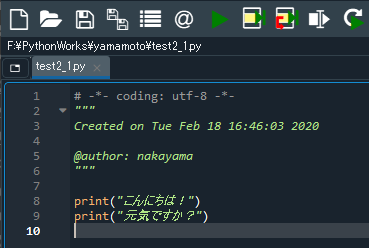


#### 実行

入力したら、画面上部に並んだアイコンから再生ボタンのようなアイコン  を探し、クリックしてみましょう。すると、画面右下のコンソールに「こんにちは！」「元気ですか？」という２行が表示されました。


#### 解説

先ほどの４つのルールの通り、表示させたい順に上から並べて記述してある点に注目しましょう。また、表示する文字列は「"」で囲まれています。コード自体は半角の英数字と記号を使って書くのですが、表示させる文字列には日本語などの全角文字が使えます。


#### 練習

このコードのフローチャートを作成するとしたら、どのようになるでしょうか？
<span><details><summary><u>→解答例を表示</u></summary><span>[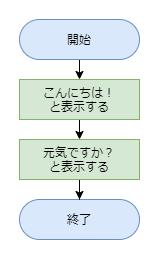](#)</span></details></span>

　

また、文字列の途中で改行出来れば、１回の出力命令で複数行の文章を表示することが出来ます。

「`\n`」（環境によっては「￥n」と表示されます）を文字列の改行したい部分に書くだけで改行してくれます。

以下のコードを記述し、実行してみましょう。

```python
print("こんにちは！\n元気ですか？") 
```

このコードを次のように変更して実行してみましょう。

```python
a = "こんにちは！\n元気ですか？"
print(a) 
```


どのように表示されましたか？
ここで出てきた「a」は変数です。変数については次回の授業で詳しく学びます。


### 入力命令を使ってキーボードの文字を取り込んでみよう

これまではコンソールに表示させる文字はあらかじめコードに書き込んでおいた文字でしたが、入力命令である `input()` を使うことで、実行の際にキーボードから表示させる文字を入力することが出来ます。


#### エディタにコードを入力


まず、Spyder の画面左上にある“新規ファイル”アイコン をクリックし、新しい Python ファイルを用意します。


以下のコードを入力し、ファイルを保存アイコンをクリックして保存しましょう。今回は `test2_2.py` という名前で保存してみました。

```python
print("名前を入力し、リターンキーを押してください。")
name = input()
print("名前は", name, "です。")
```

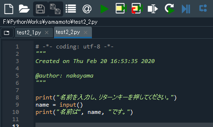


#### 実行


入力したら、画面上部の“ファイルを実行”アイコンをクリックしてみましょう。

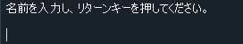
すると、コンソールにこのように表示されるはずです。

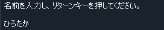
コンソールニ自分の名前を入力し、リターン（Enter）キーを押してみましょう。

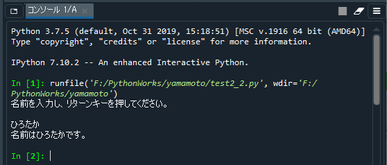
このようになりましたか？


#### 解説

コンソールは実行結果などを表示することがメインですが、今回のようにキーボードからの入力を受け付ける際にも使用します。

`input()` という部分でキーボード入力を受けているのですが、入力された文字列は変数（この例の場合は「`name`」）に入ります。

```python
name = input()
```

このコードは、`input()`命令で受け付けたキーボード入力を、「`name`」という変数に入れる（代入する）、という処理を行っています。変数については次回詳しく学びますが、ひとまず「文字列や数値を入れておく箱のようなもの」と覚えておきましょう。

ちなみに変数名は自由に付けることが出来ます（いくつかの規則はありますが）。ですので、例えば先ほどのコードは次のように変えてもOKです。

```python
print("名前を入力し、リターンキーを押してください。")
aaa = input()
print("名前は", aaa, "です。") 
```


また、３行目のコードでは表示させたいものが３つ（文字列、変数、文字列）あります。これらを１回の出力命令で表示させるには「`,`」で区切って () の中に並べて記述します。


#### 練習

このコードのフローチャートを作成するとしたら、どのようになるでしょうか？
<details><summary>→解答例を表示</summary><span>[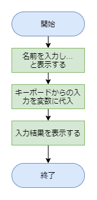](#)</span></details>


## 電卓替わりに使ってみる２

第１回の授業で Python を電卓のように使ってみる、ということをやりました。

```python
print(16+43)
```

今回はこれと全く同じ計算を、少し書き方を変えてやってみましょう。


#### エディタにコードを入力


まず、Spyder の画面左上にある“新規ファイル”アイコンをクリックし、新しい Python ファイルを用意します。


以下のコードを入力し、ファイルを保存アイコンをクリックして保存しましょう。今回は `test2_3.py` という名前で保存してみました。

```python
a = 16
b = 43
ans = a + b
print(ans)
```

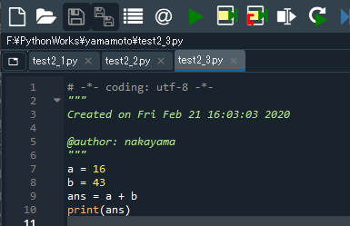


実行入力したら、画面上部の“ファイルを実行”アイコンをクリックしてみましょう。

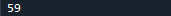
このように表示されましたか？


#### 解説

計算結果は第１回の時に書いたコードと全く同じになりますが、今回の方がコードが長くて分かりづらいですよね。これは先ほども出てきた変数を用いているからです。変数については次回の授業でしっかりと説明しますが、今後は変数がたくさん出てきますので、少しずつ慣れていきましょう。 

このコードでは、まず「`a`」という変数に16という数値を代入しています。代入する、というのは「`a`」という箱に 16 という数値を入れる、ということです。 同様に「`b`」という変数に43を代入しました。 そしてコードの３行目で 16 + 43 ( `a + b` ) の値が「`ans`」という変数に代入されます。


コードの４行目では「`ans`」という変数の中身をコンソールに表示させています。これでようやく 16 + 43 の結果が表示されました。

変数という箱に数値や文字列を代入するためには「`=`」を用いることにも注目しておいてください。数学の「=」とは少し使い方が違いますね。


#### 練習

このコードのフローチャートを作成するとしたら、どのようになるでしょうか？
<details><summary><u>→解答例を表示</u></summary><span>[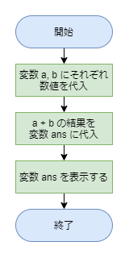](#)</span></details>


## サイコロを作ってみよう

第１回の授業では `carender` モジュールを取り込んで、指定した年月のカレンダーを表示させてみました。

今回は `random` モジュールという乱数を発生させるモジュールを取り込んでみます。乱数というのはサイコロを振った時にランダムに出る１～６の数値のようなものです。


#### エディタにコードを入力


まず、Spyder の画面左上にある“新規ファイル”アイコンをクリックし、新しい Python ファイルを用意します。


以下のコードを入力し、ファイルを保存アイコンをクリックして保存しましょう。今回は `test2_4.py` という名前で保存してみました。

```python
import random
r = random.randint(1, 6)
print(r)
```

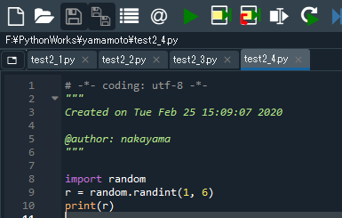


#### 実行


入力したら、画面上部の “ファイルを実行” アイコンを何回かクリックしてみましょう。コンソールには、実行するたびにサイコロのように毎回違う数値が表示されるはずです。


#### 解説

このコードにおけるポイントは次の２点です。

- `random` モジュールを取り込んでいる
- 発生させた乱数を変数に代入している

まずこのコードでは乱数を扱おうとしていますので、`random` モジュールを取り込むことが必要になります。これを行っているのは１行目の「`import random`」の部分です。これによって乱数に関するいくつかの機能を使うことが出来るようになっています。 次に２行目についてですが、ここでは「`random.randint(1, 6)`」で発生させた乱数を、変数「`r`」に代入しています。

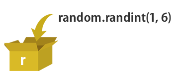

このコードも、変数を使用せずに次のように書くことも可能ではあります。 

```python
import random
print(random.randint(1, 6))
```

この方がシンプルで分かりやすいかもしれませんが、「変数」はどのプログラミング言語においてもものすごく重要ですので、出来るだけ変数を意識し、少しずつ慣れていきましょう。


#### 練習

このコードのフローチャートを作成するとしたら、どのようになるでしょうか？
<span><details><summary><u>→解答例を表示</u></summary><span>[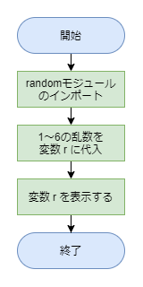](#)</span></details></span>

　

ビンゴゲームでは１～７５のランダムな数値で抽選を行います。サイコロのコードを変更し、１～７５の乱数を発生させてみましょう。

コードの２行目を「`random.uniform(1.0,6.0)`」に変更して実行してみましょう。  


## じゃんけんを作ってみよう

`random` モジュールでは、ランダムな数値を発生させる以外にも、複数の項目からランダムに選ぶ、ということが出来ます。 


#### エディタにコードを入力


まず、Spyder の画面左上にある“新規ファイル”アイコンをクリックし、新しい Python ファイルを用意します。


以下のコードを入力し、ファイルを保存アイコンをクリックして保存しましょう。今回は `test2_5.py` という名前で保存してみました。

```python
import random
j = random.choice(["ぐー", "ちょき", "ぱ－"])
print(j)   
```

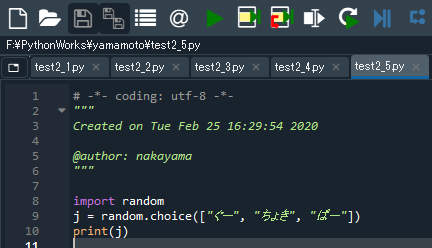


#### 実行


入力したら、画面上部の“ファイルを実行”アイコンを何回かクリックしてみましょう。

コンソールには実行するたびに「ぐー」「ちょき」「ぱー」のどれかが表示されるはずです。


#### 解説

`choice()` という命令は複数の項目から1つをランダムに選びます。複数の項目は、 `["ぐー", "ちょき", "ぱ－"]`や、 `["赤", "黄", "緑", "青"]` のような記述の仕方をします。 これは「**リスト**」と呼ばれるもので、変数の発展系です（次回の授業で詳しく説明します）。 


#### 練習

このコードのフローチャートを作成するとしたら、どのようになるでしょうか？
<span><details><summary><u>→解答例を表示</u></summary><span>[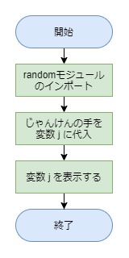](#)</span></details></span>

じゃんけんのコードを変更し、「大吉・吉・中吉・小吉・凶」などがランダムに表示されるおみくじのコードを作ってみましょう。  


[< 戻る](../)