# やってみよう画像処理１

[< 戻る](../)

Pythonの基礎の学習は大切ですが、基礎ばかりをやっているときっと飽きてしまいます。
そこで、PillowというPythonのモジュールを使用し、5回程度にわたって画像処理を体験していこうと思います。

まだ学習していない内容も含まれていますが、まずは詳細の理解よりも「こういうことも出来るんだ」ということを感じてもらえればと思います。


## よく使うデジタル画像のファイル形式

デジタル画像とは、スマホやデジカメで撮影した写真や、ペイントソフトで描いた絵、などのことです。
例えば写真は多くの色調やグラデーションが含まれていますし、アニメのセル画やイラストは色数や諧調が少なくなっています。また、3DCGで用いるテクスチャには透明な部分が含まれている場合もあります。
このようにデジタル画像はその使用用途によって特徴が異なっているため、保存しておく際のファイル形式もそれぞれの特徴に合わせた形式にしておく必要があります。

以下に、デザイナーがよく使うファイル形式をまとめてみました。


#### JPEG（ジェイペグ）形式

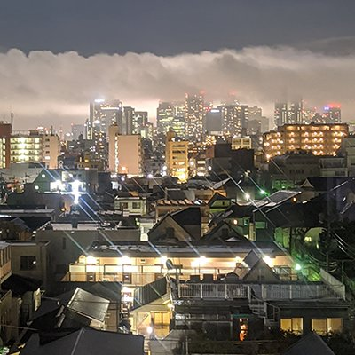
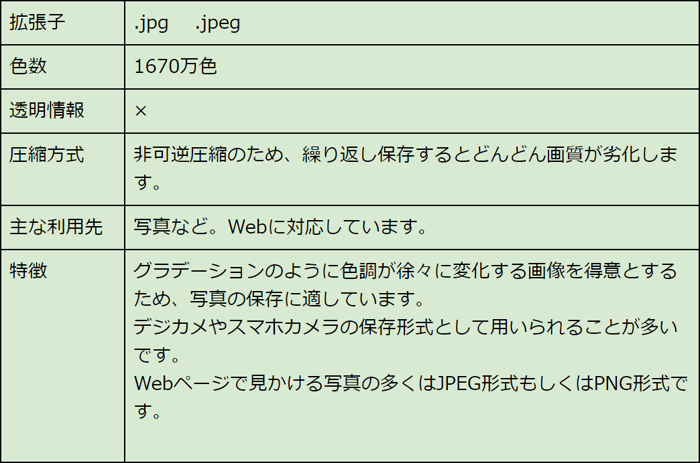


#### PNG（ピーエヌジー／ピング）形式

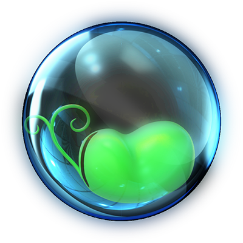
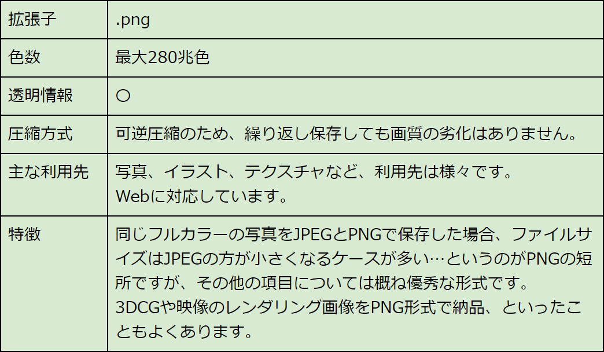


#### GIF（ジフ）形式

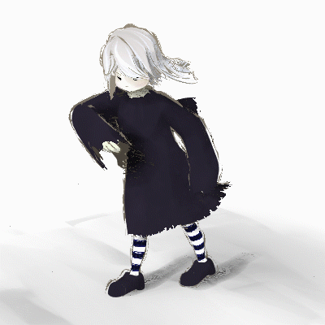
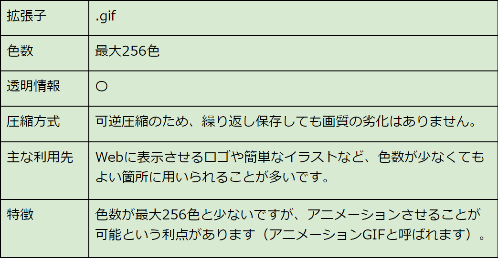


#### PSD（ピーエスディー）形式

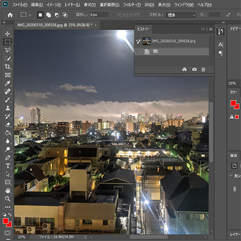
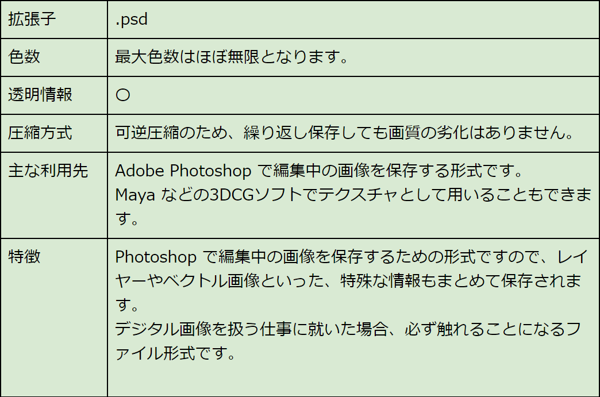


#### TGA（タルガ）形式

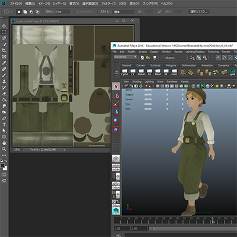
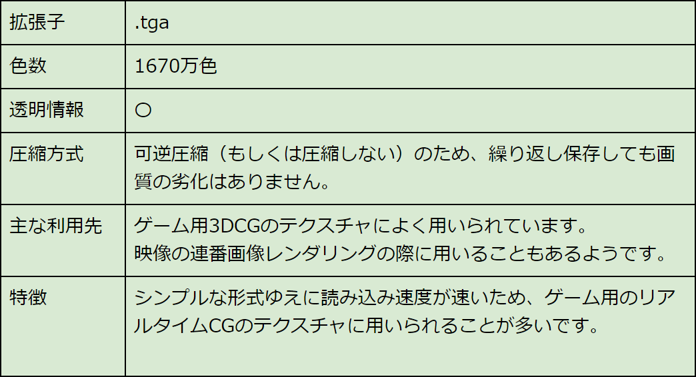


#### OpenEXR（オープンイーエックスアール）形式

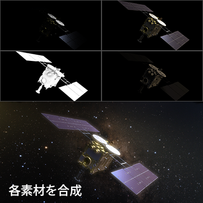
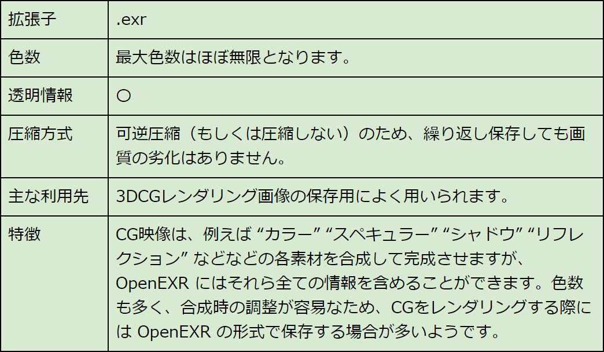


## ラスター画像とベクター画像

様々なファイル形式を見てきましたが、これらの画像は全て一部を拡大してみると次の図のように色の着いた四角形の集まりであることが分かります。この四角形のことを「**画素**」もしくは「**ピクセル**」と呼びます。最近のスマホのカメラは「12メガピクセル！」のようにアピールしていますが、これはこの四角形が1200万個ある写真が撮れますよ！ということになります。

このように画素（ピクセル）で構成されたデジタル画像のことを「**ラスター画像**」と呼びます。
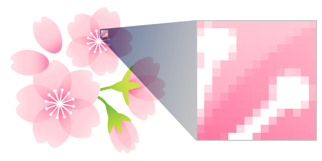 

一方で、次の図のように画像の一部をいくら拡大してみても四角形が現れず、滑らかな表示になる種類の画像もあります。

このような画像は「**ベクター画像**」と呼ばれています。数学的な曲線を用いて描画しているため、画像の表示サイズに関わらずくっきり滑らかに表示されます。 ただし、写真のように複雑で細かい色やグラデーションを表現することは出来ません。ベクター画像が得意とするのはロゴデザインやベタ塗りのイラストなどであり、印刷業界で広く使われています。 なお、編集するためには Adobe Illustrator のような専用のソフトが必要となります。
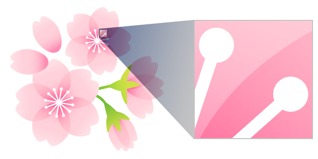

本講義で体験する画像処理は、 JPEG や PNG といった 「ラスター画像」に対して行うもの とします。 


## 画像処理用の写真をダウンロード


画像処理をするにはデジタル画像が必要です。以下のダウンロードボタンをクリックして写真をダウンロードしましょう。

[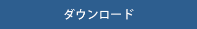 ](photoSamples1.zip)（2.8MB）

「`photoSamples1.zip`」という圧縮ファイルがダウンロードされますので、解凍（展開）しましょう。
解凍（展開）の仕方は次の通りです。

　

**Windowsの場合：**

ファイルを右クリックし、表示されるメニューから「すべて展開」を選択します。「圧縮(ZIP形式)フォルダーの展開」ダイアログが開きますので、右下の「展開」ボタンをクリックし、解凍しましょう。
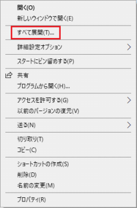

**Macの場合：**
ファイルをダブルクリックします。


### 画像ファイルは作業ディレクトリの中へ移動

ZIPファイルを解凍（展開）すると、12枚の画像が出てくるかと思います。
これらは、**先ほど授業の本編で作成した「作業ディレクトリ」の中に移動させておきましょう。**


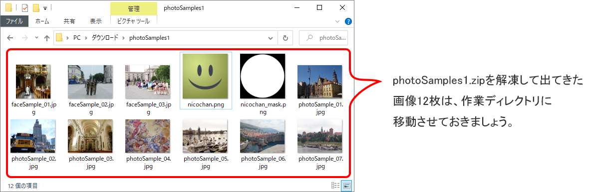

※スマホで撮影した写真を使ってもよいですが、スマホの写真はサイズが大きいため、まずはダウンロードした写真を使うことをお勧めします。

　

**Mac で作業フォルダにアクセス**

Macの場合は、初期設定だと Finder から作業フォルダにアクセスするのが難しいみたいですね。

図のように Finder の設定をしておくと「user」フォルダにすぐアクセスできるため、先ほど作成した作業フォルダにもアクセスしやすいんじゃないかなと思います。  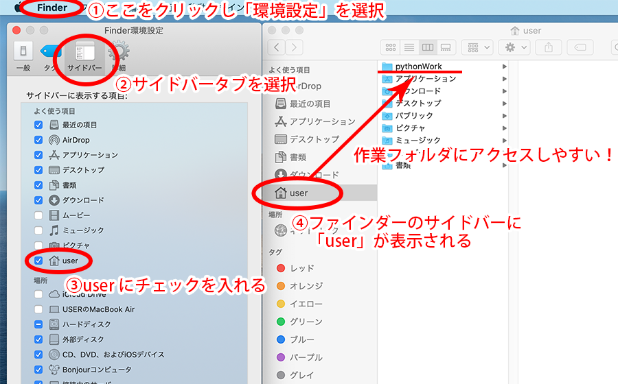 


## 画像のリサイズ

それでは簡単な処理から始めていきましょう。
まずは画像（ラスター画像）を拡大したり縮小したりするリサイズを体験してみます。
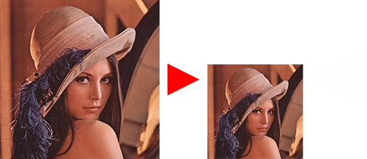


#### エディタにコードを入力

まず、Spyder の画面左上にある“新規ファイル”アイコンをクリックし、新しい Python ファイルを用意します。

以下のコードを入力し、ファイルを保存アイコンをクリックして保存しましょう。今回は `try_resize1.py` という名前で保存してみました。

※コード内の「`#`」より後の部分は、**コメントアウト**というもので、プログラムの実行時に無視される部分です。メモや説明書きを`#`の後に書くことができ、ここだけは日本語が書いてあっても大丈夫です。以下のコードを、コメントを含めて丸ごと Spyder のエディタに貼り付けて実行することが出来ます。

```python
from PIL import Image							# Pillowモジュールのインポート
 
img = Image.open("photoSample_01.jpg")			# 画像を読み込みimg変数に入れる

bairitsu = 0.2									# 望みの倍率を変数に入れる
size = [round(img.width * bairitsu), round(img.height * bairitsu)]	# round とは四捨五入
img_resize = img.resize(size, 3)							# リサイズする。3を0～5に変更すると結果が少し変わる

img_resize.save("photoSample_01_resize.jpg", quality=95)	# リサイズした画像を保存する
```

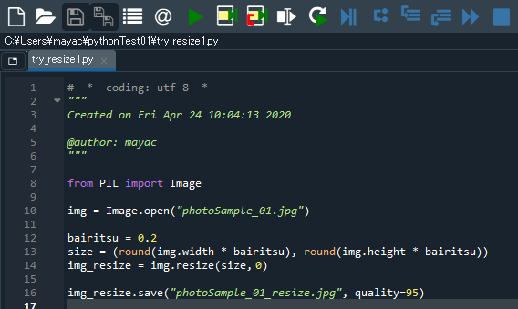


#### 実行


コードを入力したら、画面上部の“ファイルを実行”アイコンをクリックしてみましょう。

しばらくすると作業ディレクトリにリサイズされた「`photoSample_01_resize.jpg`」というファイルが保存されます。

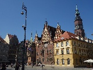
`photoSample_01_resize.jpg` は小さく（0.2倍）なっています。


#### 練習

先ほどのコードを次のように書き換えて実行してみましょう。

```python
from PIL import Image							# Pillowモジュールのインポート
 
img = Image.open("photoSample_01.jpg")			# 画像を読み込みimg変数に入れる

bairitsu_w = 0.4								# 横方向の倍率
bairitsu_h = 0.2								# 縦方向の倍率
size = [round(img.width * bairitsu_w), round(img.height * bairitsu_h)]
img_resize = img.resize(size, 3)				# リサイズする。

img_resize.save("photoSample_01_resize.jpg", quality=95)	# リサイズした画像を保存する
```

画像の横方向と縦方向の倍率をそれぞれ指定しています。

こうすることで、引き伸ばしたような画像を作ることができます。  


## 画像にモザイクをかける

画像のリサイズを応用し、モザイクをかけることができます。 一度画像を縮小して画質を下げ、その状態のまま元のサイズに拡大することでモザイクがかかります。
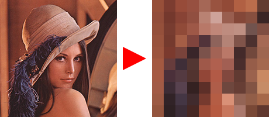


#### エディタにコードを入力


まず、Spyder の画面左上にある“新規ファイル”アイコンをクリックし、新しい Python ファイルを用意します。


以下のコードを入力し、ファイルを保存アイコンをクリックして保存しましょう。今回は `try_mosaic1.py` という名前で保存してみました。

```python
from PIL import Image										# Pillowモジュールのインポート
 
img = Image.open("photoSample_02.jpg")						# 画像を読み込みimg変数に入れる

size = [round(img.width * 0.05), round(img.height * 0.05)]
img_resize = img.resize(size, 3)							# img を小さくリサイズする
 
size = [img.width, img.height]
img_mosaic = img_resize.resize(size, 0)						# img_resize を再び元のサイズに拡大する

img_mosaic.save("photoSample_02_mosaic.jpg", quality=95)	# img_mosaic を保存する
```

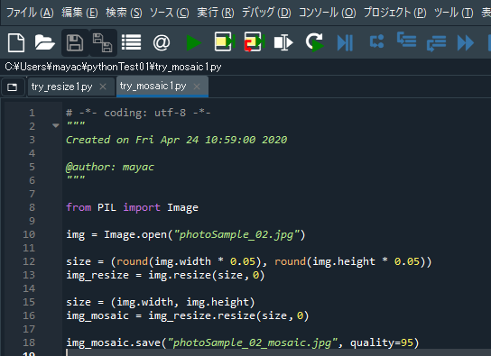


#### 実行


入力したら、画面上部の“ファイルを実行”アイコン  をクリックしてみましょう。

しばらくすると作業ディレクトリにモザイクがかかった「`photoSample_02_mosaic.jpg`」というファイルが保存されます。

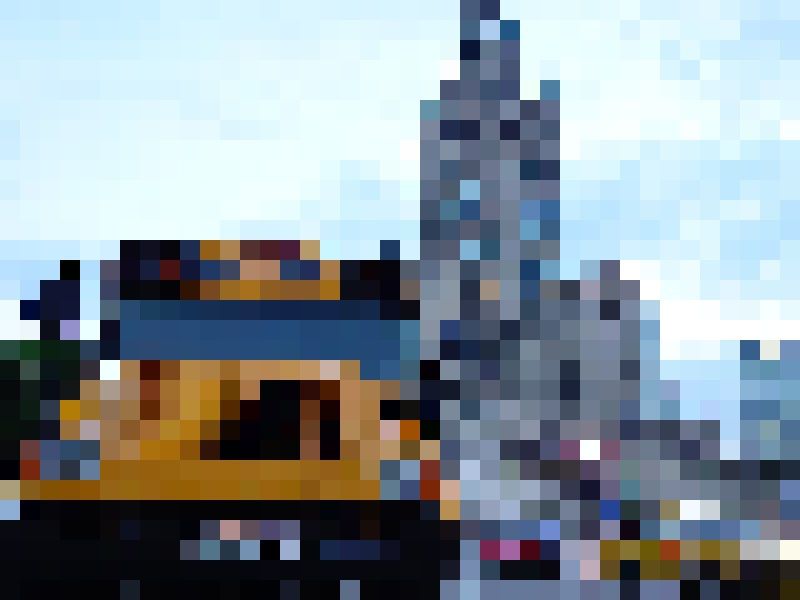


#### 練習

先ほどのコードを次のように書き換えて実行してみましょう。

```python
from PIL import Image										# Pillowモジュールのインポート
 
img = Image.open("photoSample_02.jpg")						# 画像を読み込みimg変数に入れる

size = (round(img.width * 0.05), round(img.height * 0.05))
img_resize = img.resize(size, 3)							# img を小さくリサイズする
 
size = (img.width, img.height)
img_mosaic = img_resize.resize(size, 3)						# フィルタをかけてなめらかに拡大する

img_mosaic.save("photoSample_02_mosaic.jpg", quality=95)	# img_mosaic を保存する
```

縮小した画像を拡大する際に、フィルタをかけることで滑らかに拡大し、ぼかしがかかったような画像を作ることができます。 

　

[< 戻る](../)