# 変数とリスト

[< 戻る](../)

　

本日から少しずつ、しっかりとプログラミングの基礎を学習していきます。
まずはこの授業で習得してほしい５つの項目「変数」「順次処理」「条件分岐」「繰り返し」「関数」のうち、「変数」を学習します。

「変数」は Python だけでなく、あらゆるプログラミング言語を学習するにあたって必ず覚えなくてはならない必須項目です。頑張りましょう！


## 変数ってなあに？

Python では文字列や数値など、様々なデータを扱いますが、変数というのはそれらを入れておく箱のようなものです。
変数といえば中学校や高校の数学の授業で出てきたなと思われるかもしれません。Python における変数も基本的には数学の変数と同じようなものと考えてよいですが、数値以外にも文字列などなど、様々なものが代入出来る、と覚えておきましょう。


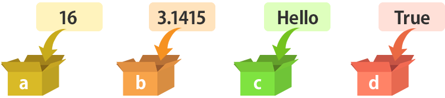


変数という箱に何か（文字列や数値などのデータ）を入れることを「代入する」と言います。また、変数という箱の中に入っているデータを使う時には「変数の値を取り出して使う」といった表現をします。「取り出す」と表現しますが、箱の中身は（故意に入れ替えたり消さない限り）無くなりません。


## 変数には種類（型）がある

例えばおもちゃ箱にはおもちゃを入れます。衣装ケースには衣類を入れます。薬箱には薬を入れます。このように「この箱には何を入れる」というのは決まっています。


Python の変数も同じで、なんでもかんでも入れて（代入して）いいわけではありません。例えば文字列は文字列用の変数に、数値は数値用の変数に代入してあげる必要があります。

**この変数の種類のことを「型」と呼びます。**


**Python で使う代表的な型**

| 型       | 説明             | 例                                                     |
| -------- | ---------------- | ------------------------------------------------------ |
| int 型   | 整数             | 0,  -13,  123,  -9999                                  |
| float 型 | 小数点を含む数値 | 3.1415,  -50.3,  0.000001,  123.0,  -5.0               |
| str 型   | 文字列           | "Hello",  "こんにちは！",  "123"                       |
| bool 型  | Yes or No の二択 | True,  False  （True は「Yes」、False は「No」を示す） |

　

bool 型は最初のうちはほとんど使うことはないですので、**まずは int, float, str の３つを覚えましょう。**
次の３つは同じように見えますが型はそれぞれ違う、という点に注目しておいてください。

123　123.0　"123"

- 123 は整数なので int型。
- 123.0 は小数点を含んでいるので float型。
- "123" は「"」で囲われているので文字列の str型。

　

なお、Python は他のプログラミング言語に比べてあまり「型」を意識しなくても大丈夫な言語です。そのため、教本によっては最初のうちは型について触れていないものもあるようですが、プログラミングにおいてものすごく重要ですので、本授業で変数が出てきた際は必ず「この変数は何の型かな？」と考えるようにしてください。


## 変数を作ってみよう

細かく説明する前に、まずは変数を作成してみましょう。


#### エディタにコードを入力

先ほどの「Spyder を立ち上げたらまず確認すること」で `test3_1.py` というファイルを新規に保存しましたので、エディタには `test3_1.py` が表示されていると思います。


もしされていない場合はSpyder の画面左上にある“新規ファイル”アイコンをクリックし、新しい Python ファイルを用意します。`test3_1.py` という名前で保存しておきましょう。 

以下のコードを `test3_1.py` に入力します。

```python
job = "学生"
age = 20
weight = 51.8
print("職業は", job, "です。")
print("年齢は", age, "です。")
print("体重は", weight, "です。")
```

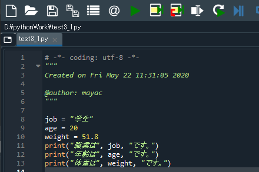


#### 実行


入力したら、画面上部の“ファイルを実行”アイコンをクリックしてみましょう。


このように表示されましたか？ 


#### 解説

変数を作成し、値を代入するには、

変数 = 値

のように、「=」の左に作成する変数、右に代入する値を記述します。

```
job = "学生"
age = 20
weight = 51.8
```

この例の場合、**変数は「job」「age」「weight」、それぞれの値は「学生」「20」「51.8」**となります。

また、job の型ですが、中身が「学生（文字列）」ですので str型となります。
同様に、age の型は int型、weight の型は float型 となります。
このように、変数の型は、作成時に代入した値によって勝手に決まります。ですので Python を使ってプログラミングを行う場合はあまり型を気にしなくても大丈夫なのですが、Python 以外のプログラミング言語でもこれらの型は重要項目ですので、常に意識するように心がけましょう。


#### 練習

このコードのフローチャートを作成するとしたら、どのようになるでしょうか？

<details><summary><u>→回答例を表示</u></summary><span>
    本授業で扱うフローチャートは、本人がプログラムの流れを意識できればよいだけですので、流れさえ合っていればどのように書いても大丈夫です。
    以下、同じ内容を、細かく書いてみた例と、ざっくり書いてみた例です。
    [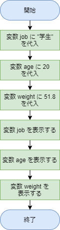](#)　[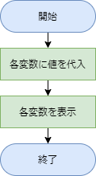](#)
</span></details>

　


変数に代入した値は書き換えることが出来ます。先ほどのコードを次のように書き換えて実行してみましょう。

```python
job = "学生"
age = 20
weight = 51.8
age = 21
weight = weight - 2
print("職業は", job, "です。")
print("年齢は", age, "です。")
print("体重は", weight, "です。")
```

`age = 21` の部分は何となく分かると思います。最初は 20 だったところを 21 に書き換えていますね。 一方の `weight = weight - 2` は数学などでは見ない表現ですね。

実行するとどのように表示されるでしょうか？ 


## 変数名の付け方には少しだけルールがある

変数の名前は自由に付けることができますが、いくつかのルールがあります。

変数名の付け方ルール：

- アルファベットと数字とアンダースコア「`_`」を組み合わせて自由に命名出来る

- 数字から始めてはいけない

- なるべくアルファベットは小文字を使う方がよい

- なるべくアンダースコア「`_`」から始まる名前は付けない

- 以下の文字（予約語）は使用してはいけない：

  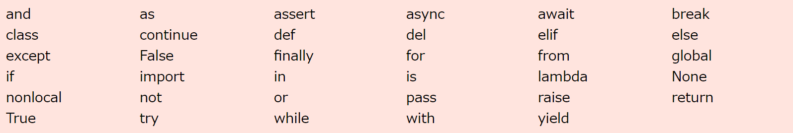

- 以下の文字（あらかじめ組み込まれている関数名）は使用しない方がよい

  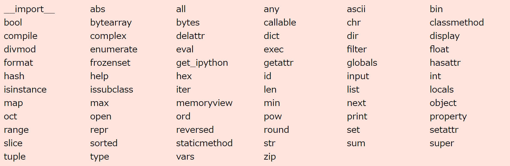

…なんだかめちゃくちゃルールにしばられている感じがしますね。。
ただ、あまり難しく考える必要はありません。
（私もルールをちゃんと勉強していなかったので「`_abcDef`」みたいな “あまり使用しない方がよい” 変数名をずっと使っていました…）

なお、コードを見た時に自分で「あ、これ変数だ」と一目で分かるような命名ルールを自分なりに作っておくとよいかもしれません。
たとえば、変数名の頭に必ず変数（hensuu）の頭文字とアンダースコアで、「`h_`」を付けるようにするなど。

例：

- `h_abc`
- `h_name1`
- `h_count`


#### 練習

以下のうち、変数名としてOKなものはどれでしょうか？

- abcdefghijklmnopqrstuvwxyz
- _abc
- 100job
- file-pass
- len
- score1
- and
- file_pass

　

正解はこちら：

[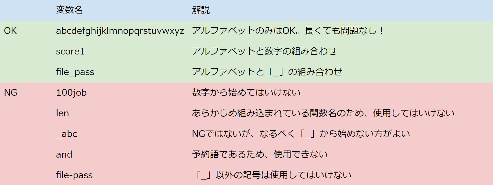](#)


## 変数の中身を覗いてみよう


コードを書いているとたくさんの変数が出てきます。使用している変数について、どのような値が入っているか、型は一体何なのか、を確認するにはどうすればよいでしょうか？

出力命令である print() を使って中身を見ることは出来ますが、Spyder にはとても便利な機能がありますので、是非覚えておきましょう。

Spyder の右上には現在、ヘルプが表示されていると思います。図の赤で囲った「**変数エクスプローラー**」と書かれた部分をクリックしてみてください。

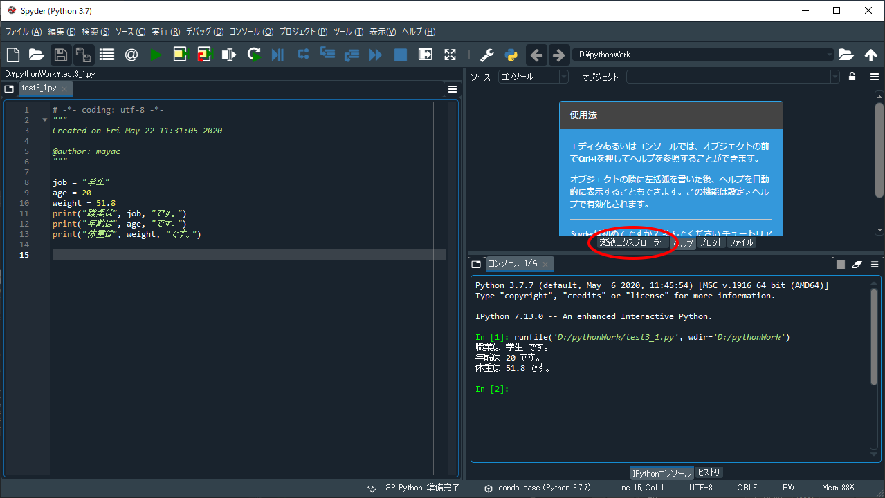


すると次の図のように変数の一覧が表示されると思います。
もし何も表示されない場合は、まだコードを実行していないのかもしれません。

をクリックして一度実行すると一覧が表示されるはずです。

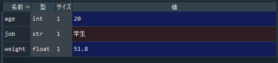

変数の型や値が一目瞭然ですね。ヘルプはほとんど使うことが無いと思いますので、Spyder を立ち上げたらすぐに変数エクスプローラーを表示させる癖をつけておきましょう。

　

## 型の変換：変数を使用して標準体重を求めるコードを書いてみよう

例えば str型の変数に「"123"」という値が入っていたとします。"123" は数値のように見えますが、あくまでも str型（文字列）ですので、123 + 456 のように計算させることは出来ません。そのような時は型を int型 もしくは float型 に変換します。

　

それでは例として、キーボードで身長を入力すると、標準体重が表示されるコードを作成してみましょう。
身長を入力させるには、以前の授業で出てきた `input()` を使用します。`input()` で入力した値は文字列（str型）なのですが、計算するために str型 を float型 に変換して計算しているところに注目してください。

標準体重は以下の式で得ることができます。

```
標準体重（kg）＝身長（m）× 身長（m）× 22
```


#### エディタにコードを入力


まず、Spyder の画面左上にある“新規ファイル”アイコンをクリックし、新しい Python ファイルを用意します。


以下のコードを入力し、ファイルを保存アイコンをクリックして保存しましょう。今回は `test3_2.py` という名前で保存してみました。

```python
print("身長をメートルで入力し、リターンキーを押してください。")
h = input()
f_h = float(h)
w = f_h * f_h * 22
print("標準体重は", w, "kgです。")
```

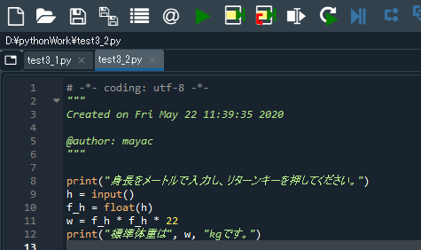


#### 実行


入力したら、画面上部の“ファイルを実行”アイコンをクリックしてみましょう。
すると、コンソールに次のように表示されるはずです。


次のように、メートルで身長を入力し、リターンキーを押してみましょう。


#### 解説

例えばダブルクオーテーションで指定した文字列 "123" があったとします。
これを int型（整数）や float型（小数点を含む数値）に変換したい場合、以下のように行います。

```python
a = int("123")
b = float("123")
```

この２行を Spyder のエディタで実行後、変数エクスプローラーを見てみると次のようになっているはずです。

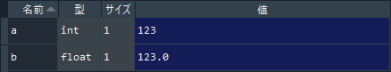

文字列 "123" は型変換されて、 変数 a には int型で、変数 b には float型で代入されている様子が分かります。

また、以下のように str型の変数から型を変換することもできます。

```python
c = "123"
d = int(c)
e = float(c)
```

これを Spyder のエディタで実行後、変数エクスプローラーを見てみると次のようになっています。

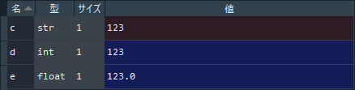

また、当然ですがありえない型の変換を行おうとするとエラーが出ます。
普通の文字列は整数に変換できません。

```python
f = int("aiueo")
```

以下の変数 g は float型への変換はできますが、int型への変換はできません。

```python
g = "123.4"
h = int(g)
```

　

以上を踏まえて先ほどの標準体重を求めるコードを見ていきましょう。
この５行のコードにはいくつの変数が出て来たでしょうか？

「h」「f_h」「w」の３つですね。

　

ここで、各変数の型を考えつつコードを見返してみましょう。

まず、２行目の `input()`命令 で受け付けたキーボード入力は文字列です。これを変数「h」に代入していますので、「h」は str型 となります（「身長なら数値じゃん！」と思うかもしれませんが、コンピュータは数値ではなく、ただの文字列として認識しています）。

この身長を使って何かの計算をさせたい場合は、文字列（str型）から数値（int型もしくは float型）に変換してあげないといけません。
それをやっているのが３行目です。str型の 「h」を float型に型変換し、「f_h」に代入しています 。

数値（int型もしくは float型）になってしまえば計算が出来ます。
４行目では標準体重を求める公式（標準体重（kg）＝身長（m）× 身長（m）× 22）に当てはめて計算し、結果を「w」に代入しています。

```python
print("身長をメートルで入力し、リターンキーを押してください。")
h = input()							# キーボードからの入力を「h」に代入
f_h = float(h)						# str型から float型へ変換し、「f_h」に代入
w = f_h * f_h * 22					# 22は整数(int)だが、同じ数値なので計算できる
print("標準体重は", w, "kgです。")
```


#### 練習

変数エクスプローラーを開き、先ほど作成したコード内の変数の型と値を確認してみましょう。

先ほど作成したコードは身長をメートルで入力しました。しかし、身長はメートルよりもセンチメートルで表現することが多いですよね。
先ほどのコードを改良し、身長をセンチメートルで入力すると標準体重が表示されるようにしてみましょう。その際、コードを書く前にまずはフローチャートを（紙とペンでよいので）考えてみましょう。


## リスト

変数の発展系に**リスト**と呼ばれるものがあります。
変数には一つの値しか入れることが出来ませんでしたが、リストには大量の値を入れることが出来ます。

他のプログラミング言語では**配列**などと呼んだりしますが、あらゆるプログラミング言語にとってとても重要な仕組みです。最初のうちは難しいと感じるかもしれませんが、少しずつ使い方を覚えていきましょう。


## リストってなあに？


リストはたくさんのデータを管理する際に使います。例えば身体測定で得られた教室全員の身長のデータを管理するなど、データの数が多くなる際に便利です。

リストを図に表してみると次のようになります。
リストとは、たくさんの変数（箱）を並べて管理するための棚です。リストにも変数と同じように名前が付きますが、この図の場合、リスト名は「`li_heights`」です。
このリストの中には５つの変数（箱）が入っており、箱には ０から始まる番号を付けて管理しています。 この箱のことを「**要素**」と呼び、番号のことを「**インデックス（添え字）**」と呼びます。要素数はこの図の場合、５となり、インデックスの範囲は０～４となります。


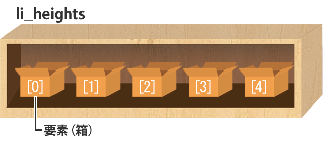


## リストを作って値を代入してみよう

まずは上の図のリスト「`li_heights`」を作成してみましょう。リストの名前の付け方は、変数の名前の付け方と同じで大丈夫ですが、複数の要素を含んでいることを示すために複数形にしておいた方が分かりやすいです。


#### エディタにコードを入力


まず、Spyder の画面左上にある“新規ファイル”アイコンをクリックし、新しい Python ファイルを用意します。


以下のコードを入力し、ファイルを保存アイコンをクリックして保存しましょう。今回は `test3_3.py` という名前で保存してみました。

```python
li_heights = [158.4, 165.4, 155.5, 174.1, 168.0]
print(li_heights)
print(li_heights[0])
```

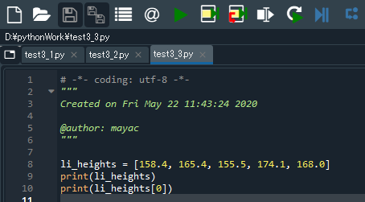


#### 実行


入力したら、画面上部の“ファイルを実行”アイコンをクリックしてみましょう。以下のように表示されましたか？

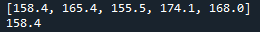


#### 解説

この例では、1行目のコードでリストの作成と値の代入をしています。
2行目ではリスト全体を表示し、3行目ではリスト内の要素 [0] を表示しています。

リストの中身を知るためには、出力命令 `print()` を使えばよいのですが、Spyder の変数エクスプローラーを使えばもっと簡単に中身を見ることが出来ます。
画面右上の「変数エクスプローラー」タブをクリックし、変数エクスプローラーを表示してみましょう。次のように表示され、リストの名前や要素数、値を見ることが出来ます。

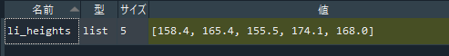

さらに変数エクスプローラー上でこのリストをダブルクリックしてみましょう。次のように表示され、さらに詳しく中身を見ることが出来ます。それぞれの要素は小数点を含んでいますので、「float型」になっていますね。

さらに変数エクスプローラー上でこのリストをダブルクリックしてみましょう。次のように表示され、さらに詳しく中身を見ることが出来ます。それぞれの要素は小数点を含んでいますので、「float型」になっていますね。

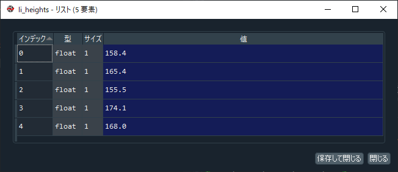


#### 練習

先ほどのコードの3行目（ print(li_heights[0]) ）ではインデックスが０の要素を表示しました。このインデックスを変更し、ちゃんと要素が表示されるか確かめてみましょう。また、範囲外のインデックス（この例の場合、５以上が範囲外）を指定すると、エラーが起きることも実際にやって確かめておきましょう。

　

先ほどのコードを以下のように書き換えて実行してみましょう。実行後には変数エクスプローラーも見ておきましょう。インデックスが０の人は少し身長が伸びたようですね。

```python
li_heights = [158.4, 165.4, 155.5, 174.1, 168.0]
print(li_heights)
print(li_heights[0])
li_heights[0] = 159.0
print(li_heights[0])
```


## リストの要素数を増やす

教室に生徒が1人転校してきました。今までは要素数が５で大丈夫でしたが、1人増えたため、身長を管理するリストの要素数は６にしないといけません。
リストの要素は増やしたり減らしたりすることが簡単に出来ます。

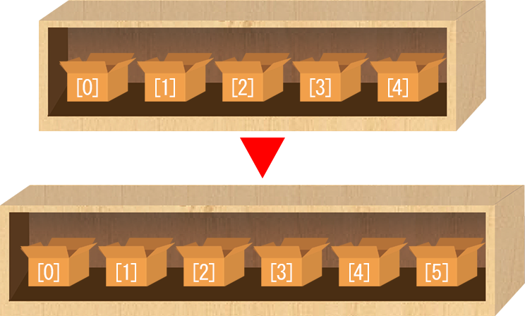


#### エディタにコードを入力

先ほどのコード（`test3_3.py`）の続きに、以下のコードを入力します。

```python
li_heights.append(150.2)
print(li_heights)
```

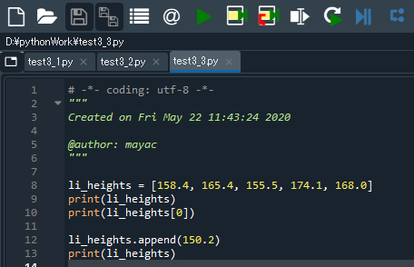


#### 実行


入力したら、画面上部の“ファイルを実行”アイコンをクリックしてみましょう。
以下のように表示されましたか？

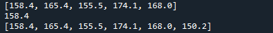


#### 解説

変数エクスプローラーでリストの中身を覗いてみましょう。要素数（サイズ）が６になっている様子が確認できます。また、追加した要素はリストの一番最後に追加されていますね。
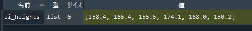


## リストの要素数を減らす

生徒が1人転校してしまい、再び5人になりました。要素数が６でしたが1人減ったため、身長を管理するリストの要素数も５にしないといけません。
リストのインデックスが２の要素を減らしてみましょう。


#### エディタにコードを入力

先ほどのコード（`test3_3.py`）の続きに、以下のコードを入力します。

```python
del li_heights[2]
print(li_heights)
```

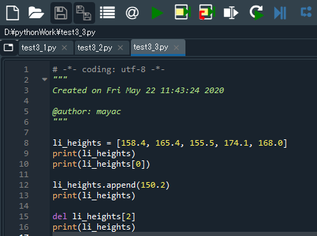


#### 実行


入力したら、画面上部の“ファイルを実行”アイコンをクリックしてみましょう。
以下のように表示されましたか？

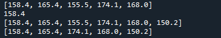


#### 解説

変数エクスプローラーでリストの中身を覗いてみましょう。インデックスが２の要素が削除され、要素数（サイズ）が５になっている様子が確認できます。

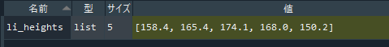


#### 練習

インデックスは0からスタートするため、リストの一番最後の要素を表示したり削除したりするには、

```python
print(li_heights[ 要素数 - 1 ])
del li_heights[ 要素数 - 1 ]
```

のように記述しますが、もっと簡単に記述することが出来ます。

次のコードを記述し、実行してみましょう。要素数が４のリストを作成し、3行目でリストの最後の要素を削除しています。

```python
li_test = [1, 2, 3, 4]
print(li_test)
del li_test[-1]
print(li_test)
```

　

---

　

本日のメインの内容は以上です。いかがでしたでしょうか？
ひょっとしたらリストについては「？？？？」だったかも知れません。まずはそれでも大丈夫ですので、変数の方はしっかり理解するように頑張ってみてください。

そういえば第２回の授業で以下のコードが出てきました。

```python
import random
j = random.choice(["ぐー", "ちょき", "ぱ－"])
print(j)
```

この ["ぐー", "ちょき", "ぱ－"] の部分は実はリストですので、このコードは以下のように書き換えることができます。

```python
import random
li_te = ["ぐー", "ちょき", "ぱ－"]
j = random.choice(li_te)
print(j)
```

今後もちょくちょく出てくると思いますので、少しずつ習得していきましょう！

　

[< 戻る](../)