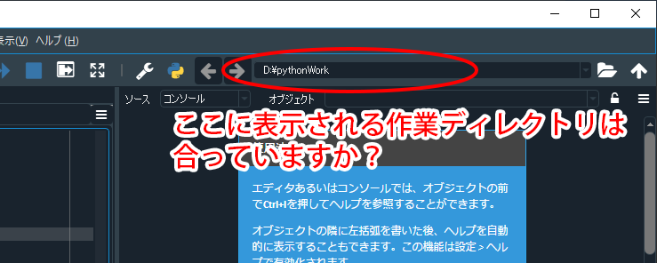
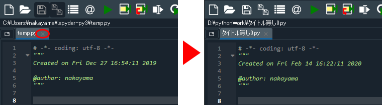
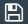

# Spyder を立ち上げたらまず確認すること

[< 戻る](../)

　

以下は、 Spyder を立ち上げたら毎回必ず確認するようにしてください。

## 自分の作業ディレクトリを確認

Spyder を立ち上げたら、第２回の授業で割り当てた**作業ディレクトリ**がちゃんと割り当てられているかどうかを確認しましょう。
画面右上に表示されているパスは合っていますか？
もし違うパスが表示されているようでしたら、[第２回のテキスト](../../02/prep/#!index.md#%E8%87%AA%E5%88%86%E3%81%AE%E4%BD%9C%E6%A5%AD%E3%83%87%E3%82%A3%E3%83%AC%E3%82%AF%E3%83%88%E3%83%AA%E3%82%92%E4%BD%9C%E3%82%8D%E3%81%86)を参考に、自分の作業ディレクトリを割り当てましょう。

## 不要なファイルを閉じ、新規ファイルを開く

画面の左側に開かれている Pythonファイル（以下の例だと「`temp.py`」）は使用しないため、× をクリックして閉じておきましょう。複数のファイルが開かれている場合は全て閉じます。するとすぐに「`タイトル無し0.py`」という新しい Pythonファイルが作られます。

　

この「`タイトル無し0.py`」はまだ保存されていませんので、保存アイコンをクリックし、分かりやすい名前（第３回の授業の場合は「`test3_1.py`」、第４回の授業の場合は「`test4_1.py`」 など）を付けて保存しておきましょう。その際、先ほど指定した作業ディレクトリが保存先になっていることを確認してください。
なお、もし保存アイコンが反応しない場合は一度コンソールをクリックしてから再びエディタをクリックすると反応するようになります。

　

[< 戻る](../)