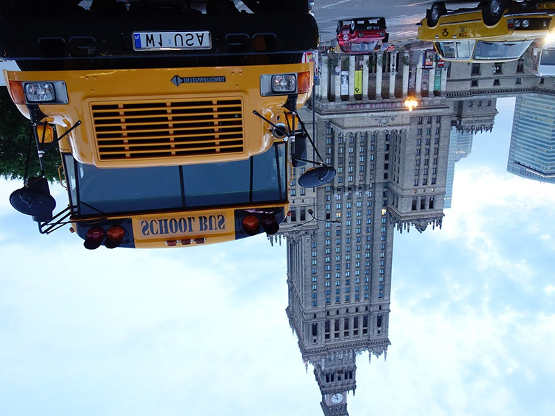

# やってみよう画像処理２

[< 戻る](../)

　

細かいことは分からなくてもいいから、とにかくやってみよう！のコーナーです。
今回の画像処理体験では、画像の回転や反転、切り抜きなどをやっていこうと思います。


## デジタル画像について

### ラスター画像のサイズ

画像処理体験１で見てきた様々なファイル形式の画像は、画素（ピクセル）の集まりで構成された「ラスター画像」とよばれる画像でした。このようなラスター画像のサイズ（「解像度」と呼ぶこともあります）は次のように表します。

```
横方向の画素数 × 縦方向の画素数
```

例えば最近のスマホのカメラで撮影した写真の場合、4000 × 3000 程度のサイズ（解像度）となっています。画像の横方向に4000個の画素（ピクセル）、縦方向に3000個の画素（ピクセル）が並んでいますので、全画素数（ピクセル数）は1200万画素、ということになります。


### 画素の並び方


例えばこの図のような 10×10 のサイズの小さなニコちゃん画像があったとします。
各画素の位置は以下の図のように表します。

画像の左上（赤枠の画素）が原点となり、座標は (0, 0) です（ (1, 1) ではありません！）。
ニコちゃんの左目（緑枠の画素）の座標は (6, 3) です。
そして画像の右下（青枠の画素）の座標は (9, 9) となります。画像サイズが 10×10 ですので座標も (10, 10) と勘違いしがちですので気を付けましょう。


画像処理体験１で画像処理用のサンプル画像をダウンロードしていない場合は、以下のボタンをクリックし、ダウンロードしてください。
「`photoSamples1.zip`」という圧縮ファイルがダウンロードされますので、解凍（展開）後、作業ディレクトリ内に写真ファイルを全て移動してください。

[](../../02/try1/photoSamples1.zip)（2.8MB）


## 画像の回転


画像を指定した角度だけ回転させてみましょう。


#### エディタにコードを入力


まず、Spyder の画面左上にある“新規ファイル”アイコンをクリックし、新しい Python ファイルを用意します。


以下のコードを入力し、ファイルを保存アイコンをクリックして保存しましょう。今回は `try_rotate1.py` という名前で保存してみました。

```python
from PIL import Image									# Pillowモジュールのインポート
 
img = Image.open("photoSample_03.jpg")					# 画像を読み込む
img_rot = img.rotate(25)								# 指定した角度（今の場合、25度）回転させる
img_rot.save("photoSample_03_rotate.jpg", quality=95)	# リサイズした画像を保存する
```


#### 実行


入力したら、画面上部の“ファイルを実行”アイコンをクリックしてみましょう。
しばらくすると作業ディレクトリに回転した「`photoSample_03_rotate.jpg`」というファイルが保存されます。


#### 練習

コードの3行目（ `img_rot = img.rotate(25)`）で、25度の回転を指定しています。
色々な角度を指定して回転させてみましょう。

先ほどのコードを次のように書き換えて実行してみましょう。

```python
from PIL import Image
 
img = Image.open("photoSample_03.jpg")
img_rot = img. rotate(25, expand=True)					# この行が変更点。画像全体が残るように。
img_rot.save("photoSample_03_rotate.jpg", quality=95)
```

画像を回転するとデフォルトでは読み込んだ画像と出力される画像のサイズが同じため、領域外の部分は切り取られていました。

「`extend=True`」というオプションを付けることで、画像全体が残るように画像の大きさが変化します。


## 画像を反転する


画像を反転させてみましょう。


#### エディタにコードを入力


まず、Spyder の画面左上にある“新規ファイル”アイコンをクリックし、新しい Python ファイルを用意します。


以下のコードを入力し、ファイルを保存アイコンをクリックして保存しましょう。今回は `try_flip1.py` という名前で保存してみました。

```python
from PIL import Image, ImageOps
 
img = Image.open("photoSample_02.jpg")
img_flip = ImageOps.flip(img)							# img を反転する
img_flip.save("photoSample_02_flip.jpg", quality=95)
```


#### 実行


入力したら、画面上部の“ファイルを実行”アイコンをクリックしてみましょう。

しばらくすると作業ディレクトリに上下が反転した「`photoSample_02_flip.jpg`」というファイルが保存されます。




#### 練習

先ほどのコードを次のように書き換えて実行してみましょう。どうなるでしょうか？

```python
from PIL import Image, ImageOps
 
img = Image.open("photoSample_02.jpg")
img_flip = ImageOps.mirror(img)							# ここが変更点。
img_flip.save("photoSample_02_flip.jpg", quality=95)
```


## 画像の切り抜き


画像の一部を切り抜くことが出来ます。


#### エディタにコードを入力


まず、Spyder の画面左上にある“新規ファイル”アイコンをクリックし、新しい Python ファイルを用意します。


以下のコードを入力し、ファイルを保存アイコンをクリックして保存しましょう。今回は `try_crop1.py` という名前で保存してみました。

```python
from PIL import Image
 
img = Image.open("faceSample_02.jpg")
img_crop = img.crop((450, 350, 800, 820))			# img を切り抜く。()の記述を忘れがちなので注意
img_crop.save("faceSample_02_crop.jpg", quality=95)
```


#### 実行


入力したら、画面上部の“ファイルを実行”アイコンをクリックしてみましょう。

しばらくすると作業ディレクトリに上下が反転した「`faceSample_02_crop.jpg`」というファイルが保存されます。


#### 解説

このコードでは `faceSample_02.jpg` という画像（サイズは 1200 × 900）から一部を切り抜いています。

切り抜く範囲の指定はコードの3行目

```python
img_crop = img.crop((450, 350, 800, 820))
```

の部分となります。
4つの数値が並んでいますが、この数値によって以下の図のように切り抜く範囲を指定しています。


切り抜かれた画像は `img_crop` という変数に代入され、コードの4行目で保存しています。

Spyder の画面右上段で「変数エクスプローラー」というタブをクリックすると、`img`（読み込んだ元画像）も `img_crop`（切り抜いた画像）も Image という型の変数（オブジェクト）であることが分かります。


#### 練習

コード3行目の数値を変更し、別の部分を切り抜いてみましょう。


## 画像の貼り付け


画像に別の画像を貼り付けることが出来ます。


#### エディタにコードを入力


まず、Spyder の画面左上にある“新規ファイル”アイコンをクリックし、新しい Python ファイルを用意します。


以下のコードを入力し、ファイルを保存アイコンをクリックして保存しましょう。今回は `try_paste1.py` という名前で保存してみました。

```python
from PIL import Image
 
img = Image.open("photoSample_05.jpg")				# 背景となる画像を「img」に読み込む
img2 = Image.open("nicochan.png")					# 貼り付ける画像を「img2」に読み込む
img.paste(img2)										# img に img2 を貼り付ける
img.save("photoSample_05_paste.jpg", quality=95)	# img2 を貼り付けた「img」を保存する
```


#### 実行


入力したら、画面上部の“ファイルを実行”アイコンをクリックしてみましょう。

しばらくすると作業ディレクトリに上下が反転した「`photoSample_05_paste.jpg`」というファイルが保存されます。


#### 練習

貼り付ける画像の位置を調節することができます。
先ほどのコードを次のように書き換えて実行してみましょう。

```python
from PIL import Image
 
img = Image.open("photoSample_05.jpg")
img2 = Image.open("nicochan.png")
img.paste(img2, (350,250))							# imgにimg2を貼り付ける(350, 250)の部分で位置を調整
img.save("photoSample_05_paste.jpg", quality=95)
```

　

貼り付ける画像をマスクで切り抜くことができます。
先ほどのコードを次のように書き換えて実行してみましょう。

```python
from PIL import Image

img = Image.open("photoSample_05.jpg")
img2 = Image.open("nicochan.png")
img_mask = Image.open("nicochan_mask.png")			# マスクとなる画像を「img_mask」に読み込む
img_mask = img_mask.convert("L")					# ※マスクはグレースケール画像である必要があるため、変換
img.paste(img2, (350,250), img_mask)
img.save("photoSample_05_paste.jpg", quality=95)
```

※マスク画像（今の場合は `nicochan_mask.png`）がもともとグレースケール画像の場合は変換の必要はありません。

　

[< 戻る](../)