# 条件分岐と繰り返し１

[< 戻る](../)

　

この授業で習得してほしい５つの項目「変数」「順次処理」「条件分岐」「繰り返し」「関数」のうち、「条件分岐」を学習します。


もし雨が降っているならば… 傘をさす


## 条件分岐

「条件分岐」は Python だけでなく、あらゆるプログラミング言語を学習するにあたって必ず覚えなくてはならない必須項目です。「条件分岐」と「繰り返し」さえ覚えれば、どんな複雑な処理も記述できると言われていますので、早速学習していきましょう！


### 条件分岐ってなあに？

第２回の授業のフローチャートの学習で、「部屋を掃除する」という例を見てみました。

このフローチャートの赤い点線で囲われた箇所を見てみると、ひし形のブロックで「ダストボックスがいっぱい？」と書かれています。

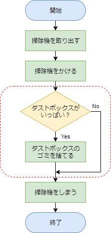
もしいっぱいになっていたらYesの矢印に進み、「ダストボックスのゴミを捨てる」という行動を取り、その後掃除機をしまいます。いっぱいになっていなかったらNoの矢印に進み、ダストボックスのごみ捨てはしません。

このように**「もし〇〇の条件を満たすなら、この処理をしなさい」という命令が条件分岐**です。

そして、**「もし〇〇ならば」の部分を条件式**といいます。

　

条件分岐の例：

|      | 条件式                                           | 処理                                            |
| ---- | ------------------------------------------------ | ----------------------------------------------- |
| もし | 入力した数値が70より大きいならば…                | "合格です。" という文字列を表示する             |
| もし | １～３のランダムな数値を発生させ、3が出たならば… | "大吉です！おめでとう！" という文字列を表示する |
| もし | 今年がうるう年ならば…                            | "今年はうるう年です。" という文字列を表示する   |
| もし | キーボードの「A」が押されたならば…               | 音を鳴らす                                      |
| もし | じゃんけんの手がコンピュータと同じならば…        | "あいこです。" という文字列を表示する           |
| もし | 入力した文字列が "徳川家康" ならば...            | "正解です。" という文字列を表示する             |


## 条件分岐の書式１

条件分岐を記述するには「もしも…」を表す英単語「if」を使って記述する方法です。「if」を使って記述した部分は **if文**と呼ばれ、以下のように記述します。

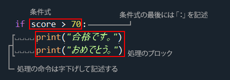

この if文では、score という変数に代入された値が70より大きい場合に「合格です。」「おめでとう。」という2文を表示します。
条件式は「score > 70」の部分で、条件式の最後には「:」を記述します。
条件が成立した時に実行する処理は字下げして記述します（Spyder が勝手に字下げしてくれます）。


### Python における字下げについて

Python における字下げはとても重要です。なぜなら Python では同じ数の空白で字下げされたまとまりを、一つのブロックとして認識するためです。

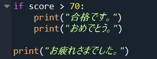

したがってこの例の場合、3行目までが if文であり、条件が成立した場合にのみブロック内の処理（「おめでとう」を表示する行まで）が実行されます。

最後の行は字下げされておらず、if文の外に記述されていますので、条件が成立していてもいなくても実行されます。

字下げは if文以外にも、次週以降に学ぶ「for文」や「関数」などにも使われています。色々なルールがありますが、実際にコードを記述しながらしっかりと覚えていきましょう。

なお、Python 以外のプログラミング言語もよく字下げしているのですが、特に何の意味もありません。単にコードを見やすくするためだけに使われていますので、字下げしていてもしていなくても、実行の際に挙動が変わることはありません。


## おみくじ

それでは if文を使ったコードの例として、簡単なおみくじを作成してみましょう。

今回のおみくじは実行すると１～３のランダムな整数を発生させ、３が出た時にのみ「大吉です！」と表示する、ごく簡単なものです。
ちなみに第２回の授業でも `random.choice()` という命令を使ってランダムに「ぐー」「ちょき」「ぱー」が表示されるじゃんけんのコードが出てきました。これを使えばすぐにおみくじできちゃうかもしれませんが、今回は if文を使ってやってみましょう。


#### エディタにコードを入力


まず、Spyder の画面左上にある“新規ファイル”アイコンをクリックし、新しい Python ファイルを用意します。


以下のコードを入力し、ファイルを保存アイコンをクリックして保存しましょう。今回は `test4_2.py` という名前で保存してみました。

3行目の「r == 3」は、イコールが２つです！間違えて「r = 3」と記述してしまいがちなので、注意しましょう！

```python
import random
r = random.randint(1, 3)
if r == 3:
    print("大吉です！おめでとう！")
```


#### 実行


入力したら、画面上部の“ファイルを実行”アイコンを何度もクリックしてみましょう。

何回かに1回、以下のように表示されるはずです。


#### 解説

このコードは３分の１の確率で大吉が出るおみくじになっています。
コードの各行の内容とフローチャートは次のようになります。

```python
import random                      # random モジュールをインポート
r = random.randint(1, 3)           # 1～3 の整数をランダムに発生させ、発生した数値を変数 r に代入
if r == 3:                         # もしも変数 r の値が 3 であるならば…
    print("大吉です！おめでとう！")   # 「大吉です…」と表示する
```

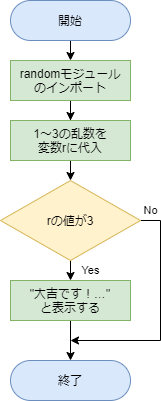

３行目の「`r == 3`」の部分が条件式となり、「変数 r の値が 3 である」という条件を示しています。「=」ではなく「`==`」と記述してある点に注意しておきましょう。
例えば「変数 r の値が 3 より小さい」という条件にしたい場合は「`r < 3`」と記述します。

この**「`==`」や「`<`」のことを関係演算子**と呼び、他にも以下のようなものがあります。

| 演算子 | 記述例   | 意味                |
| ------ | -------- | ------------------- |
| `==`   | `a == b` | a と b が等しい     |
| `!=`   | `a != b` | a と b は等しくない |
| `>`    | `a > b`  | a は b より大きい   |
| `>=`   | `a >= b` | a は b 以上         |
| `<`    | `a < b`  | a は b より小さい   |
| `<=`   | `a <= b` | a は b 以下         |


#### 練習


先ほどのおみくじコードの関係演算子 `==` を `!=` に変更し、アイコンを何度もクリックしてみましょう。
すると、先ほどよりも高い確率で「大吉です！おめでとう！」と表示されるはずです。
なぜこのようになるのか、その理由も考えてみましょう。

　

先ほどのコードでは大体３分の１の確率で大吉が出ました。
このコードを５分の２の確率で大吉が出るように修正するには、どのような方法が考えられるでしょうか？

<details><summary><u>→解答例を表示</u></summary><blockquote><span class="md-text">
まず、例えば１～５のように５つの整数をランダムに発生させます。
発生する整数は 1, 2, 3, 4, 5 です。
5通りの整数のうち、どれか2つに該当した場合に大吉判定してあげれば、大吉の確率は2/5になります。
<br>ですので大吉の確率は2/5となるコードは、例えば以下のようになります。
<pre><code class="python">import random
r = random.randint(1, 5)
if r >= 4:
    print("大吉です！おめでとう！")</code></pre>
４行目が、「もしも変数 r の値が 4以上であるならば…」という条件式です。
<br>この他にも条件式を以下のように変えても、大吉の確率は2/5になりそうです。
`r > 3`　・・・　r の値が３より大きい → つまり r が 4 か 5
`r <= 2` ・・・　r の値が２以下 → つまり r が 1 か 2
`r < 3`　・・・　r の値が３より小さい → つまり r が 1 か 2
ちなみに例えば `r >= 4` という条件式は `4 <= r` というように左右逆に書いても問題ありません。
<hr></span></blockquote></details>


## 条件分岐の書式２

先ほどの if文では、「もし〇〇なら、Aの処理をしましょう」という感じで、条件が成立している場合にのみ、何かの処理を行いました。
if文の中で else という命令を使うことで、**「もし〇〇ならAの処理、それ以外ならBの処理をしましょう」のように、条件が成立しなかった場合に実行させたい処理を記述する**ことが出来ます。

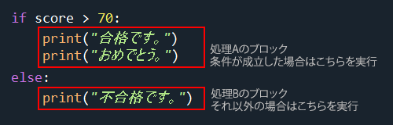

この if文では先ほどと同様に、score という変数に代入された値が70より大きいかどうかをチェックします。そして70より大きい場合には「合格です。おめでとう。」と表示します（処理Aのブロック）。それ以外の場合（70以下の場合）には「不合格です。」と表示します（処理Bのブロック）。


## おみくじ その２

おみくじのコードその２です。


#### エディタにコードを入力


まず、Spyder の画面左上にある“新規ファイル”アイコンをクリックし、新しい Python ファイルを用意します。


以下のコードを入力し、ファイルを保存アイコンをクリックして保存しましょう。今回は `test4_3.py` という名前で保存してみました。

```python
import random
r = random.randint(1, 3)
if r == 3:
    print("大吉です！おめでとう！")
else:
    print("残念無念…")
```

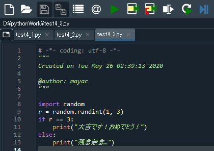


#### 実行


入力したら、画面上部の“ファイルを実行”アイコンを何度もクリックしてみましょう。

「大吉です！おめでとう！」という文字列と「残念無念…」という文字列がランダムに表示されるはずです。
「残念無念…」の方がより多く表示されていますね。


#### 解説

このコードは先ほどと同様に３分の１の確率で大吉が出るおみくじになっています。大吉ではない場合は全て「残念無念…」となります。
コードの各行の内容とフローチャートは次のようになります。

```python
import random                      # random モジュールをインポート
r = random.randint(1, 3)           # 1～3 の整数をランダムに発生させ、発生した数値を変数 r に代入
if r == 3:                         # もしも変数 r の値が 3 であるならば…
    print("大吉です！おめでとう！")   # 「大吉です…」と表示する
else:                              # それ以外の場合は…
    print("残念無念…")              # 「残念無念…」と表示する
```

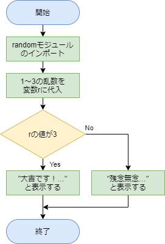


## 条件分岐の書式３

if文の中で else という命令を使うことで「もし〇〇ならAの処理、それ以外ならBの処理をしましょう」のように2つの処理からどちらかを選んで実行させることができました。

それでは「もし〇〇ならAの処理、そうではなくもし△△ならBの処理、それ以外ならCの処理をしましょう」３つの処理からどれかを選んで実行させるにはどうすればよいでしょうか？

その場合、**elif という命令を使って**次のように記述します。

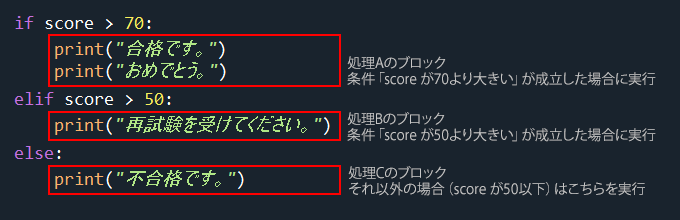

この if文ではこれまでと同様に、score という変数に代入された値が70より大きいかどうかをチェックします。そして70より大きい場合には「合格です。おめでとう。」と表示します（**処理Aのブロック**）。

次にチェックする条件は「elif」の次に記述されている「score > 50」です。ここでは score に代入されている値が50より大きいかどうかをチェックします。そして条件が成立している場合には「再試験を受けてください。」と表示します（**処理Bのブロック**）。

ここで、「じゃあ score が 80 の場合は “合格です。” おめでとう。” “再試験を受けてください。” の3つが表示されるのでは？」と思うかも知れません。しかし、score が 80 だとすると最初の条件式（score > 70）で一度拾われているので、それ以降の elif に書かれている条件は飛ばしてくれます。

score が 60 だとすると、最初の条件式（score > 70）には一致していないので、次の条件式（score > 50）に合っているかのチェックを行います。結果として、「再試験を受けてください。」と表示されるのは score の値が 50より大きく、70以下である場合、となります。

それ以外の場合（50以下である場合）には「不合格です。」と表示します（**処理Cのブロック**）。

if, elif, else の各行のラストには「:」を記述することを忘れないようにしましょう。


## おみくじ その３

おみくじのコードその３です。大吉、吉、凶がランダムに出ます。


#### エディタにコードを入力


まず、Spyder の画面左上にある“新規ファイル”アイコンをクリックし、新しい Python ファイルを用意します。


以下のコードを入力し、ファイルを保存アイコンをクリックして保存しましょう。今回は `test4_4.py` という名前で保存してみました。

```python
import random
r = random.randint(1, 3)
if r == 3:
    print("大吉です！おめでとう！")
elif r == 2:
    print("吉です。")
else:
    print("凶です…")
```

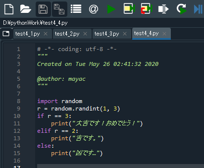


#### 実行


入力したら、画面上部の“ファイルを実行”アイコンを何度もクリックしてみましょう。

大吉、吉、凶がランダムに表示されるおみくじができました。


#### 解説

このコードは大吉と吉と凶がそれぞれ３分の１の確率で出るおみくじになっています。
コードの各行の内容とフローチャートは次のようになります。

```python
import random
r = random.randint(1, 3)
if r == 3:                         # もしも変数 r の値が 3 であるならば…
    print("大吉です！おめでとう！")   # 「大吉です…」と表示する
elif r == 2:                       # r の値が 2 の場合は…
    print("吉です。")               # 「吉です。」と表示する
else:                              # r の値がそれ以外の場合は…（ r の値が 1 の場合は…）
    print("凶です…")                # 「凶です…」と表示する
```

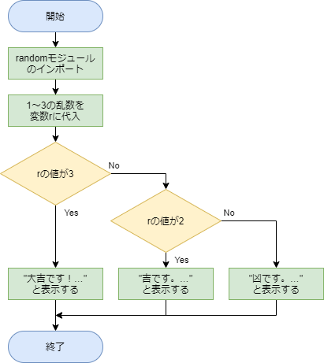

このように複数に分岐するコードはプログラミングをするに当たってよく出てくることになりますので、このフローチャートの形も覚えておくと良いと思います。	


#### 練習

例えば以下のように elif をいくつか使うことで４つ以上の処理からどれかを選んで実行させることも出来ます。

```python
import random
r = random.randint(1, 4)
if r == 4:
    print("大吉です！おめでとう！")
elif r == 3:
    print("吉です。")
elif r == 2:
    print("中吉です。")
else:
    print("凶です…")
```

これを応用し、大吉、吉、中吉、小吉、凶 の5つがランダムに表示されるおみくじを作ってみましょう。
その際、大吉と凶は表示される確率が低くなるように工夫してみてください。


## 答えが２つあるクイズ（or の使い方）

if文を使って、クイズやなぞなぞを作ってみましょう。
今回は次の問題を出題し、キーボードで回答を入力します。

問題：天空の城ラピュタの主人公は？

答え：パズー もしくは シータ

この問題には答えが２つあります。
どちらの答えを入力しても「正解！」と表示させるにはどうしたらよいでしょうか？

これまでに出てきた内容だけでコードを書くことも出来ます。

<details><summary><u>→解答例を表示</u></summary><blockquote><span class="md-text">
    まずはフローチャートを考えてみましょう。
    キーボードから入力した ans の値が「パズー」であるか、そうでないなら「シータ」か、あるいはそれ以外なのか… 判断を２回しているのでひし形ブロックは２つ使えばよさそうです。
    「おみくじ その３」のフローチャートにもひし形ブロックが２つ出てきましたね。これを参考に書くことができそうです。
    <br>おみくじ その３ のフローチャート：
    [](#)
    <br>上のフローチャートを参考にして、例として、次のようなフローチャートを書いてみました。
    [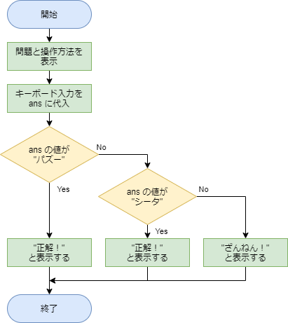](#)
    <br>このフローチャートを元に、コードを書いていきます。
<pre><code class="python">print(" 天空の城ラピュタの主人公は？\n答えを入力し、リターンキーを押してください。 ")
ans = input()             # キーボード入力を変数 ans に代入
if ans == "パズー":        # もし ans の値が「パズー」なら
    print("正解！")        # 「正解！」と表示する
elif ans == "シータ":      # そうではなく、もし ans の値が「シータ」なら
    print("正解！")        # 「正解！」と表示する
else:                     # それ以外の場合は
    print("ざんねん！")     # 「ざんねん！」と表示する</code></pre>    
<hr></span></blockquote></details>

　

しかし、**「もしくは」を表す英語「or」を用いる**ことで、「**もし複数の条件式のうちどれかが当てはまるならば…**」という条件式を、よりシンプルに書くことができます。

以下で示した例の場合、変数「drink」に代入された文字列が「ビール」もしくは「ワイン」であった場合に「これはお酒です。」と表示します。

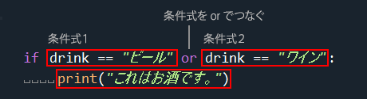

それでは早速「天空の城ラピュタの主人公当てクイズ」のコードを作成してみましょう。


#### エディタにコードを入力


まず、Spyder の画面左上にある“新規ファイル”アイコンをクリックし、新しい Python ファイルを用意します。


以下のコードを入力し、ファイルを保存アイコンをクリックして保存しましょう。今回は `test4_5.py` という名前で保存してみました。

```python
print("天空の城ラピュタの主人公は？\n答えを入力し、リターンキーを押してください。")
ans = input()
if ans == "パズー" or ans == "シータ":
    print("正解！")
else:
    print("ざんねん！")
```

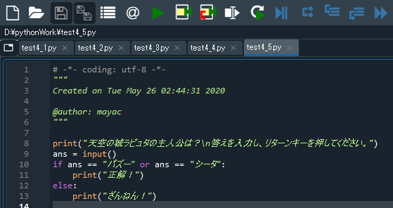

#### 実行


入力したら、画面上部の“ファイルを実行”アイコンを何度もクリックしてみましょう。

すると、コンソールに次のように表示されるはずです。


コンソールを一度クリックし、コンソールをアクティブにします。
そして「パズー」もしくは「シータ」と入力し、リターンキーを押します。


すると「正解！」もしくは「ざんねん！」と表示されるはずです。

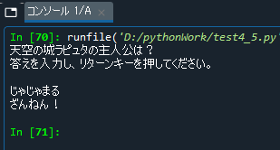


#### 解説

このコードではキーボードから入力された文字列が正解であるかどうかを判断しています。
正解が「パズー」と「シータ」の２つあるため、どちらの場合でも「正解！」と表示させなければいけません。
先ほどの例のように if文を２つ使えばよいのですが、条件式の中に「or」を使用することで、一つの条件式で済ませることができます。
コードの各行の内容とフローチャートは次のようになります。

```python
print(" 天空の城ラピュタの主人公は？\ n答えを入力し、リターンキーを押してください。 ")
ans = input()
if ans == "パズー" or ans == "シータ":
    print("正解！")
else:
    print("ざんねん！")
```

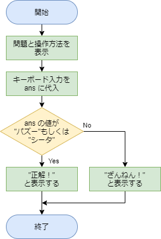


## BMI指数で健康チェック（and の使い方）

先ほどのクイズは答えが２つあり、そのどちらかを回答できれば「正解！」と表示されるものでした。２つある条件式を「or」でつなぎ、そのどちらかに当てはまっていれば何かの処理を行うというものです。

では、**２つの条件式のどちらにも当てはまった時にのみ何かの処理を行う**、というコードを書くにはどうすればよいでしょうか？
その場合、以下のように**２つの条件式を「and」でつなぎます**。

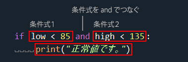

このコードでは変数 low の値が85未満、変数 high の値が135未満なら「正常値です。」と表示します。ちなみにこれは血圧測定の例です。

　

それでは、BMIという肥満度を示す指数を求め、「痩せ」「普通」「肥満」を判別するコードを書いてみましょう。
BMIは以下の式で得ることができます。

`BMI ＝ 体重 (kg) ÷ (身長(m) × 身長(m))`

BMIの値とその判定内容は以下の通りです。

| BMI値             | 判定 |
| ----------------- | ---- |
| 18.5 未満         | 痩せ |
| 18.5 以上 25 未満 | 普通 |
| 25 以上           | 肥満 |


#### エディタにコードを入力


まず、Spyder の画面左上にある“新規ファイル”アイコンをクリックし、新しい Python ファイルを用意します。


以下のコードを入力し、ファイルを保存アイコンをクリックして保存しましょう。今回は `test4_6.py` という名前で保存してみました。

```python
print("身長(cm)を入力し、リターンキーを押してください。")
h = input()
f_h = float(h) * 0.01
print("体重を入力し、リターンキーを押してください。")
w = input()
f_w = float(w)

bmi = f_w / (f_h * f_h)
print("BMI値は", bmi, "です。")

if bmi < 18.5:
    print("痩せです。")
elif 18.5 <= bmi and bmi < 25:
    print("普通です。")
elif 25 <= bmi:
    print("肥満です。")
```

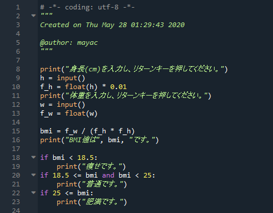

#### 実行


入力したら、画面上部の“ファイルを実行”アイコンをクリックしてみましょう。

コンソールに身長と体重を入力するよう指示が表示されるので、入力し、リターンキーを押していきます。
するとBMI値が表示され、痩せか普通か肥満のどれかが表示されます。

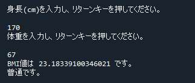

#### 解説

このコードではキーボードで入力された身長と体重からBMI値を計算し、痩せ・普通・肥満の判定を行っています。

入力直後の身長と体重は「文字列（str型）」であるため、前回の授業で出てきた型変換で「数値（float型）」に変換後、BMI値を計算させています。

条件式をつなぐ「and」は、最後の痩せ・普通・肥満判定時に出てきます。この例のようにある変数の数値が「〇〇以上〇〇未満」といった判定をさせる際に「and」をよく使います。

```python
print("身長(cm)を入力し、リターンキーを押してください。")
h = input()                             # キーボード入力を変数 h に代入
f_h = float(h) * 0.01                   # h は str型なのでfloat型に変換。ついでにメートルに変換。
print("体重を入力し、リターンキーを押してください。")
w = input()                             # キーボード入力を変数 w に代入
f_w = float(w)                          # w は str型なので、float型に変換

bmi = f_w / (f_h * f_h)                 # BMI値を計算し、変数「bmi」に代入
print("BMI値は", bmi, "です。")

if bmi < 18.5:                          # もしbmiが18.5未満ならば…
    print("痩せです。")
elif 18.5 <= bmi and bmi < 25:            # bmi が18.5以上 かつ 25未満ならば…
    print("普通です。")
elif 25 <= bmi:                           # bmiが25以上ならば…
    print("肥満です。")
```


#### 練習

変数エクスプローラーを開き、各変数の型および値をチェックしておきましょう。

このコードを「elif」を使って書き換えるとどうなるでしょうか？

<details><summary><u>→解答例を表示</u></summary><blockquote><span class="md-text">
まずはフローチャートを考えてみましょう。
以下は「if」「elif」「else」を使った場合のフローチャートと、「if」だけを使って条件式に「and」を用いた場合の２通りのフローチャートの例です。
どちらでも実行結果は同じですが、この例の場合は and は使わずに書いた方がすっきりするかもしれません。
[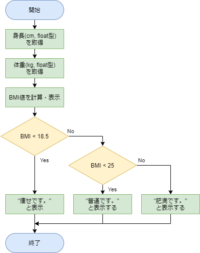](#)  [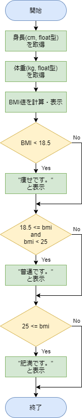](#)
<br>このフローチャート（左）を元に、elif を使ってコードを書いていきます。
<pre><code class="python">print("身長(cm)を入力し、リターンキーを押してください。")
h = input()
f_h = float(h) \* 0.01                # h は str型なので、float型に変換。ついでにメートルに変換
print("体重を入力し、リターンキーを押してください。")
w = input()
f_w = float(w)                       # w は str型なので、float型に変換
<br>bmi = f_w / (f_h \* f_h)
print("BMI値は", bmi, "です。")
<br>if bmi < 18.5:
    print("痩せです。")
elif bmi < 25:
    print("普通です。")
else:
    print("肥満です。")</code></pre>
<hr></span></blockquote></details>

　

BMI値による判定はさらに細かく分かれています。この６通りの判定を行って結果を表示させてみましょう。
and を使っても elif を使ってもどちらでも大丈夫です。

| BMI値             | 判定  |
| ----------------- | ----- |
| 18.5 未満         | 痩せ  |
| 18.5 以上 25 未満 | 普通  |
| 25 以上 30 未満   | 肥満1 |
| 30 以上 35 未満   | 肥満2 |
| 35 以上 40 未満   | 肥満3 |
| 40 以上           | 肥満4 |

　

本日のメインの内容は以上となります。いかがでしたでしょうか？

次回は「繰り返し」を学習しますが、本日学習した「条件分岐」と組み合わせることで、複雑な処理をさせることが可能です。
最初のうちは難しく感じるかもしれませんが、今回と次回の内容が本授業の山場ですので、少しずつなれていきましょう！

それでは引き続きやってみよう画像処理３も、読み進めてみてください。

　

[< 戻る](../)

