# やってみよう画像処理３

[< 戻る](../)

細かいことは分からなくてもいいから、とにかくやってみよう！のコーナーです。

今回の画像処理体験では、画像の色数の削減、ネガポジ反転、などを行ってみましょう。
後半では各画素にアクセスし、その値を変更する、ということもやってみます。


## デジタル画像について

### 加法混色と減法混色

色を混ぜて他の色を作ることを「混色」と呼びます。
この混色は大きく「加法混色」と「減法混色」に分けられます。
我々がスマホの画面や雑誌などに見ているあらゆる絵や写真や文字などは、加法混色か減法混色によって描かれています。

加法混色の例
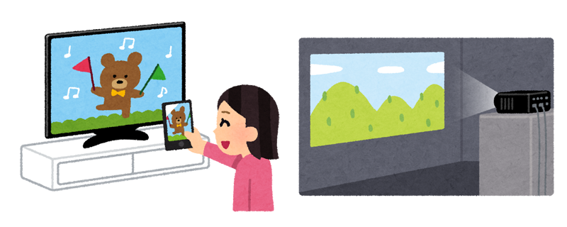

減法混色の例
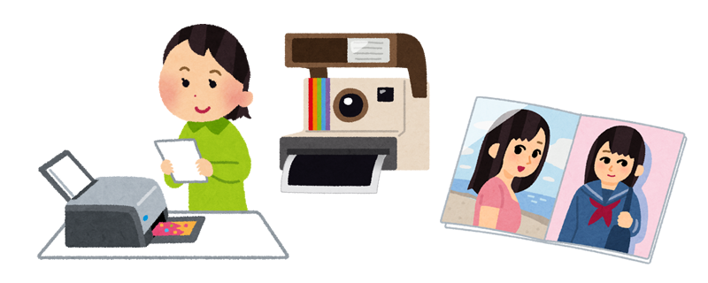

**加法混色**では、光の三原色である「赤」「緑」「青」を使ってフルカラーを表現します。三原色を重ねることで徐々に白に近づいていきます。
スマホの画面やテレビ、プロジェクターや屋外ビジョンなど、絵自体が光っていて暗いところでも見えるものが加法混色です。

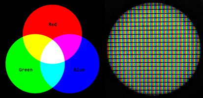
左図の右側は液晶モニタをルーペで拡大撮影したものです。赤、緑、青が規則正しく並んでいる様子が分かります。

**減法混色**では、色の三原色である「シアン」「マゼンタ」「イエロー」を使ってフルカラーを表現します。
プリンターによる印刷、グラビア写真集やポラロイドカメラで撮影した写真など、絵自体は光を発しないものが減法混色です。

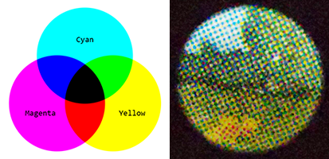
左図の右側は印刷物をルーペで拡大撮影したものです。（ちょっと分かりにくいですが）シアン、マゼンタ、イエローのドットで構成されている様子が分かります。

デジタル画像ファイルの多くは、加法混色の考え方のデータ構造になっています。
画像処理体験で用いる画像も、全て加法混色です。


### 画像ファイルの画素が持つ値

身の回りのデジタル画像は、カラーであることがほとんどです。加法混色ですので、各画素には「赤」「緑」「青」の情報（値）を持っています。
一方で白黒しか表現できないデジタル画像（グレースケール画像）も存在します。この場合、各画素には「赤」「緑」「青」の値は持たず、濃淡の情報だけを持つことになります。


### グレースケール画像の値

まずはグレースケール画像がどのような値を持っているのかを見てみましょう。


この小さいモノクロにこちゃんを拡大してみます。

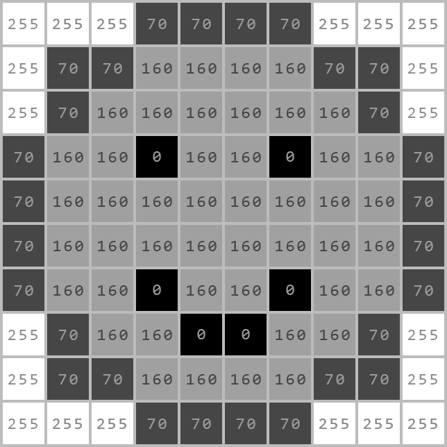

各画素に書かれている数値は、その画素の濃淡の値です。背景の白は 255、目とか口の黒は 0 となっています。
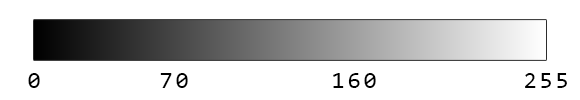

このように、**グレースケール画像における各画素は 0～255 の 256段階で濃淡を表現**しています。

例えば、このモノクロにこちゃんを、ネガポジ反転させたとします。
その場合の各画素の値はどのように決まるでしょうか？

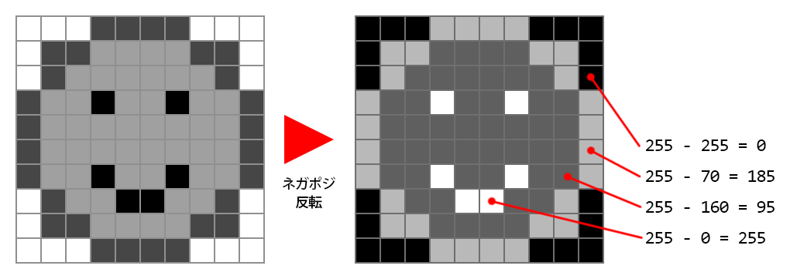

にこちゃんの背景は白（255）でしたので、ネガポジ反転したら黒（0）になります。
にこちゃんの目は黒（0）でしたので、ネガポジ反転したら白（255）になります。
つまり、ある画素の値は次のような式で求めることができます。

`ネガポジ反転後の画素の値 ＝ 255 － 元の画素の値`

この式を用いて考えると、にこちゃんの輪郭は元の値が70でしたので、`255 - 70 = 185` 、にこちゃんのほっぺは `255 - 160 = 95` となることが分かります。


### カラー画像の値

続いてカラー画像についても簡単に見ておきましょう。
グレースケール画像は濃淡の情報のみだったのに対して、カラー画像は加法混色ですから各画素には「赤」「緑」「青」の情報（値）を持っています。


この小さいカラーにこちゃんを拡大してみます。

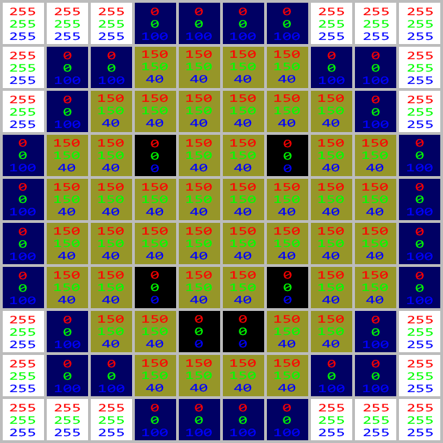

各画素に書かれている数値は、その画素の赤・緑・青（RGB）の値です。背景の白や、目口の黒は RGB の値が全て同じですね。このように R=G=B の場合は彩度が０になってモノクロとなります（濃淡の値しか持たないグレースケール画像とは別物です）。

RGB のそれぞれはグレースケール画像の濃淡の情報と同じく、 0～255 の 256 段階で表現されます。ですのでカラー画像はグレースケール画像と比較すると情報量が３倍ですね。

　

ところで、やってみよう画像処理１で jpeg形式や tga形式の画像の色数は「約1670万色」と学習しました。R、G、B のそれぞれが256段階の表現が可能であるため、それらの組み合わせの総数は 256 × 256 × 256 = 16,777,216 となります。したがって約1670万色となっているのです。

また、png形式などの画像はさらに多くの諧調を表現できるのですが、例えば「png形式のグレースケール画像」「png形式のカラー画像（色数約1670万色）」「png形式のカラー画像（色数約280兆色）」といった具合に同じ形式の画像でも様々なモードがあります。

ですので、**我々が普段目にする画像の多くは R、G、B のそれぞれが256段階のカラー画像である**、と覚えておきましょう。


## カラー画像をグレースケール画像に


#### エディタにコードを入力


まず、Spyder の画面左上にある“新規ファイル”アイコンをクリックし、新しい Python ファイルを用意します。


以下のコードを入力し、ファイルを保存アイコンをクリックして保存しましょう。今回は `try3_gray.py` という名前で保存してみました。

```python
from PIL import Image                     # Pillowモジュールのインポート
img = Image.open("photoSample_03.jpg")    # 画像を読み込む
img_gray = img.convert("L")               # グレースケール画像に変換
img_gray.save("photoSample_03_gray.png")  # モノクロになった画像を保存する（今回はPNGで保存してみました）
```


#### 実行


入力したら、画面上部の“ファイルを実行”アイコンをクリックしてみましょう。

しばらくすると作業ディレクトリにモノクロになった「`photoSample_03_gray.png`」というファイルが保存されます。

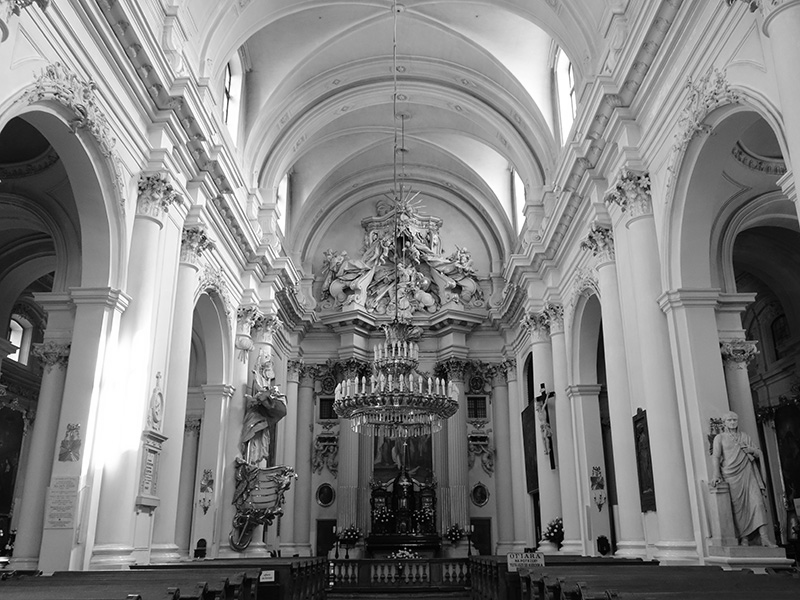


## カラー画像の1bit化

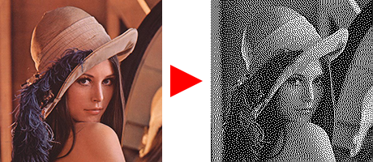

先ほど「グレースケール画像における各画素は 0～255 の 256段階で濃淡を表現しています」という説明をしたのですが、例えばFAX（使ったことある人いるかなぁ…）で画像を送る場合は、出来るだけ通信量を削減するため、黒か白の２段階で画像を表現したりします。黒と白の画素をうまく使うことでなんとなくグラデーションの表現もできていますね。

このような画像は **1bit 画像**と呼んだりします。


#### エディタにコードを入力


まず、Spyder の画面左上にある“新規ファイル”アイコンをクリックし、新しい Python ファイルを用意します。


以下のコードを入力し、ファイルを保存アイコンをクリックして保存しましょう。今回は `try3_1bit.py` という名前で保存してみました。

```python
from PIL import Image                     # Pillowモジュールのインポート
img = Image.open("photoSample_04.jpg")    # 画像を読み込む
img_1bit = img.convert('1')               # 黒白の1bit画像に変換
img_1bit.save("photoSample_04_1bit.png")  # 変換した画像を保存する
```


#### 実行


入力したら、画面上部の“ファイルを実行”アイコンをクリックしてみましょう。

しばらくすると作業ディレクトリに1bit化した「 `photoSample_04_1bit.png` 」というファイルが保存されます。

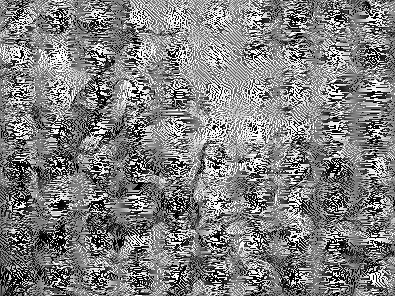


## ネガポジ反転

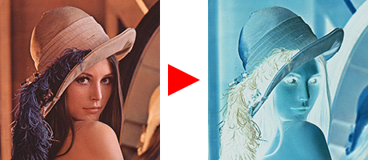

#### エディタにコードを入力


まず、Spyder の画面左上にある“新規ファイル”アイコンをクリックし、新しい Python ファイルを用意します。


以下のコードを入力し、ファイルを保存アイコンをクリックして保存しましょう。今回は `try3_hanten.py` という名前で保存してみました。

```python
from PIL import Image, ImageOps               # Pillowモジュールのインポート
img = Image.open("photoSample_05.jpg")        # 画像を読み込む
img_hanten = ImageOps.invert(img)             # 画像をネガポジ反転
img_hanten.save("photoSample_05_hanten.png")  # 反転された画像を保存する（今回はPNGで保存してみました）
```


#### 実行


入力したら、画面上部の“ファイルを実行”アイコンをクリックしてみましょう。

しばらくすると作業ディレクトリにネガポジ反転された「`photoSample_05_hanten.png`」というファイルが保存されます。


## 実際の画像処理

このやってみよう画像処理では、`Pillow`という画像処理モジュールを用いて画像処理を行っています。

例えば画像の拡大縮小を行う場合は `resize()` という命令を使いましたし、回転させる場合は `rotate()`、ネガポジ反転させるには `invert()` という命令を使いましたね。これらの命令は「中でどのような処理を具体的に行っているのかを知らなくてもOK! 命令さえ実行してくれれば結果を出しますよ！」というものです。便利ではあるのですが、細かい処理を行いたい場合など、痒い所に手が届かないケースも多々あります。

そのような時には自分で処理の中身を作ってしまうといいでしょう。
難しそうですが、簡単な例を見てみましょう。

（なお、以下の内容はまだ本編で学習していません。次回の「繰り返し（ループ）」で学習しますので、本日はなんとなく見ておいてください。）

### 全ての画素にアクセスする2重ループ

前回のやってみよう画像処理では画素（ピクセル）の並び方を紹介しました。
画像の左上が原点 (0, 0) で、右方向に x, 下方向に y の値が増えていく座標系になっていましたね。
画像処理を行うには、この画素全てにアクセスし、それぞれの画素の値を変更するなりの処理をしてあげないといけません。
この画素へのアクセスですが、例えば以下のアニメーションのような流れで行います。

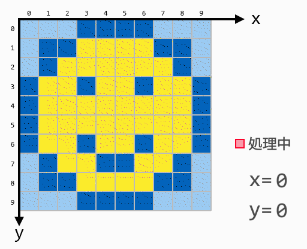

赤の画素で処理を行っています。
この例の場合、カラー画像をモノクロに変換していますね。
このようなアクセスの流れを行うためには2重ループという手法を用います。


Pythonの新規ファイルを作成し、以下のコードを記述して実行してみましょう。

```python
from PIL import Image
 
img = Image.open("photoSample_02.jpg")    # 画像を Pillow 内で画像を保持するImageオブジェクトに読み込む
size_x = img.width                        # 読み込んだ画像の横方向(x)のサイズ（ピクセル数）を取得
size_y = img.height                       # 読み込んだ画像の縦方向(y)のサイズ（ピクセル数）を取得
img_gray = img.convert("L")               # カラーモードのImageオブジェクトをグレースケールモードに変換
 
img2 = Image.new('L',(size_x, size_y))    # 読み込んだ画像と同じサイズのグレースケールImageオブジェクトを作成
 
for y in range(size_y):                         # ここから2重ループ
    for x in range(size_x):
        pixel_val = img_gray.getpixel((x, y))   # (x, y)の画素の値を取得 グレースケールモードなので読み取る値は１つ
 
        if pixel_val < 130:                     # もし画素の値が130未満の場合は…
            pixel_val2 = 0                      # 黒と判定する。変数 pixel_val2 に 0 を代入
        else:                                   # それ以外の場合は…
            pixel_val2 = 255                    # 白と判定する。変数 pixel_val2 に 255 を代入
 
        img2.putpixel((x, y), pixel_val2)       # 先ほど作成した img2 の(x, y)の画素にpixel_val2の値を書き込む
         
img2.save("photoSample_02_2chika.png")          # img2 をPNG形式の画像として保存する
```

このコードを実行すると、カラー画像が白黒の2色で構成された画像に変換されます（この変換のことを２値化といいます）。

コード中の 130 という値を色々と変化させて実行してみると、変換後の結果が変わるのでやってみてください。

（左）変換前、（右）変換後

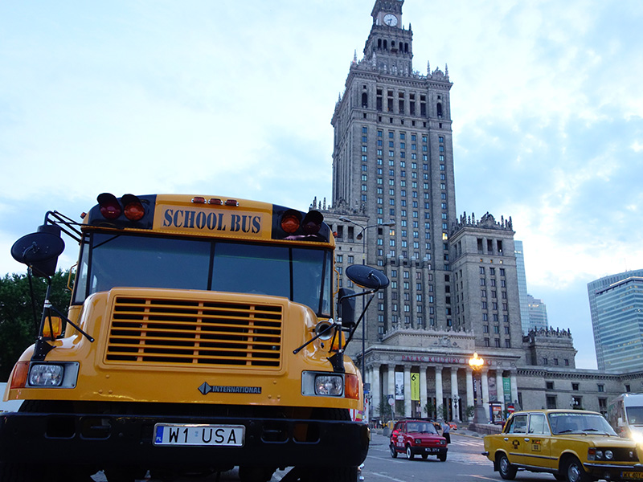
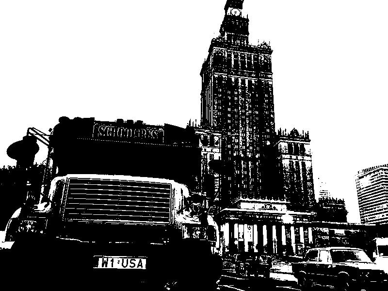

　

このコードでどのように画像を変換してるかを図で示すとこのようになります。

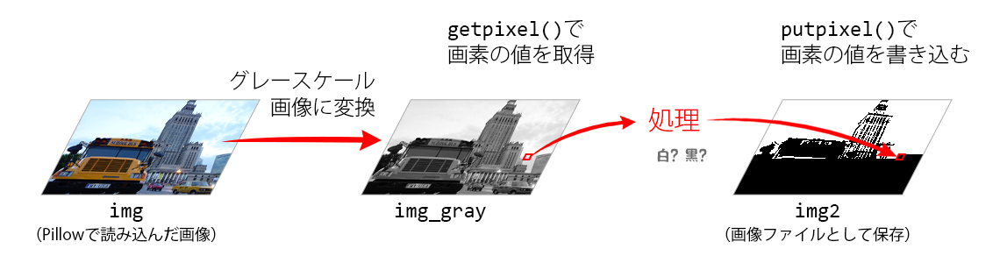

`Pillow` で画像を読み込むと `Image` というオブジェクト（変数とかリストみたいなものと思っておいてください）になります。名前は img としてみました。この段階ではカラー情報を持っています。

今回は２値化を行うので、グレースケール画像に変換します（`img_gray`）。`img` も `img_gray` も同じ Image というオブジェクトなのですが、`img` は “カラーモード” で `img_gray` は “グレースケールモード” です（`Image` にはいろんなモードがあるんですね！ Spyder の変数エクスプローラーを見るとなんとなく情報が分かります）。
そして `img_gray` の画素の値を `getpixel()` という命令で取得します。グレースケール画像の各画素が取る値は 0～255 でしたので、`getpixel()` で得られる数値も 0～255 となります。

２値化の処理は、`getpixel()`得られた値がある値より大きいか小さいかで判定します。今回の場合は値が130未満なら黒、130以上なら白です。このようにして得られた黒か白の情報を `putpixel()` で `img2` に書き込んでいきます。
`getpixel()` や `putpixel()` はすべての画素に対して行う必要がありますが、それを実現しているのが2重ループです。これについては次回のテキストで詳しく見ていこうと思います。


## RGBの入れ替え

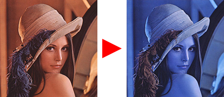

先ほどの例ではカラー画像をグレースケール画像に変換後に、2重ループと `getpixel()` で画像を構成するすべての画素の値を読み取り、2値化しました。
今回はカラー画像のままで2重ループと `getpixel()` を使ってみます。
カラー画像にはRGBの3つの情報がありますが、Rの情報とBの情報を入れ替えてみましょう。これを行うと、例えば真っ赤な画像は真っ青になります。


#### エディタにコードを入力


まず、Spyder の画面左上にある“新規ファイル”アイコンをクリックし、新しい Python ファイルを用意します。


以下のコードを入力し、ファイルを保存アイコンをクリックして保存しましょう。今回は `try3_changeRGB.py` という名前で保存してみました。

```python
from PIL import Image
 
# RとBを入れ替え                           # の後ろはすべてメモです。コードの実行に影響は出ません
img = Image.open("photoSample_05.jpg")    # 画像を読み込む
size_x = img.width                        # 読み込んだ画像の横方向(x)のサイズ（ピクセル数）を取得
size_y = img.height                       # 読み込んだ画像の縦方向(y)のサイズ（ピクセル数）を取得
 
img2 = Image.new('RGB',(size_x, size_y))  # 読み込んだ画像と同じサイズのカラーImageオブジェクトを作成
 
for y in range(size_y):                   # ここから2重ループ
    for x in range(size_x):
        pixel_col = img.getpixel((x, y))  # (x, y)の画素の値(RGB)を取得 pixel_colはリストの一種のタプルとなる
        r = pixel_col[0]                  # pixel_col から Rの値を取り出しておく（分かりやすさのため）
        g = pixel_col[1]                  # pixel_col から Gの値を取り出しておく（分かりやすさのため）
        b = pixel_col[2]                  # pixel_col から Bの値を取り出しておく（分かりやすさのため）
 
        img2.putpixel((x, y), (b, g, r))  # 先ほど作成した img2 の(x, y)の画素に値を書き込む。この際、
                                          # 本来なら(r, g, b) の順で書き込むところを(b, g, r) としてみる
img2.save("photoSample_05_bgr.png")       # img2 をPNG形式の画像として保存する
```


#### 実行


入力したら、画面上部の“ファイルを実行”アイコンをクリックしてみましょう。

しばらくすると作業ディレクトリにネガポジ反転された「`photoSample_05_bgr.png`」というファイルが保存されます。

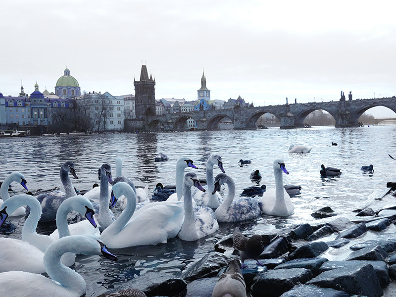


#### 練習

このコードをベースにうまくいじってみると、面白い効果を得ることができます。
`img2` に値を代入する際、例えば r g b の値に何かを足してみたり、かけてみたり、入れ替えてみたり、rgbのそれぞれに2値化の処理をかけてみたり…
まずは闇雲でよいので、いろいろといじってみましょう。

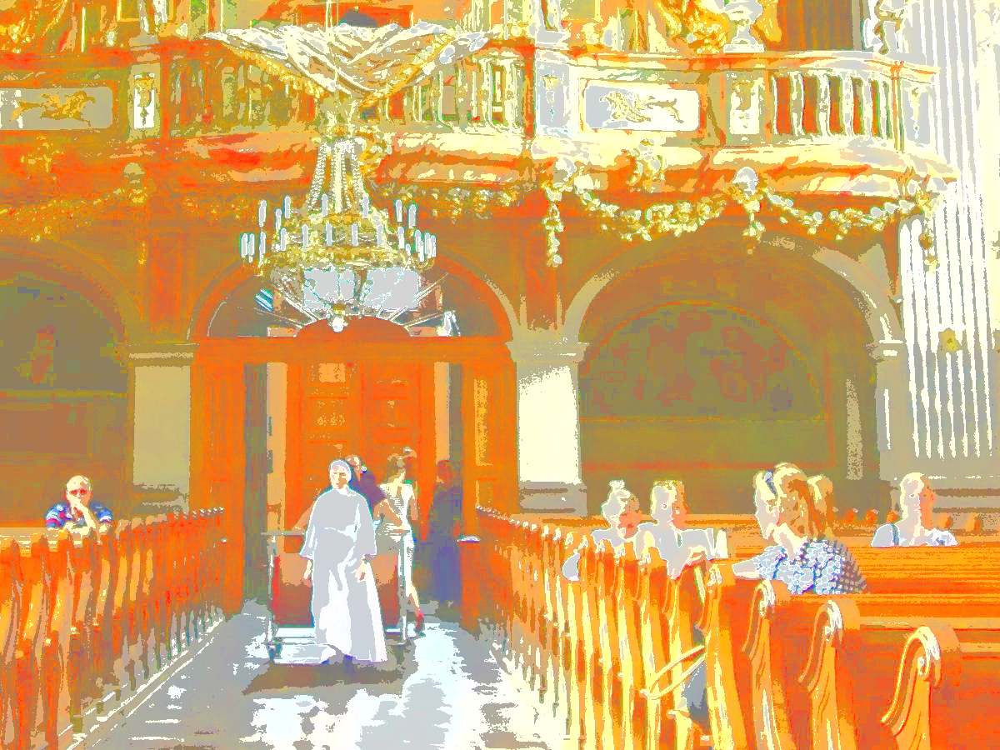
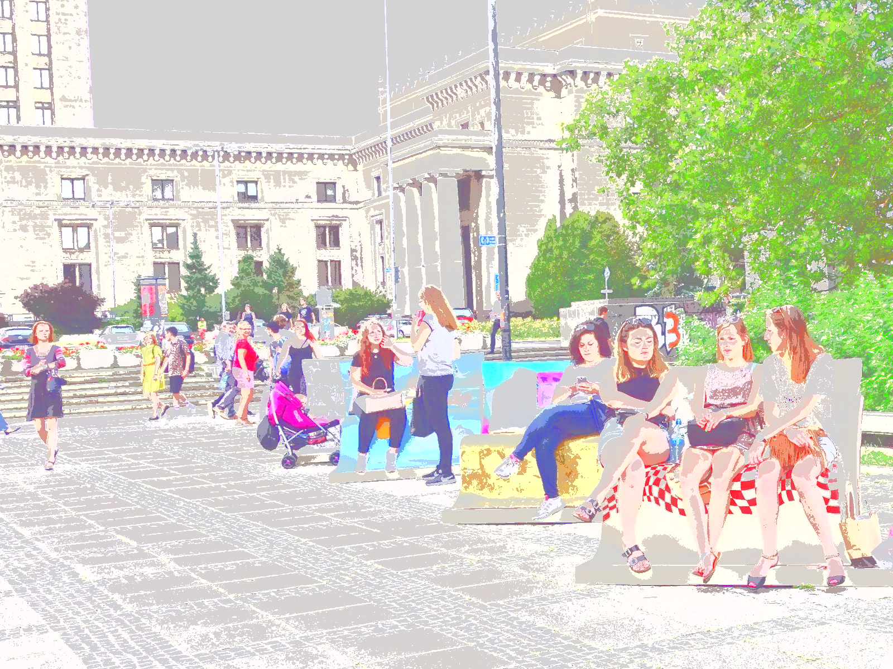

　

今回の後半はまだ本編で学習していない内容を含んでいたので、？？？だったかもしれません。

ループ（繰り返し）については次回学習しますので、今回はちゃんと理解できなくても大丈夫です。

　

[< 戻る](../)