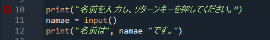
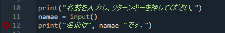
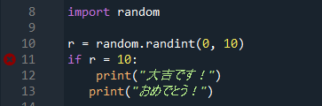
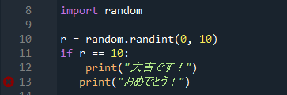
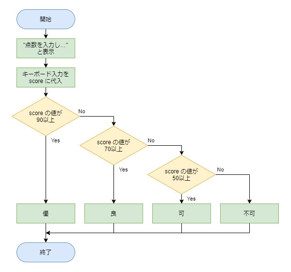

# 問１～問４の解答

[< 戻る](../)

　

## 問１：コードの間違い探し１

### 考え方

まず問題１のコードを Spyder のエディタにコピペしてみましょう。
すると**1行目の行番号の左に赤い×マークが表示されています。**


実行してみると、コンソールには「**SyntaxError**」と表示されました。
これが出た時は、**スペルミスや記述漏れなどを疑ってみましょう。**
1行目をよく見ると**最後のダブルクオーテーション `”` が全角になっています**。これを半角のダブルクオーテーションに修正しましょう。

これで1行目の間違いは修正出来ましたが、3行目にもう一つの間違いがあるようです。


実行してみると、再び「**SyntaxError**」と表示されました。スペルミスや記述漏れなどを疑いましょう。
よくよく見ると **`namae` の後にカンマ `,` が書かれていませんね！**

### 解答例

問１の間違いを修正すると、例えば以下のようなコードになります。

```python
print("名前を入力し、リターンキーを押してください。")
namae = input()
print("名前は", namae, "です。")
```


## 問２：コードの間違い探し２

### 考え方

まず問題２のコードを Spyder のエディタにコピペしてみましょう。
この時点では赤い×マークは表示されていませんので、実行してみます。
すると、このようなエラー「**TypeError**」が表示されました。


つまり、標準体重を計算するに当たって**変数の型が違う、と言われている**ようです。
この場合、**リストそのものを計算させようとしてしまったことでこのエラーが出た**ようです。

ここで、[第３回のテキストに出てきた「リスト」について](../../../03/hensuu/#!index.md#%E3%83%AA%E3%82%B9%E3%83%88)、簡単に復習しておきましょう。
リストとは、たくさんの変数（箱）を並べて管理するための棚のこと、でしたね。箱には ０から始まる番号を付けて管理し、箱のことを「要素」、番号のことを「インデックス（添え字）」と呼ぶのでした。


問題に出てきたリスト `li_heights` には「父の身長」「母の身長」「子の身長」という要素が順番に入っています。
今回の場合、`li_heights` に入っている家族全員分の要素から、**「父の身長」要素だけを取り出して計算させる必要があります**。
最初の要素である父の身長を取り出すには、 `li_heights[0]` と記述するのでしたね。

### 解答例

問２の間違いを修正すると、例えば以下のようなコードになります。

```python
li_heights = [170.5, 158.3, 95.8]
w = li_heights[0] * li_heights[0] * 0.0022
print("お父さんの標準体重は", w, "kgです。")
```


## 問３：コードの間違い探し３

### 考え方

まず問題３のコードを Spyder のエディタにコピペしてみましょう。
すると **`if r = 10:` の行番号の左に赤い×マークが表示されています。**


実行してみると、コンソールには「**SyntaxError**」と表示されました。スペルミスや記述漏れなどを疑ってみましょう。
if文の条件式をよく見てみると、「`r = 10`」となっています。ここは**「`r == 10`」が正解ですね**。
この「`==`」のことを「**演算子**」と呼ぶのでしたね（演算子には他にも <, <=, != などがあります）。
演算子について復習は[こちら（テキスト第４回、条件分岐の書式１）](../../../04/if/#!index.md#%E6%9D%A1%E4%BB%B6%E5%88%86%E5%B2%90%E3%81%AE%E6%9B%B8%E5%BC%8F%EF%BC%91)

これで1つ目の間違いは修正出来ましたが、最後の行にもう一つの間違いがあるようです。


実行してみると、コンソールには「**SyntaxError**」と表示されました。
今回は**字下げ**が揃っていないことが原因のようです。
最後の行の**字下げを、1つ上の行に揃えておきましょう（スペースを４つに統一する）。**
字下げについて復習は[こちら（テキスト第４回、Python における字下げについて）](../../../04/if/#!index.md#Python_%E3%81%AB%E3%81%8A%E3%81%91%E3%82%8B%E5%AD%97%E4%B8%8B%E3%81%92%E3%81%AB%E3%81%A4%E3%81%84%E3%81%A6)

### 解答例

問３の間違いを修正すると、例えば以下のようなコードになります。

```python
import random
r = random.randint(0, 10)
if r == 10:
    print("大吉です！")
    print("おめでとう！")
```


## 問４：コードの間違い探し４

### 考え方

今回は１～３のようなエラーではなく、if文の組み立て方を間違えていることで処理がうまく分岐していない、というものです。
`elif` を使う時にやっちゃうミスです。

コードを見てパッと分からない場合は、一度フローチャートを書いてみましょう。
問４のコードを見ながらフローチャートを書いてみると、右のようになります。


そして、開始ブロックから順に矢印をたどってみます。
**例えば100点（優）の場合はどうなるでしょうか？**
一つ目のひし形ブロックに書かれている条件を満たしているので Yes の矢印に進み、「可」となってしまいました。
他にも 80点（良）や 60点（可）で試してみても、全て「可」になってしまいますね。
一方で、40点（不可）の場合は全てのひし形ブロックで No の矢印に進むので、ちゃんと「不可」になります。

このようにフローチャートをたどることで、問４のコードは**「可」「不可」以外はきちんと分岐できていない**、ということが分かると思います。

フローチャートを修正すると、次のようになります。
このフローチャートも先ほどと同じように100点、80点、60点、40点でたどってみてください。きちんと分岐されるはずです。


### 解答例

問４の間違いを修正すると、例えば以下のようなコードになります。

```python
print("点数を入力し、エンターキーを押してください。")
score = int(input())
if score >= 90:
    print("優")
elif score >= 70:
    print("良")
elif score >= 50:
    print("可")
else:
    print("不可")  
```

　

[< 戻る](../)