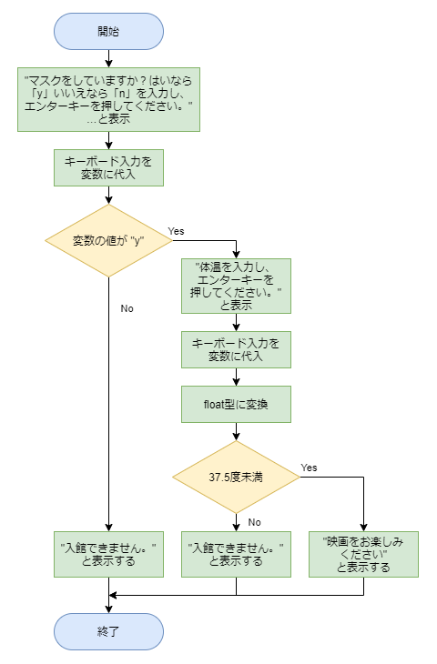

# 問６の解答

[< 戻る](../)

　

## 問６：映画館Bにはマスクして検温して…

### 考え方

この問題は先ほどの問５のコードを発展させることで解くことが出来ます。

まず、問５のフローチャートに書き加える形で問６のフローチャートを書いてみましょう。
最初の条件分岐でマスクをしていた場合、その先に「検温」というもう一つの条件分岐が待っています。
体温の入力はキーボードから行いますが、変数の型を float型に変換するのを忘れないようにしましょう。
これらを踏まえてフローチャートを書いてみると、例えば以下のようになります。



### 解答例

以上をコードにしてみると、例えば以下のように書くことができます。

```python
print("マスクをしていますか？はいなら「y」いいえなら「n」を入力し、エンターキーを押してください。")
yn = input()
if yn == "y":
    print("体温を入力し、エンターキーを押してください。")
    taion = input()
    taion_f = float(taion)
    if taion_f < 37.5:
        print("映画をお楽しみください。")
    else:
        print("入館できません。")
else:
    print("入館できません。")
```

　

[< 戻る](../)