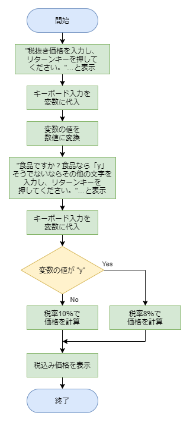

# 問７の解答

[< 戻る](../)

　

## 問７：税込み価格は？

### 考え方

この問題のコードも問５や問６と同様にキーボードからの入力と条件分岐を使って書くことが出来そうです。

税抜き価格はキーボードから入力しますが、後ほど税込み価格の計算に使いますので、int() もしくは float() を使って数値に変換することを忘れないようにしましょう。
これまで同様にフローチャートを書いてみると、例えば以下のようになります。



### 解答例

以上をコードにしてみると、例えば以下のように書くことができます。

```python
print("税抜き価格を入力し、リターンキーを押してください。")
zeinuki = input()
i_zeinuki = int(zeinuki)
print("食品ですか？食品なら「y」そうでないならその他の文字を入力し、リターンキーを押してください。")
yn = input()
if yn == "y":
    zeikomi = i_zeinuki * 1.08
else:
    zeikomi = i_zeinuki * 1.1
print("税込み価格は", int(zeikomi), "円です。")
```

　

[< 戻る](../)