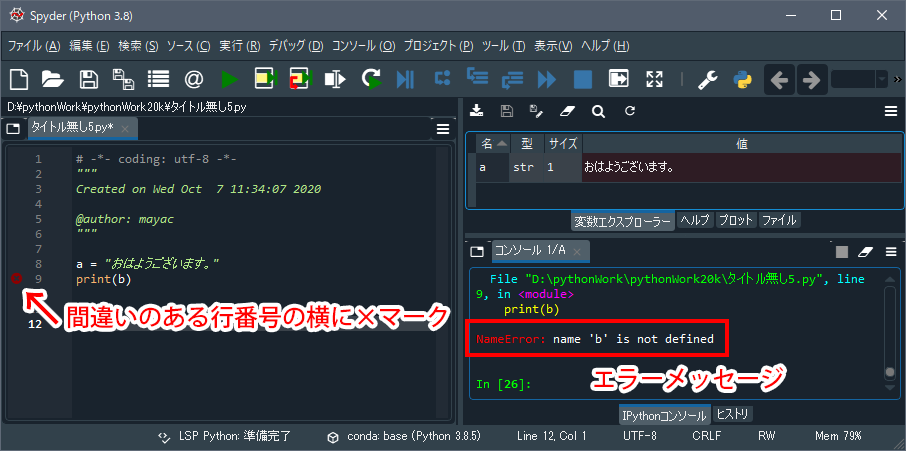

# 間違いの見つけ方

[< 戻る](../)

　

Python のコードを書いていざ実行ボタンをクリックしてみても、うまく動作しないことはよくあります。
最初のうちはどこが間違っているのか、なかなか見つけられずにイライラしてしまうこともあるのではと思います。
そんな時は以下の図のように、コードの行番号横に表示される赤い×マークと、コンソールに表示されるエラーメッセージをチェックしてみてください。




## 赤い×マーク

まずはコードの行番号の左横に表示される×マークをチェックです！たいていのケースではここをチェックすれば間違い箇所に気づくことができます。
もしもその×マークが付いている行に間違いが見当たらない場合はその 1つ前の行 もチェックしてみましょう。


## エラーメッセージ

次にチェックするのは実行するとコンソールに表示されるエラーメッセージです（赤い×マークが表示されていなくても、エラーメッセージが表示されることがあります）。
エラーメッセージにはいくつかの種類があるのですが、この授業でよく表示されることになるエラーメッセージは主に以下の5つです。

**SyntaxError**　**NameError**　**TypeError**　**ModuleNotFoundError**　**FileNotFoundError**


## エラーメッセージの種類

よくあるエラーの種類とその原因および解決方法です。


## SyntaxError

このエラーは構文が間違っていますよ！という時に表示されます。

**SyntaxError と表示されるコード：**

```python
score = input()
if score < 50
    print("不合格です")
```

構文がちゃんと合っているかを確認しましょう。
記述忘れやスペルミスなどがよくある原因です。

今回は、**条件式の最後に「:」を記述し忘れたことがエラーの原因**です。

**正しいコード：**

```python
score = input()
if score < 50:
    print("不合格です")
```

　

また、以下の例では3行目と4行目で字下げの量が違いますが、この場合も **SyntaxError** となります。

**SyntaxError と表示されるコード：**

```python
score = input()
if score < 50:
    print("不合格です")
  print("残念！")
```


## NameError

このエラーは使用した変数名が間違っていますよ！という時に表示されます。

**NameError と表示されるコード：**

```python
a = "おはようございます。"
print(b)
```

変数名がちゃんと合っているかを確認しましょう。

**正しいコード：**

```python
a = "おはようございます。"
print(a)
```


## TypeError

このエラーは誤った変数の型を使用した時に表示されます。

**TypeError と表示されるコード：**

```python
cyokkei = input()
print(cyokkei * 3.14)
```

このコードはキーボードから入力した円の直径から、円周を求めて表示するものです。

入力命令である `input()` で得られる値は str型です。**str型は `int()` もしくは `float()` を使って「数値」にしてあげないと計算できません**。
これを無理やり計算させようとしたことが、エラーの原因です。

**正しいコード：**

```python
cyokkei = input()
print(float(cyokkei) * 3.14)
```


## ModuleNotFoundError

このエラーは import 〇〇〇〇 で読み込もうとしたモジュールが見当たらない時に表示されます。

**ModuleNotFoundError と表示されるコード：**

```python
import randam
saikoro = random.randint(1, 6)
print(saikoro)
```

1行目でランダムモジュールを読み込もうとしているのですが、「**random**」を「**randam**」とスペルミスしていることがこのエラーの原因です。
読み込むモジュールがあるかどうかの判断はコードの実行に行うため、Spyder がエラーに気づくのも実行時、ということになります。
ですので、上記のエラーコードをコピペしてみても、1行目の行番号横には赤い×マークは付きません。

モジュール名のスペルミスが無いかチェックしてみましょう。 

**正しいコード：**

```python
import random
saikoro = random.randint(1, 6)
print(saikoro)
```


## FileNotFoundError

このエラーは読み込もうとしたファイルやディレクトリが見当たらない時に表示されます。

**FileNotFoundError と表示されるコード：**

```python
from PIL import Image
img = Image.open("photoSample_10.jpg")
img.show()
```

このコードは自分の作業フォルダから「 `photoSample_10.jpg` 」という画像ファイルを読み込んで、表示させる、というものです。
しかしいざ実行してみたところ、作業フォルダ内には `photoSample_10.jpg` がありませんでした。
したがって「**FileNotFoundError**」と表示されます（もし作業フォルダ内に「`photoSample_10.jpg`」があればエラーは出ません）。
このエラーも実行時に判明するため、赤い×マークは表示されません。

まず、**作業フォルダがちゃんと設定されているかを確認しましょう。**
次に、**その作業フォルダ内に指定したファイルがあるかどうかを確認しましょう。**

**正しいコード：**

```python
from PIL import Image
img = Image.open("photoSample_01.jpg")
img.show()
```

　

[< 戻る](../)