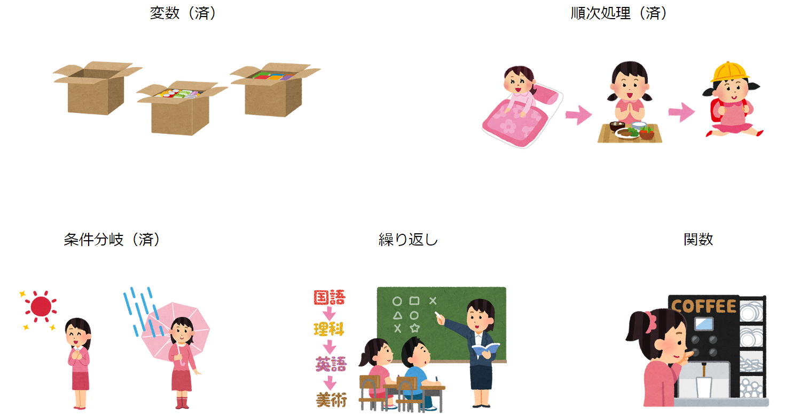
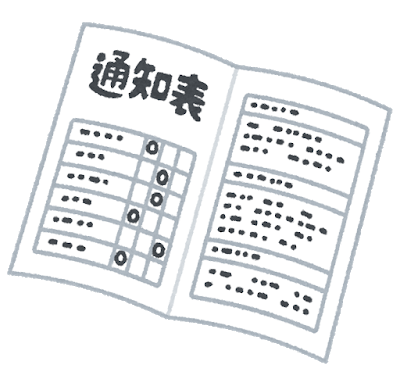
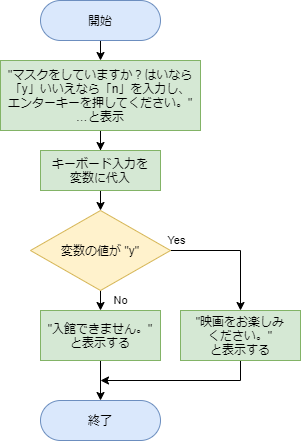
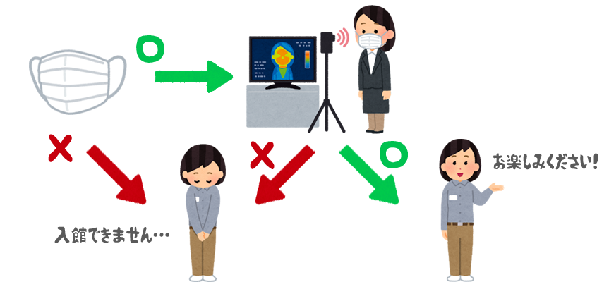
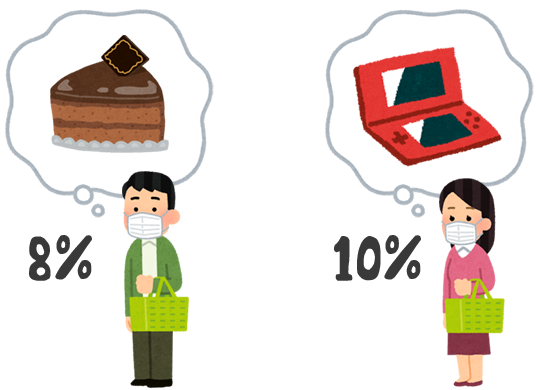
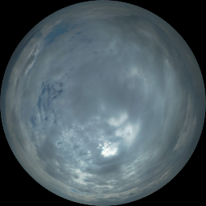

# 練習問題

[< 戻る](../)

　

本授業で習得してほしい５つのことのうち、前回までに「変数」「順次処理」「条件分岐」を学習してきました。

この次に学習するのは「繰り返し」ですが、プログラミングに初めて触れた方には、この「繰り返し」は少しややこしく感じるかもしれません。

そのため、今回は練習問題を使って、これまでの学習内容をしっかりマスターしてから次回の「繰り返し」に臨みましょう！



　

まずはこの「問題編」をやってみてください。

授業開始時に「解答編」をアップしますので、そちらで答え合わせをしてみましょう。


## 問題１：コードの間違い探し１

キーボードで自分の名前を入力すると、「名前は〇〇〇〇です。」と表示するコードを書いてみましたが、このコードを Spyder にコピペして実行しようとしても、エラーが出てしまいます。

```python
print("名前を入力し、リターンキーを押してください。”)
namae = input()
print("名前は", namae "です。")
```

**どこが間違っているかを考え、正しいコードに修正してください。※間違いは2か所あります**


## 問題２：コードの間違い探し２

家族3人の体調管理プログラムを作ります。
まずは「父の身長」「母の身長」「娘の身長」を要素に持つリスト（li_heights）を作成してみました。
そして、父の標準体重を求めるために以下のようなコードを書いてみたのですが、実行するとエラーが出てしまいます。

```python
li_heights = [170.5, 158.3, 95.8]
w = li_heights * li_heights * 0.0022
print("お父さんの標準体重は", w, "kgです。")
```

**どこが間違っているかを考え、正しいコードに修正してください。**


## 問題３：コードの間違い探し３

randomモジュールを使っておみくじを作ろうと思います。 
まず、1/10 の確率で「大吉」が出るコードを以下のように書いてみましたが、これを実行しても、エラーが出てしまいます。

```python
import random

r = random.randint(1, 10)
if r = 10:
    print("大吉です！")
   print("おめでとう！")
```

**どこが間違っているかを考え、正しいコードに修正してください。※間違いは2か所あります**


## 問題４：コードの間違い探し４

とある大学の成績は以下のように決まるそうです（武蔵野美大ではありません）。
点数を入力すると、成績を表示するコードを作りたいと思います。

| 点数      | 成績 |
| --------- | ---- |
| 90 ～ 100 | 優   |
| 70 ～ 89  | 良   |
| 50 ～ 69  | 可   |
| 50未満    | 不可 |

以下のコードを実行すると、エラーは出ませんでした。
しかし、なぜか「可」「不可」の２つしか判定してくれません。
点数に「100」と入力しても「可」と判定されてしまいます。これは変です。

```python
print("点数を入力し、エンターキーを押してください。")
score = int(input())

if score >= 50:
    print("可")
elif score >= 70:
    print("良")
elif score >= 90:
    print("優")
else:
    print("不可")   
```

**どこが間違っているかを考え、正しいコードに修正してください。**



## 問題５：映画館Aにはマスクをして…

新型コロナウイルスの感染拡大防止のため、ほとんどの人がマスクをして外出するようになりました。
マスクをしていない人は入らないでください、というお店や施設も、よく見かけます。
とある映画館Aでは、マスクをしていないと入館をお断りしているようです。

マスクを着用しているかどうかを「はい（y）」もしくは「いいえ（n）」で入力し、
はいなら「映画をお楽しみください。」
いいえなら「入館できません。」
と表示する コードを作成してみたいと思います。


まず、以下のようなフローチャートを考えてみました。

**このフローチャートを見ながら、コードを書いて、実行してみましょう。**



## 問題６：映画館Bにはマスクして検温して…

新型コロナウイルスの感染拡大防止のため、とある映画館Bでは「マスクをしている」ことに加えて「体温が37.5度以下」であるお客さんしか入館できないようです。



**問題４で作成したコードを修正し、次のようなコードを書いてみましょう。**

マスクを着用しているかどうかを「はい（y）」もしくは「いいえ（n）」で入力し、
いいえなら「入館できません。」と表示します。
はいなら「体温を入力してください。」と表示し、キーボードで体温を入力します。
入力した体温が37.5度未満の場合は「映画をお楽しみください。」と表示し、
37.5度以上なら「入館できません。」と表示します。

コードを作成する前に、ペンと紙の殴り書き程度でよいですのでフローチャートを書いてみましょう。
そのフローチャートを見ながらコードを書いて、実行してみましょう。


## 問題７：税込み価格は？

2019年の10月に消費税率が８％から10％に引き上げられました。
ただし、お酒を除く飲食料品を購入する場合は軽減税率の対象になるので、これまで通りの8％です。
飲食店でのランチの消費税も10％になってしまいましたが、テイクアウトの場合は軽減税率の対象になるので、これまで通りの8％です。



**では、消費税込みの価格を計算するコードを作成してみましょう。**

まず、キーボードから税抜きの価格を入力します。
次に、購入する品が飲食料品であるか、そうでないかを「はい（y）」もしくは「いいえ（n）」で入力し、税込み価格が表示されます。

コードを作成する前に、ペンと紙の殴り書き程度でよいですのでフローチャートを書いてみましょう。
そのフローチャートを見ながらコードを書いて、実行してみましょう。


## 問題８：お天気判定

雨が降っていたら天気は「雨」となりますが、雨が降っていない場合は雲の量で天気を決めます。
この雲の量のことを「雲量（うんりょう）」と言います。
ある地点の空全体を１０とした時に、雲の量が０～１ならば「快晴」、２～８ならば「晴れ」、９～１０ならば「曇り」です。

| 快晴                                                         | 晴れ                                                         | 曇り                      |
| ------------------------------------------------------------ | ------------------------------------------------------------ | ------------------------- |
| 雲量：０～１                                                 | 雲量：２～８                                                 | 雲量：９～１０            |
|  |  |  |

**以下のように、天気を判定するコードを作成してみましょう。**

まず雨が降っているかどうかを「はい（y）」もしくは「いいえ（n）」で入力し、「はい（y）」なら「雨です」と表示します。
雨じゃない場合は、雲量をキーボードから入力し、雲量に応じて「快晴です」「晴れです」「曇りです」と表示します。

コードを作成する前に、ペンと紙の殴り書き程度でよいですのでフローチャートを書いてみましょう。
そのフローチャートを見ながらコードを書いて、実行してみましょう。

### 問８は、今回の課題です。

- **フローチャートを描いたら、写真を撮り、課題に添付されているパワーポイントに貼り付けてください。**

  そのフローチャートを見ながらコードを書いたら一度実行し、Spyderのスナップショットを撮ってください。

- **コード（コピー＆ペーストでOKです）と、Spyderで実行した画面のスナップショットの両方を、課題に添付されているパワーポイントに貼り付けてください。**

　

---

いかがでしたでしょうか？
これらの練習問題ができるようでしたら Python の入口部分はばっちりかと思います。

「解答編」は、第5回の授業開始時にアップ予定です。

　

[< 戻る](../)