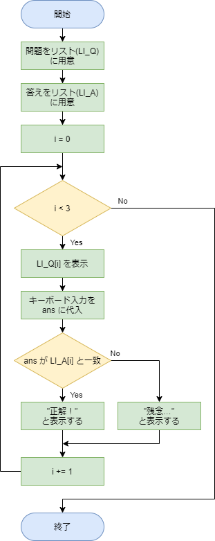

# 条件分岐と繰り返し２

[< 戻る](../)

　

この授業で習得してほしい５つの項目「変数」「順次処理」「条件分岐」「繰り返し」「関数」のうち「繰り返し」を学習します。

「繰り返し（ループ）」は Python だけでなく、あらゆるプログラミング言語を学習するにあたって必ず覚えなくてはならない必須項目です。
「条件分岐」と「繰り返し（ループ）」さえ覚えれば、どんな複雑な処理も記述できると言われていますので、早速学習していきましょう！


授業を４回繰り返すの図


## 繰り返しってなあに？

第２回の授業のフローチャートの学習で、「部屋を掃除する」という例を見てみました。


このフローチャートの赤い点線で囲われた箇所を見てみると、ひし形のブロックで「掃除機をかけてない部屋がある？」と書かれています。

この家には4部屋あり、まだ1部屋も掃除機をかけていないとします。
すると「掃除機をかけていない部屋がある？」に対する答えはYesですので、「一部屋に掃除機をかける」という行動（処理）を取ります。これで残りの部屋数は3部屋ですね。

矢印をたどると再び「掃除機をかけていない部屋がある？」というひし形ブロックにたどり着きます。
まだ3部屋に掃除機をかけていませんので再びYesの矢印に進み、一部屋に掃除機をかけます。

**これを全部で4回繰り返すと、全ての部屋に掃除機をかけたことになります。**
したがって、条件分岐のひし形ブロックからNoの矢印に進み、次の行動（処理）に移ることが出来ます。

このように、**コンピュータに一定回数同じ処理をさせることが「繰り返し」**です。あるいは「**ループ**」と言います。
4部屋程度なら繰り返しの記述をしなくても、順次処理の記述方法だけで書けるかもしれません。
しかし、100部屋だとすると順次処理ではとても書ききれません。


例えば画像処理をさせる際などは、ある処理を数万回繰り返す、といったことが多々あります。
とても順次処理では追いつきませんね。

それでは具体的にコードをどう書いていくのかを見ていきましょう。


## 繰り返し（ループ）の書式１

繰り返し（ループ）を記述する方法はいくつかありますが、最も多用するのは「for」を使って記述する方法です。「for」を使って記述した部分は for文と呼ばれます。

まずは「**〇回繰り返す**」の記述方法です。


上記の例では、処理のブロックを5回繰り返して処理します。
実行してみましょう。

コンソールにはこのように表示されます。


「おはよう。」が5回表示されているのは、「5回繰り返してるんだからそりゃそうでしょ。」となると思いますが、それと同時に 0 ～ 4 の数値も表示されています。

このコードでは1行目と2行目に「`i`」という文字が出てきていますが、これは変数です。
つまり繰り返すたびに、「今何回目の繰り返しですよ」という情報が「`i`」に代入されているのです。

<p style="color:#ff0000"><b>コンピュータの場合、始まりの数は0としますので、表示されるのは 1 ～ 5 ではなく、0 ～ 4 となっています。</b></p>

　

そういえば第３回のテキストで出てきた**「リスト」のインデックスも 0 スタートでした**ね（忘れちゃった方はテキストを読み返しておいてください）。

なお慣例的に「`i`」を用いることが多いのですが、特に「`i`」である必要もないので、以下のようにしても大丈夫です。

```python
for abc in range(5):
    print(abc)
    print("おはよう。")
```

〇回繰り返す、という処理の時にはこの書き方をしますので、まずはこのまま覚えちゃうことをお勧めします。


### 字下げについて復習

前回の条件分岐の授業でも出てきましたが、大切なことなのでしつこく書いておきます！
Python における字下げはとても重要です。なぜなら Python では同じ数の空白で字下げされたまとまりを、一つのブロックとして認識するためです。


したがってこの例の場合、2行目までが for文であり、繰り返し処理が行われるのは字下げされている `print( "ゴール！" )` の部分だけです。
最後の行は字下げされておらず、for文の外に記述されていますので、28回の繰り返しの後に1回だけ「連呼し過ぎ…」と表示されます。

字下げは「if文」や「for文」や「関数」などにも使われています。色々なルールがありますが、実際にコードを記述しながらしっかりと覚えていきましょう。

なお、Python 以外のプログラミング言語もよく字下げしているのですが、特に何の意味もありません。単にコードを見やすくするためだけに使われていますので、字下げしていてもしていなくても、実行の際に挙動が変わることはありません。


## 1+2+3+....+10000 を計算させてみよう

まずはコンピュータの速度を実感してもらうために、1～10000 の整数を全て足し合わせた合計を求めてみましょう。
「`i` は 0 から始まる」ので、1～10000 の足し算を行うには、どうすればよいでしょうか？


#### エディタにコードを入力


まず、Spyder の画面左上にある“新規ファイル”アイコンをクリックし、新しい Python ファイルを用意します。


以下のコードを入力し、ファイルを保存アイコンをクリックして保存しましょう。今回は `test5_1.py` という名前で保存してみました。

```python
goukei = 0
for i in range(10001):
    goukei += i
print(goukei)
```


#### 実行


入力したら、画面上部の“ファイルを実行”アイコンをクリックしてみましょう。

ほんの一瞬でコンソールに合計値「50005000」が表示されたかと思います。あっという間ですね。


#### 解説

この for文における変数 `i` は、0～10000 の 10001個の整数となります。
`i` は 0 スタートですので、10000 まで足したいを思ったならば range(10001) という感じで+1した値を指定する必要があります。

このコードでは 0 という整数が入った `goukei` という変数をあらかじめ用意し、そこにどんどん変数 `i` の値を追加しています。

```python
goukei += i
```

という部分が追加処理です。ちょっと見慣れない書き方ですよね。

例えば変数 a に 10 という値が入っていたとします。
`a += 5`という処理を実行すると、a の値は 15 になります。

この表記方法は他のプログラミング言語でもよく使いますので、覚えておきましょう。
なお、+= 以外にも以下のような表記もあります（表記方法１と表記方法２は同じことですので、使いやすい方を使うので大丈夫です）。

a = 10 とした場合…

| a記述方法１         | 記述方法２ | 結果        |      |
| ------------------- | ---------- | ----------- | ---- |
| a に 5 を足したい   | `a += 5`   | `a = a + 5` | 15   |
| a から 5 を引きたい | `a -= 5`   | `a = a - 5` | 5    |
| a に 5 を掛けたい   | `a *= 5`   | `a = a * 5` | 50   |
| a を 5 で割りたい   | `a /=5`    | `a = a / 5` | 2    |

コードの各行の内容とフローチャートの例は次のようになります。

```python
goukei = 0              # 合計値を入れる変数を用意しておく 値は0
for i in range(10001):  # 10001回の繰り返し 変数iは繰り返すごとに0,1,2 … 10000と変化していく
    goukei += i         # 変数 goukei に変数 i の値を追加していく
print(goukei)           # 最後に合計値をコンソールに表示
```


#### 練習

〇回繰り返す、というフローチャートは例えば以下のように書くことができます。自分好みの書き方を見つけて、パッと書けるように覚えてしまいましょう！

（左）コードに忠実に書いてみた例　　（右）簡単に書いてみた例


先ほどのコードでは 1～10000 の整数すべての合計値を計算させました。一瞬で計算できたと思います。

それでは 1～10000000（1000万）の整数全ての合計値ではどうでしょうか？こちらもかなりのスピードで計算できるはずですので、試してみてください。

1～10 までの整数値をすべてかけ合わせる計算をさせるにはどうすればよいでしょうか？
繰り返し（ループ）の記述を用いてコードを作成してみてください。 

<details class="md-text"><summary><u>→解答例を表示</u></summary><blockquote><span>
1～10の整数値を全て掛けた値を計算させます。
以下、解答例となります。
<pre><code class="python">ans = 1                 # 答えを入れる変数を用意しておく 値はあらかじめ 1 を入れておく
for i in range(10):     # for文 10回繰り返す
    ans = ans \* (i + 1) # iは0,1,2, … 8,9という値を取るため(i+1)とすることで1～10になる
print(ans)              # 結果を表示</code></pre>
掛け算の場合、0 を掛けてしまうとダメですので i に 1 を足してあげる必要があります。
また、答えを入れる変数も最初に 0 を入れてしまうと何をかけても 0 ですので、1 を入れておきましょう。
3628800 と表示されれば正解です。
<br>なお、3行目の「 ans = ans * (i + 1) 」は、「 ans *= (i + 1) 」と書いてもOKです。
<br>まったくの余談ですが 1 ～ n までの整数値を全て掛け合わせたものを「階乗」といいます（高校の数学でやった人もいるかもしれません）。
階乗は n! と表記しますので、今の場合は 10! と表記します。
<hr></span></blockquote></details>


## クイズ

前回の条件分岐の授業では、クイズを作ってみました。
では、このクイズの問題数を増やすには、どうしたらよいでしょうか？
もちろん順次処理でも増やせますが、for文を使うこで簡単に増やすことができます。
今回は以下の３問のクイズが順に表示されるコードを書いてみます。

Q1：月までの距離は約何万km？　　A1：38
Q2：銀河の中心には何がある？　　　A2：ブラックホール
Q3：宇宙は約何億年前に誕生した？　A3：138


#### フローチャートを考える

そろそろコードを書く前に、ざっくりとでいいのでフローチャートを考えるようにしてみましょう。
まずは、先ほど出てきたフローチャートを参考に、for文で3回繰り返すフローチャートを作ります。
そして、「何かの処理」のブロックにクイズのあたりはずれを判定する「条件分岐」の処理を割り当てます。


問題と答えは、それぞれリストに入れて用意しておきます。（リストは、第３回に出てきましたね！）
ざっくり考えてから、下記の解答例を見てください。

以下、コードに忠実に書いてみた例（左）とざっくり書いてみた例（右）です。




#### エディタにコードを入力


まず、Spyder の画面左上にある“新規ファイル”アイコンをクリックし、新しい Python ファイルを用意します。


以下のコードを入力し、ファイルを保存アイコンをクリックして保存しましょう。今回は `test5_2.py` という名前で保存してみました。

```python
LI_Q = ["月までの距離は約何万km？", "銀河の中心には何がある？", "宇宙は約何億年前に誕生した？"]
LI_A = ["38", "ブラックホール", "138"]
 
for i in range(3):
    print(LI_Q[i])
    ans = input()
    if ans == LI_A[i]:
        print("正解です！")
    else:
        print("残念…")
```


#### 実行


入力したら、画面上部の“ファイルを実行”アイコンをクリックしてみましょう。

コンソールに問題が表示されるので、解答を入力してリターンキーを押すと、正解か不正解化が表示され、次の問題に進みます。


#### 解説

まず、問題と答えを入れておくリストについては第３回のテキストで出てきたのでそれほど難しくはないと思います。

```python
LI_Q = ["月までの距離は約何万km？", "銀河の中心には何がある？", "宇宙は約何億年前に誕生した？"]
LI_A = ["38", "ブラックホール", "138"]
```

例えば LI_Q には問題（要素）が３つ入っており、その１問めを表示したい場合は以下のように記述します。

```python
print(LI_Q[0])
```

　

なお、問題と答えのリストはコードの実行中に中身が変化することはありません。
このように**変化しない変数やリストは「定数」と呼び、慣例的に大文字で記述します。**
小文字表記でも問題なく動作しますが、なるべく定数は大文字で書くようにしましょう。

```python
for i in range(3):         # 3回繰り返す  繰り返すごとに i は 0, 1, 2 と変化していく
    print(LI_Q[i])         # 問題を表示する  繰り返すごとに LI_Q[0],  LI_Q[1],  LI_Q[2] と表示していく
    ans = input()          # キーボードからの入力を変数 ans に代入
    if ans == LI_A[i]:     # ansの値とあらかじめ入力しておいた答え LI_A[i] の値が同じであるかチェック
        print("正解です！") # 同じ場合は「正解です！」と表示
    else:
        print("残念…")     # そうでない場合は「残念…」と表示
```

　

**ここで、字下げについて見てみます。**

上の青文字で書かれた部分は、前回学習した**条件分岐**ですね。これがそのまま for文内にはめ込まれています。
for文は字下げをする必要がありました。そして if文も字下げが必要です。
したがって、今回の例では字下げが2段階に行われています。

このように for文の中に if文や for文が入ったり、さらにその中に if文や for文が入ったりすることは多々あります。
ですので複雑なコードの場合は「すげー字下げっぷりだな」ということがよくあります。


#### 練習

先ほどの3問クイズは、3問目が終わるとその時点でプログラム終了となってしまいます。
最後に「あなたは〇問正解しました！」と表示させるようにコードを修正してみましょう。

<details class="md-text"><summary><u>→解答例を表示</u></summary><blockquote><span>
まずフローチャートを考えてみましょう。先ほど出てきたフローチャートをベースにし、必要な処理を書き足してみました。赤枠の部分が追加した処理です。
[](#)
<br>このフローチャートを見ながら先ほどのコードに処理を追加していきます。
<pre><code class="python">LI_Q = ["月までの距離は約何万km？", "銀河の中心には何がある？", "宇宙は約何億年前に誕生した？"]
LI\_A = ["38", "ブラックホール", "138"]
count = 0                                # 正解数カウント用の変数　　0を入れておく<br>
for i in range(3):                       # for文
    print(LI\_Q[i])
    ans = input()
    if ans == LI\_A[i]:                   # もし正解ならば･･･
        print("正解です！")               # 正解です！と表示
        count += 1                       # count の値をプラス１
    else:
        print("残念…")                    # 正解じゃない場合は、残念…と表示<br>
print("あなたは", count, "問正解しました！")    # for文終了後に、正解数を表示</code></pre>
実行してみましょう。
コンソールに答えを入力していくと次々に「正解です！」か「残念…」と表示され、最後に「〇問正解しました！」と表示されます。
[](#)
<hr></span></blockquote></details>


## 繰り返し（ループ）の書式２

例えば次のようにリストに試験のスコアがたくさん入っていたとします。
出席番号1番の人が10点、2番の人が65点…といった具合です。

```python
li_scores = [10, 65, 34, 59, 94]
```

このスコアについて、一つずつ表示させるコードを書くにはどうすればよいでしょうか？
先ほど学習した for文を使うと、次のように記述できそうです。

```python
li_scores = [10, 65, 34, 59, 94]
for i in range(5):
    print(li_scores[i])
```

もちろんこの記述方法でも大丈夫です。
ただ、この場合 `li_score` の要素数が５であることをあらかじめ分かっているか、もしくは何かの方法で調べないといけません。
（実は簡単に調べられるのですが、とりあえず置いておいて…）


そんな時には次のような記述方法が便利です。


for文の1行目が見慣れない表現になっています。
今までは「`for i in range(5):`」であったところが「`for s in li_scores:`」になっていますね。

これを実行すると次のようにコンソールに表示されます。


狙った結果になっていますね。
以下のような流れで処理が行われています。

```
li_scores から1つ目の要素を取り出し、変数 s に代入

コンソールに s を表示

li_scores から2つ目の要素を取り出し、変数 s に代入

コンソールに s を表示

li_scores から3つ目の要素を取り出し、変数 s に代入

コンソールに s を表示

li_scores から4つ目の要素を取り出し、変数 s に代入

コンソールに s を表示

li_scores から5つ目の要素を取り出し、変数 s に代入

コンソールに s を表示

li_scores からすべての要素を取り出したので、for文を終了
```

また、フローチャートですが、どのように書けるでしょうか？
このコードのフローチャートを考えてみると「ん？」となっちゃうかも知れません。
僕の場合はざっくりと次のように書いたりしています。


## 文字列が入ったリストを使って for文を作ってみる

繰り返し（ループ）の書式２の例は「数値」が入ったリストを使った for文でした。
このリストに入るのは数値である必要はありません。文字列が入ったリストを使って for文を作ってみましょう。

 リスト（`li_drinks`）には色々な飲み物の名前が入っています。
 このリストから一つ一つを取り出して「〇〇を飲みます。」と表示してみましょう。
 その際「ワイン」「ビール」「日本酒」はお酒なので「20歳になるまで飲んではいけません。」と注意喚起してみましょう。


#### フローチャートを考える

コードを書く前に、ざっくりとフローチャートを考えてみましょう。
今回フローチャートに書き込む処理内容として必要なのは…

1. **リストから取り出し要素が「ワイン、ビール、日本酒」かをチェック**
2. **お酒ならば注意喚起をし、そうでないならば「〇〇を飲みます。」と表示**

　

これらを先ほど出てきたフローチャートに割り当ててみるとどうなるでしょうか？
お酒かどうかのチェックやその後の処理の分岐は if文を使えばできそうです。

以下、ざっくり書いてみた例になります。


#### エディタにコードを入力


まず、Spyder の画面左上にある“新規ファイル”アイコンをクリックし、新しい Python ファイルを用意します。


以下のコードを入力し、ファイルを保存アイコンをクリックして保存しましょう。今回は `test5_3.py` という名前で保存してみました。

```python
li_drinks = ["お茶", "コーヒー", "日本酒", "ワイン", "コーラ", "ビール", "水"]
for d in li_drinks:
    if d == "ワイン" or d == "ビール" or d == "日本酒":
        print(d, "はお酒です。20歳になるまで飲んではいけません。")
    else:
        print(d, "を飲みました。")
```


#### 実行


入力したら、画面上部の“ファイルを実行”アイコンをクリックしてみましょう。
以下のように表示されたでしょうか。


#### 解説

このコードでは以下のような流れで処理が進みます。

```
li_drinks から1つ目の要素「お茶」を取り出し、変数 d に代入
  「お茶」は「ワイン, ビール, 日本酒」のどれかに該当するか？
  該当しないため、コンソールに「d を飲みました。」と表示

li_drinksから2つ目の要素「コーヒー」を取り出し、変数 d に代入
  「コーヒー」は「ワイン, ビール, 日本酒」のどれかに該当するか？
  該当しないため、コンソールに「d を飲みました。」と表示

li_drinksから3つ目の要素「日本酒」を取り出し、変数 d に代入
  「日本酒」は「ワイン, ビール, 日本酒」のどれかに該当するか？
  該当するため、コンソールに「d はお酒です。20際になるまで～」と表示

･･･以上を li_drinks に含まれる全ての要素について行う
```

　

コードの各行の内容は次のようになります。

```python
li_drinks = ["お茶", "コーヒー", "日本酒", "ワイン", "コーラ", "ビール", "水"]   # 飲み物名がたくさん入ったリストを作成
for d in li_drinks:                                           # リストから1つずつ要素を取り出し、d に代入
    if d == "ワイン" or d == "ビール" or d == "日本酒":         # d が「ワイン、ビール、日本酒」であるならば…
        print(d, "はお酒です。20歳になるまで飲んではいけません。")  # d はお酒です～～と表示
    else:                                                     # そうでないならば
        print(d, "を飲みました。")                              # d を飲みました。と表示
```


## 作業フォルダ内のJpeg形式の画像全てをリサイズ

先ほどのお酒注意喚起の例は、「仕組みは分かるけど使いどころあるの？」という印象だったかもしれませんので、もう少し実践的な例を見ていこうと思います。

「やってみよう画像処理１」で行った画像のリサイズを、複数の画像に対して繰り返し行う、ということをやってみます。
具体的には、作業フォルダ内にある全てのjpeg形式の画像をリサイズし、別名で保存する、ということを目指します。
少し難しいかもしれませんが、見て行きましょう。


#### フローチャートを考える

「作業フォルダ内にある全てのjpeg形式の画像をリサイズし、別名で保存する」
これを実現するにはどういった処理が必要かを考えてみましょう。

1. **作業フォルダ内にある全てのjpeg画像を取得**
   リストとして画像名を取得できれば for文（書式２）で使えそうです
2. **画像をリサイズ**
   やってみよう画像処理１で出てきました
3. **リサイズ済みの画像を別名保存**
   保存はやったことがありますが、「別名」を自動生成する必要があります

　

これらを先ほどの書式２のフローチャートに当てはめてみましょう。

以下、詳しく書いてみた例（左）と、ざっくりと簡単に書いてみた例（右）です。


#### 1. 作業フォルダ内にある全てのjpeg形式の画像を取得

やってみよう画像処理では、次のようにして作業フォルダ内の画像を読み込みました。

```python
img = Image.open("photoSample_01.jpg")   # 画像を読み込む
```

　

複数の画像を読み込みたい場合、リストを用いると次のように記述することができそうです。

```python
li_files = ["photoSample_01.jpg","photoSample_02.jpg","photoSample_03.jpg"]   # 画像ファイル名のリストを作成
img = Image.open(li_files[n])                                                 # リストのn個目を読み込む
```

　

そこで、`li_files` を何とかして自動生成してあげる必要があります。
このような機能を持つ命令はいくつかあるようですが、globモジュールの glob() という命令を使ってみましょう。
以下のコードを Spyder で実行してみてください。

```python
import glob                 # globモジュールをインポート
li_files = glob.glob("*")   # 現在の作業フォルダ内の全てのファイル名とフォルダ名をリストとして取得
for f in li_files:          # 繰り返しの書式２
    print(f)                # li_filesというリストの中身全てを一つずつ表示していく
```

　

ここで重要なのは2行目です。
`li_files = glob.glob("*")`
「`*`」は「あらゆる文字列（名前）の～」という意味になります（`*` のことをワイルドカードと言います）。
ですので「 `glob.glob("*")` 」は「作業フォルダ内のあらゆる文字列のファイルやフォルダをリストとして取得しなさい」と命令していることになります。それをそのまま左辺（`li_files`）に代入しています。
変数エクスプローラーでも `li_files` の型やその中身を確認しておきましょう。

　

これでファイル名をリストとして得ることができましたが、作業フォルダ内にはjpeg画像形式以外のファイルもたくさん入っており、それらもひっくるめてリストになってしまっています。
ですので、「jpeg画像形式」のファイルのみを取得するよう、指示してあげなければいけません。
先ほどのコードを以下のように修正して実行してみましょう。

```python
import glob                    # globモジュールをインポート
li_files = glob.glob("*.jpg")  # 現在の作業フォルダ内の全ての「〇〇〇〇.jpg」という文字列のものをリストとして取得
for f in li_files:             # 繰り返しの書式２
    print(f)                   # li_filesというリストの中身全てを一つずつ表示していく
```

　

コンソールには、jpeg画像名のみが表示されていると思います。
これは、2行目の右辺が「現在の作業フォルダ内の全ての「〇〇〇〇.jpg」という文字列のものをリストとして取得しなさい、という命令になっているからです。〇〇〇〇の部分の文字列は何でも、何文字でもOKです。

例えばPNG形式の画像名リストは「 `glob.glob("*.png")` 」とすれば取得できますね！


#### 2. 画像をリサイズ

以下、やってみよう画像処理１で出てきたコードです。見直しておきましょう。
コード４行目の「`img.width`」は読み込んだ画像の横方向の画素数、「`img.height`」は読み込んだ画像の縦方向の画素数です。

```python
from PIL import Image                                              # Pillowモジュールのインポート
img = Image.open("photoSample_01.jpg")                             # 画像を読み込む
bairitsu = 0.2                                                     # リサイズする倍率を指定
size = [round(img.width * bairitsu), round(img.height * bairitsu)] # roundは四捨五入 sizeは整数値が2つ入ったリスト
img_resize = img.resize(size, 3 )                                  # 滑らかにリサイズする
img_resize.save("photoSample_01_resize.jpg", quality=95)           # リサイズした画像を保存する
```

　

まず、Pillow で画像を読み込むと Image というオブジェクト（変数とかリストみたいなもの）になるんでしたね。
2行目では `photoSample_01.jpg` を読み込み、`img`という名前の Imageオブジェクトに代入しています。

どれくらいリサイズするかは、リサイズ後のサイズ（横方向のピクセル数、縦方向のピクセル数）をリスト化して指定します。
4行目の `size` がリスト化したリサイズ後のサイズですね。したがって、リサイズ後の横縦のピクセル数があらかじめ分かっているなら、以下のように指定してもOKです。
`size = [400, 300]`
なお、ピクセル数は整数ですので、上記コードでは四捨五入する命令「`round()`」を使って、どんな倍率を指定しても必ず整数となるようにしています。

5行目では Imageオブジェクトの `img` をリサイズし、`img_resize` という名前の Imageオブジェクトとして保持します。
最後の行で、名前を指定して保存しています。


#### 3. リサイズ済みの画像を別名保存

例えば abc.jpg という画像をリサイズし保存する場合、リサイズしたことが分かりやすい別名で保存するとよいでしょう。

今回は保存名を簡単のため、`resized_abc.jpg` のように、ファイル名の頭に「`resized_`」という文字列を追加することにします。
先ほどのコードを以下のように修正して実行してみましょう。

```python
import glob
li_files = glob.glob("*.jpg")
for f in li_files:
    f = "resized_" + f         # f は str型なので、"resized_"という文字列と繋ぎ合わせることができる
    print(f)
```


#### エディタにコードを入力

以上1. 2. 3.を踏まえてコードを作ってみましょう。


まず、Spyder の画面左上にある“新規ファイル”アイコンをクリックし、新しい Python ファイルを用意します。


作成したフローチャートを元に以下のコードを入力し、ファイルを保存アイコンをクリックして保存しましょう。今回は `test5_4.py` という名前で保存してみました。

```python
import glob
from PIL import Image

li_files = glob.glob("*.jpg")
bairitsu = 0.2

for f in li_files:
    img = Image.open(f)
    size = [round(img.width * bairitsu), round(img.height * bairitsu)]
    img_resize = img.resize(size, 3)
    f = "resized_" + f
    img_resize.save(f, quality=95)
    print(f, "を保存しました。")

print("全てのJpegファイルをリサイズしました。")
```


#### 実行


入力したら、画面上部の“ファイルを実行”アイコンをクリックしてみましょう。

コンソールには次々に保存したことを示すメッセージが表示され、最後に「全てのjpegファイルをリサイズしました。」と表示されます。
自分の作業フォルダ内にはリサイズされたjpegファイルが保存されているはずですので、確認しておきましょう。


#### 解説

今までより少し複雑でしたが、必要な処理を書き出したり、フローチャートを考えておくことでスムーズにコードを書くことができます。
コードの各行の解説は以下となります。

```python
import glob                           # globモジュールをインポート
from PIL import Image                 # PillowのImageモジュールをインポート
 
li_files = glob.glob("*.jpg")         # 作業フォルダ内のjpeg画像ファイル名のリストを作成
bairitsu = 0.2                        # 倍率を指定
 
for f in li_files:                    # for文の書式２
    img = Image.open(f)               # 画像ファイルを1つ読み込む imgという名で保持
    size = [round(img.width * bairitsu), round(img.height * bairitsu)]  # リサイズ後のサイズを指定したリスト(size)を作成
    img_resize = img.resize(size, 3)  # imgをリサイズし、img_resizeという名で保持
    f = "resized_" + f                # 保存ファイル名を作成
    img_resize.save(f, quality=95)    # img_resizeを作成した保存名で保存
    print(f, "を保存しました。")        # 保存できたことを表示
 
print("全てのJpegファイルをリサイズしました。")   # ループを抜けたことを表示しておしまい
```

上記コードの4行目では「`bairitsu = 0.2`」と、倍率を指定しています。
この0.2という倍率は、全ての画像に対して同じですので、for文の前で一度だけ指定しています。
for文の中に入れてしまっても大丈夫ではあるのですが、繰り返す必要のない処理は、for文の外に書くようにしましょう。
中に書いてしまうと、処理の内容によってはものすごく実行速度が遅くなる可能性があります。


#### 練習

やってみよう画像処理１ではリサイズを応用してモザイクをかけました。
今回のコードを修正し、作業フォルダ内の全てのjpeg画像に対してモザイクをかけ、別名保存するコードを作成しましょう。

<details class="md-text"><summary><u>→解答例を表示</u></summary><blockquote><span>
作業フォルダ内の全ての JPEG画像にモザイクをかけます。
<br>まずはフローチャートを考えてみましょう。先ほどのリサイズのフローチャートを元に考えています。
以下、詳細に書いてみた例と、ざっくり書いてみた例になります。
[](#)　[](#)
<br>赤枠で囲った部分が新しく追加した処理、修正を加えた処理になります。
このフローチャートを元にしてコードを考えると以下のようになります。
<br><pre><code class="python">import glob
from PIL import Image
<br>li\_files = glob.glob("\*.jpg")                # 作業フォルダ内のjpeg画像ファイル名のリストを作成
bairitsu = 0.02                              # 倍率を指定（小さくするとモザイクタイルは大きくなる）
<br>for f in li\_files:                           # for文書式２
    img = Image.open(f)                      # 画像ファイルを1つ読み込む imgという名で保持
    size = [round(img.width \* bairitsu), round(img.height \* bairitsu)]  # リサイズ後のサイズを指定したリスト(size)を作成
    img\_resize = img.resize(size, 3)         # imgをリサイズし、img_resizeという名で保持
    size = [img.width, img.height]           # 元のサイズをリスト(size)に代入 [横の画素数, 縦の画素数]
    img_mosaic = img\_resize.resize(size, 0)  # 小さくなった「img_resize」を再び元のサイズに拡大する
    f = "mosaic\_" + f                        # 保存ファイル名を作成
    img\_mosaic.save(f, quality=95)           # img_resizeを作成した保存名で保存
    print(f, "を保存しました。")               # 保存できたことを表示
<br>print("全てのJpegファイルにモザイクをかけました。")</code></pre>
実行してみましょう。
作業フォルダ内の全てのJPEG画像にモザイクがかかり、別名保存されているはずです。
<hr></span></blockquote></details>

　

---

本日のメインの内容は以上となります。いかがでしたでしょうか？
次回は「条件分岐と繰り返し３」ということで、if文とfor文をもう一度学習します（大切な部分なのでしっかりやります！）。
繰り返し例題をこなして覚えて行きましょう！

それでは引き続きやってみよう画像処理４も読み進めてみてください。

　

[< 戻る](../)