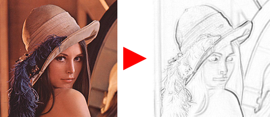

# やってみよう画像処理４

[< 戻る](../)

　

細かいことは分からなくてもいいから、とにかくやってみよう！のコーナーです。
今回の画像処理体験では、画像合成、ブラーや鮮鋭化といったフィルタリング、そして写真からデッサン風の画像への変換などを行ってみましょう。


## Photoshop の合成モード

Photoshop のようなレイヤー機能を備えた画像編集ソフトは、必ずレイヤーの合成モードをいろいろと選択できるようになっています。
例えば以下は Photoshop の画面です。


この編集中の画像には2つのレイヤーがあり、レイヤー１の合成モードが「覆い焼き（リニア）- 加算」となっています。

Photoshop等の画像編集ソフトを使ったことのある人はピンとくると思いますが、例えば合成モードが「加算」だと明るく輝いた感じに、「乗算」だと暗く重い感じになります。


他にも Photoshop にはいろいろな合成モードが用意されています。
上図の赤枠をクリックすると、左のような一覧が表示されて合成モードを選択できます。

さて、これらの合成モードとは一体何なのでしょうか？ どのようにして２つのレイヤーを合成しているのでしょうか？


## 加算と乗算

以下の図はつのレイヤーを乗算合成および加算合成した際、ある画素の値がどのように変化するかを数値で表したものです。
まずは簡単な加算合成（Photoshop の「覆い焼き (リニア) - 加算」です）を見てみましょう。


加算というのは足し算のことですので、その名の通り合成する２つの画像の画素の値を足しています。例えば以下の図で赤枠で示した画素は、B成分については背景画像が56、エフェクト画像が50ですので、結果は106となります。元の画像に比べて明るくなっていますね。


一方の乗算については加算に比べて式が複雑になっています。

乗算とは掛け算のことですから、「さっきの加算と同じように、各成分の値を掛け算すればいいのでは？」と思うかもしれません。
確かに掛け算すればいいのですが、例えば赤枠で示した画素のB成分について見てみると、掛けてしまうと 56 × 50 = 2800 となり、値の範囲（0～255）を超えてしまっています。

ですので乗算の場合、合成後の画素の値は以下の式で決定します。

```
合成後の値 ＝ （合成前の値１ × 合成前の値２）÷ ２５５
```

掛けてるのに最後割っちゃってますね… ややこしいですが我々が扱うことの多い画像のタイプでは、このような式になります。


## ImageChops モジュールを使った画像合成


Photoshop の様々な合成モードと同じようなことが Pillow の中の ImageChops モジュールを使用するとすぐに出来てしまいます。
先ほどのような計算式を考える必要もありません。

いくつかの合成方法を試してみましょう。

なお、既に作業フォルダに入っている写真同士を合成してもよいのですが、少しエフェクトっぽい方が面白いかなと思ったので、以下のダウンロードボタンをクリックしてエフェクト用の画像をダウンロードしましょう。

[](effects.zip)（5.3MB）

「effects.zip」という圧縮ファイルがダウンロードされますので、解凍（展開）しましょう。

**6枚の画像が出てきますので、作業フォルダの中に移動させておきましょう。**


#### エディタにコードを入力


まず、Spyder の画面左上にある“新規ファイル”アイコンをクリックし、新しい Python ファイルを用意します。


以下のコードを入力し、ファイルを保存アイコンをクリックして保存しましょう。今回は `try4_blend1.py` という名前で保存してみました。

```python
from PIL import Image, ImageChops       # PillowのImageモジュールとImageChopsモジュールのインポート
img = Image.open("photoSample_04.jpg")  # 合成用画像１を Imageオブジェクトとして読み込む 名前は img
img2 = Image.open("effect01.png")       # 合成用画像２を Imageオブジェクトとして読み込む 名前は img2
img3 = ImageChops.add(img, img2)        # img と img2 を加算合成し、結果をImageオブジェクト (img3) に代入
img3.save("try4_blendTest1.png")        # 合成結果 (img3) を名前を付けて保存
```


#### 実行


入力したら、画面上部の“ファイルを実行”アイコンをクリックしてみましょう。

しばらくすると作業ディレクトリにモノクロになった「`photoSample_03_gray.png`」というファイルが保存されます。


#### 練習

ImageChopsモジュールには他にも様々な合成方法があります。
先ほどのコードの4行目にある「`add`」を以下の命令に変更すると、様々な結果を得ることができます。
例えば下にある命令一覧の「`screen`」を使ってみたい場合は、次のようにコードを変更します。

```python
from PIL import Image, ImageChops
img = Image.open("photoSample_04.jpg")
img2 = Image.open("effect01.png")
img3 = ImageChops.screen(img, img2)     # ここだけ add から screen に変更した。
img3.save("try4_blendTest1.png")
```

いろいろな画像でいろいろな合成方法を試してみましょう。
※自分の写真などを使う場合、合成する画像とサイズを合わせる必要があります。その場合、やってみよう画像処理１で出てきたリサイズを使うのもいいかも知れません。


## ImageFilterモジュールを使ってみる


例えば Photoshop にはフィルタというメニューがあって、画像にぼかしをかけたり、シャープにしたりすることができます。
Pillow でも同じようなことができますので、いくつかの処理をやってみましょう。


#### エディタにコードを入力


まず、Spyder の画面左上にある“新規ファイル”アイコンをクリックし、新しい Python ファイルを用意します。


以下のコードを入力し、ファイルを保存アイコンをクリックして保存しましょう。今回は `try4_filter1.py` という名前で保存してみました。

```python
from PIL import Image, ImageFilter
 
img = Image.open("photoSample_07.jpg")
#各種フィルタをかける
img2 = img.filter(ImageFilter.GaussianBlur(10))        # 読み込んだ画像（img）にブラーをかけたものを img2 に代入
img3 = img.filter(ImageFilter.UnsharpMask(radius=10))  # 読み込んだ画像（img）にシャープをかけたものを img3 に代入
img4 = img.filter(ImageFilter.FIND_EDGES)              # 読み込んだ画像（img）に輪郭検出をしたものを img4 に代入
img5 = img.filter(ImageFilter.MinFilter(7))            # 読み込んだ画像（img）にMinFilterをかけたものを img5に代入
#フィルタをかけた結果を保存
img2.save("try4_blur1.png")                            # ブラーをかけた画像を保存
img3.save("try4_sharp1.png")                           # シャープをかけた画像を保存
img4.save("try4_edge1.png")                            # エッジ検出した画像を保存
img5.save("try4_min.png")                              # MinFilterをかけた画像を保存
```

#### 実行


入力したら、画面上部の“ファイルを実行”アイコンをクリックしてみましょう。

今回は4種類のフィルタのテストをまとめて行うコードになっていますので、
4種類の結果（ `try4_blur1.png`, `try4_sharp1.png`, `try4_edge1.png`, `try4_min.png` ）が保存されているはずです。


#### 解説

これまで行ってきた画像処理は、一つの画素に注目して何かしらの計算をし、結果を得るというものでした。
しかし、例えば画像をぼかしたいと思った場合や輪郭を検出しようと思った場合などなどは、一つの画素にばかり注目していても結果は出てきません。注目している画素の周囲の画素も考慮してあげる必要があります。

こういった処理のことを「**空間フィルタ処理**」と呼びます。

先ほどのコードの1行目では ImageFilter というモジュールをインポートしていますが、このモジュールによって簡単に空間フィルタ処理が行えるようになります。

##### ぼかし：

先ほどのコードの一つ目の処理はぼかしです。これはぼかしの中でもガウスブラーとよばれるもので、Photoshop では「ぼかし (ガウス)」と書かれています。`()` 内に記述した数値でぼかし具合を調整します。


##### 鮮鋭化：

2つ目の処理は画像をくっきりシャープにする鮮鋭化とよばれる処理です。`(radius=10)` の値でシャープ具合を調整します。


##### 輪郭検出：

3つ目の処理は輪郭検出です。輪郭検出には先ほどの「`FIND_EDGES`」という手法以外に「`CONTOUR`」という手法を使ったものもあります。


以下のコードで結果の比較をしてみましょう。
単にネガポジ反転したようにも見えますが、よく見ると検出結果が微妙に異なっています。

```python
from PIL import Image, ImageFilter
 
img = Image.open("photoSample_07.jpg")      # 画像をImageオブジェクトとして読み込む 名前は img
img2 = img.filter(ImageFilter.FIND_EDGES)   # 読み込んだ画像（img）に輪郭検出をしたものを img2 に代入
img3 = img.filter(ImageFilter.CONTOUR)      # 読み込んだ画像（img）に輪郭検出をしたものを img3 に代入
img2.save("try4_edge1.png")
img3.save("try4_edge2.png")
```

##### 膨張/収縮フィルタ：

最後の処理については少し謎に感じるかもしれません。こちらも `()` 内の数値（奇数のみ）を調整することで結果を変化させることができます。また、先ほどは「`MinFilter`（収縮）」というものを用いましたが、「`MaxFilter`（膨張）」というものもあります。


以下のコードで比較してみましょう。

```python
from PIL import Image, ImageFilter

img = Image.open("photoSample_07.jpg")        # 画像をImageオブジェクトとして読み込む 名前は img
img2 = img.filter(ImageFilter.MinFilter(7))   # 読み込んだ画像（img）にMinFilterをかけたものを img2 に代入
img3 = img.filter(ImageFilter.MaxFilter(7))   # 読み込んだ画像（img）にMaxFilterをかけたものを img3 に代入
img2.save("try4_min.png")
img3.save("try4_max.png")
```


`MinFilter()`（収縮）では画像内の暗い部分の面積が大きくなり、`MaxFilter()`（膨張）では明るい部分の面積が大きくなっています。
何に使うの？？と感じるかもしれませんが、画像処理的にはいろいろと応用が利く手法のようです。
見た目に面白い効果としては、写真をデッサン風に変換させる、ということが出来ます。次の項目を見てみましょう。


## 写真をデッサン風画像に変換



先ほど出てきた謎の膨張/収縮フィルタのうち「`MinFilter()`」を用いて、写真を鉛筆デッサン風に変換するコードを書いてみましょう。


#### エディタにコードを入力


まず、Spyder の画面左上にある“新規ファイル”アイコンをクリックし、新しい Python ファイルを用意します。


以下のコードを入力し、ファイルを保存アイコンをクリックして保存しましょう。今回は `try3_dessin.py` という名前で保存してみました。

```python
from PIL import Image, ImageChops, ImageOps, ImageFilter  # Pillowのモジュールを5種類インポート
 
img = Image.open("photoSample_01.jpg")          # 1: 画像をImageオブジェクトとして読み込む 名前は img
img2 = img.convert("L")                         # 2: 読み込んだ画像(img)をグレースケールに変換しimg2に代入
img3 = img2.filter(ImageFilter.MinFilter(5))    # 3: img2 に MinFilter をかけたものを img3 に代入
img4 = ImageChops.difference(img2, img3)        # 4: img2 と img3 の「差の絶対値」を取り、img4 に代入
img5 = ImageOps.invert(img4)                    # 5: img4 をネガポジ反転し、img5 に代入
 
img5.save("dessin01.png")                       # img5 を保存
```


#### 実行


入力したら、画面上部の“ファイルを実行”アイコンをクリックしてみましょう。

しばらくすると作業ディレクトリにネガポジ反転された「dessin01.png」というファイルが保存されます。
先ほどの輪郭検出でも線画っぽさは多少出ましたが、こちらの方がより自然にデッサン風になっている様子が分かります。


#### 解説

やってみよう画像処理で今までに出てきた処理を組み合わせています。
コード中では4回の処理を行っていますが、それぞれの段階で画像がどう変化していくのかを確認してみましょう。

１：元画像


２：元画像をグレースケール画像に変換


３：MinFilter（収縮）をかける


４：上記２と３の差を取る


「difference」という合成を行っていますが、これはPhotoshop の合成モードでいうところの「差の絶対値」です。

５：４をネガポジ反転


これで完成！
ただ、もっと濃く描かなくてはならない部分が薄かったりその逆もあったり、と、なかなか実際の鉛筆デッサンのように変換するのは難しいようです。
これを少しでも改善するにはもう少し工夫が要りそうですが、それについては今後どこかで紹介できればと思います。

　

[< 戻る](../)