# 条件分岐と繰り返し３

[< 戻る](../)

　

この授業で習得してほしい５つの項目「変数」「順次処理」「条件分岐」「繰り返し」「関数」のうち、先週までに関数以外の４つは終わりました…が、「繰り返し」の書式で他にもよく使われるものがいくつかありますので、今回はそれらを見ていくことにしましょう。


今日も授業が４回繰り返す…


## 繰り返し（ループ）の終了：break の使い方

例えば10問中3問不正解になったら即退場というテストがあったとします。
for文を使えば問題を10問表示していくコードは書けますが、前回学習した項目だけでは3問不正解になった後も最後まで問題を表示し続けてしまいます。

`break` を使うと、「〇回繰り返ししようと思ってたけどやっぱり止めた！」という時などに強制終了できます。
`break` の使い方は簡単です。繰り返しを終了したいと思ったタイミングで `break` を実行するだけです。

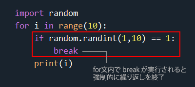

この場合、for文は10回繰り返します。
ここで、if 文の条件式に「`random.randint(1, 10)`」とありますが、これは 1～10 のランダムな整数値を発生させるものです。
つまり、for文で繰り返すごとにランダムな数値を発生させ、その値がもしも 1 だった場合に `break` を実行する、ということになります。

このコードを実行してみると、コンソールには以下のような感じで、毎回異なる回数の繰り返しをしている様子が分かります。
また、フローチャートは右下の図のように書けます。

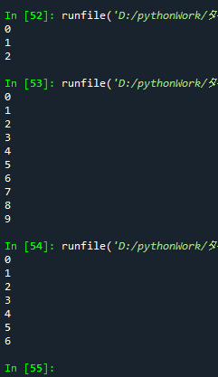
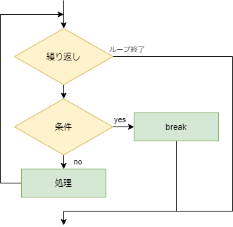


## 鬼滅の刃を読みますか？

「寝る前に鬼滅の刃〇巻を読みますか？」という質問に答えていくコードを作成してみましょう。


まず、コンソールに「寝る前に鬼滅の刃1巻を読みますか？」と表示されます。
イエスかノーを入力すると、以下のように続きます。

| イエスの場合                                                 | ノーの場合                                   |
| ------------------------------------------------------------ | -------------------------------------------- |
| 「1巻を読みました。」 「寝る前に鬼滅の刃2巻を読みますか？」 という感じで23巻を読み切るまで繰り返します。 23巻まで読むと「おやすみなさい。」と表示されて終了します。 | 「おやすみなさい。」と表示されて終了します。 |


#### フローチャートを考える

「鬼滅の刃を読みますか？」に必要な処理を見ていきますと、以下のような感じでしょうか。

- 「鬼滅の刃〇巻を読みますか？ ノーなら n 、イエスならその他のキーを入力してください。」と表示
- 入力されたキーが `n` の場合は `break`
- その他のキーが入力された場合は23回まで繰り返し、
- 最後に「おやすみなさい。」と表示 

これを先ほどのフローチャートに当てはめてみましょう。

少し考えてみてから、解答例を見てみてください。
（今回はコードをすっきりさせるために、「ノーなら n 、イエスならその他のキー」という少し変な入力にしてあります。）

<details class="md-text"><summary><u>→解答例を表示</u></summary><blockquote><span>
先ほど出てきたフローチャートをベースに書いてみるとこのようになります。
[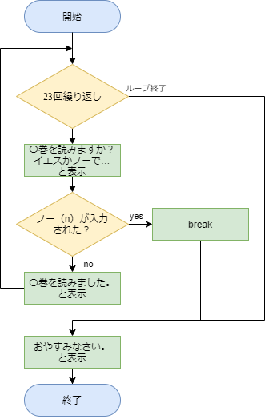](#)
<hr></span></blockquote></details>


#### エディタにコードを入力


まず、Spyder の画面左上にある“新規ファイル”アイコンをクリックし、新しい Python ファイルを用意します。


以下のコードを入力し、ファイルを保存アイコンをクリックして保存しましょう。今回は `test7_1.py` という名前で保存してみました。

```python
for i in range(23):
    print("寝る前に鬼滅の刃", i+1, "巻を読みますか？\n読まない場合は「n」を、読む場合はその他のキーを押してください")
    a = input()
    if a == "n":
        break
    print(i + 1, "巻を読みました。")
print("おやすみなさい。")
```

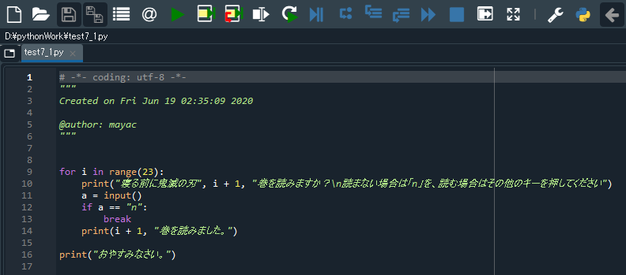


#### 実行


入力したら、画面上部の“ファイルを実行”アイコンをクリックしてみましょう。

コンソールに表示される指示にしたがっていくと次のようになります。

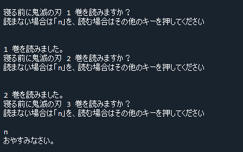


#### 解説

このコードは順を追って見ていくとそれほど難しくないと思います。
break が実行されると、for文の繰り返しを強制的に終了し、処理のブロックを抜けて次の処理（「おやすみなさい。」と表示）に移る、ということをしっかり確認しておいてください。

```python
for i in range(23):                   # for文で23回繰り返し
    print ("寝る前に鬼滅の刃", i + 1, "巻を読みますか？\n読まない場合は「n」を、読む場合はその他のキーを押してください")
    a = input()                       # キーボード入力を変数 a に代入
    if a == "n":                      # もし入力された文字が n ならば…
        break                         # 繰り返し終了
    print(i + 1, "巻を読みました。")
print("おやすみなさい。")
```


#### 練習

このコードでは、「`n`」を入力するとすぐに「おやすみなさい。」と表示されて終了します。
「`n`」を入力した際の表示を「続きはまた明日」→「おやすみなさい。」とするには、このコードをどう修正すればよいでしょうか？

<details class="md-text"><summary><u>→解答例を表示</u></summary><blockquote><span>
23巻を読み切る前に `n` を入力して中断した場合、「続きはまた明日。」と表示されてから「おやすみなさい。」と表示させるコードの例になります。
<pre><code class="python">for i in range(23):
    print   ("寝る前に鬼滅の刃", i + 1, "巻を読みますか？\n読まない場合は「n」を、読む場合はその他のキーを押してください")
    a = input()                              # キーボード入力を変数 a に代入
    if a == "n":                             # もし入力された文字が n ならば…
        print("続きはまた明日。")              # 「続きはまた明日」と表示
        break                                # 繰り返し終了
    print(i + 1, "巻を読みました。")
print("おやすみなさい。")</code></pre>
break が実行されると、すぐにループから抜けてしまいます。
「続きはまた明日。」と表示させるには、`break`の前に「`print("続きはまた明日。")`」と書く必要があります。
<hr></span></blockquote></details>


## while を用いた繰り返し１

繰り返し（ループ）処理は、for 以外にも `while` という命令で行うことができます。
for文は「〇〇回繰り返したい」といった具合に、繰り返す回数が決まっている場合によく用いられます。

一方の `while` は、繰り返す数は決まっていないけど、とりあえず break されるまでは繰り返しておきたい、とか、〇〇という条件の時には繰り返しましょう、といった具合に用います。

まずは「break されるまではとにかく繰り返す！」という場合の書き方を見てみましょう。

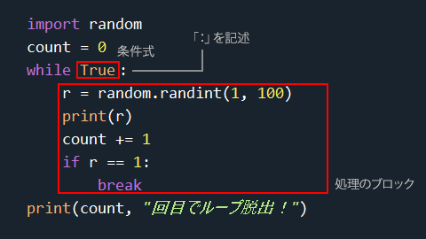

この3行目～8行目が while文です。
`while` の隣には「**条件式**」が書かれています。

この条件式は if文（条件分岐）で出てきた条件式と同じものです…が、`True`って何だ？？ …となると思います。
この**`True` とは、「条件が成立していますよ！」ということを示しています**。
ということは、**条件式に「`True`」と書かれている while文は、延々と繰り返している無限ループ**、ということになります。

この例では while文が繰り返す毎に1～100のランダムな数値を発生させ、変数 `r` に代入します。そして `r` が 1であった場合に `break` が実行され、ループを脱出します。最後に、ループ脱出までに何回ループしたかを表示します。

実行してみると、以下のようにループ脱出までの回数が毎回ランダムになっている様子が分かります。
また、フローチャートをざっくりと書いてみると右下のような感じになるでしょうか。今回の while文は「ひたすら繰り返しなさい」というものですので、繰り返しのひし形ブロックからは矢印が１方向にしか伸びていませんね。

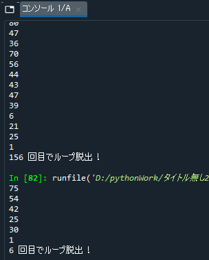
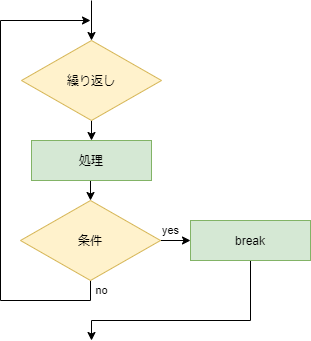


### 無限ループ

お気づきかもしれませんが、この while文の中に breakを記述し忘れてしまうと、**永遠に処理を繰り返す無限ループ**となってしまいます。 無限ループは当然やってはいけないのですが、どうしてもコードの記述ミスなどで意図せず無限ループになってしまう時があります。
そんな時は一応プログラムを強制的に終了させる方法がありますので、覚えておきましょう。

以下のコードを Spyder に入力し、実行してください。
するとコンソールには延々と「無限テスト」と表示され続けます。

```python
while True:
    print("無限テスト")
```

このままではまずいので、強制終了しましょう。

| Windows の場合                                             | Mac の場合                                                   |
| ---------------------------------------------------------- | ------------------------------------------------------------ |
| コンソールをクリック後に Ctrl キーを押しながら Cキーを押す | コンソールをクリック後に controlキーを押しながら Cキーを押す |

無限ループは起こりえますので、一度実際にやってみて強制終了の練習をしておきましょう。


## 延々と続く計算ドリル

ランダムに出題される九九の問題が延々と続くコードを書いてみましょう。


次のようなコードの作成を目指します。

毎回ランダムな九九の問題が延々と出題される
入力した答えが合っているかどうか判定し、「正解」「残念」を表示
問題に答える度に「まだ続けますか？」と確認し、続けない場合はプログラムを終了する 


#### フローチャートを考える

「延々と続く計算ドリル」に必要な処理を見ていきますと、以下のような感じでしょうか。

- 延々と続かせないといけないので、while文を使用
- ランダムな九九の問題は1～9のランダムな整数を2回発生させて作成
- キーボードから入力された答えは文字列なので、int型に変換
- 答えが合っているかチェックし、「正解」「残念」
- 1問終わるごとに「まだ続けますか？～」と表示
- 入力されたキーが n の場合は break、その他のキーが入力された場合は繰り返し
- 最後に「おしまい！」と表示 

　

これを先ほどのフローチャートに当てはめてみましょう。
少し考えてみてから、解答例を見てみてください。（今回はコードをすっきりさせるために、「ノーなら n 、イエスならその他のキー」という少し変な入力にしてあります。）

<details class="md-text"><summary><u>→解答例を表示</u></summary><blockquote><span>
先ほど出てきたフローチャートをベースに書いてみるとこのようになります。
入力された九九の答えが合っているか判断し、結果を表示させる部分はif文を用いるので、ひし形ブロックを使用するべきですが、フローチャートが長いので、全体を見渡せるようにするために簡略化して1つのブロックにまとめてあります。
コードの記述に慣れてきたら、簡略化できるところは出来るだけ簡略化しましょう。（複数人で作業するプロジェクトの場合はちゃんと書いた方がいいです）。
[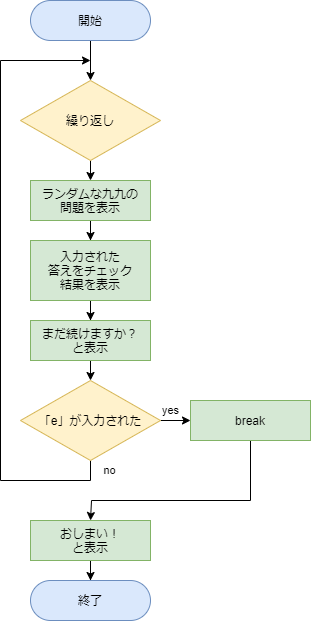](#)
<hr></span></blockquote></details>


#### エディタにコードを入力


まず、Spyder の画面左上にある“新規ファイル”アイコンをクリックし、新しい Python ファイルを用意します。


以下のコードを入力し、ファイルを保存アイコンをクリックして保存しましょう。今回は `test7_2.py` という名前で保存してみました。

```python
import random
while True:
    a = random.randint(1, 9)
    b = random.randint(1, 9)
    print(a, "×", b, "の答えはなんでしょう？")
    ans = input()
    if a*b == int(ans):
        print("正解です！")
    else:
        print("残念…")
    print("まだ続けますか？ やめる場合は「e」 続ける場合はその他のキーを押してください。")
    if input() == "e":
        break
print("おしまい！")
```

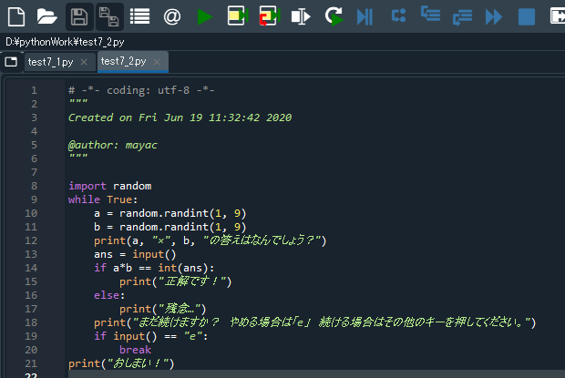


#### 実行


入力したら、画面上部の“ファイルを実行”アイコンをクリックしてみましょう。
以下のようにドリルが進みます。

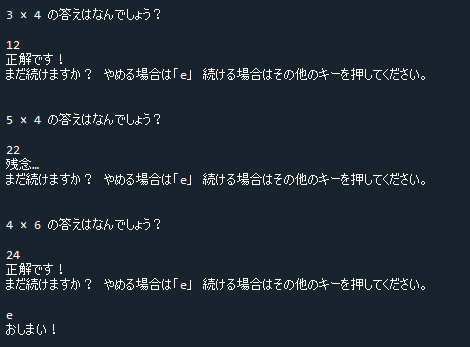


#### 解説

このコードもちょっぴり複雑そうに見えますが、順を追って見ていくとそれほど難しくないと思います。
while文の使い方や break の使い方に加え、九九の問題を自動生成している、ということにも注目しておいてください。

```python
import random
while True:                                    # 延々と繰り返す while文
    a = random.randint(1, 9)                   # 1～9ランダムな整数値を取得
    b = random.randint(1, 9)                   # 1～9ランダムな整数値を取得
    print(a, "×", b, "の答えはなんでしょう？")    # 問題を表示
    ans = input()                              # キーボードからの入力を変数 ans に代入
    if a*b == int(ans):                        # ans を int型に変換し、正解と比較
        print("正解です！")                     # 合っていたら「正解です！」と表示
    else:
        print("残念…")                         # そうでなければ、「残念…」と表示
    print ("まだ続けますか？ やめる場合は「e」 続ける場合はその他のキーを押してください。")
    if input() == "e":                         # e が入力されたら
        break                                  # ループを抜ける
print("おしまい！")                             # 最後に「おしまい！」と表示
```


## while を用いた繰り返し２

先ほど出てきた while文は条件式が「True」になっていたため、延々と繰り返し続けます。ループを抜けるには break を使うしかありませんでした。

しかし、**条件式をうまく使うことで、breakを使わずにループを終了できます。**


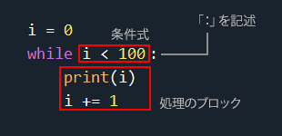

この while文は「変数 `i` の値が100未満の時に繰り返す」というものです。
処理のブロック内で毎回 `i` の値をプラス１していますので、`i` は 0 からスタートし、0, 1, 2, 3, 4 ... と増えていきます。

そして `i` が100になった瞬間に条件式に合わなくなるため、ループを終了します。
つまり、この while文と以下の for文は同じ、ということになります。

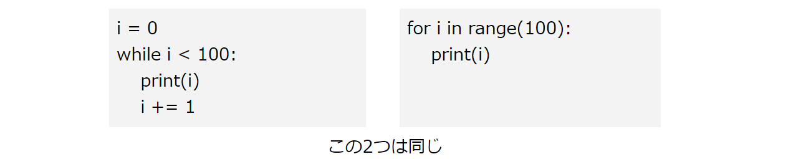


## 1万円使い切ったら終了

お正月に1万円のお年玉をもらいました。

この1万円を使って買い物をしますが、残金が0より下になったら買い物終了、というコードを書いてみましょう。


次のようなコードの作成を目指します。

「いくら使いましたか？」と聞かれるので、買った物の金額を入力
↑これを繰り返す
残金が0を下回ったら終了


#### フローチャートを考える

簡単な例ですので
少し考えてみてから解答例を見てください。

<details class="md-text"><summary><u>→解答例を表示</u></summary><blockquote><span>
while を用いた繰り返し１では条件式の部分には True が入っており、延々と繰り返しましたが、今回は while を用いた繰り返し２の書式ですので、ひし形ブロックには条件式を書いておきましょう。
<br>この条件が成立しなくなった場合に繰り返し終了となります。
[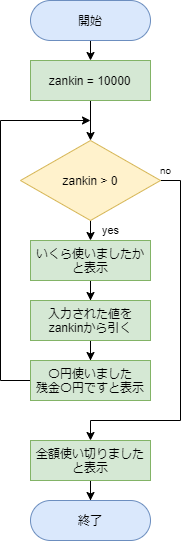](#)
<hr></span></blockquote></details>


#### エディタにコードを入力


まず、Spyder の画面左上にある“新規ファイル”アイコンをクリックし、新しい Python ファイルを用意します。


以下のコードを入力し、ファイルを保存アイコンをクリックして保存しましょう。今回は `test7_3.py` という名前で保存してみました。

```python
zankin = 10000
while zankin > 0:
    print("いくら使いましたか？")
    a = int(input())
    zankin -= a
    print(a, "円使いました。残りは", zankin, "です。")
print("お年玉を使いきりました。")
```

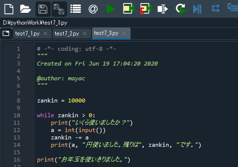


#### 実行


入力したら、画面上部の“ファイルを実行”アイコンをクリックしてみましょう。

以下のようにお年玉が減っていきます。

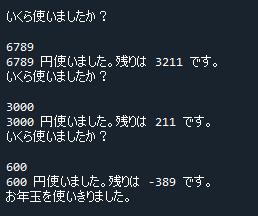


#### 解説

このコードも一行ずつ見て行けばそれほど難しい箇所は無いと思います。
繰り返すための条件は「変数 zankin に代入された値が 0 より大きい（つまり1以上）場合」です。
繰り返すたびに使用金額をキーボードから入力し、その分が zankin から引かれます。

```python
zankin = 10000                                    # 変数 zankin に 10000を代入
 
while zankin > 0:                                 # zankinが 0 より大きい場合に繰り返す
    print("いくら使いましたか？")
    a = int(input())                              # キーボードから入力された値をint型に変換し、変数 a に代入
    zankin -= a                                   # zankin から a を引く
    print(a, "円使いました。残りは", zankin, "です。")
 
print("お年玉を使いきりました。")                    # zankinが 0 以下になったらwhileから抜けるので、メッセージを表示
```

このように「**何回繰り返すか分からない」コードは for文を使うより while文を使った方が書きやすい**です。


#### 練習

このコードは「while を用いた繰り返し１」のように「延々と繰り返す while文」を用いても書くことが出来ます。
以下の少しだけ書かれたコードに加筆して、同じ動作をするコードを完成させてみましょう。 

```python
zankin = 10000
 
while True:
    （ここに処理を書く）
```

<details class="md-text"><summary><u>→解答例を表示</u></summary><blockquote><span>
先ほどは条件式に「zankin > 0」と書きましたが、ここを True にして延々と繰り返す while文 でも同じことが出来ます。
どちらを使うかは、使いやすい方でOKです。
<pre><code class="python">zankin = 10000
while True:                       # 延々と繰り返す while文
    print("いくら使いましたか？")
    a = int(input())
    zankin -= a
    print(a, "円使いました。残りは", zankin, "です。")
    if zankin <= 0:               # ループを脱出するための仕組みを作ってあげる
        break                     # zankin が 0 以下になったらループを脱出
print("お年玉を使いきりました。")</code></pre>
<hr></span></blockquote></details>


## 2重ループ

第４回テキストの「やってみよう画像処理３」で少し触れましたが、画像のすべての画素にアクセスしたい場合、以下のアニメーションのように x, y の値を動かします。

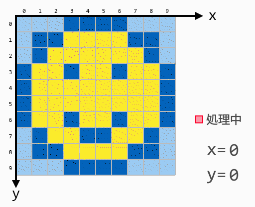

このような x, y の値の動きを実現させるには「２重ループ」という手法を使います。

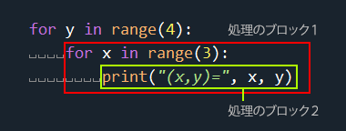

この場合、処理のブロック１は4回繰り返します。その処理のブロック１の中にはさらに for文が入っています。
処理のブロック２は何回繰り返すことになるでしょうか？
処理のブロック１の中の for文は、1度に3回繰り返します。処理のブロック１自体が4回繰り返すので、処理のブロック２は 3 × 4 = 12回繰り返します。

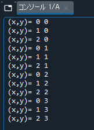
実行してみると、コンソールには次のように表示されます。処理のブロック２はちゃんと12回実行されていますね。

このように、あるfor文の処理のブロック内にさらにfor文が入っているのが「2重ループ」です。最初はややこしいと感じると思いますが、パターンが決まっているので何度も繰り返し例題をこなして覚えてしまうのがお勧めです。


フローチャートも見ておきましょう。
以下、忠実に書いてみた例とざっくりと書いてみた例です。赤い点線で囲った部分が1つ目のfor文で、その中にある青い点線で囲った部分が2つ目のfor文となります。
この授業で扱うフローチャートは、自分でプログラムの流れを意識する・整理することが目的ですので、ざっくりフローチャートで十分かなと思います。

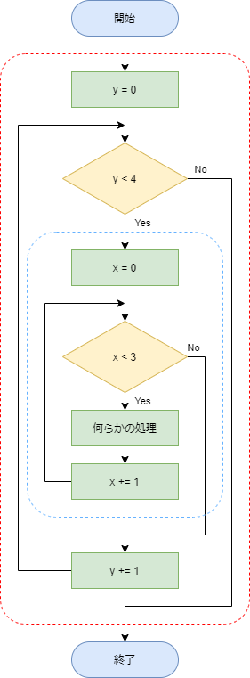
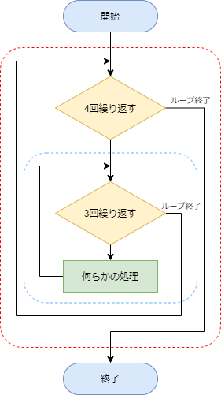


## カラー画像のネガポジ反転

第４回テキストの「やってみよう画像処理３」では「`invert()`」という命令を使ったネガポジ反転を行いました。


この「`invert()`」では、特に2重ループを意識することなく結果を得ることができましたが、`invert()` を使わずに行うとどうなるでしょうか？
前回のやってみよう画像処理の復習もかねて2重ループを見ていきましょう。


#### カラー画像をネガポジ反転するには

ネガポジ反転を行う際の、ある画素の値がどのように決まるかは、以下の式のようになります（グレースケール画像についてはやってみよう画像処理３でやりましたね）。カラー画像の場合、画素の一つ一つのRGB値を読み取り、R、G、Bのそれぞれについて計算を行い、元の画像（もしくは新規画像）の画素に書き込んでいきます。

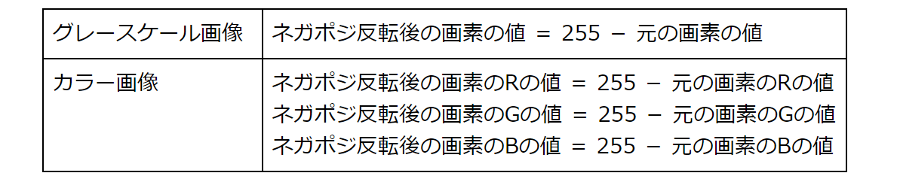

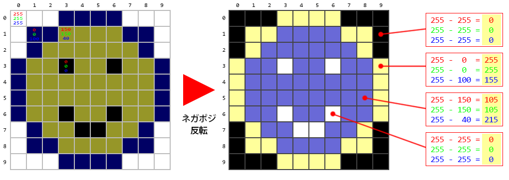


### Pillow で画素を操作する

Pillow で画素の値を読み取るには `getpixel()` という命令を使用し、書き込むには `putpixel()` という命令を使用します。

以下のコードでは `getpixel()` を用いて、画像の「とある画素」にアクセスし、その値を読み取っています。どの画素の値を取得するかについては、`getpixel((画素のx座標, 画素のy座標))` という具合に指定します。
上記のにこちゃんの左目の値を取得したい場合は、 `getpixel((6, 3))` ですね。

```python
from PIL import Image                  # Pillowモジュールのインポート
 
img = Image.open("photoSample_01.jpg") # 画像をimgという名のImageオブジェクトとして読み込む
x = 0
y = 0
pixel_val = img.getpixel((x,y))        # getpixel((画素のx座標, 画素のy座標)) で画素の値を取得できる
print(pixel_val)                       # 取得した画素の値を表示
```

ここで、上記コードを実行後に変数エクスプローラーを見てみましょう。
`img` は Image型のオブジェクトで、そのサイズは `(800, 600)` となっています。つまり、この画像のx方向の画素数は800、y方向は600画素ということです。

次に `pixel_val` ですが、「**tuple（タプル）**」という見慣れない型です。これはこれまでに出てきたリストと同じものだと考えておいてください。tuple は list の一種です。
この例の場合、Rの値が77、Gの値が116、Bの値が171ですね。

なお、読み込んだ画像はカラー画像でしたのでRGBの3色のデータを持つため、`pixel_val` の型はtuple になっていますが、グレースケール画像の場合は `pixel_val` の値は1種類の整数値ですので、型は int になります。

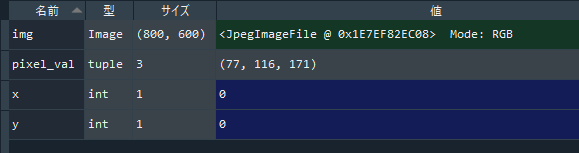


#### フローチャートを考える

「カラー画像のネガポジ反転」をもう少し細かく処理を見ていきますと、以下のような感じでしょうか。

- 画像をImageオブジェクトとして読み込む
- 画像の縦横サイズを調べる
- 読み込んだ画像と同サイズのImageオブジェクトを作成
- ◎元画像の画素の値を読み取る
- ◎読み取った値をネガポジ反転
- ◎反転した値を新しく作成したImageオブジェクトの画素に書き込む
- 新しく作成したImageオブジェクトを保存

　

先頭に◎が書いてある部分が、2重ループで行う処理です。
これを先ほどの書式３のフローチャートに当てはめてみましょう。少し考えてみてから、解答例を見てみてください。

<details class="md-text"><summary><u>→解答例を表示</u></summary><blockquote><span>
コードに忠実に書いてみた例と、少しだけざっくり書いてみた例です。
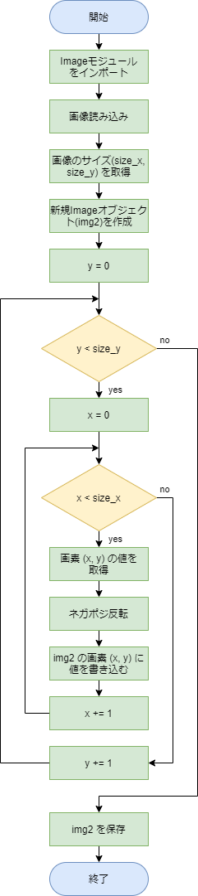　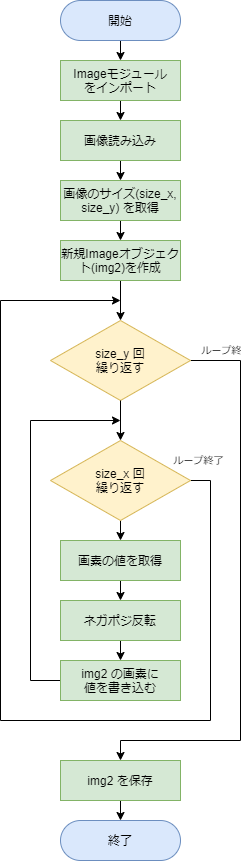
<hr></span></blockquote></details>


#### エディタにコードを入力


まず、Spyder の画面左上にある“新規ファイル”アイコンをクリックし、新しい Python ファイルを用意します。


以下のコードを入力し、ファイルを保存アイコンをクリックして保存しましょう。今回は `test7_4.py` という名前で保存してみました。

```python
from PIL import Image
 
img = Image.open("photoSample_01.jpg")
size_x = img.width
size_y = img.height
 
img2 = Image.new('RGB',(size_x, size_y))
 
for y in range(size_y):
    for x in range(size_x):
        pixel_col = img.getpixel((x, y))
        r = 255 - pixel_col[0]
        g = 255 - pixel_col[1]
        b = 255 - pixel_col[2]
 
        img2.putpixel((x, y), (r, g, b))
 
img2.save("photoSample_01_negaposi.jpg", quality=95)
```

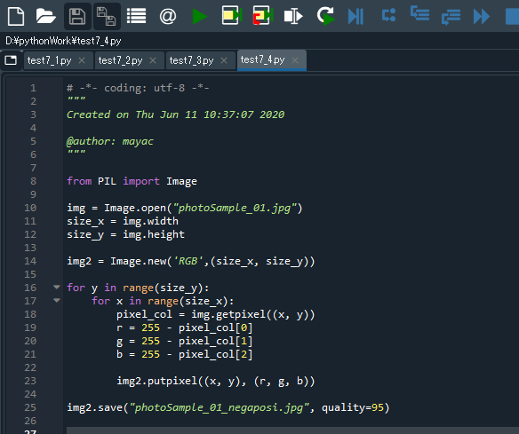


#### 実行


入力したら、画面上部の“ファイルを実行”アイコンをクリックしてみましょう。

しばらくすると自分の作業フォルダ内にネガポジ反転されたjpegファイルが保存されているはずですので、確認しておきましょう。


#### 解説

画像を扱うコードを書く際は2重ループ（場合によっては3重ループ以上になることも）がよく出てきます。本授業の例題としてもまだいくつか出てくる予定ですが、全てこのパターンですので、繰り返し例題をこなして覚えてしまいましょう。
コードの各行の解説は以下となります。

```pyhton
from PIL import Image
 
img = Image.open("photoSample_01.jpg")       # 画像をImageオブジェクト（名前はimg）として読み込む
size_x = img.width                           # 読み込んだ画像の横方向の画素数を変数 size_x に代入
size_y = img.height                          # 読み込んだ画像の縦方向の画素数を変数 size_y に代入
 
img2 = Image.new('RGB',(size_x, size_y))     # 新規Imageオブジェクトを横が size_x 縦が size_y で作成
 
for y in range(size_y):                      # 2重ループ
    for x in range(size_x):
        pixel_col = img.getpixel((x, y))     # ◎img の (x, y) で指定される画素から値を読み取る
        r = 255 - pixel_col[0]               # ◎ネガポジ反転したRの値を変数 r に代入
        g = 255 - pixel_col[1]               # ◎ネガポジ反転したGの値を変数 gに代入
        b = 255 - pixel_col[2]               # ◎ネガポジ反転したBの値を変数 b に代入
        
        img2.putpixel((x, y), (r, g, b))     # ◎img2 の (x, y) で指定される画素へ値を書き込む
 
img2.save("photoSample_01_negaposi.jpg", quality=95)    # 2重ループが終わり、img2 を保存
```

コードを見た時に**字下げに注目して見てあげると、どこまでが2重ループなのかが簡単に分かります**。

この例では解説の先頭に◎が着いている行が大きく字下げされており、2重ループの部分です。ここでは、size_x × size_y 回（小さい画像でも何十万回にもなります）も処理を繰り返すことになります。

最後の行は字下げされていませんので、2重ループを抜けた後に一度だけ実行されます。


#### 練習

今回のネガポジ反転や、やってみよう画像処理での例題では、「何かの画像を読み込んでから」加工処理をし、別名で保存してきました。
しかし元画像を読み込まなくてもコード内でImageオブジェクトを作成し、各ピクセルに色を書き込んでから保存することで、新しく画像を作成できます。

それでは、画像サイズが 横×縦 ＝ 800×600 の、真っ赤な画像を作成してみましょう。

例えば新規に Imageオブジェクトを作成するには次のようにします。
`img = Image.new('RGB',(800, 600))`
また、ある画素に赤い色を書き込むには次のようにします。
`img.putpixel((x, y), (255, 0, 0))`

　

<details class="md-text"><summary><u>→解答例を表示</u></summary><blockquote><span>
画像サイズが 横×縦 ＝ 800×600 の、真っ赤な画像を作成します。
<br>まず、サイズが 800×600 の Imageオブジェクトを作成します。
出来上がる画像の画素数は 48万画素になります。
その1つ1つを2重ループ内で赤 (255, 0, 0) に塗りつぶします。
そして2重ループを抜けた後に保存します。
<br>以上をコードにしてみると以下のようになります。
<br>
<pre><code class="python">from PIL import Image
<br>img = Image.new('RGB',(800, 600))          # 横×縦 が 800 × 600 のサイズの Imageオブジェクトを作成
<br>for y in range(600):                       # 2重ループ
    for x in range(800):                   # 座標 (x, y) を赤 (255, 0, 0) で次々に塗りつぶしていく
        img.putpixel((x, y), (255, 0, 0))  #  一行一行を赤で塗りつぶしながら縦方向に赤の面積を増やしていく感じ
<br>img.save("pixelTest01.png")                # 真っ赤になった ImageオブジェクトをPNG形式で保存
print("画像を出力しました。")</code></pre>
画像のサイズ指定に変数を使うと、簡単に画像の大きさを変更出来て便利です。
<pre><code class="python">from PIL import Image
<br>yoko = 800
tate = 600
<br>img = Image.new('RGB',(yoko, tate))            # 横×縦 が yoko × tate のサイズの Imageオブジェクトを作成
<br>for y in range(tate):
    for x in range(yoko):
        img.putpixel((x, y), (255, 0, 0))
<br>img.save("pixelTest01.png")
print("画像を出力しました。")</code></pre>
<br>2重ループ内で画素を赤く塗りつぶす様子。img = Image.new('RGB',(10, 7)) の場合の例。
[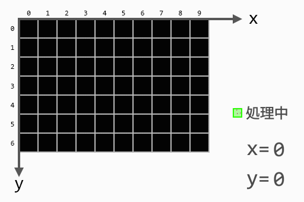](#)
<hr></span></blockquote></details>

　

---

本日のメインの内容は以上となります。いかがでしたでしょうか？

「条件分岐」と「繰り返し」は様々なプログラミング言語において最も重要な項目です。 少し難しく感じたかもしれませんが、この２つを覚えておくと今後他の言語に触れる際に必ず役に立ちます。 この授業でもまだまだ練習問題とか出てきますので、最初は難しいかもしれませんがゆっくり慣れていきましょう！

それでは引き続きやってみよう画像処理５も読み進めてみてください。

　

[< 戻る](../)