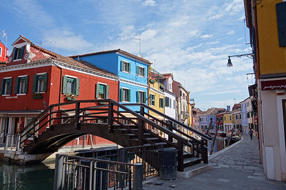
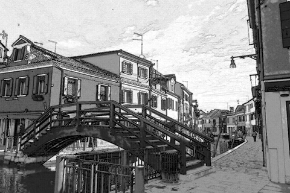

# 第７回の課題

[< 戻る](../)


## 課題１

テキストの例題「延々と続く計算ドリル」では、ランダムな九九の問題が出題され続けるコードを書いてみました。

そのコードでは、「まだ続けますか？ やめる場合は「e」 続ける場合はその他のキーを押してください。」という選択が出来るようになっていましたが、今回はその途中でやめる選択肢を無くし、**「５問正解すると終了する計算ドリル」に変更してください。**

５問**出題**して終了ではなく、５問**正解**すると終了であることに注意して、解いてみてください。（つまり、正解数を数える必要があるということ！）

ヒント：途中でやめる選択肢を無くした状態のコードは、こちらです：

```python
import random
while True:
    a = random.randint(1, 9)
    b = random.randint(1, 9)
    print(a, "×", b, "の答えはなんでしょう？")
    ans = input()
    if a*b == int(ans):
        print("正解です！")
    else:
        print("残念…")
print("おしまい！")
```

　

コードが完成したら実行し、Spyderの画面をスナップショットを撮って、
**コード（コピー＆ペーストでOKです）と、Spyderで実行した画面のスナップショットの両方を、課題に添付されているパワーポイントに貼り付けてください。**

　

※もしコードを実行した際に無限ループになってしまった場合は以下を試してみてください。

Windowsの場合：コンソールをクリック後に Ctrl キーを押しながら Cキーを押す

Macの場合：コンソールをクリック後に controlキーを押しながら Cキーを押す


## 課題２

やってみよう画像処理５ では画像を鉛筆デッサン風（漫画風）に変換してみました。




このコードを使って、何か写真を１つ変換してみてください。
その際、コードの最初の方の以下の部分を変更し、いい感じに見えるように調整してみましょう。

```python
nameraka = 3                    # 値を大きくするとディテールが薄くなる
line_size = 5                   # 線の太さ 3, 5, 7, 9 のように、奇数で指定
line_kosa = 3                   # 線の濃さを 1以上の整数で指定
nuri_blur = 2.5                 # 塗りにかけるブラーの大きさを0以上で指定
nuri_con = 1.2                  # 塗りのコントラスト調整　0.5～2.0程度で指定
nuri_brightness = 1.5           # 塗りの明るさ調整　0.5～3.0程度で指定
```

変換出来たら、**変換前後の画像を、課題に添付されているパワーポイントに貼り付けてください。**

変換する写真はこちらから配布した写真（photoSample_01.jpg  や faceSample_01.jpg など）でも構いませんし、自分で撮影した写真でも構いません。

ただし、自分で撮影したものを使用する場合は一度サイズを小さくしてから変換してください。
サイズの目安は、横×縦が1200×900程度です。スマホカメラで撮影した写真そのままのサイズだと、変換に何分もかかってしまいますので、気を付けてください。

　

[< 戻る](../)

