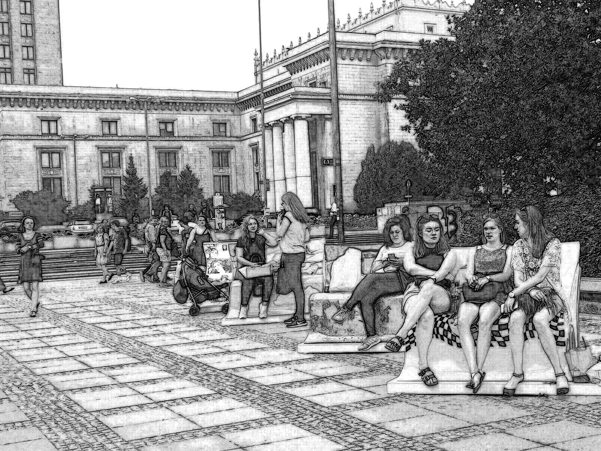

# やってみよう画像処理５

[< 戻る](../)

　

細かいことは分からなくてもいいから、とにかくやってみよう！のコーナーです。

今回はやってみよう画像処理４の最後でやった「写真をデッサン風画像に変換」を発展させてみましょう。以下、本日紹介するデッサン風変換用のコードを使って変換してみたものです。鉛筆デッサンというより漫画の背景っぽいですかね…


## 写真をデッサン風画像に変換２


やってみよう画像処理４では主に輪郭部分のみを鉛筆で描いたような風合いに変化させましたが、今回は陰影も付けてみます。

そのために今回は以下の図のように一度元画像を「輪郭線」と「塗り」に変換し、それらを合成する、という流れにしてみたいと思います。「輪郭線」を取り出すにはやってみよう画像処理４でやった手法でよいのですが、そのままでは変換前画像のコントラストが強い部分の輪郭線は濃く、コントラストが低ければ輪郭線も薄くなってたため、変換後の画像を見ると違和感が感じられました。今回はそういった違和感を少しでも軽減させるような工夫も入れてみようと思います。

なお、このような変換の手法は「こういう手順で変換すればよい」と決まったものがあるわけではなく、コードを書く人がそれぞれ工夫してオリジナリティを加えていくものです。ですのでここで紹介する手順も私が適当に考えてみたものですので、「こういったやり方もあるのね」程度に見ていただければと思います。

　


#### エディタにコードを入力


まず、Spyder の画面左上にある“新規ファイル”アイコンをクリックし、新しい Python ファイルを用意します。


以下のコードを入力し、ファイルを保存アイコンをクリックして保存しましょう。今回は `try5_dessin1.py` という名前で保存してみました。

コード右側のコメントには、 0 ①②…といった数字やアルファベットを書きました。これらは下の解説画像の番号と対応します。

```python
from PIL import Image, ImageChops, ImageOps, ImageFilter, ImageEnhance   # Pillowのいろんなものをインポート
 
filename = "faceSample_01.jpg"                 # 読み込むファイル名を指定
nameraka = 3                                   # 値を大きくするとディテールが薄くなる
line_size = 5                                  # 線の太さ 3, 5, 7, 9 のように、奇数で指定
line_kosa = 3                                  # 線の濃さを 1以上の整数で指定
nuri_blur = 2.5                                # 塗りにかけるブラーの大きさを0以上で指定
nuri_con = 1.2                                 # 塗りのコントラスト調整　0.5～2.0程度で指定
nuri_brightness = 1.5                          # 塗りの明るさ調整　0.5～3.0程度で指定
 
#画像ファイルの読み込み
img = Image.open(filename)                     # 0: 画像読み込み
sizeX = img.width                              # 画像の横方向の画素数を取得
sizeY = img.height                             # 画像の縦方向の画素数を取得
 
#必要なImageオブジェクトを作成
imgR = Image.new("L", (sizeX, sizeY))          # 画像のR成分だけを入れるImageオブジェクト
imgG = Image.new("L", (sizeX, sizeY))          # 画像のG成分だけを入れるImageオブジェクト
imgB = Image.new("L", (sizeX, sizeY))          # 画像のB成分だけを入れるImageオブジェクト
img_nuri = Image.new("L", (sizeX, sizeY))      # 塗りImageオブジェクト
 
#2重ループ処理
for y in range(sizeY):
    for x in range(sizeX):
        r,g,b = img.getpixel((x,y))            # 座標(x, y)の画素の値をr, g, b に代入
        aaa = 0                                # ①aaaは調整用のパラメータ
        if r+g+b != 0:                         # ①
            aaa = 255.0 / float(r + g + b )    # ①
        newR = int(r*aaa)                      # ①newR,newG,newBを足し合わせると255になる
        newG = int(g*aaa)
        newB = int(b*aaa)
        imgR.putpixel((x,y), int((newR*nameraka + r)/(nameraka+1)))   # ①ImgRの画素に値を入力
        imgG.putpixel((x,y), int((newG*nameraka + g)/(nameraka+1)))   # ①ImgGの画素に値を入力
        imgB.putpixel((x,y), int((newB*nameraka + b)/(nameraka+1)))   # ①ImgBの画素に値を入力
       
        if r+g+b < 100:                        # A:r+g+b が100未満なら
            img_nuri.putpixel((x,y), 80)       # A:塗り素材の画素値は80
        elif r+g+b < 200:                      # A:そうではなく r+g+b が200未満なら
            img_nuri.putpixel((x,y), 120)      # A:塗り素材の画素値は120
        elif r+g+b < 400:                      # A:そうではなく r+g+b が400未満なら
            img_nuri.putpixel((x,y), 160)      # A:塗り素材の画素値は160
        elif r+g+b < 600:                      # A:そうではなく r+g+b が600未満なら
            img_nuri.putpixel((x,y), 220)      # A:塗り素材の画素値は220
        elif r+g+b < 720:                      # A:そうではなく r+g+b が720未満なら
            img_nuri.putpixel((x,y), 240)      # A:塗り素材の画素値は240
        else:                                  # A:それ以外の場合は
            img_nuri.putpixel((x,y), 255)      # A:塗り素材の画素値は255
                                               # A:塗り素材は6段階になる
#塗り素材のコントラスト調整・ぼかし
enhancer = ImageEnhance.Contrast(img_nuri)     # B:塗り素材のコントラスト調整
img_nuri= enhancer.enhance(nuri_con)           # B:
enhancer = ImageEnhance.Brightness(img_nuri)   # C:塗り素材の明るさ調整
img_nuri= enhancer.enhance(nuri_brightness)    # C:
img_nuri= img_nuri.filter(ImageFilter.GaussianBlur(nuri_blur))   # D:塗り素材にブラーをかけて、塗り素材完成
 
#R・G・B のそれぞれについてライン化
imgR2 = imgR.filter(ImageFilter.MaxFilter(line_size))      # ②imgRに膨張フィルタをかける
imgR3 = ImageChops.difference(imgR, imgR2)                 # ③imgRとimgR2の差の絶対値
 
imgG2 = imgG.filter(ImageFilter.MaxFilter(line_size))      # ②imgGに膨張フィルタをかける
imgG3 = ImageChops.difference(imgG, imgG2)                 # ③imgGとimgG2の差の絶対値
 
imgB2 = imgB.filter(ImageFilter.MaxFilter(line_size))      # ②imgBに膨張フィルタをかける
imgB3 = ImageChops.difference(imgB, imgB2)                 # ③imgBとimgB2の差の絶対値
 
#ラインの各素材を合成して1つに
line_img = ImageChops.add(imgR3, imgG3)                    # ④RとGのライン素材を加算合成
line_img = ImageChops.add(line_img, imgB3)                 # ④↑とBのライン素材を加算合成
line_img = ImageOps.invert(line_img)                       # ⑤黒地に白ラインになっているのでネガポジ反転
 
#ラインを濃くする
for i in range(line_kosa):                                 # ⑥とりあえずライン素材同士を乗算して濃く
    line_img = ImageChops.multiply(line_img, line_img)     # ⑥
 
#塗り素材とライン素材をを乗算し、保存
kansei_img = ImageChops.multiply(line_img, img_nuri)       # ⑦ ⑥とCを乗算合成
kansei_img.save("dessinTest.png")                          # 保存
print("変換終了しました。")
```


#### 実行


入力したら、画面上部の“ファイルを実行”アイコンをクリックしてみましょう。

しばらくするとコンソールに「変換終了しました。」と表示され、作業ディレクトリにはデッサン風に変換された「dessinTest.png」というファイルが保存されます。


#### 解説

コントラスト調整など、一部まだ紹介していない機能も使用していますが、ほとんどはやってみよう画像処理で今までに出てきた処理を組み合わせたものです。
以下の画像は読み込んだ画像がどのように変化していくのかを示しています。
図中の 0 ①②…やABCDはコードの解説（緑文字）のものと対応しています。


|      | 処理内容                                                     |
| ---- | ------------------------------------------------------------ |
| 0    | 読み込んだ画像。この画像の各画素のRGB成分に処理を加えつつ、imgR, imgG, imgBに代入していく。 |
| ①    | newR, newG, newB を足し合わせると255になるように調整。 例えば元画像の r=10, g=10, b=5 だったとすると、newR=102, newG=102, newB=51となる。 imgR, imgG, imgB の各座標に値を書き込む際は、変換の調整のために元画像の r, g, b と newR, newG, newB の中間くらいの値に調整している（imgR.putpixel((x,y), int((newR*nameraka + r)/(nameraka+1))) の部分）。 |
| ②    | imgR, imgG, imgB に膨張フィルタをかけたものを imgR2, imgG2, imgB2 とする |
| ③    | imgRとimgR2 の「差の絶対値」を取ったものを imgR3 とする。G, B についても同様。 |
| ④    | imgR3, imgG3, imgB3 を加算合成したものをライン素材 (line_img) とする。 |
| ⑤    | line_img をネガポジ反転して鉛筆で輪郭を取ったような雰囲気に変換。 |
| ⑥    | line_img の濃さ調整のために、とりあえずライン素材同士を乗算合成して濃くしてみた。 |
| A    | 元画像の各画素の r, g, b 合計値によって塗り素材 (img_nuri) の各画素に値を入力していく。 今回は塗り素材を6段階の濃淡で表現されるようにしてみたが、6段階にする必要は特にない。 |
| B    | 塗り素材のコントラスト調整。                                 |
| C    | 塗り素材の明るさ調整。                                       |
| D    | 塗り素材にブラーをかけて、塗り素材完成。                     |
| ⑦    | ⑥とCを乗算合成して完成。                                     |


#### 練習

コードの最初にある赤字の部分は読み込み用の画像ファイル名を指定したり、変換後の結果を調整するためのパラメータです。
いろいろと変更して試してみましょう。
自分で撮影した写真も変換できますが、スマホのカメラで撮った画像はサイズが大きいため、変換にかなりの時間がかかってしまいます。一度画像のサイズを小さく（横の画素数×縦の画素数 が 1200×800 程度が目安）してから試すとよいでしょう。

```python
filename = "faceSample_01.jpg"  # 読み込むファイル名を指定
nameraka = 3                    # 値を大きくするとディテールが薄くなる
line_size = 5                   # 線の太さ 3, 5, 7, 9 のように、奇数で指定
line_kosa = 3                   # 線の濃さを 1以上の整数で指定
nuri_blur = 2.5                 # 塗りにかけるブラーの大きさを0以上で指定
nuri_con = 1.2                  # 塗りのコントラスト調整　0.5～2.0程度で指定
nuri_brightness = 1.5           # 塗りの明るさ調整　0.5～3.0程度で指定
```





　

今回はより実践的なコードを紹介してみましたがいかがでしたか？

なお、第６回の条件分岐と繰り返し２に出てきた例題「作業フォルダ内のJpeg形式の画像全てをリサイズ」と今回のコードを組み合わせると、フォルダ内の全ての画像を鉛筆デッサン風に変換することが出来ます。

その結果を動画編集ソフトなどで動画にしてみると、鉛筆デッサン風（漫画風？）動画も出来てしまいます。


　

[< 戻る](../)