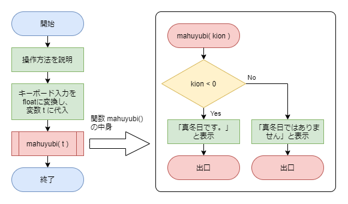
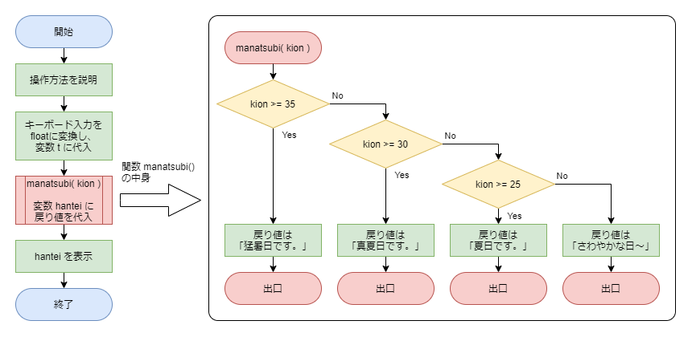

# 第８回の課題

## 課題１：今日は真冬日？

真冬日を判定するプログラムを作成します。
東京では珍しいですが、真冬日と呼ばれる日があります。一日を通しての最高気温が０度未満の日のことです。
キーボードからその日の最高気温を入力すると、真冬日かどうかを判定し、以下のようにコンソールに表示するコードを、**引数あり、戻り値なしの関数を用いて作成してください。**
表示するメッセージは適当に変えてもOKです！

| 気温     | コンソールに表示するメッセージ |
| -------- | ------------------------------ |
| ０度以上 | 「真冬日ではありません。」     |
| ０度未満 | 「真冬日です。」               |

[テキストの例題「成績判定」](../kansu/#!index.md#成績判定)を参考にしましょう。

また、こちらのフローチャートも参考にしてみてください。

コードが完成したら実行し、**コード（コピー＆ペーストでOKです）と、Spyderで実行した画面のスナップショットの両方を、課題に添付されているパワーポイントに貼り付けてください。**

## 課題２：今日は真夏日？

キーボードから最高気温を入力すると、気温に応じて以下のようにコンソールに表示するコードを、
**引数あり、戻り値ありの関数を用いて作成してください。**
表示するメッセージは適当に変えてもOKです！

| 気温     |                                                            |
| -------- | ---------------------------------------------------------- |
| 35度以上 | コンソールに「猛暑日です。」のようなメッセージを表示       |
| 30度以上 | コンソールに「真夏日です。」のようなメッセージを表示       |
| 25度以上 | コンソールに「夏日です。」のようなメッセージを表示         |
| それ以外 | コンソールに「さわやかな日です。」のようなメッセージを表示 |

[テキストの例題「偶数？奇数？」](../kansu/#!index.md#偶数？奇数？)辺りを参考にしましょう。

また、こちらのフローチャートも参考にしてみてください。

コードが完成したら実行し、**コード（コピー＆ペーストでOKです）と、Spyderで実行した画面のスナップショットの両方を、課題に添付されているパワーポイントに貼り付けてください。**
