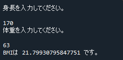

# 関数

[< 戻る](../)

この授業で習得してほしい５つの項目（「変数」「順次処理」「条件分岐」「繰り返し」「関数」）のうち、「関数」を学習します。

本授業で習得してほしいこと５つは、今日の「関数」で最後となります。
これまで学習してきた４つの項目と同様、関数もあらゆるプログラミング言語において重要な項目です。
最初のうちは？？？となるかもしれませんが、しっかり学習しましょう！


## 関数ってなあに？

ここまでの授業において、例えば以下のような命令が出てきました。

| 命令        | 機能                     | 使用例                                       |
| ----------- | ------------------------ | -------------------------------------------- |
| `print()`   | コンソールに表示         | `print( "おはようございます！" )`            |
| `input()`   | キーボード入力を取得     | `a = input()`                                |
| `int()`     | int型に変換              | `b = int(3.14)`                              |
| `float()`   | float型に変換            | `c = float(10)`                              |
| `randint()` | 任意の範囲の整数を発生   | `d = random.randint(1, 5)`                   |
| `choice()`  | ランダムに要素を一つ選択 | `e = random.choice([ "xxx", "yyy", "zzz" ])` |

　

これらの命令は「**関数**」と呼ばれる種類の命令で、最後に「`()`」が付いているのが特徴です。
関数とは、**よく使う命令を一つのまとまりにしておき、簡単に使えるようにしたもの**になります。

`print()` の場合だと、「`()`」内に表示させたい文字列や数値などを記述すると、それをコンソールに表示させてくれます。「コンソールに表示させるだけでしょ･･･？」と感じるかもしれませんが、実はそこそこ複雑な処理を内部的に行っています。`print()` の中身は何十行にも渡るコードで作られているのですが、それを意識せずにたった1行でコンソールに表示させることが出来ます。

なお、pythonの関数について検索すると、「**メソッド**」という言葉も沢山出てきます。本授業でも第３回の授業で出てきた「`append()`」や、やってみよう画像処理で出てきた命令の多くが「メソッド」になります。メソッドと関数はその使い方の違いから名前を分けて呼んでいますが、**その構造は一緒ですので、この授業では関数＝メソッドとして扱います**。


## 関数の作り方・使い方

`print()` や `input()` という関数はあらかじめ Python に組み込まれている関数です。このように、あらかじめ用意されている関数もありますが、自分で新しく関数を作ることもできます。**関数を作ることを、「 関数を定義する 」と表現します**。

Python の関数を新たに定義する場合は、次のように**頭に「`def`」と記述**します。
また、**関数の中身は 「字下げ」**して記述していきます。
そして、関数を記述し終わったら 一度実行してあげることで定義されます。


この関数は（想像つくと思いますが）「おはようございます。」「今日も元気にがんばりましょう！」とコンソールに表示するだけの機能を持っています。

それでは早速、動作を確認してみましょう。
以下のコードを Spyder のエディタに記述（コピペ）し、実行ボタンをクリックしてみてください。

```python
def kansu_ohayo():
    print("おはようございます。")
    print("今日も元気にがんばりましょう！")
```

…特にコンソールには何も表示されません。なぜでしょうか…？？

実はこのコードだけを実行しても、関数の定義をするだけで、その関数を使用してはいません。
つまり、「作ってみましたー！まだスイッチONしてないけどね！」という状態です。

このスイッチを押して**関数を使用することを、「 関数を呼び出す 」と表現します**。

それではこの関数を呼び出してみましょう。
以下のコードを Spyder のエディタに記述（コピペ）し、実行ボタンをクリックしてみてください。
**カッコまで含む関数名を記述することで関数の呼び出しができます（コードの赤字の部分）。**

```python
def kansu_ohayo():
    print("おはようございます。")
    print("今日も元気にがんばりましょう！")

kansu_ohayo()
```


コンソールに、このように表示されましたか？

　

コードを書くときは必ず「関数を定義してから呼び出す」ようにしてください。
例えば、以下のような順番でコードを書いてしまうと、実行時にエラーが出ます。
関数を定義する前に呼び出そうとしているため、「そんな関数、知らないよ！」と Spyderが言っているのです。

```python
kansu_test()

def kansu_test():
    print("関数のテストです。")
```


## おはよう３回

コンソールに「おはよう！おはよう！おはよう！」と３回表示される、大した意味のない関数を定義し、呼び出してみましょう。


#### エディタにコードを入力


まず、Spyder の画面左上にある“新規ファイル”アイコンをクリックし、新しい Python ファイルを用意します。


以下のコードを入力し、ファイルを保存アイコンをクリックして保存しましょう。今回は `test8_1.py` という名前で保存してみました。

```python
def kansu_ohayo3():
   for i in range(3):
        print("おはようございます。")
 
kansu_ohayo3()
```


#### 実行


入力したら、画面上部の“ファイルを実行”アイコンをクリックしてみましょう。


コンソールには、このように表示されましたか？


#### 解説

関数の中には for文を入れることができます。
for文の処理のブロックは字下げをしました。関数の中身も字下げをしますので、for文を関数の中に入れる場合は for文の全体を字下げしましょう。

**関数を使わずにおはよう×３の例**

```python
for i in range(3):
    print("おはようございます。")
```

**関数を使っておはよう×３の例**

```python
def kansu_ohayo3():
    for i in range(3):
        print("おはようございます。")
 
kansu_ohayo3()
```

　

ところで、↑のコードを見てみると、関数を使って書いたコードと使わずに書いたコードの実行時の結果は、同じです。
どちらも「おはようございます。おはようございます。おはようございます。」と表示されます。

関数にするのは面倒くさいだけのような気がしますよね。
確かに、コードを実行し終えるまでに「おはようございます。×３」と表示するだけなら関数を使う必要はないでしょう。

ですが、コード内で何回も何十回も「おはようございます。×３」を表示させないといけない場合は、関数にしておいた方が便利です。
なぜなら関数の呼び出しは１行で済みますので、コードがすっきりするからです。
今回は関数の中身がたったの２行しかないので、「コードがすっきりする」と言われてもあまりありがたみが無いのですが、例えば100行にもなる処理を繰り返し行いたい場合には、関数化しておくべきということです。

　

では、フローチャートはどのように書くとよいでしょうか？


関数は一般的に、このブロックで表現します。

以下のように、全体の流れと関数の中身は分けて書いておくとよいでしょう。


フローチャートはあくまでもコードを作成する上での流れを整理するためのものなので、ある程度コードの作成に慣れてきたら関数部分のフローチャートは、必要ないかもしれません。
私も簡単なコードを書く場合は、大雑把な流れをメモる程度で細かくは書いていません。
皆さんそれぞれが効率よくコードを書ける手順を見つけてもらえればと思います。


## 引数のある関数の作り方・使い方

関数には、何かの値を渡すことが出来ます。

例えばPythonにあらかじめ組み込まれている関数 `print()` の場合、表示させたい文字列や数値などを「`print("こんにちは！")`」のように「`()`」の中に記述します。すると `print()`側で「こんにちは！」という文字列を受け取り、それをコンソールに表示します。

この、**渡す値のことを「 引数（ひきすう） 」と呼びます**。


このように、関数を定義する時に、あらかじめカッコの中に引数を受け取るための変数（この例の場合、`name`）を書いておきます。すると、その変数は関数内の処理（赤枠部分）で使用できます。

　

それではこの関数を呼び出してみましょう。
下のコードを Spyder のエディタに記述（コピペ）し、実行ボタンをクリックしてみてください。

```python
def kansu_myname(name):                 # kansu_myname という関数を定義。引数は変数 name
    print("私の名前は", name, "です。")   # 受け取った値を表示する

kansu_myname("金太郎")                   # 関数を呼び出し
```


コンソールに、このように表示されましたか？

引数の扱い方は最初のうちは難しく感じるかもしれません。例題をたくさんこなして慣れていくようにしましょう。


## おはようn回

指定した回数、コンソールに「おはよう！」と表示する関数を定義し、呼び出してみましょう。


#### エディタにコードを入力


まず、Spyder の画面左上にある“新規ファイル”アイコンをクリックし、新しい Python ファイルを用意します。


以下のコードを入力し、ファイルを保存アイコンをクリックして保存しましょう。今回は `test8_2.py` という名前で保存してみました。

```python
def kansu_ohayon(n):                  # kansu_ohayonという関数を定義。引数は変数 n で受け取る
    for i in range(n):                # 受け取った値（nに入っている）を使って、繰り返す
        print("おはようございます。")    # この関数は上イラストの男の子
 
kansu_ohayon(10)                      # 引数をカッコ内に書いて関数を呼び出す。上イラストの女の子がコレ。
```


#### 実行


入力したら、画面上部の“ファイルを実行”アイコンをクリックしてみましょう。


コンソールには、このように表示されましたか？


#### 解説

先ほどの例題「おはよう３回」と似ていますが、こちらの関数では「おはようございます。」の回数を指定できるようになっています。
関数に対して「〇回おはようって言ってね！」と指示することを、「**引数を渡す**」と言いますが、渡すためには関数側に受け取るための箱（変数）が必要です。それで関数名の後のカッコの中に、引数を受け取るための箱（今の場合は変数 n）を書いてあるのです。 

フローチャートは、例えば以下のように書けるでしょう。


## 成績判定

テストの点数を引数として渡すと、成績を「優・良・可・不可」で判定する関数を定義し、呼び出してみましょう。
テストは100点満点とし、成績は次の点数で分けるものとします。

| 優        | 良       | 可       | 不可    |
| --------- | -------- | -------- | ------- |
| 81 ～ 100 | 51 ～ 80 | 31 ～ 50 | 0 ～ 30 |


#### エディタにコードを入力


まず、Spyder の画面左上にある“新規ファイル”アイコンをクリックし、新しい Python ファイルを用意します。


以下のコードを入力し、ファイルを保存アイコンをクリックして保存しましょう。今回は `test8_3.py` という名前で保存してみました。

```python
def kansu_seiseki(score):               # kansu_seiseki という関数を定義。引数は変数 score で受け取る
    if 80 < score:                      # 受け取った引数が80より大きいならば…
        print("優")
    elif 50 < score:                    # そうではなくて、50より大きいならば…
        print("良")
    elif 30 < score:                    # そうではなくて、30より大きいならば…
        print("可")
    else:                               # それ以外は…
        print("不可")
 
print("テストの点数を入力してください。")
tensu = input()                         # キーボードからの入力を tensu に代入
kansu_seiseki(int(tensu))               # 関数を呼び出し。tensu を整数値に型変換したものを引数として渡す
```


#### 実行


入力したら、画面上部の“ファイルを実行”アイコンをクリックしてみましょう。

テストの点数の入力を求められるので、入力してエンターキーを押してください。


このように表示されましたか？


#### 解説

関数の中には if文を入れることができます。
あらかじめ関数名の後のカッコ内に用意しておいた変数 `score` で引数を受け取ります。そして `score` と if文を使って成績を判定しています。
フローチャートは次のように書けるでしょう。


関数はこの図形で表現し、関数の中身は別で書いておきます。


#### 練習

引数の値をいろいろと変えて関数を呼び出してみましょう。


## BMI指数１

関数には複数の引数を渡すことができます。
身長（cm）と体重（kg）を渡すとBMIという肥満度を示す指数を表示する関数を定義し、呼び出してみましょう。
BMIは以下の式で得ることができます（第４回のテキストでやりましたね）。

```
BMI ＝ 体重 (kg) ÷ (身長(m) × 身長(m))
```


#### エディタにコードを入力


まず、Spyder の画面左上にある“新規ファイル”アイコンをクリックし、新しい Python ファイルを用意します。


以下のコードを入力し、ファイルを保存アイコンをクリックして保存しましょう。今回は `test8_4.py` という名前で保存してみました。

```python
def kansu_bmi(height, weight):         # kansu_bmi という関数を定義。引数を受け取る変数は height と weight
    height *= 0.01                     # height は cm なので m に変換
    bmi = weight / (height * height)   # BMI値を計算
    print("BMIは", bmi, "です。")       # 結果を表示
 
print("身長をcmで入力してください。")
h = float(input())                     # キーボードからの入力を float型に変換
print("体重を入力してください。")
w = float(input())                     # キーボードからの入力を float型に変換
kansu_bmi(h, w)                        # 関数を呼び出し 引数として h, w を渡す
```


#### 実行


入力したら、画面上部の“ファイルを実行”アイコンをクリックしてみましょう。

身長と体重の入力を求められるので、入力してエンターキーを押してください。


このように表示されましたか？


#### 解説

この関数には引数が２つあります。
関数で２つの引数を受け取る場合、関数名の後のカッコ内に変数を「`,`」で区切って２つ書いておきます。関数を呼び出す際も同様に、引数を２つ「`,`」で区切って書きます。

３つ以上の引数でも同様です。
例えば以下のコードで定義した関数には３つの引数（`a, b, c`）があります。
呼び出す側も3つの数値を「`,`」で区切って書いてあります。

```python
def kansu_test(a, b, c):   # kansu_testという関数を定義。引数を受け取る変数は a, b, c の３つ
    print(a*b*c)           # a, b, c の値全てを掛け合わせた値を表示
 
kansu_test(3, 6, 14)       # 関数を呼び出し 引数として 3, 6, 14 を渡す
```

　

フローチャートは、例えば以下のように書けるでしょう。


## 引数と戻り値のある関数の作り方・使い方

次のコードでは、赤字の部分で 1～6 のランダムな整数値を発生させ、変数 `r` に代入しています。

```python
import random
r = random.randint(1, 6)
print(r)
```

今まで何度もこのようなコードを書いてきましたが、詳しく説明すると次のようになります。

- 「`random.randint()`」の部分が関数になります。 
- 呼び出した関数に２つの引数（1 と 6）を渡します。 
- 関数内の計算で得られる1～6のランダムな数値が変数 r に代入されます。 
- それをコンソールに表示しています。


変数 `r` にランダムな数値が代入されるのは、関数からランダムな数値が出力されているからです。

**この「関数から出力される」ことを「返ってくる」と表現します。**
そして**この値のことを「 戻り値 」と呼びます**（返り値と言うと返り血っぽいから、戻り値と言います）。

戻り値のある関数は次のように記述します。


この関数は「引数として円の半径を渡すと、円の面積を返す関数」です。

**関数内の処理（赤枠の部分）の最後に「`return 〇〇〇（黄枠の部分）`」と記述することで、関数は戻り値を返します。**

それでは、この関数を呼び出してみましょう。
下のコードを Spyder のエディタに記述（コピペ）し、実行ボタンをクリックしてみてください。

```python
def kansu_menseki( hankei ):           # kansu_menseki という関数を定義。引数は変数 hankei
    menseki = hankei * hankei * 3.14   # 受け取った値を使って円の面積を求める
    return menseki                     # 円の面積を返す

m = kansu_menseki(5)                   # 半径が5の円の面積を求めたいので、引数を5として関数を呼び出し、結果を m に代入
print(m)                               # m （半径5の円の面積）をコンソールに表示
```


コンソールに、このように表示されましたか？

　

このように、関数に引数を渡して戻り値が返ってくるというのは、例えばコーヒーメーカーに似ています。

コーヒーメーカーには、水とコーヒー豆を入れます。するとコーヒーメーカーがコーヒーを抽出し、コーヒーが得られます。
このコーヒーメーカーはPython でいうところの、関数に相当します。
コーヒーメーカーに入れるコーヒー豆と水が、引数です。
そしてコーヒーメーカーから出てくるコーヒーが、戻り値です。


　

他にも我々の身の周りのもので例えると、電子レンジも分かりやすいかもしれません。
電子レンジに冷めた食品を入れてスイッチを押すと、ホカホカになって出てきます。
電子レンジが関数に相当し、中に入れる冷めた食品が引数、ホカホカになった食品が戻り値に相当します。


　

それでは実際にコードを記述して試してみましょう。


## BMI指数２

BMIというヒトの肥満度を表す指数の計算を例にしてみましょう。
引数として身長と体重を渡すと、戻り値としてBMIを返す関数を作成してみます。

先ほどの例題「BMI指数１」で作成した関数は、BMI指数をコンソールに表示させるものでした。この関数を、戻り値を返す関数に変更してみましょう。


#### エディタにコードを入力


まず、Spyder の画面左上にある“新規ファイル”アイコンをクリックし、新しい Python ファイルを用意します。


以下のコードを入力し、ファイルを保存アイコンをクリックして保存しましょう。今回は `test8_5.py` という名前で保存してみました。

```python
def kansu_bmi2(height, weight):        # kansu_bmi2 という関数を定義。引数は変数 height と weight で受け取る
    height *= 0.01                     # height は cm なので、m に直す
    bmi = weight / (height * height)   # bmi値を計算
    return bmi                         # 計算したbmi値を関数の呼び出し元に返す
 
print("身長をcmで入力してください。")
h = float(input())                     # キーボードからの入力をfloat型に変換し、変数 h に代入
print("体重を入力してください。")
w = float(input())                     # キーボードからの入力をfloat型に変換し、変数 w に代入
b = kansu_bmi2(h, w)                   # 関数の呼び出し。引数として h, w を渡し、戻ってくる値を変数 b に代入
print(b)
```


#### 実行


入力したら、画面上部の“ファイルを実行”アイコンをクリックしてみましょう。

身長と体重の入力を求められるので、入力してエンターキーを押してください。


このように表示されましたか？


#### 解説

この例題では「身長」「体重」の２つの引数を関数に渡し、関数から戻ってきた値を変数で受け止めています。

まずは下のBMI関数ロボのイラストを見てみましょう。
女の子が関数ロボが持っている箱の中に数字（身長と体重）を入れました。
すると、関数ロボが数字（BMI指数）を返してきたので、女の子はその数字を箱で受け止めています。


女の子が関数ロボに渡した２つの数字が引数です。
そして関数ロボから女の子に渡した数字が戻り値です。
この関数ロボには引数を受け取る仕組みと戻り値を返す仕組みが備わっているのです。

```python
def kansu_bmi2(height, weight):        # 関数名の後のカッコ内に書かれた変数 height と weight で引数を受け取る
    height *= 0.01
    bmi = weight / (height * height)
    return bmi                         # return 〇〇〇 と書くことで、戻り値〇〇〇を関数の呼び出し元へ返します。
```

そして、関数に引数を渡した代わりに戻り値を受け取る、ということを次の1行で行っています。

```python
b = kansu_bmi2(h, w)
```

フローチャートは、例えば以下のように書けるでしょう。


## 偶数？奇数？

戻り値を返すために用いる `return` ですが、１つの関数内に２つ以上ある場合もあります。
引数として適当な整数値が渡されると、戻り値として "偶数です" もしくは "奇数です" という文字列を返す関数を作成してみましょう。


#### エディタにコードを入力


まず、Spyder の画面左上にある“新規ファイル”アイコンをクリックし、新しい Python ファイルを用意します。


以下のコードを入力し、ファイルを保存アイコンをクリックして保存しましょう。今回は `test8_6.py` という名前で保存してみました。

```python
def kansu_gu_ki( a ):          # kansu_gu_ki という関数を定義。引数は変数 a で受け取る
    if a%2 == 0:               # もし a を 2で割った余りが0ならば…
        return("偶数です。")    #  「偶数です。」という文字列を関数の呼び出し元に返す
    else:                      # そうでないならば…
        return("奇数です。")    # 「奇数です。」という文字列を関数の呼び出し元に返す
 
b = kansu_gu_ki(120)           # 関数の呼び出し 引数として120を渡し、戻ってくる値をbに代入
print(b)
```


#### 実行


入力したら、画面上部の“ファイルを実行”アイコンをクリックしてみましょう。


このように表示されましたか？


#### 解説

`return` は1つの関数内にいくつ書いても大丈夫です。

ただし、**return で戻り値を返した時点で関数の実行は終了するので注意が必要です。**

例えば以下のAとBのコードがあったとします。
関数が呼び出された際に「〇が入力されました。」と表示したい場合は B のように return の前に print命令を書いておかなくてはいけません。Aは return より後に print命令があるため、この行は実行されることはありません（ただし、エラーは出ません）。


フローチャートは、例えば以下のように書けるでしょう。


## 関数名の付け方には少しだけルールがある

変数と同様に関数の名前は自由に付けることができますが、いくつかのルールがあります。

関数名の付け方ルール

- アルファベットと数字とアンダースコア「\_」を組み合わせて自由に命名出来る
- 数字から始めてはいけない
- なるべくアルファベットは小文字を使う方がよい
- なるべくアンダースコア「\_」から始まる名前は付けない
- 以下の文字（予約語）は使用してはいけない
  


## 実践的に関数を使ってみよう

これまでいくつかの例題を見てきましたが、どのあたりが関数のメリットか、分かったでしょうか？
ぶっちゃけ、あまり分からなかったのではと思います。
どの例題も関数を使わなくてもコードを書けますし、むしろ関数を使わない場合の方がすっきり書けたりもします。
というわけで、最後は少し実践的な例題を見てみましょう。


## 模様の描画

[第７回の条件分岐と繰り返し３の最後の練習では、真っ赤な画像を作成してみました。](../../07/for/#!index.md#Pillow_で画素を操作する)

今回は模様を描くコードを作成してみましょう。
画像を作成するには、それぞれの画素に値を入れていく必要があります。
今回のコードでは、画素に入れる値は関数に聞いてみるようにしてみましょう。

つまり、**関数に画素の座標 x と y を引数として渡すと、戻り値として画素の値が返ってくる**、というものです。
このような仕組みにしておけば、値を聞く関数を変更すれば、簡単に描画できる模様も変更できます。


#### エディタにコードを入力


まず、Spyder の画面左上にある“新規ファイル”アイコンをクリックし、新しい Python ファイルを用意します。


以下のコードを入力し、ファイルを保存アイコンをクリックして保存しましょう。今回は `test8_7.py` という名前で保存してみました。

```python
from PIL import Image                           # Pillow の Imageモジュールをインポート
import math                                     # 数式を扱うことの出来る mathモジュールをインポート

def circles(pos_x, pos_y):                      # 模様描画用の関数１ 変数 pos_x と pos_y で引数を受け取る
    dx = pos_x - size_x/2.0
    dy = pos_y - size_y/2.0
    dis = math.sqrt(dx**2 + dy**2)              # 画像の中心から座標 (pos_x, pos_y) までの距離を算出し、dis に代入
    return int(128 * (math.sin(dis/20)+1))      # dis の値に応じて黒～白の値を返す

def checker(pos_x, pos_y):                      # 模様描画用の関数２ 変数 pos_x と pos_y で引数を受け取る
    a = int(pos_x/5) % 2 + int(pos_y/5) % 2     # 計算で求めた値を a に代入  a の値によって戻り値を変更する
    if a == 0:                                  # a が 0 ならば…
        return 0                                #  戻り値は 0
    elif a == 1:                                # a が 1 ならば…
        return 127                              #  戻り値は 127
    else:                                       # それ以外ならば…
        return 255                              #  戻り値は 255

size_x = 640                                    # 作成する画像の横方向の画素数
size_y = 480                                    # 作成する画像の縦方向の画素数

img = Image.new('RGB', (size_x, size_y))        # 指定したサイズの Imageオブジェクトを作成 ここに模様を描画する

for y in range(size_y):                         # ２重ループ
    for x in range(size_x):
        val = circles(x, y)                     # 模様描画用の関数に引数 x と y を渡し、返ってきた戻り値を val に代入
        img.putpixel((x, y), (val, val, val))   # 作成した Imageオブジェクトの座標 (x, y) に値を書き込む

img.save("drawTest.png")                        # 保存
img.show()                                      # 画像を表示
```


#### 実行


入力したら、画面上部の“ファイルを実行”アイコンをクリックしてみましょう。


しばらくすると作業フォルダ内に以下のような画像が保存されるはずです。


#### 解説

このコードには模様描画用の関数が２つ用意されています（`circles()` と `checker()`）。
以下の図はどのように描画するかを関数ロボ「`circles()`」に聞くか、関数ロボ「`checker()`」に聞くかで異なる模様が描かれる様子を示しています。


先ほど作成したコードでは「`circles()`」を使ってみましたので、今度は「`checker()`」を使ってみましょう。
２重ループ内の「 `circles(x, y)` 」を「`checker(x, y)`」に変更し、実行してみてください。

```python
for y in range(size_y):
    for x in range(size_x):
        val = circles(x, y)                    # ← この行を変更
        img.putpixel((x, y), (val, val, val))
```


しばらくすると作業フォルダ内に、このような画像が保存されるはずです。

　

どの描画用関数を呼び出すかで簡単に描く模様を変更できます。関数化しておくメリットがなんとなく分かったでしょうか？
今回は簡単な模様でしたが、そのうちもう少し複雑な模様を描くための関数を紹介できればと思っています。

　

---

今回の「関数」で、本授業で習得してほしいこと５つ（変数・順次処理・条件分岐・繰り返し・関数）を全て学習したことになります。
次回は練習問題です。これまでの復習を兼ねてチャレンジしてみましょう。

　

[< 戻る](../)