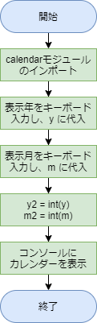
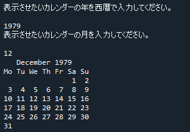

# 解答例と解説：カレンダー

[< 戻る](../)

　

例えば 2020年 7月のカレンダーをコンソールに表示させたい場合、以下のようにコードを書きます。
この際、赤字で示した数値（2020と7）は整数である必要があります。

```python
import calendar
print(calendar.month( 2020 , 7 ))
```

　

また、キーボードから入力された文字列を取得するためには入力命令を用います。
以下の例ではキーボードで入力した文字列を変数 year に代入しています。

```python
year = input()
```

　

ただし、year に「2020」と代入しても、あくまでも「文字列」ですので数値として扱うことができません。
したがって、文字列（str型）から整数値（int型）に変換してあげる必要があります。
year を整数値に変換するには以下のように記述します。

```python
year2 = int(year)
```


これらを頭に置きつつ、まずは簡単でよいのでフローチャートを考えてみましょう。
今回は条件分岐も繰り返しもないため、上から順に一本道のフローチャートになりました。





以上をコードにしてみると、例えば以下のように書くことができます。

```python
import calendar                                          # calendarモジュールをインポート
print("表示させたいカレンダーの年を西暦で入力してください。")
y = input()                                              # 入力した文字列を y に代入
print("表示させたいカレンダーの月を入力してください。")
m = input()                                              # 入力した文字列を m に代入
y2 = int(y)                                              # y は文字列（str型）なので整数値（int型）に変換し、y2 に代入
m2 = int(m)                                              # m は文字列（str型）なので整数値（int型）に変換し、m2 に代入
print(calendar.month(y2, m2))                            # カレンダーをコンソールに表示
```



　

[< 戻る](../)