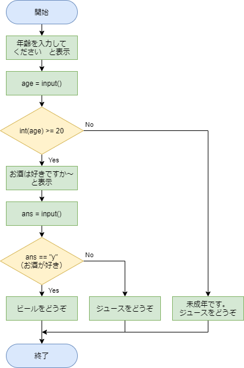

# 解答例と解説：ドリンクの提供

[< 戻る](../)

　

このコードも問題１、問題２と同様に「変数の型の変換」と「条件分岐」を用いることで比較的簡単に書くことができそうです。
早速フローチャートを考えてみましょう。



　

条件分岐の if文は2か所出てきます。最初の if文では20歳以上か未満かを判断するため、変数の型変換が必要ですが、2つ目の if文では文字列のままで判断しています。

以上をコードにしてみると、例えば以下のように書くことができます。

```python
print("あなたの年齢を入力してください。")
age = input()                                              # キーボードからの入力を age に代入
if int(age) >= 20:                                         # ageを整数値に変換すると同時に20以上かどうかをチェック
    print("お酒は好きですか？")  
    print("はいなら「y」、いいえなら「n」を入力してください。")
    ans = input()                                          # キーボードからの入力を ans に代入
    if ans == "y":                                         # ans に代入された文字列が y ならば…
        print("ビールをどうぞ。")                            #  ビールを提供
    else:                                                  # y じゃない文字列が代入されていたら…
        print("ジュースをどうぞ。")                          #  ジュースを提供
else:                                                      # 20歳未満の場合は…
    print("未成年です。ジュースをどうぞ。")                    #  ジュースを提供
```

　

最初の if文（赤字の部分）では、変数 age を整数値に変換すると同時に 20以上かどうかを判断しています。
この書き方が分かりづらい場合は以下のように整数値に変換したものを一度変数に代入してから if文で判断させても大丈夫です。

```python
age2 = int(age)
if age2 >= 20:
```

　

また、この解答例では2つ目の if文（青字の部分）で 「はい（y）」が入力されたか、そうでないか を判断しています。
つまり、「いいえ（n）」が入力されたかどうかは判断していないため、たとえば「a」を入力しても else: の処理に進み、「ジュースをどうぞ。」になってしまいます。

「y」か「n」を入力しない限り次に進めないようにするには、入力命令を無限ループの中に入れてしまって、ans の値が「y」か「n」の場合にループを脱出（break）してあげるとよさそうです。

その場合のコードの例を[こちら](../ans3_2/)に示しましたので、より発展させたい方は見ておいてください。

　

[< 戻る](../)