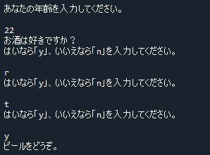

# 解答例：ドリンクの提供　発展

[< 戻る](../ans3/)

　

「お酒は好きですか？」の問いかけに対し、「はい（y）」もしくは「いいえ（n）」を入力しない限り、ずっと答えを求め続けるコードの例です。

```python
print("あなたの年齢を入力してください。")
age = input()                                                    # キーボードからの入力を age に代入
                                                                 #  
if int(age) >= 20:                                               # ageを整数値に変換と同時に20以上かをチェック
    print("お酒は好きですか？")
    while True:                                                  # while文による無限ループ
        print("はいなら「y」、いいえなら「n」を入力してください。")
        ans = input()                                            # キーボードからの入力を ans に代入
        if ans == "y":                                           # ans に代入された文字列が y ならば…
            print("ビールをどうぞ。")                              #  ビールを提供
            break                                                #  無限ループを脱出
        if ans == "n":                                           # ans に代入された文字列が n ならば…
            print("ジュースをどうぞ。")                            #  ジュースを提供
            break                                                #  無限ループを脱出
else:                                                            # 20歳未満の場合は…
    print("未成年です。ジュースをどうぞ。")                          #  ジュースを提供
```




　

[< 戻る](../ans3/)