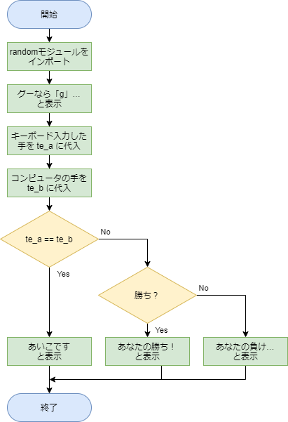
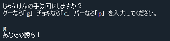
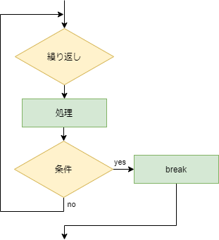
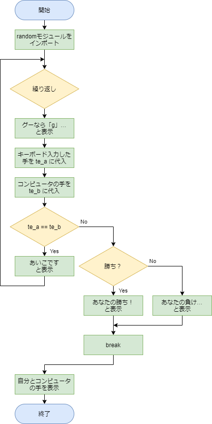
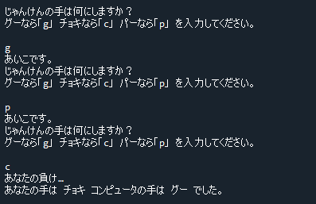

# 解答例と解説：じゃんけんゲーム

[< 戻る](../)

　

じゃんけんの手の組み合わせは次のようになります。
自分の手はキーボードから入力し、相手の手はランダムに決めるようにします。
キーボードからの入力ですが、今回は「グーなら g」「チョキなら c」「パーなら p」を入力するようにしてみましょう。

|        | 自分の手         | 相手の手         |
| ------ | ---------------- | ---------------- |
| 勝ち   | グー チョキ パー | チョキ パー グー |
| 負け   | グー チョキ パー | パー グー チョキ |
| あいこ | グー チョキ パー | グー チョキ パー |

　

この問題もいかに条件分岐を使えばよい、ということはピンと来ると思います。ただし手の組み合わせが９通りもあるので、全ての場合に対応させる必要があります。

　

まずはじゃんけんの結果が「勝ち」「負け」「あいこ」のいづれでもゲームが終了するフローチャートを考えてみます。
2つ目の条件分岐のブロックで勝ち負けの判断をしています。

（このフローチャートでは簡単のため、一つのひし形ブロックで表現していますが、本当なら勝ちか負けの組み合わせは６通りあるため、ひし形ブロックも６つ必要になります。）



　

以上をコードにしてみると、例えば以下のように書くことができます。

```python
import random                                                      # randomモジュールをインポート

print("じゃんけんの手は何にしますか？")                                #  
print("グーなら「g」 チョキなら「c」 パーなら「p」を入力してください。")   #  
te_a = input()                                                     # 入力した文字列を te_a に代入
te_b = random.choice(["g", "c", "p"])                              # 相手の手をランダムに選び、te_b に代入

if te_a == te_b:                                                   # te_a と te_b が同じ場合は…
    print("あいこです。")                                            #  あいこです。
else:                                                              # そうではなくて…
    if te_a == "g" and te_b =="c":                                 # 自分：グー 相手：チョキ ならば…
        print("あなたの勝ち！")                                      #  あなたの勝ち！
    if te_a == "g" and te_b == "p":                                # 自分：グー 相手：パー ならば…
        print("あなたの負け…")                                       #  あなたの負け…
    if te_a == "c" and te_b =="p":                                 # 自分：チョキ 相手：パー ならば…
        print("あなたの勝ち！")                                      #  あなたの勝ち！
    if te_a == "c" and te_b == "g":                                # 自分：チョキ 相手：グー ならば…
        print("あなたの負け…")                                      #  あなたの負け…
    if te_a == "p" and te_b =="g":                                 # 自分：パー 相手：グー ならば…
        print("あなたの勝ち！")                                      #  あなたの勝ち！
    if te_a == "p" and te_b == "c":                                # 自分：パー 相手：チョキ ならば…
        print("あなたの負け…")                                       #  あなたの負け…
```



　

---

このコードを元にして、あいこの場合はもう一度手を出し合い、ちゃんと勝敗が付くじゃんけんゲームに修正してみましょう。また、最後に自分の手とコンピュータのが何であったかを表示させるようにしてみます。

仮にずーっとあいこが続いた場合は何度も繰り返し手を出し合うことになります。
何度繰り返すか分からない ため、while を用いた繰り返しを使うのがよさそうです。
早速フローチャートを考えてみましょう。

　

whileによる無限ループのフローチャート：



　

最初のフローチャートと、while無限ループのものの組み合わせ：



　

最初のフローチャートと whileによる無限ループのフローチャートを組み合わせて、例えばこのようなフローチャートが書けるのではと思います。最後には「自分とコンピュータの手を表示」のブロックも書いてみました。


以上をコードにしてみると、例えば以下のように書くことができます。

```python
import random                                                        # randomモジュールをインポート

while True:                                                          # whileによる無限ループ
    print("じゃんけんの手は何にしますか？")                              #  
    print("グーなら「g」 チョキなら「c」 パーなら「p」を入力してください。") #  
    te_a = input()                                                   # 入力した文字列を te_a に代入
    te_b = random.choice(["g", "c", "p"])                            # 相手の手をランダムに選び、te_b に代入
                                                                     #  
    if te_a == te_b:                                                 # te_a と te_b が同じ場合は…
        print("あいこです。")                                          #  あいこです。
    else:                                                            # そうではなくて…
        if te_a == "g" and te_b =="c":                               #  自分：グー 相手：チョキ ならば…
            print("あなたの勝ち！")                                    #   あなたの勝ち！
        if te_a == "g" and te_b == "p":                              #  自分：グー 相手：パー ならば…
            print("あなたの負け…")                                     #   あなたの負け…
        if te_a == "c" and te_b =="p":                               #  自分：チョキ 相手：パー ならば…
            print("あなたの勝ち！")                                    #   あなたの勝ち！
        if te_a == "c" and te_b == "g":                              #  自分：チョキ 相手：グー ならば…
            print("あなたの負け…")                                     #   あなたの負け…
        if te_a == "p" and te_b =="g":                               #  自分：パー 相手：グー ならば…
            print("あなたの勝ち！")                                    #   あなたの勝ち！
        if te_a == "p" and te_b == "c":                              #  自分：パー 相手：チョキ ならば…
            print("あなたの負け…")                                     #   あなたの負け…
        break                                                        #  ループ脱出！
                                                                     #  
te_a2 = "グー"                                                        # te_a2にとりあえず「グー」の文字列を代入
if te_a == "c":                                                      # もし te_a が「c」ならば…
    te_a2 = "チョキ"                                                  #  te_a2 に「チョキ」を代入
if te_a == "p":                                                      # もし te_a が「p」ならば…
    te_a2 = "パー"                                                    #  te_a2 に「パー」を代入
                                                                     #  
te_b2 = "グー"                                                        # te_b2にとりあえず「グー」の文字列を代入
if te_b == "c":                                                      # もし te_b が「c」ならば…
    te_b2 = "チョキ"                                                  #  te_b2 に「チョキ」を代入
if te_b == "p":                                                       # もし te_b が「p」ならば…
    te_b2 = "パー"                                                    #  te_b2 に「パー」を代入
                                                                      #  
print("あなたの手は", te_a2, "コンピュータの手は", te_b2, "でした。")      # 自分とコンピュータの手を表示
```



　

[< 戻る](../)