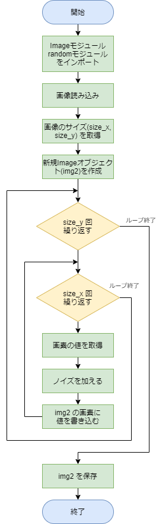
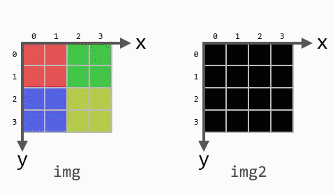

# 解答例と解説：ノイズを加える

[< 戻る](../)

　

やってみよう画像処理３の例題「RGBの入れ替え」や、第６回テキストの例題「カラー画像のネガポジ反転」において、「2重ループを使って読み込んだ画像の各画素の値に変更を加える」、ということをやりました。

この問題はそれらのコードを少しだけ変更することで解けます。
ポイントとなるのは「どのようにしてノイズを加えるか」ですが、これは問題文に書いた通り 各画素のRGBの値それぞれに、ランダムに発生させた整数値を足したり引いたりすればOKですので、それほど難しくはないですね！

　

これらを頭に置きつつ、簡単なフローチャートを考えてみましょう。



　

以上をコードにしてみると、例えば以下のように書くことができます。

```python
from PIL import Image                                 # Pillow の Imageモジュールをインポート
import random                                         # randomモジュールをインポート
                                                      #  
img = Image.open("photoSample_01.jpg")                # 画像を Imageオブジェクトとして読み込む
size_x = img.width                                    # 読み込んだ画像の横方向の画素数を変数 size_x に代入
size_y = img.height                                   # 読み込んだ画像の縦方向の画素数を変数 size_y に代入
img2 = Image.new('RGB',(size_x, size_y))              # 元画像と同じサイズの Imageオブジェクトを作成
                                                      #  
for y in range(size_y):                               # 2重ループ
    for x in range(size_x):                           #  
        pixel_col = img.getpixel((x, y))              # 座標(x, y)の画素の値を読み取る カラーなので RGBの3色
        r = pixel_col[0] + random.randint( -30 , 30 ) # 読み取った値（赤成分）にノイズを加えたものを r に代入
        g = pixel_col[1] + random.randint( -30 , 30 ) # 読み取った値（緑成分）にノイズを加えたものを g に代入
        b = pixel_col[2] + random.randint( -30 , 30 ) # 読み取った値（青成分）にノイズを加えたものを b に代入
                                                      #  
        img2.putpixel((x, y), (r, g, b))              # 先ほど作成したimg2の(x, y)座標に値を書き込む
                                                      #  
img2.save("photoSample_01_noise.png")                 # 保存
```

　

2重ループの中では `getpixel()` という命令で元画像（`img`）の画素の値を読み取り、ノイズを加えて、img2 に `putpixel()` という命令で書き込む、ということを繰り返しています。

以下の図はノイズを加える一連の処理をアニメーションで表したものになります。アニメーション内の画像サイズは 4×4 ととても小さいですが、何万画素、何十万画素もある画像でもコンピュータなら一瞬で終えることができます。



　

保存された画像：


コード内の数値を調節することで、加えるノイズの強さを調節できます。
例えばもっと強くノイズを掛けたい場合は「 random.randint( -100 , 100 )」のように、発生するランダムな数値の範囲を広げてあげるとよいでしょう。

　

[< 戻る](../)