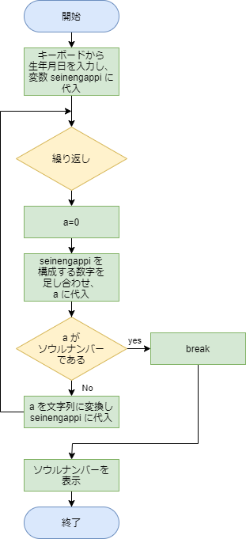

# 解答例と解説：ソウルナンバー

[< 戻る](../)

　

練習問題に出てきたAさんの場合、まずは生年月日 1980324 を分解して足し合わせる、ということをする必要があります。
その場合、以下のようなコードで実現できるのでした。

```python
seinengappi = "1980324" # 生年月日を文字列（str型）として変数に代入
a = 0                   # 足し合わせた結果をこの変数 a に入れる
for i in seinengappi:   # 変数「seinengappi」に代入された文字列を1つずつ取り出して変数「i」に入れる
    a += int(i)         # 「i」は文字列（str型）なので、int型に変換し、a に足し合わせていく
print(a)                # a を表示させて、ちゃんと 1 + 9 + 8 + 0 + 3 + 2 + 4 = 27 になっているか確認
```

これについて、もう一度順を追って見ていこうと思います。

　


まず、str型の変数に生年月日を文字列として代入しておきます。
また、足し合わせた数を代入しておく変数（int型）を用意し、0を代入しておきます。
（上記コードの1行目と2行目)

　

そして上記コードの赤字の部分では以下のような処理が行われています。


1回目のループ


2回目のループ


3回目のループ．．．

　

．．．


最後のループ

　

これで、生年月日を構成する数字をバラバラに分解して足し合わせる、ということができました。
ではこの足し合わせた数値（変数 a ）がソウルナンバーかどうかを確かめてみましょう。

```python
seinengappi = "1980324"
a = 0
for i in seinengappi:
    a += int(i)
print(a)
if a < 10 or a==11 or a==22 or a==33 or a==44: # もし a がソウルナンバー（1～9, 11, 22, 33, 44）ならば…
    print("ソウルナンバーです。")                #  「ソウルナンバーです。」とコンソールに表示
else:                                          # a がソウルナンバーじゃないならば…
    print("ソウルナンバーではありません。")       #  「ソウルナンバーではありません。」とコンソールに表示
```

if ... else ...の部分で aがソウルナンバーかどうかを判断し、結果を表示しています。
この例の場合は a の値は 27 になるので「ソウルナンバーではありません。」と表示されますね。

　

さて、a の値がソウルナンバーになっていたらそこで計算終了なのですが、そうじゃないならばもう一度 a を構成する数字をバラバラに分解して足し合わせる必要があります。
そのためには以下のようにしてあげるとよさそうです。


　

以上を頭に置きながら、次のようなフローチャートを考えてみました。
（変数 `seinengappi` を構成する数字を足し合わせるところは、簡単のため1つのブロックにまとめて書いてあります。）



このフローチャートを見ながらコードを書いてみると、例えば以下のように書くことが出来ます。

```python
print("あなたの生年月日の年を西暦で入力してください。")
y = input()
print("あなたの生年月日の月を入力してください。")
m = input()
print("あなたの生年月日の日を入力してください。")
d = input()

seinengappi = y + m + d

while True:                                        # while を用いて無限ループにしておく
    a = 0                                          #  
    for i in seinengappi:                          # seinengappi を構成する数字を a に足し合わせていく
        a += int(i)                                #  
    if a < 10 or a==11 or a==22 or a==33 or a==44: # a がソウルナンバーになっていたら…
        break                                      #  無限ループから脱出
    seinengappi = str(a)                           # a を文字列に変換し、seinengappi に代入
                                                   #  
print("あなたのソウルナンバーは…", a)                 # 無限ループ脱出後にソウルナンバーを表示
```

　

このコードでは生年月日の入力を「年」「月」「日」に分けてあります。
コードにしてみると意外と短く書くことができますね！

　

[< 戻る](../)