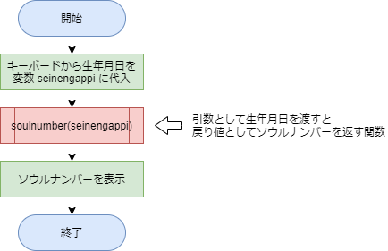

# 第９回の課題

[< 戻る](../)


## 課題１

練習問題にある、問題２「ガチャシステム」を作ってください。

コードが完成したら、実行出来ることを確認し、ちゃんと動作したら、**コード（コピー＆ペーストでOKです）と、Spyderで実行した画面のスナップショットの両方を、課題に添付されているパワーポイントに貼り付けてください。**


## 課題２


練習問題の、問題７「ソウルナンバー（チャレンジ問題）」の解答例は以下のようになっています。

```python
print("あなたの生年月日の年を西暦で入力してください。")
y = input()
print("あなたの生年月日の月を入力してください。")
m = input()
print("あなたの生年月日の日を入力してください。")
d = input()
seinengappi = y + m + d

while True:
    a = 0
    for i in seinengappi:
        a += int(i)
    if a < 10 or a==11 or a==22 or a==33 or a==44:
        break
    seinengappi = str(a)

print("あなたのソウルナンバーは…", a)
```

このコードでソウルナンバーを求めているのは、`while True:`からの７行です。

この部分を関数にしたいと思います。**引数として生年月日（上記コードの `seinengappi`）を渡すと戻り値としてソウルナンバーが返ってくる関数**を作成してください。

関数ができたら、以下のフローチャートのように、コンソールにソウルナンバーが表示されるようにしてみましょう。



コードが完成したら、実行出来ることを確認し、ちゃんと動作したら、**コード（コピー＆ペーストでOKです）と、Spyderで実行した画面のスナップショットの両方を、課題に添付されているパワーポイントに貼り付けてください。**

　

[< 戻る](../)