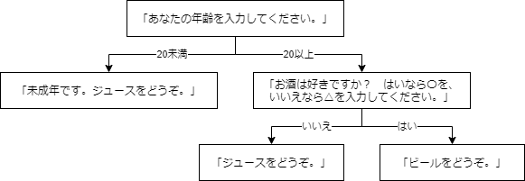

# 練習問題

[< 戻る](../)

　

本授業で習得してほしい項目は「変数」「順次処理」「条件分岐」「繰り返し」「関数」の５つでしたが、前回まででその全てを学習しました。いかがでしたでしょうか？
プログラミングに初めて触れた方には、おそらく「繰り返し」の辺りから頭がこんがらがって来たのではと思います。


そこで、今回は今までの復習をかねた練習問題（主に条件分岐と繰り返し）をいくつかやってみようと思います。
まずはこの「問題編」をやってみてください。

後ほど「解答編」をアップしますので、そちらで答え合わせをしてみましょう。
また、この練習問題のうち、どれか２問を第９回の課題とします。


## 問題１：カレンダー

例えば 2020年 7月のカレンダーをコンソールに表示させたい場合、以下のようにコードを書きます。

```python
import calendar                 # calendarモジュールをインポート
print(calendar.month(2020, 7))  # 2020年 7月のカレンダーを print() でコンソールに出力
```


それでは、以下のような動作をするコードはどう記述できるでしょうか？

- 年（西暦）と月をキーボードから入力
- 入力した年月のカレンダーをコンソールに表示

簡単でよいのでフローチャートを考え、コードを作成してください。


## 問題２：ガチャシステム

スマホゲームによくあるガチャシステムを作ってみましょう。
ガチャでゲットできるキャラクターは「"キャラA", "キャラB", "キャラC", "レアキャラ", "激レアキャラ"」の5人とします。
これら５人のキャラクターはあらかじめ以下のようにリストに入れておきます。

```python
characters = ["キャラA", "キャラB", "キャラC", "レアキャラ", "激レアキャラ"]
```

また、各キャラクターの当たる確率は以下とします。

|            | キャラA | キャラB | キャラC | レアキャラ | 激レアキャラ |
| ---------- | ------- | ------- | ------- | ---------- | ------------ |
| 当たる確率 | 30%     | 30%     | 30%     | 9%         | 1%           |

実行するたびに「〇〇〇をゲットしました！」と表示されるコードを作成してください。


## 問題３：ドリンクの提供

とあるロボット飲食店の受け答えシステムのコードを作成しましょう。


以下のようにまず年齢を確認してからジュースを提供するかビールを提供するかの判断を行います。
`input()` による入力と、if文を用いてコードを作成してください。




## 問題４：じゃんけんゲーム

コンピュータ相手にじゃんけんゲームが出来るコードを作成しようと思います。

自分のじゃんけんの手はキーボードから入力し、相手（コンピュータ）の手はランダムに決めます。


以下のコードでは自分のじゃんけんの手とコンピュータの手を決定し、その２つが同じであった場合に「あいこです。」と表示します。
このコードに加筆し、じゃんけんゲームのコードを完成させてください。

じゃんけんは「あいこ」が出るともう一度対戦するものですが、まずは「勝ち」「負け」「あいこ」のどれになっても終了するコードを作成してみてください。

そのコードができたら、あいこの場合はもう一度手を出し合い、ちゃんと勝敗が付くコードに変更してみましょう。 また、最後に自分とコンピュータの手が何であったかを表示させてみましょう。

```python
import random                           # random モジュールをインポート

print ("じゃんけんの手は何にしますか？\nグーなら「g」チョキなら「c」パーなら「p」を入力してください。")
te_a = input()                          # 自分のじゃんけんの手
te_b = random.choice(["g", "c", "p"])   # 相手のじゃんけんの手

if te_a == te_b:                        # 手が同じならば…
    print("あいこです。")                #  あいこです。と表示

```


## 問題５：無限じゃんけんゲーム

以下の繰り返しのコードは、「e」を入力しない限りは延々と繰り返し続けるものです。

```python
while True:
    print ("ループを抜ける場合は「e」 続ける場合はその他のキーを押してください。")
    if input() == "e":   # 「e」が入力されたならば…
        break            # ループを抜ける
```

先ほどの問題４で作成したじゃんけんゲームのコードとこの無限ループを組み合わせ、「e」を入力しないと延々とじゃんけんを続けるコードを作成してください。
その際、何勝、何敗、何引き分け、かをカウントし、ゲーム終了時に結果を表示させるようにしてみましょう。


## 問題６：ノイズを加える

[やってみよう画像処理３の例題「RGBの入れ替え」](../../04/try3)や、[第７回テキストの例題「カラー画像のネガポジ反転」](../../07/for)では、2重ループを使って読み込んだ画像の各画素の値に変更を加える、ということをやりました。

これらのコードを参考に、画像にノイズを加えるコードを作成してください。ノイズを加えるには各画素のRGBの値それぞれに、ランダムに発生させた整数値を足します（もしくは引きます）。


## 問題７：ソウルナンバー（チャレンジ問題）

占い好きの方は知っているかも知れませんが、「ソウルナンバー」や「運命数」と呼ばれる数値があります。生年月日から算出される数値で、その数値で性格などを占えるとか…

ソウルナンバーは１～９の数値です。また、11、22、33、44 のぞろ目もソウルナンバーとなります。全部で13種類ですね！

| ソウルナンバー | 特徴                             |
| -------------- | -------------------------------- |
| 1              | 明朗快活で才能と強運の持ち主     |
| 2              | 冷静沈着で頭の回転が速いキレ者   |
| 3              | 面倒見がよく、クリエイティブ     |
| 4              | 働き者でクールなリーダータイプ   |
| 5              | 落ち着いた堅実なタイプ           |
| 6              | 愛情深く、ユーモアあふれる社交的 |
| 7              | 感受性が強く、パワフル           |
| 8              | 純粋で一途、几帳面               |
| 9              | 寂しがり屋な圧倒的天才肌の持ち主 |
| 11             | 鋭い直感と感受性と強運           |
| 22             | 人類を導くリーダー               |
| 33             | 人々を魅了するカリスマ性         |
| 44             | 頭脳明晰で問題解決のプロ         |

参考：https://easier.jp/soulnumber/

　

いくつかの例を見ながらソウルナンバーの算出方法を理解してみましょう。

#### Aさん（1980年3月24日生まれ）

まず、生年月日のそれぞれの数字を一つ一つ分解し、全て足し合わせます。
`1 + 9 + 8 + 0 + 3 + 2 + 4 = 27`
この 27 をさらに分解し、足し合わせます。
`2 + 7 = 9`
Aさんのソウルナンバーは「9」


#### Bさん（1999年12月26日生まれ）

まず、生年月日のそれぞれの数字を一つ一つ分解し、全て足し合わせます。
`1 + 9 + 9 + 9 + 1 + 2 + 2 + 6 = 39`
この 39 をさらに分解し、足し合わせます。
`3 + 9 = 12`
12はソウルナンバーではないので、さらに分解して足し合わせます。
`1 + 2 = 3`
Bさんのソウルナンバーは「3」


#### Cさん（1997年9月27日生まれ）

まず、生年月日のそれぞれの数字を一つ一つ分解し、全て足し合わせます。
`1 + 9 + 9 + 7 + 9 + 2 + 7 = 44`
44 はぞろ目なので計算はここでおしまいです。
Cさんのソウルナンバーは「44」

　

このように、生年月日を構成する数字を分解して足し合わせ、さらにその数を分解して足し合わせ、ということを、ソウルナンバー（1～9、11、22、33、44）になるまで繰り返します。

このソウルナンバーを求めるコードを作成しようと思います。

ここで例えばAさんの場合、生年月日 1980324 を分解して足し合わせる、ということをする必要があります。
その場合、以下のようなコードで実現できます。

```python
seinengappi = "1980324"  # 生年月日を文字列（str型）として変数に代入
a = 0                    # 足し合わせた結果をこの変数 a に入れる
for i in seinengappi:    # 変数「seinengappi」に代入された文字列を1つずつ取り出して変数「i」に入れる
    a += int(i)          # 「i」は文字列（str型）なので、int型に変換し、a に足し合わせていく
print(a)                 # a を表示させて、ちゃんと 1 + 9 + 8 + 0 + 3 + 2 + 4 = 27 になっているか確認
```

forの部分で `1 + 9 + 8 + 0 + 3 + 2 + 4` を行っています。
この時、変数 `seinengappi` は文字列（str型）であることに注意しておきましょう。

以上をヒントに、生年月日をキーボード入力するとソウルナンバーを表示するコードを作成してみましょう！


　

　

いかがでしたでしょうか？
問４～問７は少し難しかったのではと思います。特に問７は簡単そうに思えるのに「あれ？？」ってなっちゃったのではないでしょうか。
これらの練習問題ができるようになれば、プログラミングの初級としては十分です。他のプログラミング言語を使う際も十分に役に立つはずです。

今すぐにスラスラ解くのは難しいと思いますが、少しずつ慣れていけるよう、一つ一つをしっかり理解するようにしましょう。
「よく分からん！」というところがあったらチャットなりで連絡ください。

解答編は 6/12 にアップ予定です。

　

[< 戻る](../)

