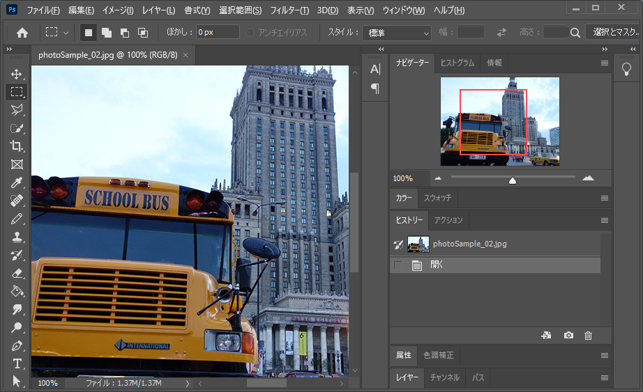
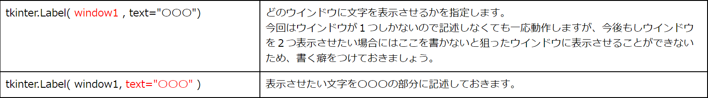
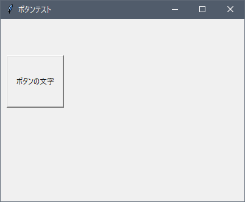

# GUI１

[< 戻る](../)

　

前回の授業までで、本授業で習得してほしい５つの項目（「変数」「順次処理」「条件分岐」「繰り返し」「関数」）は全て学習しました。これら5つの項目は、Python以外のプログラミング言語でも必ず出てきますので、今後 Python やその他の言語を扱う際に役に立つはずです。

さて、この授業も残すところあと数回となりました。 今まではコードをSpyderのエディタに記述し、実行するとコンソールに何か表示される、といったものが多かったのですが、今回と次回くらいでもう少しちゃんとしたソフトウェア開発っぽい雰囲気を味わってみようと思います。


## GUIってなあに？

Spyder での Pythonのプログラミングでは、エディタにコードを記述し、実行すると結果がコンソールに表示されたりしました。 このように文字を使ってコンピュータとやり取りをする操作系のことをCUI（キャラクタ・ユーザ・インターフェース）と言います。

一方で私たちの使い慣れているソフトウェアは様々なボタンが配置されていて、どこをどうクリックすればよいか、ということが直感的に分かるように作られています。このような操作系のことをGUI（グラフィカル・ユーザ・インターフェース）と言います。今はほぼ100％のソフトウェアがGUIですね。

CUI（左）とGUI（右）の例：




　

Spyder 自体はアイコンもあってどこをクリックすればよいかなどが分かりやすく出来ているので、GUIということになります。Spyderのエディタ部分とコンソール部分での操作がCUIですね。


## GUIの組み立て方イメージ

GUIを作るには、まずは文字やボタンといった部品を配置するためのウィンドウが必要となります。
そこに「文字」「ボタン」「テキスト入力欄」「スライダー」「キャンバス（絵などを表示する領域）」といった部品を配置していきます。


　

福笑いを思い浮かべると分かりやすいかもしれません。
福笑いは顔の輪郭が書いた紙に顔の部品を配置していきます。GUIの作り方もこういうことです。


　

PythonでGUIを作るにはいくつか方法がありますが、今回は `tkinter` というモジュールを使用します。
早速ウィンドウから作ってみましょう！


## まずはウィンドウを作ってみよう

まずはGUIのベースとなるウィンドウを作ってみましょう。ウィンドウのバーにはタイトル文字を表示させることができますので、こちらも確認しておきましょう。


#### エディタにコードを入力


まず、Spyder の画面左上にある“新規ファイル”アイコンをクリックし、新しい Python ファイルを用意します。


以下のコードを入力し、ファイルを保存アイコンをクリックして保存しましょう。今回は `test10_1.py` という名前で保存してみました。

```python
import tkinter                      # tkinter モジュールをインポート
window1 = tkinter.Tk()              # 「window1」という名前のウィンドウ部品を作成（この時点ではまだ表示されない）
window1.title("ウィンドウテスト")    # ウィンドウのバーに表示させる文字を指定
window1.geometry("400x300")         # ウィンドウのサイズを指定
window1.mainloop()                  # ウィンドウを表示
```


#### 実行


入力したら、画面上部の“ファイルを実行”アイコンをクリックしてみましょう。
次のようなサイズのウィンドウが表示されましたか？


<span style="color:red">ウィンドウが表示されているうちは次のコードを実行できません。<br>ウィンドウが表示されることをを確認したら、×マークをクリックして閉じておきましょう！</span>


#### 解説

GUIの最初なのでしっかり見ていこうと思います。
まず１行目ですが、これは `tkinter`モジュールをインポートしています。この行がないと始まりません。

```python
import tkinter      # tkinter モジュールをインポート
```

　

続いて２行目ですが、分かりづらいのではと思います。

```python
window1 = tkinter.Tk()      # 「window1」という名前のウィンドウ部品を作成（この時点ではまだ表示されない）
```

　

GUIを作るには「部品」を作って配置するのですが、ウィンドウ自体も「部品」です。
部品には必ず「名前」を付ける必要がありますが、ここでは「`window1`」という名前にしています。
（正確には「名前」という表現はおかしいのですが、分かりやすさのために「名前」ということにしています。）
なお、ウィンドウの部品を作成しただけではまだ表示はされません。

　

続いて3行目です。
ここでは先ほど作成したウィンドウのバーに表示させる文字を指定しています。この行はオプションなので、無くてもOKです。

```python
window1.title("ウィンドウテスト")      # ウィンドウのバーに表示させる文字を指定
```

　

続いて4行目です。
ここではウィンドウのサイズを指定しています。400x300 の、「`x`」の部分は小文字のエックスです。この行もオプションなので、無くてもOKです。その場合、小さなウインドウが表示されるはずです。

```python
window1.geometry("400x300")      # ウインドウのサイズを指定
```

　

そして5行目で、ようやくウインドウを画面に表示させます。「メインループ？？」と思うかもしれませんが、とにかく作成したウインドウ「`window1`」を表示させるにはこう表記します。

```python
window1.mainloop()      # ウインドウを表示
```


#### 練習

ウインドウのバーに表示させる文字をいろいろと変更してみましょう。
ウインドウのサイズを変更してみましょう。


## どうしようもなくなったら…

ウインドウが表示されないのに、プログラムが実行されたまま…
実行ボタンを何度クリックしても反応なし…
繰り返し文（while文など）が無限ループになってしまい、どうにも止められない…

といったことが時々起こると思います。これはコードのどこかにミスがあるために起こる場合がほとんどです。
そういう時はカーネル（プログラムの実行環境）を再起動しちゃいましょう。

コンソールタブの右端に三本線アイコンがあるので、クリックします。
すると表示されるメニューの中に「カーネルの再起動」という項目があるので、クリックすればカーネルが再起動し、再びコードを実行できるようになります。ただし、再び実行する前にミスがないかちゃんとチェックしましょう。


## ウインドウの中に文字を表示してみよう

ウインドウの中に文字を表示させるには、文字の部品（ラベル）を作成し、配置していきます。


#### エディタにコードを入力


まず、Spyder の画面左上にある“新規ファイル”アイコンをクリックし、新しい Python ファイルを用意します。


以下のコードを入力し、ファイルを保存アイコンをクリックして保存しましょう。今回は `test10_2.py` という名前で保存してみました。

```python
import tkinter                                                        # tkinter モジュールをインポート
window1 = tkinter.Tk()                                                # ウインドウオブジェクトを作成
window1.title("ラベルテスト")                                           # ウインドウのバーに表示させる文字を指定
window1.geometry("400x300")                                           # ウインドウのサイズを指定

label1 = tkinter.Label(window1, text="ここに表示したい文字を書きます。")  # 文字の部品を作成 名前は「label1」
label1.place(x=200, y=100)                                            # 作成した文字の部品をウインドウ内に配置

window1.mainloop()                                                    # ウインドウを表示
```


#### 実行


入力したら、画面上部の“ファイルを実行”アイコンをクリックしてみましょう。


このようなウィンドウが表示されましたか？


#### 解説

1つ目の例題でウインドウのみを作成してみましたが、今回の例題ではウインドウを表示させるコードの間に、文字部品を作成・配置するコードが挟まっている点に注目してください。

まず、以下のコードで「`label1`」という名前の文字部品を作成しています。

```python
label1 = tkinter.Label(window1, text="ここに表示したい文字を書きます。")      # 文字の部品を作成 名前は「label1」
```

　

文字部品の作成には `tkinter.Label()` という命令を使います。
() の中にいろいろ書いてありますが、以下のような意味になります。



　


そして以下のコードの `place()` という命令で、「`label1`」をウインドウ内に配置しています。

```python
label1.place(x=200, y=100)      # 作成した文字の部品を配置
```

() 内で表示位置を指定しています。今の例の場合、「ウインドウの左上から 横方向に200ピクセル、縦方向に100ピクセル の位置にlabel1 を表示しなさい」ということになります。


　

全ての部品を配置し終わってから、以下の命令でウインドウを表示していることにも注目しておいてください。

```python
window1.mainloop()      # ウインドウを表示
```

ウインドウを表示させた後に文字部品を作成しても、それは表示されません。あくまでも以下の順で記述する必要があります。

`ウインドウを作成 → ウインドウ内に表示させる部品を作成・配置 → ウインドウを表示`


#### 練習

表示させる文字をいろいろ変えてみましょう。
文字の位置を変更してみましょう。

ウインドウ内には文字を複数表示することができます。３つの文字部品を作成し、重ならないように配置してみましょう。

<details class="md-text"><summary><u>→解答例を表示</u></summary><blockquote><span>文字部品はいくつでも表示できますが、同じ座標に配置してしまうと重なってしまって、一つしか見えなくなってしまいます。
複数の文字部品を表示させたい場合は必ず重ならないように配置しましょう。
また、それぞれの文字部品の名前はバラバラになるようにしてください。コピペで増やすと名前の変更を忘れがちなので注意です。
<br><pre><code class="python">import tkinter                                    # tkinterモジュールをインポート
window1 = tkinter.Tk()                            # ウインドウの部品を作成 名前は「window1」
window1.title("３つのラベルテスト")                 # ウインドウのバーの文字を指定
window1.geometry("400x300")                       # ウインドウのサイズを指定
                                                  #  
label1 = tkinter.Label(window1, text="織田信長")   # 文字の部品を作成 名前は「label1」
label1.place(x=200, y=230)                        # 作成したラベルの部品をウインドウ内に配置
                                                  #  
label2 = tkinter.Label(window1, text="豊臣秀吉")   # 文字の部品を作成 名前は「label2」
label2.place(x=20, y=150)                         # 作成したラベルの部品をウインドウ内に配置
                                                  #  
label3 = tkinter.Label(window1, text="徳川家康")   # 文字の部品を作成 名前は「label2」
label3.place(x=300, y=60)                         # 作成したラベルの部品をウインドウ内に配置
                                                  #  
window1.mainloop()                                # ウインドウを表示</code></pre>
<br>[](#)
（この配置に意味はない…）
<hr></span></blockquote></details>


## ボタンを表示してみよう

ウインドウの中にボタンを表示させるには、ボタンの部品を作成し、配置していきます。


#### エディタにコードを入力


まず、Spyder の画面左上にある“新規ファイル”アイコンをクリックし、新しい Python ファイルを用意します。


以下のコードを入力し、ファイルを保存アイコンをクリックして保存しましょう。今回は `test10_3.py` という名前で保存してみました。

```python
import tkinter                                                        # tkinter モジュールをインポート
window1 = tkinter.Tk()                                                # ウインドウオブジェクトを作成
window1.title("ボタンテスト")                                           # ウインドウのバーに表示させる文字を指定
window1.geometry("400x300")                                           # ウインドウのサイズを指定
                                                                      #  
bu1 = tkinter.Button(window1, text="ボタンの文字", width=12, height=5)  # ボタンの部品を作成
bu1.place(x=10, y=60)                                                 # 作成したボタンの部品をウインドウ内に配置
                                                                      #  
window1.mainloop()                                                    # ウインドウを表示
```


#### 実行


入力したら、画面上部の“ファイルを実行”アイコンをクリックしてみましょう。


このようなウインドウが表示されましたか？


#### 解説

まず、以下のコードで「`bu1`」という名前のボタン部品を作成しています。

```python
bu1 = tkinter.Button(window1, text="ボタンの文字", width=12, height=5)      # ボタンの部品を作成 名前は「bu1」
```

　

ボタン部品の作成には `tkinter.Button()` という命令を使います。
() の中にオプションがいろいろ書いてありますが、以下のような意味になります。


　

なお、上記の **window1 以外のオプション**については、記述しなくても大丈夫です、その場合はデフォルトの値になります（記述しないと小さなボタンになってしまい、クリックしづらいですが）。


そして、以下のコードで `bu1` をウインドウ内に配置しています。位置の指定方法は文字部品の配置と同じです。

```python
bu1.place(x=10, y=60)      # 作成したボタンの部品をウインドウ内に配置
```


#### 練習

ボタンのサイズを変更してみましょう。
このウインドウに文字を追加してみましょう。


## おみくじツールを作ってみよう

ウインドウの中に文字とボタンを配置することができたので、ボタンをクリックすることで「大吉、吉、中吉、小吉、末吉、凶」のどれかが表示されるおみくじツールを作成してみましょう。


#### エディタにコードを入力


まず、Spyder の画面左上にある“新規ファイル”アイコンをクリックし、新しい Python ファイルを用意します。


以下のコードを入力し、ファイルを保存アイコンをクリックして保存しましょう。今回は `test10_4.py` という名前で保存してみました。

```python
import tkinter                                                      # tkinter モジュールをインポート
import random                                                       # random モジュールをインポート
                                                                    #  
def omikuji():                                                      # 関数を定義
    unsei = random.choice(["大吉","吉","中吉","小吉","末吉","凶"])  #  ランダムに運勢を選び、変数 unsei に代入
    print(unsei)                                                    #  unsei をコンソールに表示
                                                                    #  
window1 = tkinter.Tk()                                              # ウインドウ部品を作成
window1.title("おみくじ")                                           # ウインドウのバーに表示させる文字を指定
window1.geometry("400x200")                                         # ウインドウのサイズを指定
bu1 = tkinter.Button(window1, text="うらなう", command=omikuji)     # ボタンの部品を作成 クリックするとomikuji()を実行
bu1.place(x=10, y=10)                                               # 作成したボタンの部品をウインドウ内に配置
window1.mainloop()                                                  # ウインドウを表示
```


#### 実行


入力したら、画面上部の“ファイルを実行”アイコンをクリックしてみましょう。


このような画面が表示されましたか？

「うらなう」ボタンを何度かクリックしてみましょう。


すると運勢が Spyder のコンソールにこのように表示されるはずです。


#### 解説

`random`モジュールを用いたじゃんけんや占いはこれまでにテキストで何度か出てきましたので、ボタンをクリックすることで占いのコードが実行されるようにしてあげればよさそうです。

そのためには以下のように占いのコードを関数化しておきます（コード内の青表記部分です）。

```python
import random
 
def omikuji():
    unsei = random.choice(["大吉","吉","中吉","小吉","末吉","凶"])
    print(unsei)
```

　

そしてボタン部品作成の際に、クリックすることで上記関数が実行されるように「`command=関数名`」というオプションで指定しておきます。

```python
bu1 = tkinter.Button(window1, text="うらなう", command=omikuji )   # クリックするとomikuji()を実行
```

　

ここで第８回のテキストを思い出してみてください。
関数を実行するには以下のように記述すると学習しました。

```python
omikuji()      # おみくじの関数を実行する。() も書く必要がある。
```

ですので、以下のように表記しがちなのですが、 <font color="red">**これは間違いです**</font>ので気を付けてください。

```python
bu1 = tkinter.Button(window1, text="うらなう", command=omikuji() )   # 間違いです。() は書いてはならない。
```

　

…なんでこんな面倒くさい仕様なんでしょうね～。この仕様のせいで関数に引数を渡すことがそのままではできません。。。


#### コードを修正しよう

先ほどのコードは占いの結果がコンソールに表示されるものでした。
しかしせっかくのGUIですし、ウインドウ内に表示させるようにコードを修正してみましょう。
先ほどのコードを以下のように変更してみてください。

```python
import tkinter
import random
 
def omikuji():
    unsei = random.choice(["大吉","吉","中吉","小吉","末吉","凶"])
    label1["text"] = unsei                                      # 変更箇所。label1 の文字を unsei の値に変更
 
window1 = tkinter.Tk()
window1.title("おみくじ")
window1.geometry("400x200")
label1 = tkinter.Label(window1, text="ここに運勢が表示されます。")  # 変更箇所。文字部品を作成 名前は「label1」
label1.place(x=10,y=30)                                         # 変更箇所。作成した文字部品をウインドウ内に配置
bu1 = tkinter.Button(window1, text="うらなう", command=omikuji)
bu1.place(x=10, y=60 )                                          # 変更箇所。y=10をy=60に。
window1.mainloop()
```


#### 実行


コードを修正したら、画面上部の“ファイルを実行”アイコンをクリックしてみましょう。

ウインドウが表示されるので、「うらなう」ボタンをクリックしてみると、


このように、占いの結果がウインドウ内のラベルに表示されるはずです。


#### 解説

ウインドウ内に表示した文字は、後から変更することができます。
例えば「`label1`」という名前の文字部品がウインドウ内に表示されていたとします。その文字を変更するには以下のように記述します。

```python
label1["text"] = "文字を変更しました。"
```

　

以下はボタンをクリックすると文字が変わるだけのコードです。
Spyder にコピペしてで実行してみましょう。

```python
import tkinter
 
def kansu_test():
    label1["text"] = "文字を変更しました。"
 
window1 = tkinter.Tk()
window1.geometry("400x200")
label1 = tkinter.Label(window1, text="文字変更テスト。")
label1.place(x=10,y=30)
bu1 = tkinter.Button(window1, text="変更！", command=kansu_test)
bu1.place(x=10, y=60 )
window1.mainloop()
```


## 部品の配置方法について

`tkinter` ではウインドウ内に文字やボタンなどの部品を配置する方法がいくつか用意されています。
それらを駆使することで、複雑な見た目も実現できるのですが、まずは簡単な配置方法を２つ覚えてみましょう。


### 配置方法１：place()

`place()` は今まで見てきた例題でも使いましたのでなんとなく分かるかと思います。
`place()` で部品を配置する場合は () の中に「`x=10, y=20`」のようにウインドウ左上からの距離をピクセル数で指定します。
例えば以下のコードでは文字部品「`label1`」とボタン部品「`bu1`」を２つ、`place()` で配置しています。

```python
import tkinter                                           # tkinter モジュールをインポート
                                                         #  
window1 = tkinter.Tk()                                   # ウインドウ部品を作成
window1.geometry("400x200")                              # ウインドウのサイズを指定
                                                         #  
label1 = tkinter.Label(window1, text="ABCDEFG")          # 文字の部品を作成 名前は「label1」
label1.place(x=300, y=100)                               # label1 をウインドウ内に配置
bu1 = tkinter.Button(window1, text="ボタン１", width=10) # ボタンの部品を作成 名前は「bu1」
bu1.place(x=160, y=150)                                  # bu1 をウインドウ内に配置
                                                         #  
window1.mainloop()                                       # ウインドウを表示
```

　

Spyder で実行してみると、次の図のようなウインドウが表示されるはずです。place() は任意の場所に配置できるため、頑張れば複雑な見た目の配置も可能です。


### 配置方法２：pack()

文字部品やボタン部品を縦1列に並べたい場合には `pack()` を使います。
オプション指定することで、「ウインドウの左側に縦1列」「ボタン部品の幅をウインドウの幅に合わせる」といった表示も可能です。また、横1列に並べることも出来ます。


#### 縦1列に並べて表示させるサンプルを３つ紹介：

- ウインドウの中央に縦1列配置

  
  各部品名の後ろに「`.pack()`」と記述することでこのような配置になります。

  ```python
  import tkinter
   
  window1 = tkinter.Tk()
  window1.geometry("300x100")
  label1 = tkinter.Label(window1, text="ABCDEFG")
  label1.pack()
  bu1 = tkinter.Button(window1, text="ボタン１")
  bu1.pack()
  bu2 = tkinter.Button(window1, text="ボタン２")
  bu2.pack()
  window1.mainloop()
  ```

  

- ウインドウの左端に縦1列配置

  
  `pack()` の () の中にオプションとして「`anchor=tkinter.W`」と記述することで、各部品をウインドウの左端に寄せることができます。`W`とは西のことですので、ここを`E`（東の意味）に変えるとウインドウの右端に縦1列配置となります。

  ```python
  import tkinter
   
  window1 = tkinter.Tk()
  window1.geometry("300x100")
  label1 = tkinter.Label(window1, text="ABCDEFG")
  label1.pack( anchor=tkinter.W )
  bu1 = tkinter.Button(window1, text="ボタン１")
  bu1.pack( anchor=tkinter.W )
  bu2 = tkinter.Button(window1, text="ボタン２")
  bu2.pack( anchor=tkinter.W )
  window1.mainloop()
  ```

  

- 部品の幅をウインドウの幅に合わせて縦1列配置

  
  `pack()` の () の中にオプションとして「`fill=tkinter.X`」と記述することで、各部品をウインドウの幅に合わせることができます。

  ```python
  import tkinter
   
  window1 = tkinter.Tk()
  window1.geometry("300x100")
  label1 = tkinter.Label(window1, text="ABCDEFG")
  label1.pack( fill=tkinter.X )
  bu1 = tkinter.Button(window1, text="ボタン１")
  bu1.pack( fill=tkinter.X )
  bu2 = tkinter.Button(window1, text="ボタン２")
  bu2.pack( fill=tkinter.X )
  window1.mainloop()
  ```


#### 横1列に並べて表示させる場合のサンプルを３つ紹介：

- ウインドウの中央に横1列配置

  
  `pack()` の () の中にオプションとして「`side=tkinter.LEFT`」と記述することで、各部品を横並びに配置できます。なお、「`side=tkinter.RIGHT`」と記述すると右端から各部品が並びます。

  ```python
  import tkinter
   
  window1 = tkinter.Tk()
  window1.geometry("300x100")
  label1 = tkinter.Label(window1, text="ABCDEFG")
  label1.pack( side=tkinter.LEFT )
  bu1 = tkinter.Button(window1, text="ボタン１")
  bu1.pack( side=tkinter.LEFT )
  bu2 = tkinter.Button(window1, text="ボタン２")
  bu2.pack( side=tkinter.LEFT )
  window1.mainloop()
  ```

  

- ウインドウの上端に横1列配置

  
  `pack()` の () の中にオプションとして「`side=tkinter.LEFT`」と「`anchor=tkinter.N`」を2つ記述することで、各部品がウインドウの上端に寄った横1列配置が出来ます。`N`とは北のことですので、ここを`S`（南)に変えるとウインドウの下端に横1列配置となります。

  ```python
  import tkinter
   
  window1 = tkinter.Tk()
  window1.geometry("300x100")
  label1 = tkinter.Label(window1, text="ABCDEFG")
  label1.pack( side=tkinter.LEFT, anchor=tkinter.N )
  bu1 = tkinter.Button(window1, text="ボタン１")
  bu1.pack( side=tkinter.LEFT, anchor=tkinter.N )
  bu2 = tkinter.Button(window1, text="ボタン２")
  bu2.pack( side=tkinter.LEFT, anchor=tkinter.N )
  window1.mainloop()
  ```

  

- 部品の幅をウインドウの縦幅に合わせて横1列配置

  
  `pack()` の () の中にオプションとして「`side=tkinter.LEFT`」と「`fill=tkinter.Y`」を2つ記述することで、各部品をウインドウの縦幅に合わせた横1列配置ができます。

  ```python
  import tkinter
   
  window1 = tkinter.Tk()
  window1.geometry("300x100")
  label1 = tkinter.Label(window1, text="ABCDEFG")
  label1.pack( side=tkinter.LEFT, fill=tkinter.Y )
  bu1 = tkinter.Button(window1, text="ボタン１")
  bu1.pack( side=tkinter.LEFT, fill=tkinter.Y )
  bu2 = tkinter.Button(window1, text="ボタン２")
  bu2.pack( side=tkinter.LEFT, fill=tkinter.Y )
  window1.mainloop()
  ```


## テキスト入力欄を表示してみよう

ウインドウの中にテキスト入力欄を表示させるには、テキスト入力欄の部品（エントリー）を作成し、配置していきます。


#### エディタにコードを入力


まず、Spyder の画面左上にある“新規ファイル”アイコンをクリックし、新しい Python ファイルを用意します。


以下のコードを入力し、ファイルを保存アイコンをクリックして保存しましょう。今回は `test10_5.py` という名前で保存してみました。

```python
import tkinter                         # tkinter モジュールをインポート
                                       #  
window1 = tkinter.Tk()                 # ウインドウ部品を作成
window1.title("テキスト入力欄テスト")   # ウインドウのバーに表示させる文字を指定
window1.geometry("400x300")            # ウインドウのサイズを指定
                                       #  
tn1 = tkinter.Entry(window1)           # テキスト入力欄の部品を作成 名前は「tn1」
tn1.place(x=10, y=30)                  # tn1 をウインドウ内に配置
                                       #  
window1.mainloop()                     # ウインドウを表示
```


#### 実行


入力したら、画面上部の“ファイルを実行”アイコンをクリックしてみましょう。


このようなウィンドウが表示されましたか？


#### 解説

まず、以下のコードで「`tn1`」という名前の文字部品を作成しています。
名前は何でもOKです。今回はテキスト（t）と入力欄（n）で `tn1` としてみています。

```python
tn1 = tkinter.Entry(window1)      # テキスト入力欄の部品を作成 名前は「tn1」
```

　

文字部品の作成には `tkinter.Entry()` という命令を使います。
() の中に「`window1`」と書いてありますが、以下のような意味になります。


## 標準体重計算ツール

ウインドウの中に文字とボタンとテキスト入力欄を配置することができたので、テキスト入力欄に身長を入力し、ボタンをクリックすることで標準体重が表示されるツールを作成してみましょう。


#### エディタにコードを入力


まず、Spyder の画面左上にある“新規ファイル”アイコンをクリックし、新しい Python ファイルを用意します。


以下のコードを入力し、ファイルを保存アイコンをクリックして保存しましょう。今回は `test10_6.py` という名前で保存してみました。

```python
import tkinter                                                         # tkinter モジュールをインポート
                                                                       #  
def hyojun():                                                          # 関数を定義
    h = tn1.get()                                                      #  テキスト入力欄に入力された文字列を h に代入
    h2 = float(h)                                                      #  h はstr型なので、float型に変換し、h2 に代入
    h2 = h2/100                                                        #  h2 はcmなので、100で割って mにする
    w = h2*h2*22                                                       #  標準体重を計算
    label2["text"] = "あなたの標準体重は", w, "kgです。"               #  label2 の文字列を書き換える
                                                                       #  
window1 = tkinter.Tk()                                                 # ウインドウ部品を作成
window1.title("標準体重計算ツール")                                    # ウインドウのバーに表示させる文字を指定
window1.geometry("400x300")                                            # ウインドウのサイズを指定
                                                                       #  
label1 = tkinter.Label(window1, text="身長をcmで入力してください。")   # 文字部品を作成 名前は「label1」
label1.place(x=10,y=10)                                                # label1 をウインドウ内に配置
                                                                       #  
tn1 = tkinter.Entry(window1)                                           # テキスト入力欄の部品を作成 名前は「tn1」
tn1.place(x=10, y=40)                                                  # tn1 をウインドウ内に配置
                                                                       #  
label2 = tkinter.Label(window1, text="ここに結果が表示されます。")     # 結果表示用の文字部品を作成 名前は「label2」
label2.place(x=10,y=70)                                                # label2 をウインドウ内に配置
                                                                       #  
bu1 = tkinter.Button(window1, text="標準体重を計算", command=hyojun)   # ボタン部品を作成 クリックするとhyojun()を実行
bu1.place(x=10, y=100)                                                 # 作成したボタン部品「bu1」をウインドウ内に配置
                                                                       #  
window1.mainloop()                                                     # ウインドウを表示
```


#### 実行


入力したら、画面上部の“ファイルを実行”アイコンをクリックしてみましょう。


このようなウインドウが表示されましたか？

テキスト入力欄に身長を入力し、ボタンをクリックしてみましょう。標準体重が表示されれば成功です。


#### 解説

先ほどの例題「おみくじツールを作ってみよう」と同じく、ボタンをクリックすることで標準体重を計算する関数「`hyojun()`」が呼び出されればOKです。


```python
def hyojun():                                             # 関数を定義
    h = tn1.get()                                         # テキスト入力欄に入力された文字列を h に代入
    h2 = float(h)                                         # h はstr型なので、float型に変換し、h2 に代入
    h2 = h2/100                                           # h2 はcmなので、100で割って mにする
    w = h2*h2*22                                          # 標準体重を計算
    label2["text"] = "あなたの標準体重は", w, "kgです。"  # label2 の文字列を書き換える
```

この関数では標準体重を計算するため、身長の情報が必要となります。
これを行っているのが、２行目の `h = tn1.get()` の部分になります。

テキスト入力欄の部品「`tn1`」に「`.get()`」とつなげて記述すると、`tn1` に入力されている文字列が取得できます。これを変数 `h` に代入しています。次の行でそれをfloat型に変換してから、標準体重を計算しています。

そしてこの関数の最後の行では、計算結果を文字部品「`label2`」に表示させています。


## キャンバスを表示してみよう

ウインドウの中には「キャンバス」と呼ばれる部品を配置することができます。
このキャンバスには図形を表示させたり、写真などを表示させたりすることができます。


#### エディタにコードを入力


まず、Spyder の画面左上にある“新規ファイル”アイコンをクリックし、新しい Python ファイルを用意します。


以下のコードを入力し、ファイルを保存アイコンをクリックして保存しましょう。今回は `test10_7.py` という名前で保存してみました。

```python
import tkinter                                                   # tkinter モジュールをインポート
                                                                 #  
window1 = tkinter.Tk()                                           # ウインドウ部品を作成
window1.title("キャンバステスト")                                # ウインドウのバーに表示させる文字を指定
                                                                 #  
cv1 = tkinter.Canvas(window1, width=400, height=200, bg="red")   # キャンバスの部品を作成 名前は「cv1」
cv1.pack()                                                       # cv1 を pack() を使ってウインドウ内に配置
                                                                 #  
window1.mainloop()                                               # ウインドウを表示
```


#### 実行


入力したら、画面上部の“ファイルを実行”アイコンをクリックしてみましょう。


このようなウインドウが表示されましたか？


#### 解説

まず、以下のコードで「`bu1`」という名前のボタン部品を作成しています。

```python
cv1 = tkinter.Canvas(window1, width=400, height=200, bg="red")      # キャンバスの部品を作成 名前は「cv1」
```

キャンバス部品の作成には `tkinter.Canvas()` という命令を使います。
() の中にオプションがいろいろ書いてありますが、以下のような意味になります。


　

そして、以下のコードで cv1 をウインドウ内に配置します。

```python
cv1 = cv1.pack()      #  cv1 を pack() を使ってウインドウ内に配置
```

　

さて、既にお気づきかもしれませんが、今回の例題では今までずっと記述し続けてきた以下の命令がありません。

```python
window1.geometry("400x300")      # ウインドウのサイズを指定
```

　

ウインドウのサイズ指定をしていない状態で、ボタンやキャンバスといった部品を `pack()` を使って配置した場合、ウインドウのサイズが部品のサイズに合わせて自動でフィットしてくれます。
ですので今回はキャンパスのサイズを指定した上で `pack()` で配置しているので、あえてウインドウのサイズは指定しませんでした。


#### コードを修正しよう

先ほどのコードは赤いキャンバスを表示させるだけのものでした。
キャンバスという部品には写真などの画像を表示させることができるので、早速先ほどのコードを修正し、画像を表示させてみましょう。

```python
import tkinter
from PIL import Image, ImageTk              # 変更箇所。PillowのImageモジュールとImageTkモジュールをインポート
 
window1 = tkinter.Tk()
window1.title("画像表示テスト")
 
img = Image.open("photoSample_01.jpg")      # 変更箇所。画像をImageオブジェクトとして読み込む 名前は img
w = img.width                               # 変更箇所。読み込んだ画像の横方向のサイズを取得し、w に代入
h = img.height                              # 変更箇所。読み込んだ画像の縦方向のサイズを取得し、h に代入
 
img_tk = ImageTk.PhotoImage(img)                    # 変更箇所。img をキャンバスに表示できる形式に変換
cv1 = tkinter.Canvas(window1, width=w, height=h)    # 変更箇所。キャンバスの部品を作成 名前は「cv1」
cv1.create_image(0, 0, image=img_tk, anchor="nw")   # 変更箇所。キャンバスに読み込んだ画像を表示
cv1.pack()
 
window1.mainloop()
```


#### 実行


入力したら、画面上部の“ファイルを実行”アイコンをクリックしてみましょう。


このようなウインドウが表示されましたか？


#### 解説

キャンバスには写真などの画像を表示させることができるのですが、そのためには画像ファイルを読み込まなくてはいけません。
やってみよう画像処理では `Pillow` を使ってさんざん画像の読み込みをやってきましたが、キャンバスに表示させる場合もこの読み込み方でOKです。

```python
img = Image.open("photoSample_01.jpg")      # 画像をImageオブジェクトとして読み込む 名前は img
```

　

キャンバスのサイズは画像のサイズと同じにしたいので、画像サイズを取得し、変数「w, h」に代入しておきます。

```python
w = img.width    # 読み込んだ画像の横方向のサイズを取得し、w に代入
h = img.height   # 読み込んだ画像の縦方向のサイズを取得し、h に代入
```

　

Imageオブジェクト「img」はそのままではキャンバスに表示できません。
そこで以下のコードでキャンバスに表示できる形式に変更しておきましょう。

```python
img_tk = ImageTk.PhotoImage(img)   # img をキャンバスに表示できる形式に変換
```

　

次にキャンバス部品を作成します。
サイズは先ほど画像を読み込んだ際に取得しておいた画像サイズと同じにしましょう。

```python
cv1 = tkinter.Canvas(window1, width=w, height=h)   # キャンバスの部品を作成 名前は「cv1」
```

　

先ほど読み込んだ画像をキャンバスに表示できる形式に変換したので、それをキャンバスに表示します。
`create_image()` という命令の () の中には４つの引数が入っていますが、まずは３つ目の引数で表示画像を指定する、ということだけを覚えておけば大丈夫です。

```python
cv1.create_image(0, 0, image=img_tk, anchor="nw")   # キャンバスに読み込んだ画像を表示
```


#### 練習

様々な画像ファイルを読み込んで表示してみましょう。

　

---

今回は tkinterを使った基本的なGUIの作成を行ってみました。
次回はさらに本格的なツールの作成をやってみようと思います。

　

[< 戻る](../)