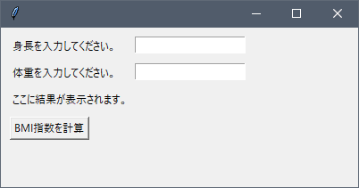
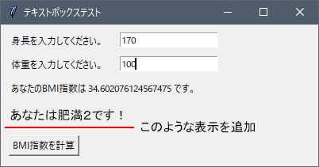

# 第１０回の課題

[< 戻る](../)

　

テキストの例題「標準体重計算ツール」を参考に、BMI計算ツールを作成してください。
テキスト入力欄に身長と体重を入力してボタンをクリックすると、ツールのウインドウ内にBMIの値が表示される、というものです。


BMIの計算方法は次のようになります（今までに何度か出てきましたね！)。

```python
BMI ＝ 体重 (kg) ÷ (身長(m) × 身長(m))
```

　

また、ツールの見た目は以下の図を参考にしてください。
ただし、この図のレイアウトにこだわる必要はありません。他にも何か配置したいものがあれば、自由に配置してください。



　

コードが完成したら、実行出来ることを確認し、

- **コードを、コピー＆ペーストで提出用パワーポイントに貼り付けてください。**
- **上の図と同じように、ツールそのもののスクリーンショットを取って、貼り付けてください。**

　

---

余裕がある人は、以下の機能も追加してみましょう（難しい場合は上の機能だけでOKです）。
BMIの値によって「痩せ、普通、肥満１、肥満２、肥満３、肥満４」の6段階に分類されます。この分類をウインドウ内のどこかに表示します（以下の図を参考にしてください）。



| BMI値             | 判定  |
| ----------------- | ----- |
| 18.5 未満         | 痩せ  |
| 18.5 以上 25 未満 | 普通  |
| 25 以上 30 未満   | 肥満1 |
| 30 以上 35 未満   | 肥満2 |
| 35 以上 40 未満   | 肥満3 |
| 40 以上           | 肥満4 |

　

[< 戻る](../)