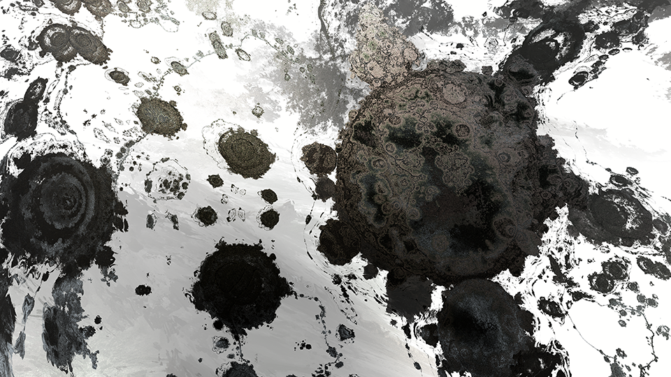
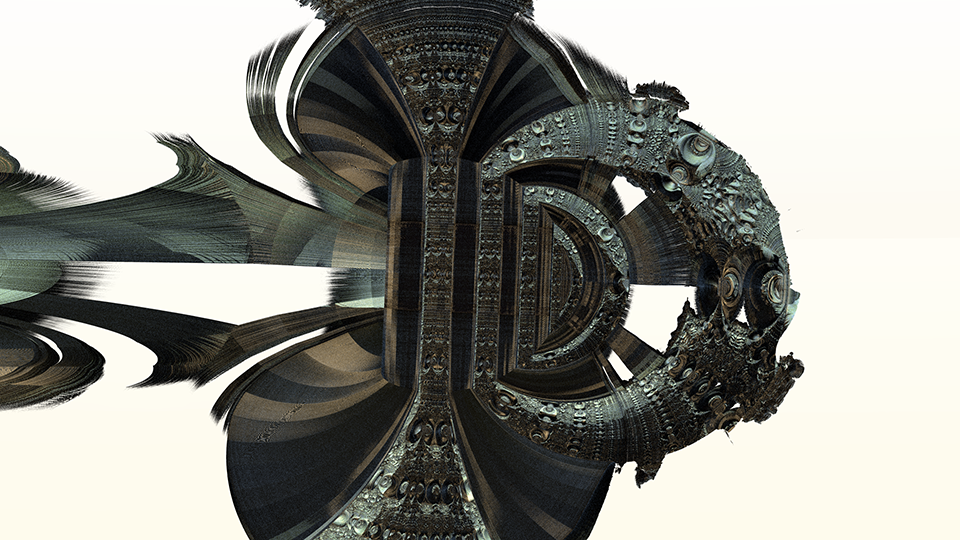

# やってみよう画像処理６

[< 戻る](../)


細かいことは分からなくてもいいから、とにかくやってみよう！のコーナー第６回目です。
今回は不思議なフラクタルの紹介をしてみようと思います。


## フラクタルってなあに？

フラクタルという言葉は、皆さんも一度は聞いたことがあるかと思います。ひょっとしたら授業で出てきたこともあるかもしれません。
ただ、いまいちフラクタルってなんのことだか分からない…と感じている人も多いのではないでしょうか？

さて、いきなりですがまずは以下の２つの例を見てみましょう。
これら２つの例は岩手県とイギリス南端の海岸線を、右に行くほど拡大率を上げて表示してみたものになります。どんどんズームしていっても、その中にズーム前と似たような形を見つけることができます（もちろん完全に同じ形ではありませんが）。海岸線や地形には、このように大きいスケールで見ても小さいスケールで見ても似たような形をしていることがよくあります。


画像提供：Google Earth

　

フラクタルとは、このように **自分の中に倍率の異なる自分がいるもの** のことを言います。
別の言い方をすると、 **どんどんズームしても同じ形がずーっと出てくるもの** 、です。
自然界にはこのような例はたくさんあります。少しだけ見てみましょう。


　

ロマネスコは大きなスーパーマーケットとかでたまに売っているのを見かけるカリフラワーの一種です。三角錐の部分（つぼみ）を拡大してみると、小さな三角錐が集まっている様子が分かります。とても綺麗なフラクタル形状をしているので、フラクタルの例としてよく使われます。
シダもその一部を見てみると、シダの形状をしています。
稲妻も枝分かれしたビカビカを見てみると、稲妻全体像を小さくしたような形状をしています。

コンピュータで描いたフラクタルはさらに分かりやすいと思うので見てみましょう。
以下の動画はマンデルブロ集合という名前のフラクタルをどんどんズームしていく様子です。どれだけズームしても同じような形状がどんどん現れます。


マンデルブロ集合をどんどんズーム

　

フラクタルというものがどのようなものか、ほんの少しだけ分かったのではないでしょうか。
ここから先は、フラクタルを使って描かれた様々なデザインをご紹介していこうと思います。


## マンデルボックス

先ほど紹介したマンデルブロ集合は2次元で描かれたものですが、フラクタルは3次元で描くこともできます。
代表的な3次元フラクタルを3つ紹介します。


　

どれも面白い形状をしていますね。
中でも3つ目の「マンデルボックス」は物凄く複雑な形状をしており、2017年放送のアニメ「正解するカド」でも謎の巨大立方体「カド」そのものとして使用されていたので、知っている人もいるのではないでしょうか。

これらのフラクタルはコンピュータとそのフラクタル専用の数式を使って描いています。そして、数式のパラメータを少しいじってあげることで、形状がウネウネ変化していきます。

マンデルボックスのパラメータを徐々に変化させることで、形状が大きく変化する


## マンデルボックス七変化


それでは、このマンデルボックスを変形させることで描かれた不思議な図形をいくつか紹介します。






　

これらは全て、マンデルボックスのパラメータを調整することで描かれています。

最後の4枚については人物や鳥などを追加で描いてみたのですが、それら以外はレタッチなどは一切していません。驚かれた方も多いのではないでしょうか？

マンデルボックスなどのフラクタルには、色は本来ありません。
しかし「今描いている面はどっちを向いているの？」とか「ここの穴はどれくらい奥まっているの？」といった情報は描画する時に知ることができます。そういった情報を元に色付けをしています。

　

> なおマンデルボックスは立体ですので、3DCGと合成することで様々な映像利用ができるのでは、と考えています。
> そのテストとして作曲家の清田愛未さんの新譜「VOICES2」のPV制作依頼を請けた際、背景を全てマンデルボックスで作成するテストを行ってみました。
>
> （プログラミング入門 金曜日担当講師 中山先生 談）

<iframe width="560" height="315" src="https://www.youtube.com/embed/i0YeUZp3b24?rel=0" title="YouTube video player" frameborder="0" allow="accelerometer; autoplay; clipboard-write; encrypted-media; gyroscope; picture-in-picture" allowfullscreen></iframe>

これらのフラクタル図形は、全て「Beanstalk」というソフトウェアを用いて描いています。

**Beanstalk**: [https://sizima.com/beanstalk/jp/](https://sizima.com/beanstalk/jp)

このソフトウェアは、金曜日のプログラミング入門の講義を担当している中山先生が開発中のものです。
現在はまだベータ版（未完成版）のようですが、興味がある方は、ぜひ触ってみてください。
※ある程度速度の出るグラフィックボードを搭載したWindowsPCでのみ動作します。


## フラクタルを描画してみよう


第８回のテキストの例題「模様の描画」では、作成した画像に単純な模様を描く、ということをやってみました。
その応用で、作成した画像にフラクタルを描画してみましょう。


#### エディタにコードを入力


まず、Spyder の画面左上にある“新規ファイル”アイコンをクリックし、新しい Python ファイルを用意します。


以下のコードを入力し、ファイルを保存アイコンをクリックして保存しましょう。今回は `try6_fractal1.py` という名前で保存してみました。

```python
from PIL import Image              # PillowのImageモジュールのインポート
import math                        # mathモジュールをインポート
 
def mandelbrot(pos_x, pos_y):      # フラクタル描画用の関数
    di =  1.0
    z_x = 0.0
    z_y = 0.0
    m2 = 0.0
    dz_x = 0.0
    dz_y = 0.0
   
    p_x = float(pos_x)/size_x - 0.5
    p_y = (float(pos_y)/size_y - 0.5) * size_y/size_x
    c_x = p_x*scale - offset_x
    c_y = p_y*scale - offset_y
   
    for i in range(500):
        if m2 > 1024:
            di = 0.0
            break
        tmp_dzx = dz_x
        dz_x = 2.0 * (z_x * dz_x - z_y * dz_y) + 1.0
        dz_y = 2.0 * (z_x * dz_y + z_y * tmp_dzx)
        tmp_zx = z_x
        z_x = z_x * z_x - z_y * z_y + c_x
        z_y = 2.0 * tmp_zx * z_y + c_y
        m2 = z_x*z_x + z_y*z_y
 
    dz_dot = dz_x*dz_x + dz_y*dz_y
    if m2>0:
        d = 0.5 * (m2/dz_dot)**0.5 * math.log(m2)
    if di > 0.5:
        d=0.0
    dd = float(d)*5/scale
    dd = (4.0*dd/0.5**scale)**0.2
    if dd < 0:
        dd = 0.0
    elif dd > 1:
        dd = 1
    return int(dd * 255)

scale = 0.005                                  # フラクタルにどれだけ小さな範囲を見ているかを指定
offset_x = 0.05                                # フラクタルの位置を横方向に移動
offset_y = -0.6805                             # フラクタルの位置を縦方向に移動
                                               #  
size_x = 480                                   # 作成する画像の横方向の画素数
size_y = 270                                   # 作成する画像の縦方向の画素数
img = Image.new('RGB', (size_x, size_y))       # 指定したサイズの Imageオブジェクトを作成 ここに描画する
                                               #  
for y in range(size_y):                        # ２重ループ
    for x in range(size_x):                    #  
        val = mandelbrot(x, y)                 # 関数に引数 x と y を渡し、返ってきた戻り値を val に代入
        img.putpixel((x, y), (val, val, val))  # 作成した Imageオブジェクトの座標 (x, y) に値を書き込む
                                               #  
img.show()                                     # 画像を表示
img.save('fractalTest.png')                    # 保存
```


#### 実行


入力したら、画面上部の“ファイルを実行”アイコンをクリックしてみましょう。

しばらくすると作業ディレクトリに 「`fractalTest .png`」というファイルが保存されます。（PCやMacの性能によっては、画像が保存されるまでに1分以上かかる可能性があります。)


#### 解説

第８回のテキストの最後の例題「模様の描画」のコードと、構造が同じになっていることに注目してみましょう。
模様の描画のコードでは円模様を描くための関数「`circles()`」とチェック模様を描くための関数「`checker()`」がありましたが、今回のコードにはそれらの代わりにフラクタル描画のための関数「`mandelbrot()`」を使っています。


　

フラクタルを作り出す数式はコード中で茶色表記している部分になります。
それほど長いわけではないのですが、とてもパッと見て理解できるようなものではありません。ですが、いくつかあるパラメータを変更することで様々なフラクタルの絵を描画することができます。
主に変更して影響あるのは関数の外に表記してある以下の３つの変数です。

```python
scale = 0.005         # フラクタルにどれだけ小さな範囲を見ているかを指定 この値が小さいほど、ズームしていることになる
offset_x = 0.05       # フラクタルの位置を横方向に移動 正の値にすると、フラクタルが右に移動
offset_y = -0.6805    # フラクタルの位置を縦方向に移動 正の値にすると、フラクタルは下に移動
```

これら３つの変数の値をいろいろと変えてみると、様々な模様を見ることができます。
以下は各種パラメータとその時に描画されたフラクタルです。


　

また、関数「`mandelbrot()`」内の for文で何度も繰り返し計算を行うことで、フラクタルの細部まで描いています。

```python
for i in range(500):
```

しかし、この繰り返しがかなり重たい処理になるため、500回繰り返しているところを100回程度にしてあげると描画速度が一気に上がりますので、あまりにも時間がかかる場合は繰り返しの回数を少なくしてみてください。


#### 練習

各種パラメータ変更し、実行してみましょう。

　

[< 戻る](../)