# GUI２

[< 戻る](../)


前回のテキストでは、GUIを用いたプログラミングにチャレンジしてみました。
ウインドウの表示、文字の表示、ボタンの表示、テキスト入力欄の表示 が出来れば、基本的なツールの作成はできるのですが、 今回はもう少し踏み込んでスライダーの表示や、画像処理のためのツールの作り方をやってみましょう。


## 画像処理ツールの制作

前回のテキストの最後の例題では、`tkinter`モジュールと、Pillow の `Image`モジュール、 `ImageTk`モジュールを利用することで、キャンバスに画像を表示する、ということをやってみました。 これはコードを実行すると、すかさず画像をよみこみ、表示する、というものでした。

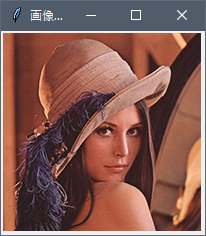


これを発展させて、「やってみよう画像処理」でやってきたような画像処理が出来るツールを制作してみましょう。
まずは、ボタンをクリックすると画像を読み込み、表示するだけのツールを作ってみます。
意外にややこしいですが順を追って見て行きますので、是非チャレンジしてみましょう！

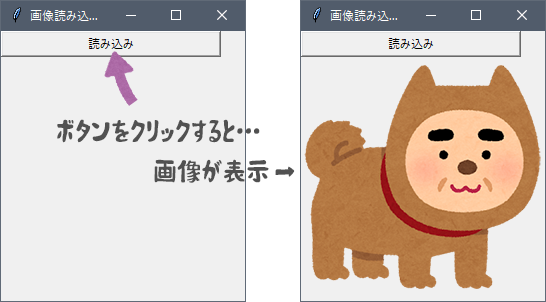


### ボタンクリックで文字表示

まずはボタンをクリックすると文字が表示される、というコードを作成してみましょう。
以下のコードを Spyder のエディタに記述（コピペ）し、実行ボタンをクリックしてみてください。

```python
import tkinter
 
def moji():
    label1["text"] = "おはようございます！"
 
window1 = tkinter.Tk()
window1.title("文字表示テスト")
window1.geometry("300x150")
button1 = tkinter.Button(window1, text = "挨拶", width=30, command = moji)
button1.place(x=10, y=10)
label1 = tkinter.Label(window1, text="")
label1.place(x=10, y=50)
window1.mainloop()
```

　

ウインドウが表示されるので、ボタンをクリックすると「おはようございます！」と表示されます。
これは、以下の図のようにボタンクリックで関数「`moji()`」が実行され、関数内では文字部品「`label1`」の文字を書き換えているからです。 （ここまでは何となく分かるのではと思います。）

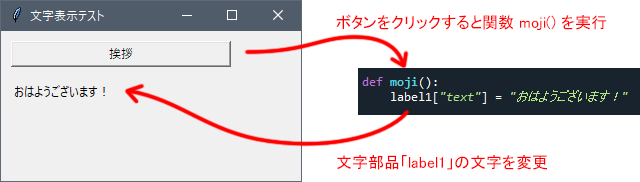

　

### ボタンクリックで画像表示？

ボタンをクリックすると文字が表示されるコードを修正してあげれば、ボタンをクリックすることで画像が表示されるコードが書けそうな気がしますね。
以下のコードを Spyder のエディタに記述（コピペ）し、実行ボタンをクリックしてみてください。

```python
import tkinter                                                  # tkinterモジュールをインポート
from PIL import Image, ImageTk                                  # Image, ImageTkモジュールをインポート

def gazou():                                                    # 画像を読み込んで表示させる関数を定義
    img = Image.open("photoSample_03.jpg")                      # いつも通り画像を読み込む
    w = img.width                                               # 読み込んだ画像の横方向の画素数
    h = img.height                                              # 読み込んだ画像の縦方向の画素数
    img_tk = ImageTk.PhotoImage(img)                            # imgをキャンバスに表示できる形式に変換
    canvas1.config(width = w, height = h)                       # キャンバスのサイズを変更
    canvas1.create_image(0, 0, image=img_tk, anchor="nw")       # キャンバスに img_tk を表示

window1 = tkinter.Tk()
window1.title("画像テスト")
window1.geometry("400x200")
button1 = tkinter.Button(window1, text="読み込み", width=30, command=gazou) # ボタンクリックでgazou()を実行
button1.place(x=10, y=10)
canvas1 = tkinter.Canvas(window1, width=100, height=100, bg="gray70")  # 画像を表示させるキャンバスを用意
canvas1.place(x=10, y=40)
window1.mainloop()
```

　

…キャンバス（濃いグレーの部分）のサイズはちゃんと変化したので、画像の読み込み自体はちゃんと出来ているようですが画像そのものは表示されていません。

ボタンクリック前（左）とボタンクリック後（右）
キャンバスの大きさは読み込んだ画像のサイズに合わせて変わっているが、画像自体は表示されていない。

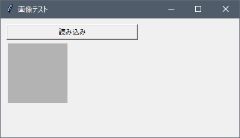
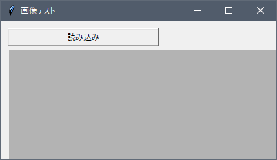

　

この画像が表示されないところがつまづきポイントです。
なぜ表示されないか…
それは、 キャンバス内に描画しようと思ったけど、描画する前に画像が消えちゃっているから描画できない！ …からです。

　

#### 解説

Pythonには「**関数の中で作られた変数やオブジェクトは、関数終了後に削除される**」という仕組みがあります。
キャンバスに画像を描画させるには `create_image()` という命令を使うのですが、この命令が実行される前に、読み込んだ画像そのものが消えてしまうのです。

以下の図が分かりやすいので、図を見ながら解説していきます。


　

まず、ボタンをクリックすると `gazou()` という関数ロボが起動します。
関数ロボは次のように命令を実行していきます。

　

<span style="align: center">画像の読み込み</span>
　　　↓
画像のサイズをチェック
　　　↓
画像形式を変換
　　　↓
キャンバスに画像サイズを伝える
　　　↓
キャンバスに絵を描いてねと言う

　

最後のキャンバスに絵を描いてねと言ったら、関数ロボはすぐに読み込んだ画像そのものを削除してしまいます。
関数ロボはキャンバスのサイズ（変数 `w`, `h`）も削除するのですが、キャンバスさんはなんとかサイズ変更だけは削除前に出来ました。
ところが、キャンバスさんが絵を描こうとした時にはもう遅し… 画像は削除されていた、というわけです。


…このような理由で、キャンバス内には画像は表示されなかったのです。
ということは、画像を表示させるためにはキャンバスさんがゆっくり描けるように、読み込んだ画像を消しちゃわないようにしてあげるとよさそうです。

　

以下のコードを Spyder のエディタに記述（コピペ）し、実行ボタンをクリックしてみてください。

```python
import tkinter                                                  # tkinterモジュールをインポート
from PIL import Image, ImageTk                                  # Image, ImageTkモジュールをインポート

def gazou():                                                    # 画像を読み込んで表示させる関数を定義
    global img_tk                                               # img_tk はグローバル変数だよと言っておく
    img = Image.open("photoSample_03.jpg")                      # いつも通り画像を読み込む
    w = img.width                                               # 読み込んだ画像の横方向の画素数
    h = img.height                                              # 読み込んだ画像の縦方向の画素数
    img_tk = ImageTk.PhotoImage(img)                            # imgをキャンバスに表示できる形式に変換
    canvas1.config(width = w, height = h)                       # キャンバスのサイズを変更
    canvas1.create_image(0, 0, image=img_tk, anchor="nw")       # キャンバスに img_tk を表示

window1 = tkinter.Tk()
window1.title("画像テスト")
window1.geometry("400x200")
button1 = tkinter.Button(window1, text="読み込み", width=30, command=gazou) # ボタンクリックでgazou()を実行
button1.place(x=10, y=10)
canvas1 = tkinter.Canvas(window1, width=100, height=100, bg="gray70")   # 画像を表示させるキャンバスを用意
canvas1.place(x=10, y=40)
window1.mainloop()
```

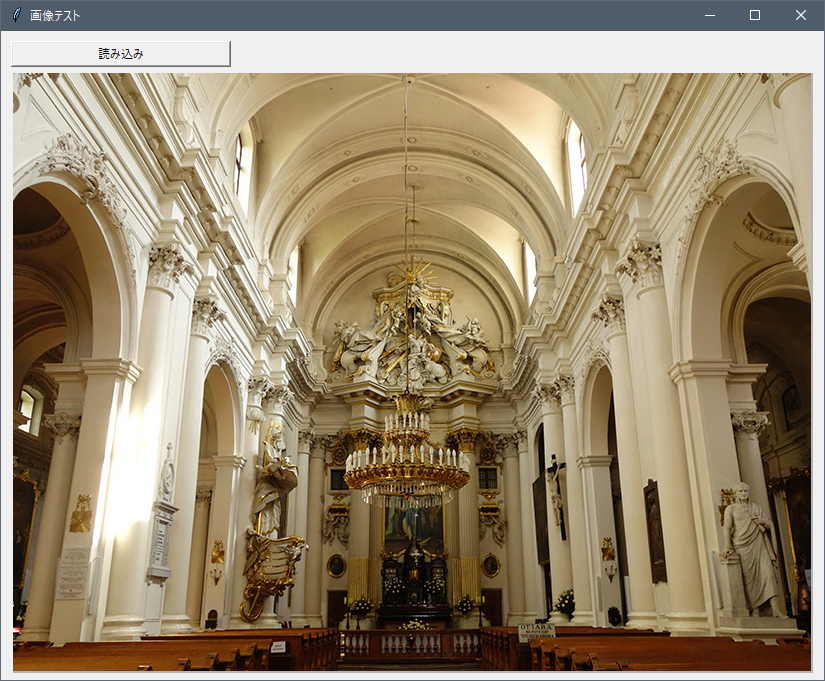

　

ちゃんと画像が表示されたと思います（↑ ウインドウのサイズはマウスで広げました）。

変更は5行目の、`gazou()`の中のこれ↓だけ、新たに書き加えただけです。

```python
global img_tk
```

　

#### 解説

`img_tk`（読み込んだ画像をキャンバスに表示できる形式に変換したものが代入されている）は変数の一種なのですが、 この `img_tk` の前に `global` と書く（宣言する、と言います）ことで、「`img_tk` はグローバル変数ですよ」という意味になります。

変数には「**ローカル変数**」と「**グローバル変数**」の2種類があり、通常関数内で使われる変数は「ローカル変数」です。ローカル変数は先ほど説明したように、関数の実行終了時に削除されてしまいます。
一方のグローバル変数は、削除されません。また、他の関数から変数の値を見ることもできます。

ですので、あらかじめ「`img_tk` はグローバル変数ですよ！」と宣言しておくことで、`img_tk` は関数実行後も削除されなくなります。キャンバスさんもこれならゆっくり描けますね！


## ローカル変数とグローバル変数

ローカル変数とグローバル変数はなかなか理解するのが難しいと思います。
以下、簡単な例で少しだけ解説してみます。

例えば以下のコードを Spyder のエディタに記述（コピペ）してみましょう。
関数 `aaa()` の中で変数 `a` を作っていますが、これはローカル変数なので関数を実行してもすぐに消えてしまいます。
したがって、関数 `bbb()` の中から変数 `a` の値を見ることはできませんので、エラーが出てしまいます。

```python
def aaa():
    a = "あいうえお"
 
def bbb():
    print(a)
 
aaa()
bbb()
```


　

一方で以下のコードでは、関数 `aaa()` 内で「変数 `a` はグローバル変数だよ」ということをあらかじめ宣言しています。
グローバル変数は関数実行後も消えないので、一度関数 `aaa()` を実行してしまえば、他の関数からも `a` の値を見ることができます。
コードを実行してみるとちゃんとコンソールに「あいうえお」と表示されるはずです。

```python
def aaa():
    global a
    a = "あいうえお"
 
def bbb():
    print(a)
 
aaa()
bbb()
```


　

なんだかグローバル変数の方が便利そうにみえますね。
ただ、**グローバル変数は出来るだけ使わない方がよい**と言われています。
今回の例のように短いコードなら特に問題ないのですが、関数がたくさんある複雑なコードになった場合、グローバル変数ばかりにしてしまうと値を書き換えちゃいけない変数の値をうっかり書き換えちゃった…のようなことが起こりえます。

そういった事故を防ぐためにも、できるだけグローバル変数の使用は避けましょう。


## 読み込む画像を選択しよう

まずは画像を読み込む時にどの画像を読み込むか、選択できるようにしてみましょう。
下図のような選択ウインドウを表示させてみます。
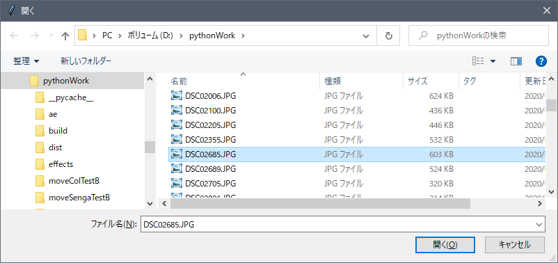


#### エディタにコードを入力


まず、Spyder の画面左上にある“新規ファイル”アイコンをクリックし、新しい Python ファイルを用意します。


以下のコードを入力し、ファイルを保存アイコンをクリックして保存しましょう。今回は `test11_1.py` という名前で保存してみました。

```python
import tkinter
import tkinter.filedialog
from PIL import Image, ImageTk

def select():
    global img_tk
    path = tkinter.filedialog.askopenfilename()
    print(path)
    if path != '':
        img = Image.open(path)
        img_tk = ImageTk.PhotoImage(img)
        w = img_tk.width()
        h = img_tk.height()
        canvas1.config(width = w, height = h)
        canvas1.create_image(0, 0, image=img_tk, anchor="nw")

window1 = tkinter.Tk()
window1.title("画像読み込みテスト")
window1.geometry("400x300")
button1 = tkinter.Button(window1, text="開く", width=30, command=select)
button1.place(x=2, y=2)
canvas1 = tkinter.Canvas(window1) # Canvas作成
canvas1.place(x=0, y=30)
window1.mainloop()
```


#### 実行


入力したら、画面上部の“ファイルを実行”アイコンをクリックしてみましょう。

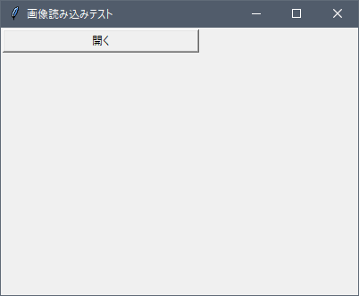
表示されたウインドウの開くボタンをクリックし、表示させたい画像を選択します。

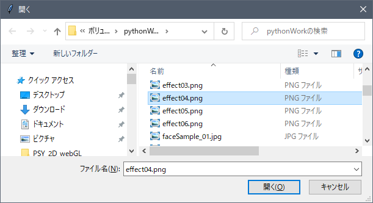
画像を選択する画面です。

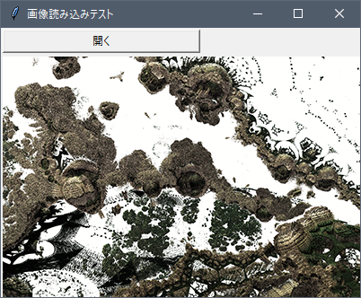
選択した画像が表示されました。
画像の一部しか表示されないと思いますが、マウスでウインドウのサイズを広げると、画像全体が表示されている様子が分かります。


#### 解説

今回表示したファイル選択画面のことを、ファイルを開くための「ダイアログボックス」と言います。
このダイアログボックスを使いたい場合は、以下のように `tkinter.filedialog`モジュールをインポートする必要があります。

```python
import tkinter.filedialog
```

　

開くボタンをクリックすると、以下の関数「`select()`」が実行されます。
`select()` の中身を一つずつ見ていきましょう。

```python
def select():
    global img_tk
    path = tkinter.filedialog.askopenfilename()
    print(path)
    if path != "":
        img = Image.open(path)
        img_tk = ImageTk.PhotoImage(img)
        w = img_tk.width()
        h = img_tk.height()
        canvas1.config(width = w, height = h)
        canvas1.create_image(0, 0, image=img_tk, anchor="nw")
```

　

まず関数内の1行目では「`img_tk` はグローバル変数ですよ！」と宣言しています。これによって、関数の実行が終了後も `img_tk`の値は消去されなくなります（つまりキャンバスさんが描画したり、他の関数から値を見たりすることができるようになります）。

```python
    global img_tk
```

　

そして2行目で以下の処理を行っています。
ファイルを開くダイアログボックスを表示 → 選択したファイルまでのパス（文字列）を取得し、変数 path に代入

```python
    path = tkinter.filedialog.askopenfilename()
```

　

3行目は、パス（ファイルの場所を指し示す文字列）がちゃんと取得出来ているかを確認するために書いてあるだけなので、無くてもOKです。

　

4行目以下では画像を `img`に読み込み、`img`をキャンバスに表示できる形式に変換し、キャンバスの大きさを整えて、キャンバスさんに「`img_tk`を描いてね」と命令しています。

ここで、「なぜ if文があるの？」と感じた人もいると思います。
これは、**ダイアログボックスで「キャンセル」をクリックした場合、if分以下の命令を実行させないため**に書いてあります。

```python
    if path != "":
        img = Image.open(path)
        img_tk = ImageTk.PhotoImage(img)
        w = img_tk.width()
        h = img_tk.height()
        canvas1.config(width = w, height = h)
        canvas1.create_image(0, 0, image=img_tk, anchor="nw")
```

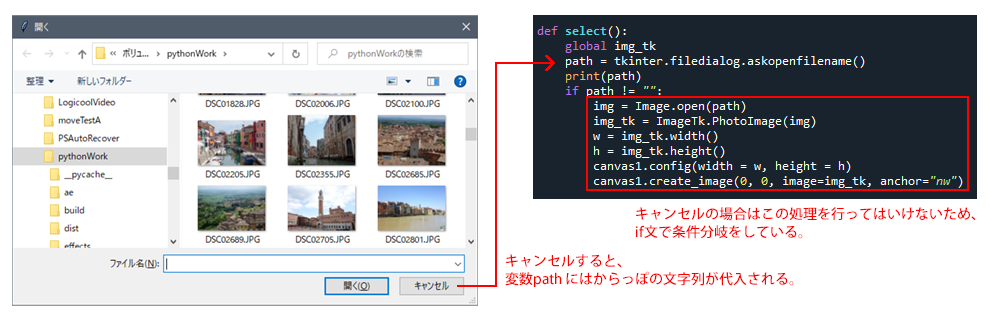

　

少しややこしく感じるかもしれませんが、今までは以下のように手動でファイル名を指定していたところを、ダイアログボックスで指定したファイルのパス（文字列）で代用している、ということになります。
ツール制作の際にはダイアログボックスはよく使いますので、数をこなして慣れて行きましょう。

| 今までの画像ファイルの読み込み方                             | ダイアログボックスを使ったファイルの読み込み方               |
| ------------------------------------------------------------ | ------------------------------------------------------------ |
| <pre><code class="python">img = Image.open("photoSample_03.jpg")</code></pre> | <pre><code class="python">path = tkinter.filedialog.askopenfilename()<br/>img = Image.open(path)</code></pre> |


## 読み込んだ画像にモザイクをかけてみよう

任意の画像を読み込めるようになったので、今度は読み込んだ画像を加工してみましょう。
今回は「やってみよう画像処理１」で出てきたモザイクをかけてみたいと思います。


#### エディタにコードを入力


まず、Spyder の画面左上にある“新規ファイル”アイコンをクリックし、新しい Python ファイルを用意します。


以下のコードを入力し、ファイルを保存アイコンをクリックして保存しましょう。今回は `test11_2.py` という名前で保存してみました。

```python
import tkinter
import tkinter.filedialog
from PIL import Image, ImageTk

def select():
    global img
    global img_tk
    path = tkinter.filedialog.askopenfilename()
    print(path)
    if path != "":
        img = Image.open(path)
        img_tk = ImageTk.PhotoImage(img)
        w = img_tk.width()
        h = img_tk.height()
        canvas1.config(width = w, height = h)
        canvas1.create_image(0, 0, image=img_tk, anchor="nw")

def mosaic():
    global img_tk
    size = [round(img.width * 0.05), round(img.height * 0.05)]
    img_resize = img.resize(size, 3)
    size = [img.width, img.height]
    img_resize = img_resize.resize(size, 0)
    img_tk = ImageTk.PhotoImage(img_resize)
    canvas1.create_image(0, 0, image=img_tk, anchor="nw")


window1 = tkinter.Tk()
window1.title("モザイクテスト")
window1.geometry("400x300")
button1 = tkinter.Button(window1, text="開く", width=20, command=select)
button1.place(x=2, y=2)
button2 = tkinter.Button(window1, text="モザイク", width=20, command=mosaic)
button2.place(x=160, y=2)
canvas1 = tkinter.Canvas(window1)
canvas1.place(x=0, y=30)
window1.mainloop()
```


#### 実行


入力したら、画面上部の“ファイルを実行”アイコンをクリックしてみましょう。

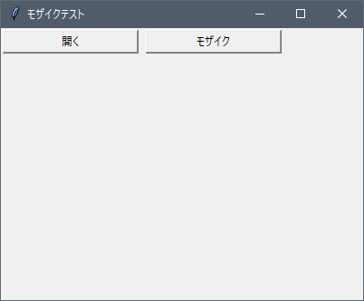
ウインドウが表示されるので、開くボタンをクリックして、好きな画像ファイルを開きましょう。

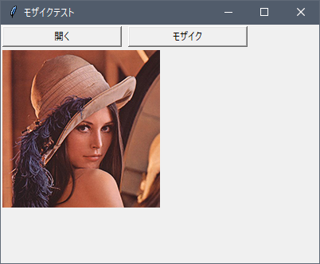
画像が表示されます。
大きい画像の場合はウインドウをマウスで広げて全体が見えるようにしてみましょう（大きすぎる画像は画面内に収まらなくなってしまうので注意しましょう)。

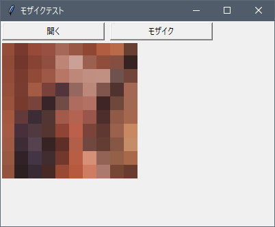
モザイクボタンをクリックすると、モザイクがかかります。


#### 解説

このモザイクツールを図を使って説明すると、次のようになります。
まずは開くボタンをクリックした時…

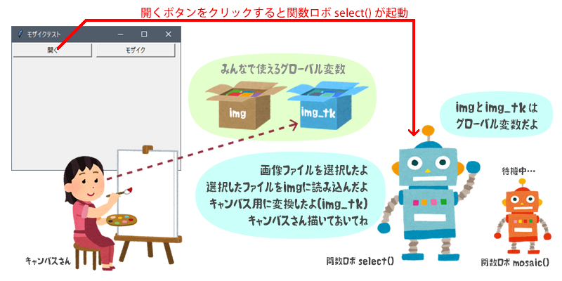

　

開くボタンをクリックすると、関数 `select()` が呼び出されます。
キャンバスに画像を表示させたいので、今まで通り `img_tk` はグローバル変数ですよと宣言しておきましょう。同時に `img` もグローバル変数ですよと宣言しておきます。なぜならこの `img` を使ってモザイクをかけるため、関数`select()`の実行後に消去されるとまずいからです。

　

それではグローバル変数の宣言後の処理を見ていきましょう。

 ① ダイアログボックスで選択された画像ファイルのパスを取得します。
 ② ①で取得したパスの画像ファイルを `img` に読み込みます。
 ③ `img` をキャンバスに描画できる形式にし、`img_tk` に代入します。
 ④ キャンバスの大きさを整えます。
 ⑤ キャンバスに`img_tk`を描画しなさいという命令を出します。

これで関数の実行は終了となります。
関数の実行が終了しても、グローバル変数の `img_tk` は消去されないため、キャンバスさんは描画することができますね。

　

続いて、モザイクボタンをクリックしたらどうなるかを見てみましょう。

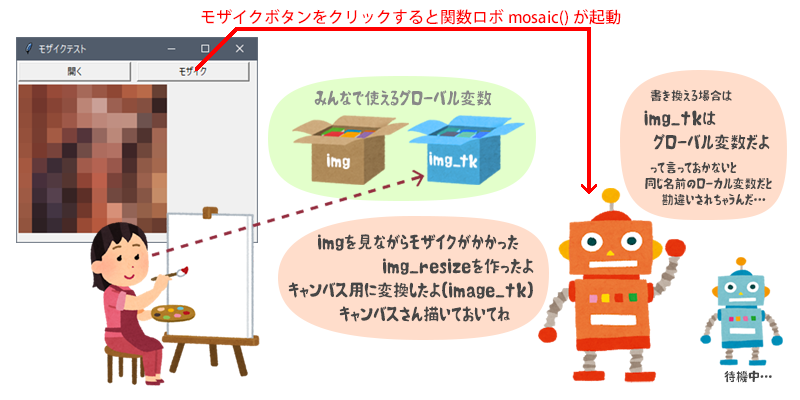

　

モザイクボタンがクリックされると関数 `mosaic()` が呼び出されます。
ここで注目しておきたいのは、`mosaic()` 内で再び `img_tk` がグローバル変数ですよと宣言しているところです。
なぜ宣言が必要なのでしょうか？ それはずばり関数 `mosaic()` 内で `img_tk` に値を代入するからです。

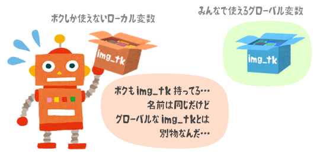

　

もし `img_tk` をグローバル変数宣言しなかったら、`mosaic()` 内で使用される変数 `img_tk` はローカル変数になってしまいます。
つまり、`mosaic()` 内の `img_tk` と関数 `select()` 内で作ったグローバル変数の `img_tk` は名前は同じだけど別物、ということになります。
一方 `select()` 内でグローバル変数宣言をした `img` については `mosaic()` 内で値を代入することがないため、グローバル変数を宣言する必要はありません。

　

それではグローバル変数の宣言後の処理を見ていきましょう。

 ① `img`のサイズを小さくし、`img_resize` に代入します。
 ② `img_resize` のサイズを元の大きさに戻し、再び `img_resize` に代入します。
 ③ `img_resize` をキャンバスに描画できる形式にし、`img_tk` に代入します。
 ④ キャンバスに`img_tk`を描画しなさいという命令を出します。

これで関数の実行は終了となります。
関数の実行が終了しても、グローバル変数の `img_tk` は消去されないため、キャンバスさんはモザイク処理の結果を描画することができますね。


## 読み込んだ画像を回転し、保存してみよう

任意の画像の読み込みから、読み込んだ画像を加工するところまで出来ました。
今度は加工済みの画像を任意の名前で保存する、というところまで作ってみましょう。


#### エディタにコードを入力


まず、Spyder の画面左上にある“新規ファイル”アイコンをクリックし、新しい Python ファイルを用意します。


以下のコードを入力し、ファイルを保存アイコンをクリックして保存しましょう。今回は `test11_3.py` という名前で保存してみました。

```python
import tkinter
import tkinter.filedialog
from PIL import Image, ImageTk
 
def select():
    global img
    global img_tk
    path = tkinter.filedialog.askopenfilename()
    if path != "":
        img = Image.open(path)
        w = img.width
        h = img.height
        img_tk = ImageTk.PhotoImage(img)
        canvas1.config(width = w, height = h)
        canvas1.create_image(0, 0, image=img_tk, anchor="nw")
 
def rot():
    global img
    global img_tk
    angle = tb1.get()
    angle2 = float(angle)
    img = img.rotate(angle2, resample=3)
    img_tk = ImageTk.PhotoImage(img)
    canvas1.create_image(0, 0, image=img_tk, anchor="nw")
 
def save():
    path = tkinter.filedialog.asksaveasfilename(defaultextension="png", filetypes=[("PNG画像", "*.png")])
    if path != "":
        img.save(path)
 
window1 = tkinter.Tk()
window1.title("回転テスト")
window1.geometry("400x300")
button1 = tkinter.Button(window1, text = "開く", width=20, command = select)
button1.place(x=2, y=2)
label1 = tkinter.Label(window1, text="回転させる角度を入力してください。")
label1.place(x=2, y=40)
tb1 = tkinter.Entry(window1, width=10)
tb1.place(x=200, y=40)
button2 = tkinter.Button(window1, text = "回転", width=12, command = rot)
button2.place(x=280, y=36)
button3 = tkinter.Button(window1, text = "保存", width=20, command = save)
button3.place(x=160, y=2)
canvas1 = tkinter.Canvas(window1, bg="gray88") # Canvas作成
canvas1.place(x=2, y=80)
window1.mainloop()
```


#### 実行


入力したら、画面上部の“ファイルを実行”アイコンをクリックしてみましょう。

表示されたウインドウの開くボタンをクリックして、表示させたい画像を選択してみましょう。

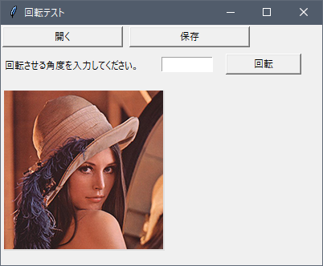
開くボタンから画像ファイルを選んで、表示させた状態です。

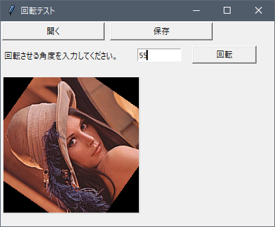
テキスト入力欄に回転させたい角度を入力し、回転ボタンをクリックしてみましょう。

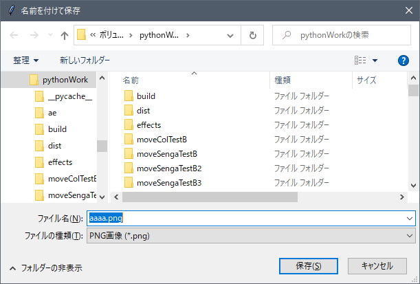
保存ボタンをクリックすると、ファイル保存用のウインドウが開きます。好きな名前を入力し、保存してみましょう。

　

任意の画像ファイルを開く → 開いた画像ファイルを加工する → 任意のファイル名で保存する
というツールとして最低限必要な一連の機能が付きました。


#### 解説

この回転ツールも図を使って説明してみましょう。
まずは開くボタンをクリックした時…

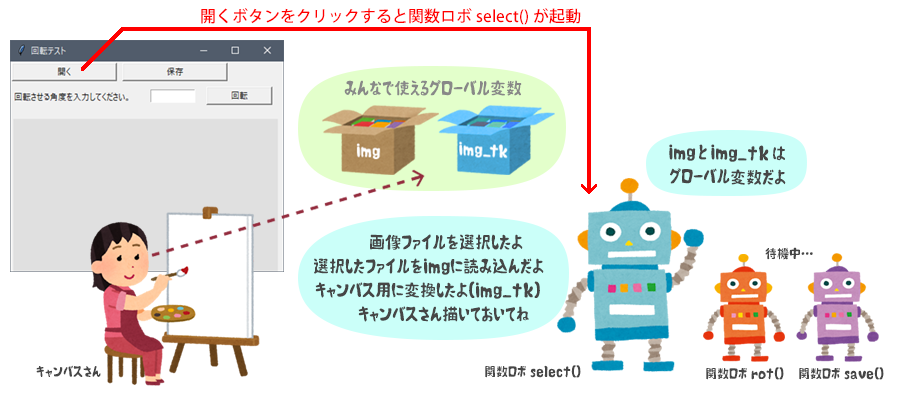

開くボタンをクリックすると、関数 `select()` が呼び出されます。
モザイクツールの場合と全く同じですので、説明の詳細は省きます。

　

続いて、回転ボタンをクリックしたらどうなるかを見てみましょう

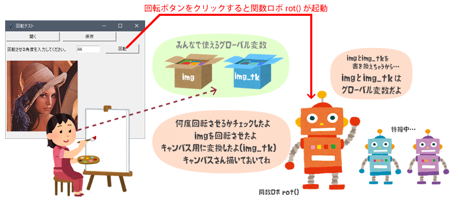

回転ボタンがクリックされると関数 `rot()` が呼び出されます。
`rot()` 内では先ほど定めたグローバル変数（`img`, `img_tk`）の両者に対して、新たに値を代入します。
ですので `img` と `img_tk` はグローバル変数ですよと宣言しなくてはなりません。

　

それではグローバル変数の宣言後の処理を見ていきましょう。

 ① テキスト入力欄に入力された数値を読み取り、float型に変換します。
 ② ①の角度だけ、`img` を回転させます。
 ③ `img` をキャンバスに描画できる形式にし、`img_tk` に代入します。
 ④ キャンバスに`img_tk`を描画しなさいという命令を出します。

これで関数の実行は終了となります。
関数の実行が終了してもグローバル変数の `img_tk` は消去されないため、キャンバスさんは回転処理の結果を描画することができますね。

　

最後は保存ボタンをクリックしたらどうなるかを見てみましょう。

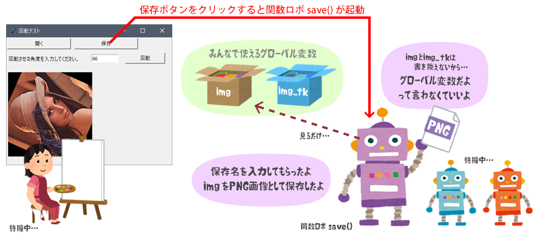

今回、保存の際に名前や保存場所を指定できるダイアログボックスを使用してみました。
ですので関数 `save()` は

 ① 保存ダイアログボックスを開き、保存先のパスを取得します。
 ② `img` を PNG画像として、①で得られたパスに保存します。

`save()` 内でも `img` を扱いますが、あくまでも `img` の値を見るだけであって、`img` に値を代入してはいません。ですので `save()` 内ではグローバル変数の宣言は不要です。


## スライダーを使ってみよう

テキスト入力欄さえあればツールを使用する際にパラメータを指定することは可能です。
ただ、いちいちキーボード入力にしないといけないので面倒なこともあると思います。
そんな時はスライダーでパラメータ指定できるようにしておくと、マウスを使うだけでよいので便利です。
まずはスライダーを表示させて、その値を読み取るだけの簡単なコードを書いてみましょう。


#### エディタにコードを入力


まず、Spyder の画面左上にある“新規ファイル”アイコンをクリックし、新しい Python ファイルを用意します。


以下のコードを入力し、ファイルを保存アイコンをクリックして保存しましょう。今回は `test11_4.py` という名前で保存してみました。

```python
import tkinter                                                            # tkinter モジュールをインポート

def test():                                                               # 関数を定義
    s1 = scale1.get()                                                     # scale1 から値を読み取る
    s2 = scale2.get()                                                     # scale2 から値を読み取る
    print("スライダー１の値は", s1, "です。")
    print("スライダー２の値は", s2, "です。")

window1 = tkinter.Tk()                                                    # ウインドウを作成
window1.geometry("350x200")
button1 = tkinter.Button(window1, text="スライダーテスト", command=test)    # ボタンを作成
button1.place(x=10, y=10)
scale1 = tkinter.Scale(window1, from_=0, to=10)                          # スライダー部品（scale1）を作成
scale1.place(x=10, y=50)                                                  # scale1 を配置
scale2 = tkinter.Scale(window1, length=200, orient="horizontal", from_=-10, to=60)  # スライダー部品（scale2）を作成
scale2.set(10)                                                            # scale2 の初期値を10にセット
scale2.place(x=60, y=50)                                                  # scale2 を配置
window1.mainloop()                                                        # ウインドウを表示
```

#### 実行


入力したら、画面上部の“ファイルを実行”アイコンをクリックしてみましょう。

ウインドウ内のスライダーを操作し、ボタンをクリックするとコンソールにスライダーの値が表示されるかと思います。

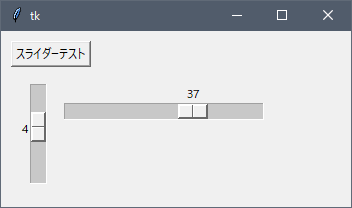
スライダーが表示されているので、適当に動かし、スライダーテストボタンをクリックしてみましょう。


Spyder のコンソールにこのように表示されます。


#### 解説

今回はテストでスライダーを２つ配置してみました（tkinter ではスライダーのことを Scale と呼んでいます）。
２つのスライダーで大分見た目が違いますが、それぞれの作り方を見てみましょう。

まずは1つ目のスライダーです。

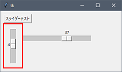

スライダー部品作成のためのコードを見てみます。

```python
scale1 = tkinter.Scale(window1, from_=0, to=10)   # 名前が scale1 のスライダー部品を作成
```

基本はこのように記述します。
「from_」と「to」でこのスライダーの取る値の範囲を指定しています。
このように、なぜか基本のスライダーは縦型になってしまうので、
横型にしたい場合は2つ目のスライダーのようにしてみましょう。

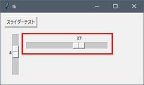

```python
scale2 = tkinter.Scale(window1, length=200, orient="horizontal", from_=-10, to=60)   # 横型のスライダー
scale2.set(10)                                                                       # 初期値を10に設定
```

このように `scale()` という命令の `()` の中にどんどんオプションを書き足していくことで、スライダーをカスタマイズしています。
まず、横型にするためには「 `orient="horizontal"` 」と記述を加えます。
また、スライダーの大きさ（長さ）を指定するには「`length=200`」のように書き加えましょう。こうすると、スライダーの長さが200ピクセルになります。
そして、実行した時のスライダーの初期値を指定しておきたいときは「`scale2.set(初期値)`」のように書きます。

ボタンをクリックすると `test()` という関数が実行されます。
`get()` という命令でスライダーの値が整数（int型）で読み取れるので、読み取った値を変数 `s1`, `s2` に代入し、それをコンソールに表示しています。

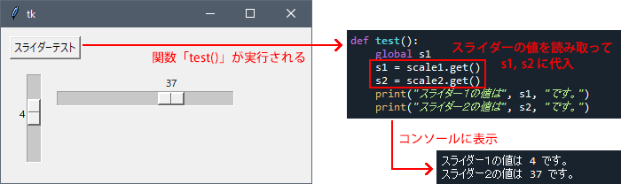


## 写真を鉛筆デッサン風に変換するツールを作ってみよう

最後は少し複雑なツールの制作を行ってみようと思います。
以前「[やってみよう画像処理 ５](../../07/try5/)」では写真を鉛筆デッサン風に変換させる、ということをやってみました。

ただしGUIのないコードでしたので、最適な変換結果にたどり着くには、いくつかあるパラメータを手動で書き換えて実行する、ということを繰り返す必要がありました。
今回のツール制作で、GUIがあるととても便利だということが実感できると思います。


#### エディタにコードを入力


まず、Spyder の画面左上にある“新規ファイル”アイコンをクリックし、新しい Python ファイルを用意します。


以下のコードを入力し、ファイルを保存アイコンをクリックして保存しましょう。今回は `test11_5.py` という名前で保存してみました。

```python
import tkinter
import tkinter.filedialog
from PIL import Image, ImageTk
from PIL import ImageChops, ImageOps, ImageFilter, ImageEnhance
 
# 画像を選択する関数
def select():
    global img
    global img_tk
    path = tkinter.filedialog.askopenfilename()
    if path != "":
        img = Image.open(path)
        w = img.width
        h = img.height
        img_tk = ImageTk.PhotoImage(img)
        canvas1.config(width = w, height = h)
        canvas1.create_image(0, 0, image=img_tk, anchor="nw")
 
# デッサン風に変換する関数
def dessin():
    global img2
    global img_tk
   
    nameraka  = scale1.get()
    line_size = scale2.get() * 2 + 1
    line_kosa = scale3.get()
    nuri_blur = scale4.get()/5
    nuri_bri  = 1.0 + (scale5.get() * 0.1)
 
    sizeX = img.width
    sizeY = img.height
 
    imgR = Image.new("L", (sizeX, sizeY))
    imgG = Image.new("L", (sizeX, sizeY))
    imgB = Image.new("L", (sizeX, sizeY))
    img_nuri = Image.new("L", (sizeX, sizeY))
 
    #2重ループ処理
    for y in range(sizeY):
        for x in range(sizeX):
            r,g,b = img.getpixel((x,y))
            aaa = 0
            if r+g+b != 0:
                aaa = 255.0 / float(r + g + b )
            newR = int(r*aaa)
            newG = int(g*aaa)
            newB = int(b*aaa)
            imgR.putpixel((x,y), int((newR*nameraka + r)/(nameraka+1)))
            imgG.putpixel((x,y), int((newG*nameraka + g)/(nameraka+1)))
            imgB.putpixel((x,y), int((newB*nameraka + b)/(nameraka+1)))
 
            if r+g+b < 100:
                img_nuri.putpixel((x,y), 80)
            elif r+g+b < 200:
                img_nuri.putpixel((x,y), 120)
            elif r+g+b < 400:
                img_nuri.putpixel((x,y), 160)
            elif r+g+b < 600:
                img_nuri.putpixel((x,y), 220)
            elif r+g+b < 720:
                img_nuri.putpixel((x,y), 240)
            else:
                img_nuri.putpixel((x,y), 255)
 
    #塗り素材の明るさ調整・ぼかし
    con = ImageEnhance.Brightness(img_nuri)
    img_nuri= con.enhance(nuri_bri)
    img_nuri= img_nuri.filter(ImageFilter.GaussianBlur(nuri_blur))
 
    #R・G・B のそれぞれについてライン化
    imgR2 = imgR.filter(ImageFilter.MaxFilter(line_size))
    imgR3 = ImageChops.difference(imgR, imgR2)
    imgG2 = imgG.filter(ImageFilter.MaxFilter(line_size))
    imgG3 = ImageChops.difference(imgG, imgG2)
    imgB2 = imgB.filter(ImageFilter.MaxFilter(line_size))
    imgB3 = ImageChops.difference(imgB, imgB2)
 
    #ラインの各素材を合成して1つに
    line_img = ImageChops.add(imgR3, imgG3)
    line_img = ImageChops.add(line_img, imgB3)
    line_img = ImageOps.invert(line_img)
 
    #ラインを濃くする
    for i in range(line_kosa):
        line_img = ImageChops.multiply(line_img, line_img)
 
    #塗り素材とライン素材をを乗算し、ウインドウに表示
    img2 = ImageChops.multiply(line_img, img_nuri)
    img_tk = ImageTk.PhotoImage(img2)
    canvas1.create_image(0, 0, image=img_tk, anchor="nw")
 
# 保存させる関数
def save():
    path = tkinter.filedialog.asksaveasfilename(defaultextension="png", filetypes=[("PNG画像", "*.png")])
    if path != "":
        img2.save(path)
 
# ウインドウを作成
window1 = tkinter.Tk()
window1.title("鉛筆画に変換")
window1.geometry("1600x900")
button1 = tkinter.Button(window1, text="開く", width=15, command=select)
button1.place(x=10, y=10)
button2 = tkinter.Button(window1, text="保存", width=15, command=save)
button2.place(x=140, y=10)
 
label1 = tkinter.Label(window1, text="滑らかさ")
label1.place(x=20, y=60)
scale1 = tkinter.Scale(window1, orient='horizontal',from_=0, to=10)
scale1.set(5)
scale1.place(x=100, y=40)
 
label2 = tkinter.Label(window1, text="線の太さ")
label2.place(x=20, y=100)
scale2 = tkinter.Scale(window1, orient='horizontal',from_=1, to=5)
scale2.set(1)
scale2.place(x=100, y=80)
 
label3 = tkinter.Label(window1, text="線の濃さ")
label3.place(x=20, y=140)
scale3 = tkinter.Scale(window1, orient='horizontal',from_=1, to=5)
scale3.set(2)
scale3.place(x=100, y=120)
 
label4 = tkinter.Label(window1, text="塗りのブラー")
label4.place(x=20, y=180)
scale4 = tkinter.Scale(window1, orient='horizontal',from_=0, to=100)
scale4.set(30)
scale4.place(x=100, y=160)
 
label5 = tkinter.Label(window1, text="塗りの明るさ")
label5.place(x=20, y=220)
scale5 = tkinter.Scale(window1, orient='horizontal',from_=-10, to=20)
scale5.set(10)
scale5.place(x=100, y=200)
 
button3 = tkinter.Button(window1, text = "変換", width=34, height=5, command = dessin)
button3.place(x=10, y=260)
 
canvas1 = tkinter.Canvas(window1, bg="gray88")
canvas1.place(x=280, y=0)
 
window1.mainloop()
```


#### 実行


入力したら、画面上部の“ファイルを実行”アイコンをクリックしてみましょう。

開くボタンから好きな画像を読み込み、適当にパラメータを調整してから変換ボタンをクリックすると、画像が鉛筆画風に変換されます。

※変換ボタンをクリックしてから結果が表示されるには少し時間がかかります。サイズの大きいものほど多くの時間がかかりますので、あまり大きい画像を変換しないように気をつけてください。

変換前と後：

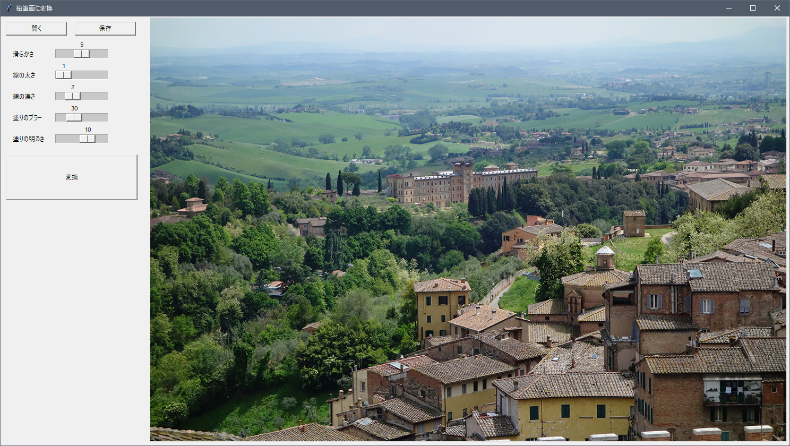
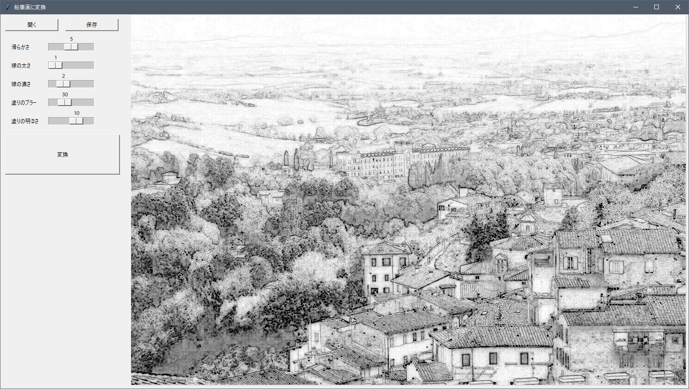


#### 解説

今までの例題に比べるとかなり複雑なコードに感じたのではと思います。
しかしコードをよく見てみると、先ほどの例題「読み込んだ画像を回転し、保存してみよう」と構造が同じであることに気づきます。

下の図を見てみましょう。
左は例題「読み込んだ画像を回転し、保存してみよう」の構造、右は今回の例題の構造になります。
違っているのはGUIに表示する部品の種類と数、あとは読み込んだ画像に処理を加える時に呼び出される関数です。

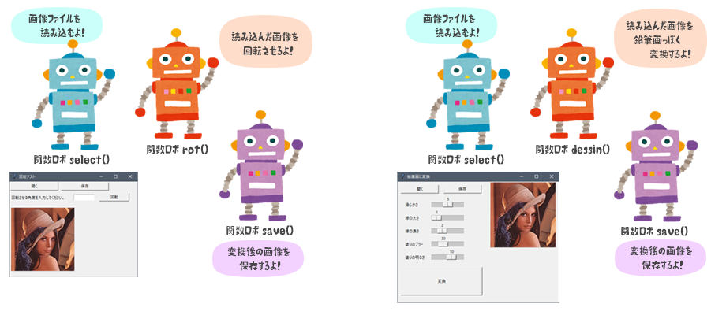

　

鉛筆画風に変換している関数は `dessin()` ですが、その中身は「[やってみよう画像処理 ５](../../07/try5/)」で出てきたコードとほぼ同じとなっています。ここではどうやって鉛筆画風に変換しているのかの説明は行いませんが、気になる方はやってみよう画像処理の番外編を見直してみてください。

　

---

　

前回と今回とでGUIについて学習してみました。
いかがでしたでしょうか？特に今回の内容は少し難しかったかもしれませんね…
このGUIはプログラミングを行う上で必須ではないのかもしれませんが、自分で書いたコードを他の人に使ってもらう際にとても有効です。 今回のように画像を表示させたりするのは少し面倒ですが、前回学習したようにボタンとテキスト入力欄などはさっと使えるようになるといいかなと思います。

さて、来週は組み立てたGUIをアプリ化してみようと思います。
アプリ化すると Python が入っていないパソコンでも動くようになるので、多くの人に使ってもらうことができるようになります！

　

[< 戻る](../)