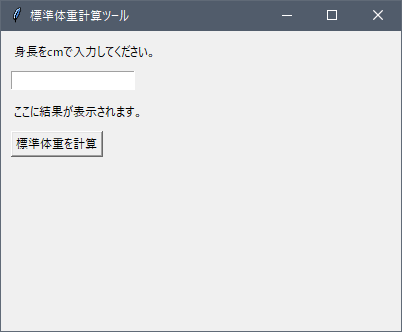
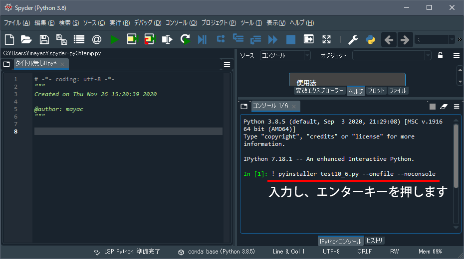
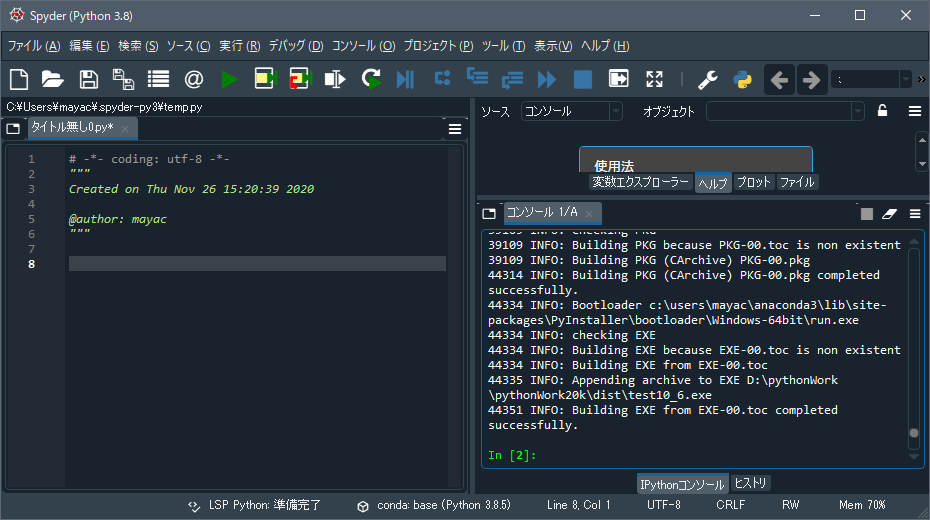
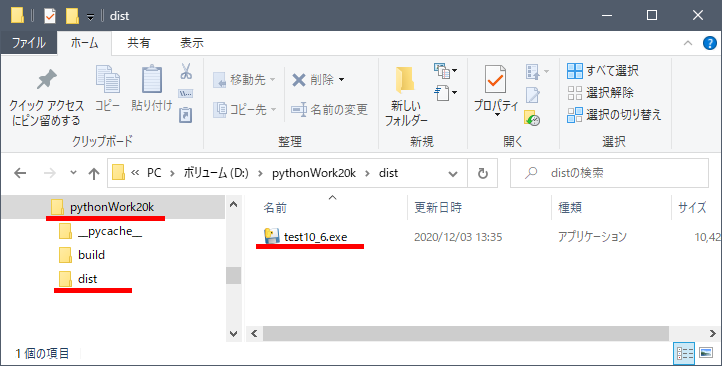
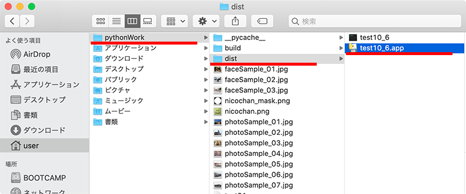
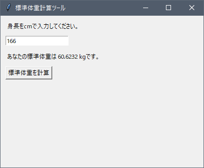
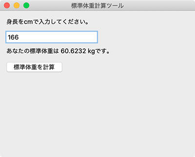

# アプリ化

[< 戻る](../)

　

前回と前々回でGUIの組み立て方を学習しました。
やっぱりGUIがあると一気にツールっぽさが出てくるので、ちゃんと動いた時の満足感も大きいかと思います。

しかし前回までの学習内容では、いくらGUIを使ってツールを作っても、あくまで Spyder 上でコードを実行して初めて使うことが出来る、というものでした。これでは Spyder などの Python 実行環境がインストールされているパソコンでしか使うことが出来ませんし、他の人にツールを配布して使ってもらう、ということもとても難しいですね。

そこで今回は、Pythonの実行環境がインストールされていないパソコンでも実行できる、実行ファイル形式（アプリ）に変換する、ということをやってみます。
アプリにしてしまえばどのパソコンでも使えるようになるので、とても便利ですね！

## PyInstaller

アプリ化する方法はいくつかあるようですが、ここでは簡単とされている PyInstaller を使った方法でやってみようと思います。
以下のリンクに PyInstaller のインストール方法をまとめてみましたので、早速自分の パソコン・Mac にインストールしましょう。

### [Windows PC へのインストール方法](ins_win/)

### [Mac へのインストール方法](ins_mac/)

## アプリ化してみよう

PyInstaller のインストールが出来たら、早速前回と前々回で試したコードのアプリ化をしてみましょう。
まずは手始めに第10回のテキスト「GUI１」の例題「標準体重計算ツール」のアプリ化を行ってみたいと思います。

これをアプリ化してみましょう

### 手順１：コードをファイルに保存

まずは「標準体重計算ツール」のコードが作業フォルダ内に保存されているかを確認しましょう。
テキストでは「`test10_6.py`」という名前で保存したので、この名前のファイルが作業フォルダ内にあればOKです。
もし無い場合はテキストの例題のコードを「`test10_6.py`」という名前で保存しておいてください。

### 手順２：Spyderのコンソールからアプリ化

手順１で保存したファイル（`test10_6.py`）のアプリ化は、Spyderの画面右側のコンソールから行います。
コンソールに以下のコマンドを入力し、エンターキーを押してみましょう。コマンドの最初に「`!`」を記述するのを忘れないようにしてください。

<pre><code class="python">! pyinstaller test10_6.py --onefile --noconsole</code></pre>

　

　

そのまま１分くらい待っていると、以下のようなたくさんのメッセージがコンソールに表示されます。
メッセージの最後が「`successfully`」になっていたら成功です！

### 手順３：保存されたアプリ（実行ファイル）を実行し、動作を確認

`test10_6.py` から変換されたアプリファイルは、作業フォルダ内に新しく作られた「`dist`」フォルダ内に保存されています。

Windowsの場合（左）とMacの場合（右）：

　

早速アプリファイルを実行してみましょう。
Windowsは「`test10_6.exe`」、Macは２つファイルがありますが「`test10_6.app`」をダブルクリックします。

Windows での実行例（左）と Mac での実行例（右）：

　

このようにうまく動作したでしょうか？
このアプリ化したファイル「`test10_6.exe`」や「`test10_6.app`」は、他のWindowsPCやMacにコピーしてもそのまま使うことが出来ます。ただし、Windowsで作成したアプリはWindowsでのみ、Macで作成したアプリはMacでのみ動作します。

## ウイルス対策ソフトに注意！！

コマンドを実行してアプリ化成功のメッセージが表示され、保存先の「`dist`」フォルダも作られたのに、なぜかアプリファイルが無い！ということがたまにあります（特にWindowsで多いようです）。そんな時はウイルス対策ソフトによって削除されてしまっていないかを確認してみましょう。

PyInstaller によって作られたアプリファイルは、一部のウイルス対策ソフトから「悪意のあるソフトウェア」として誤認識されてしまうようです。特に Avast や AVG が誤認識率が高いようです。

もしもウイルス対策ソフトが誤認識してアプリファイルを削除してしまう場合は以下を試してみてください。

　

**アプリ化のコマンドを変更してみる**

アプリ化する際のコマンドは以下でした。

<pre><code class="python">! pyinstaller test10_6.py --onefile --noconsole</code></pre>

これを、以下のように変更してみましょう。

<pre><code class="python">! pyinstaller test10_6.py --onefile</code></pre>

　

…この方法でうまくいかない場合はなかなか厄介です。ウイルス対策ソフトを一時停止して動作確認をすることは可能ですが、ウイルス対策ソフトを再び稼働させるとすぐに削除されてしまいます。

私の手持ちの Windows10 と Mac で試したところ、アプリ化してもウイルス対策ソフトが誤認識することはありませんでしたが、[様々なウイルス対策ソフトがどう認識するかを確かめることが出来るサイト](https://www.virustotal.com/gui/home/upload)で確認したところ、やはりいくつかのウイルス対策ソフトが誤認識しているようでした。

この問題はなかなか簡単に対処する方法がないのが現状のようです。もしどうしてもウイルス対策ソフトが誤認識するようでしたらチャットで連絡ください。

　

[< 戻る](../)