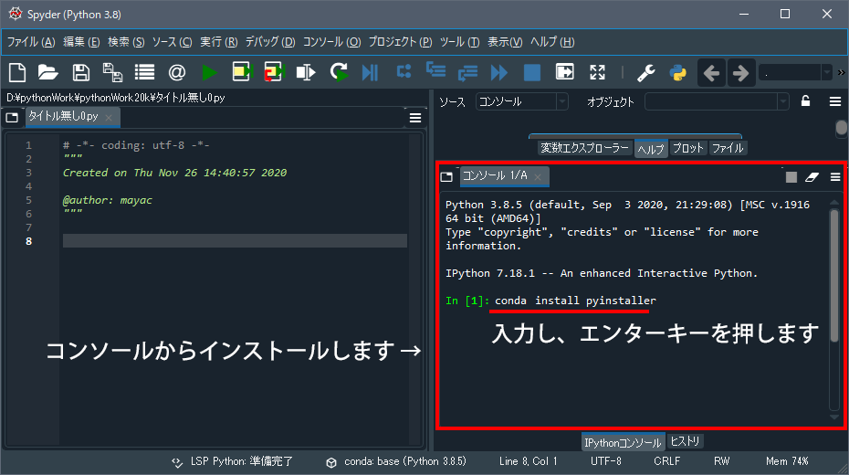
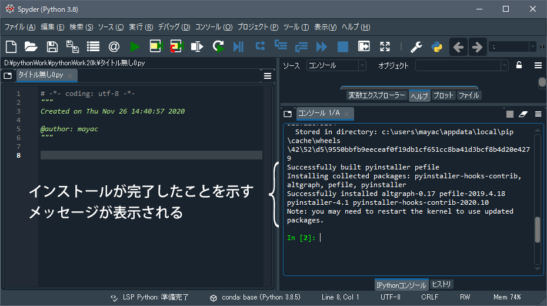

# PyInstaller のインストール（Windows）

[< 戻る](../#!index.md#PyInstaller)


## インストールはSpyderのコンソールから！


PyInstaller をインストールするには、Spyder のコンソールに以下のコマンドを入力し、エンターキーを押します。

```shell
conda install pyinstaller
```

　



　

するとインストールが始まりますのでしばらく待ちましょう。。

しばらくすると以下のようなメッセージがコンソールに表示され、インストール完了です。



### インストールが完了したら、**Spyderを一度終了して、起動しなおしてください。**

その後、テキストの先ほどのページの続きを読み進めてみてください。

　

[< 戻る](../#!index.md#PyInstaller)