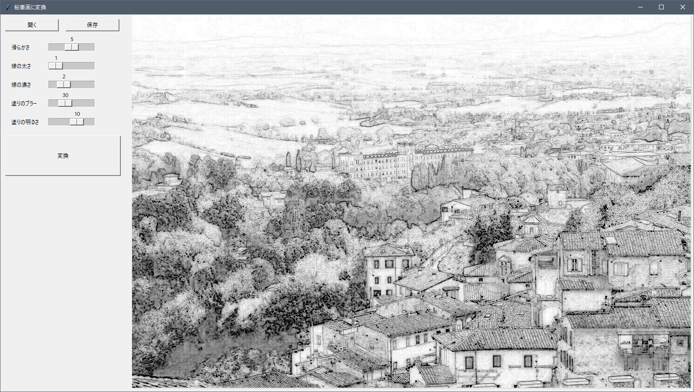
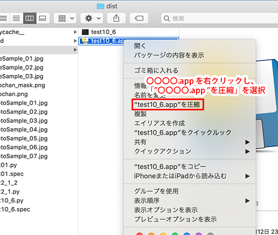

# 第１２回の課題

[< 戻る](../)

## 変換ツールのアプリ化

第１１回のテキスト「GUI２」の例題「写真を鉛筆デッサン風に変換するツールを作ってみよう」では、以下の図のようなGUIを持つツールを作成してみました。

　

これを **PyInstaller を使ってアプリ化**してください。

　

無事にアプリ化できたら…

**①実行し、その画面のスクリーンショットを添付のパワーポイントに貼り付けて提出してください。**
**②実行ファイル（Windowsなら〇〇.exe、Macなら〇〇.app）をチャットで、内田宛に送ってください。**

この２点を行ってください。
（課題の提出フォームから実行ファイルを送ることが出来ないようですので、チャットで送ってもらうことにしました。）

　

Macの人は、アプリをチャットで送る前に圧縮をしてください。圧縮をせずにチャットで 〇〇.app ファイルを送ろうとすると、うまく送れない場合があるようです。
ですので、以下を参考にファイルを圧縮してから送ってください。 

　

もし無事にアプリ化できない（もしくはウイルス対策ソフトのせいでアプリ化できないなど）場合は、チャットで連絡をください。

　

[< 戻る](../)