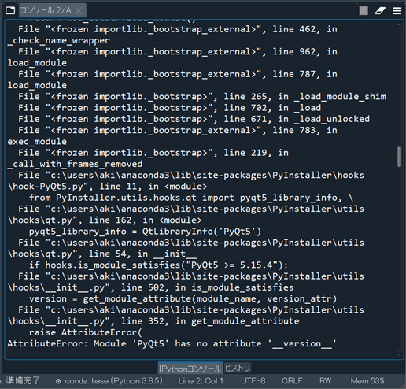
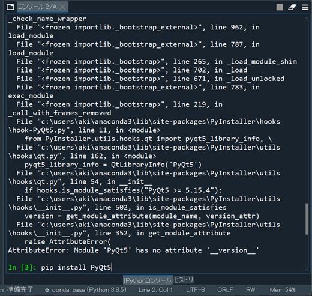
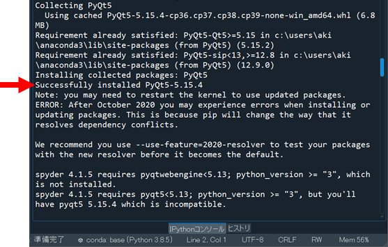
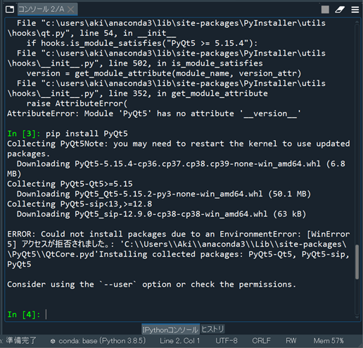
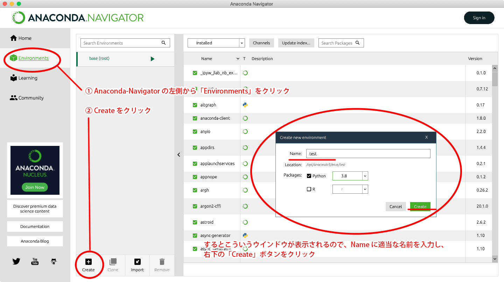
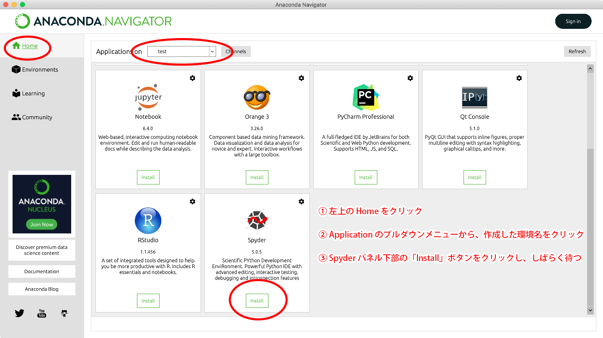

# PyInstallerのエラーへの対処

[< 戻る](../)


## AttributeError: Module 'PyQt5' has no attribute '\__version__'の対処

pyinstallerのコマンドを実行した時、コンソールにこのエラーが表示された場合の対処法です。



まず、コンソールの`In [〇]:`の後に、

```shell
pip install PyQt5
```

と入力してリターンキーを押します。



このコマンドにより、「`PyQt5`」というパッケージがインストールされます。

Successfully installed PyQt5-5.15.7 PyQt5-Qt5-5.15.2 PyQt5-sip-12.11.0

リターンキーを押すと文字がたくさん出ますが、「`Successfully installed PyQt5-5.15.4`」と出ていれば、ちゃんとインストールされています（エラーが出る場合もあります）。



インストール出来たら、

<pre><code class="shell">! pyinstaller 〇〇〇〇.py --onefile --noconsole -y</code></pre>

のコマンドでアプリ化を行ってください。（**コマンドの最後に -y を追加してあります**）

　

たまに、`PyQt5`のインストールで次のようなエラーが表示される場合があります。



このエラーが出た場合は、コンソールで`In [〇]:`の後に、

```shell
pip install --user PyQt5
```

と入力してリターンキーを押します。

これでインストール出来たら、

<pre><code class="shell">! pyinstaller 〇〇〇〇.py --onefile --noconsole -y</code></pre>

で再度アプリ化を行ってください。（**コマンドの最後に -y を追加してあります**）

　　

## Spyderが起動できなくなった場合の対処

上記の対処法の後、Spyderが起動できなくなる場合があるようです。その場合は、次の手順に沿ってください。





これで、Spyderが起動できるようになるはずです。

　

[< 戻る](../)