# やってみよう画像処理７

[< 戻る](../)

　

細かいことは分からなくてもいいから、とにかくやってみよう！のコーナー最終回です。
前回はフラクタルの紹介をしてみましたが、フラクタル図形についてネットなどで調べてみると「カオス図形」という言葉もちょいちょい出てきます。

今回はこの**カオス図形**について紹介してみようと思います。
前半のカオス図形についての解説部分では数学の話が出てきます。ここは特に理解しなくてよいので、数学が苦手な人は読み飛ばしてしまってください。


## カオスって…？

皆さん「カオス」という言葉を聞いてどういったことを想像するでしょうか？
「カオス」は「混沌」や「支離滅裂」という意味で使われます。例えば物があふれて収拾がつかなくなった部屋のことを「カオスな部屋」と表現したり、奇想天外な考えが次々に出てくる人を「あの人は発想がカオスだ」と表現したりもします。

一方で数学の世界で言うところの「カオス」は我々が普段の会話で使うカオスとは少し意味合いが違っています。
明確な定義はされていないので人によって何をカオスと呼ぶかが微妙なのですが、主に以下に挙げる特徴を持っています。

　

**特徴１：数式によって導き出されたものなのに、めちゃくちゃに見える**

**特徴２：めちゃくちゃに見えるのに、ずっと続けて見ていると特徴が見えてくる**

**特徴３：初期値をほんの少し変えると、全く違う結果になる（バタフライエフェクト）**

　

ここで話を進める前に漸化式（ぜんかしき）について少しだけ説明しておきます。
漸化式とは、直前の計算結果を用いて次の計算を行う、という手法の式です。
例えば以下の数字の並びを見てみましょう。

`0, 1, 1, 2, 3, 5, 8, 13, 21, 34, 55, 89, ...`

一見でたらめな数字の並びに見えますが、よくよく見ると「**ある数字はその1つ前と2つ前の数字の足し合わせ**」になっていることに気づきます。例えば 13 はその1つ前「8」と2つ前「5」を足し合わせた数になっていますね。
（この数字の並びのことを「フィボナッチ数列」と呼びます。以下の図が有名ですので、一度は見たことがあるのではないでしょうか？ちなみにこの図の縦横比は、ほぼ黄金比（1：1.618）になっています。神秘的ですね！）

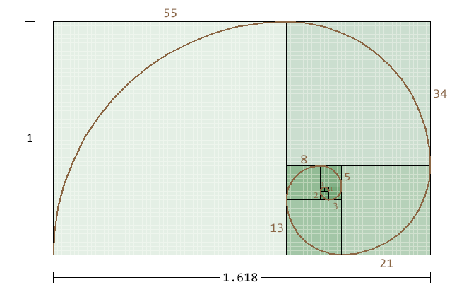

この数字の並び（フィボナッチ数列）を式で書くと

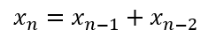

となります。 …分かりづらいですね。日本語で書くと

`欲しい数 ＝ 1つ前の数 ＋ 2つ前の数`

です。
このように **以前の計算結果を使って欲しい数値を求める式**のことを「漸化式（ぜんかしき）」と言います。

また、フィボナッチ数列の最初の「 0 」については1つ前の数も2つ前の数もありません。そして、２つ目の数「 1 」 については2つ前の数がありません。ですので「最初は0、その次は1とします」のように与える必要があります。このような数値のことを「 **初期値** 」と呼びます。

　

　

さて、カオスに話を戻します。
カオスは数式によって導き出される、とのことですが、この数式は主に漸化式です（フィボナッチ数列も漸化式によって導き出されますが、カオスとは言われていません。漸化式によってはカオスになったり、そうでなかったり、ということですね！）。

以下の漸化式を例に、カオスについて少しだけ見てみましょう。
（※流し読みで大丈夫です！！）


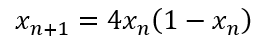

この式はどういうことなのでしょうか？分かりにくいので日本語で書いてみます。

`欲しい数 ＝ 4×1つ前の数 × (1 - 1つ前の数)` 

　

これの初期値を 0.8 にした場合と 0.8001 にした場合で、少しだけ計算して比べてみましょう。

| 初期値（n=0）      | 0.8                                          | 0.8001                                       |
| ------------------ | -------------------------------------------- | -------------------------------------------- |
| 1回目の計算（n=1） | 4 × 0.8 × (1 - 0.8) = **0.64**               | 4 × 0.8001 × (1 - 0.8001) = **0.639760**     |
| 2回目の計算（n=2） | 4 × 0.64 × (1 - 0.64) = **0.9216**           | 4 × 0.639760 × (1 - 0.639760) = **0.921869** |
| 3回目の計算（n=3） | 4 × 0.9216 × (1 - 0.9216) = **0.289014**     | 4 × 0.921869 × (1 - 0.921869) = **0.288107** |
| 4回目の計算（n=4） | 4 × 0.289014 × (1 - 0.289014) = **0.821939** | 4 × 0.288107 × (1 - 0.288107) = **0.820406** |

　

この計算を30回ほど続け、その結果を折れ線グラフにしてみましょう。

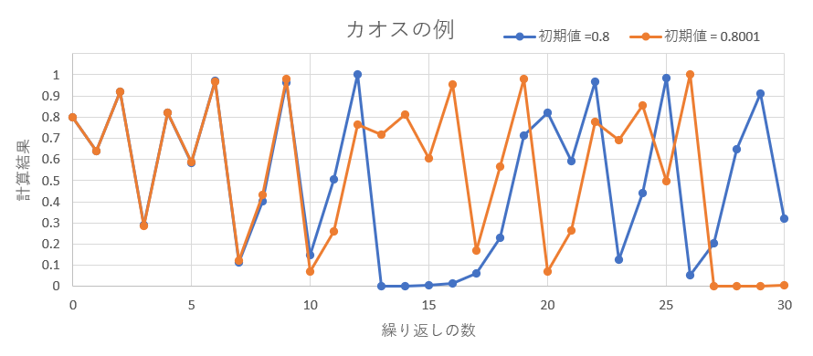

　

まず、初期値が 0.8 のグラフも 0.8001 のグラフも、 パッと見た感じ全く規則が無いように見えます。ノイズみたいですね。
　**→ 特徴１：数式によって導き出されたものなのに、めちゃくちゃに見える**


しかし、ずっと見ているとこのグラフは必ず 0 から 1 の間に収まっており、 全くのでたらめな値ではないことが分かります。
　**→ 特徴２：めちゃくちゃに見えるのに、ずっと続けて見ていると特徴が見えてくる**

また、初期値 0.8 と 0.8001 は、ほんの 0.0001 しか差がありませんので、２つのグラフはほとんど同じになるのでは…と考える人が多いと思います。しかし、計算を繰り返す数が10付近から、 2つの折れ線グラフは全く違うものになっています。
　**→ 特徴３：初期値をほんの少し変えると、全く違う結果になる（バタフライエフェクト）**


この例は簡単なカオスの例としてよく出てくる「ロジスティック写像」と呼ばれるものです（変な名前ですね）。


### バタフライエフェクトについて

バタフライエフェクト…アニメや映画などのSF系エンターテインメント作品で聞いたことある人も多いかと思います。ゲームやアニメで人気の作品「シュタインズ・ゲート」などが有名ですね。

このバタフライエフェクトとは、「初期のほんのわずかの差が、後の結果にものすごく大きな差を与えてしまう」という現象のことを言います。数十年前にエドワード・ローレンツという気象学者が天候予報の研究を行っていました。この時、大気の初期条件をほんの少し変えて計算してみたところ、結果がものすごく異なるものになってしまったそうです。その後ローレンツさんが「ブラジルで1匹の蝶が羽ばたくとテキサスで竜巻が起こるか？」という題目で講演を行ったことから、バタフライエフェクトという名前が付いています。同じような意味合いの日本のことわざに「風が吹けば桶屋が儲かる」というものがありますね。


　

## カオス図形

カオスがどういうものかは何となく分かりましたが、**カオス図形**とは何のことでしょうか？

簡単に言うと、「カオスの数式をグラフにしてみたもの」です。
しかし、先ほど見たロジスティック写像というカオスのグラフは、まったく「図形」っぽくはないですね。
それはロジスティック写像がカオス図形向きではないからです。

ここでは綺麗な図形が描ける「エノン写像」を紹介しようと思います。
エノン写像は以下の漸化式で表現されます。


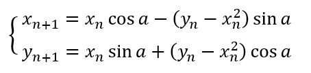

…もはやパッと見ただけでは何が何だか…ですね。。
でも少しだけ説明してみます。
まず式中の a はパラメータと呼ばれ、任意の値になります。
また、今回の漸化式では x と y の２つの値が次々に計算されていきます。したがって初期値も x0 と y0 の２つあることになります。
以下のパラメータと初期値の場合で少しだけ計算してみましょう。

|                    | パラメータ（a）= 1.6  初期値（x0）= 0.5  初期値（y0）= 0     |
| ------------------ | ------------------------------------------------------------ |
| 初期値（n=0）      |  |
| 1回目の計算（n=1） |  |
| 2回目の計算（n=2） |  |
| 3回目の計算（n=3） | 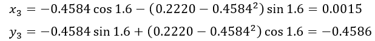                                   |


そして、グラフ上にこれらの点 (`xn`, `yn`) を打ってみます。

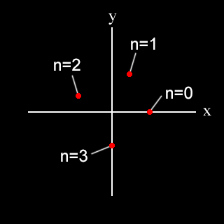

するとこのようにバラバラな位置に点が打たれます。
では、このままどんどん計算を進めていくとどうなるでしょうか？

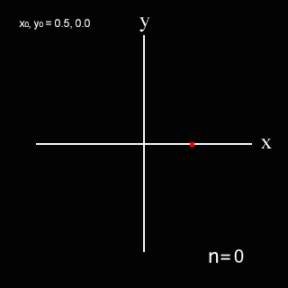

これは計算を150回繰り返しながらグラフ上に点を打って行った場合のアニメーションです。バラバラに点が打たれていきますが、計算数が増えていくと何やら形が見えてきます。

これが、**カオス図形**と呼ばれるものです。

さらに今度は初期値の取り方に10種類のバリエーションを持たせてみます。そしてそのそれぞれについて150回計算させたものを、1つのグラフ上にまとめて点を打っていきます。すると以下のように綺麗な模様が見えてきます。

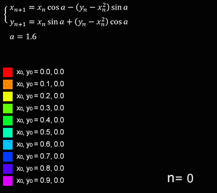

カオス図形はこのように描いていきます。

この例では初期値のバリエーションは10種類で計算数も150回ですが、バリエーションや回数をさらに増やすことでとても綺麗で不思議な模様を描くことが出来ます。


### カオス図形の例

さて、カオスについて小難しい話を書きましたが、今回のテーマであるカオス図形を描いてみるに当たって、あまりこれらのことを深く理解しておく必要はありません。「カオス図形とは、コンピュータに描いてもらう絵の種類の一つ」程度に考えておけばとりあえずはOKです。

このカオスを用いて描いた図をいくつか紹介します。まずは２次元のカオス図形の例です。


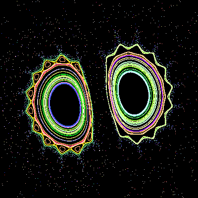
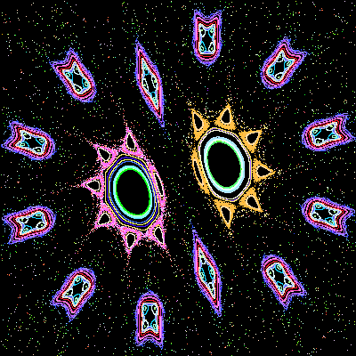
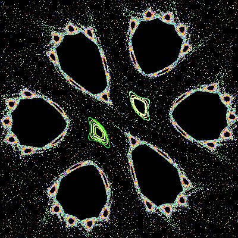
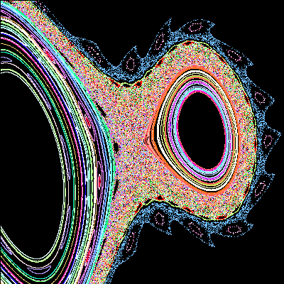
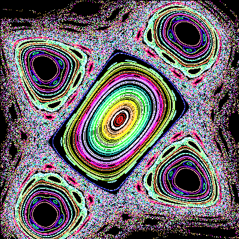
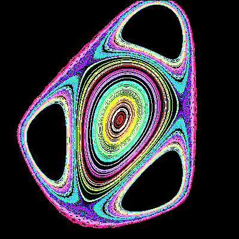

　

パラメータを少しずつ変化させていくと…


　

また、フラクタルと同様に３次元版のカオス図形もあります。
以下の例は 3DCGソフトのMayaで描画した３次元カオス図形です。


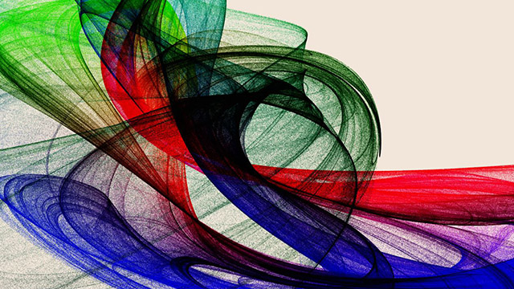


## カオス図形を描画してみよう

それでは早速カオス図形を Python に描かせてみましょう。


#### エディタにコードを入力


まず、Spyder の画面左上にある“新規ファイル”アイコンをクリックし、新しい Python ファイルを用意します。


以下のコードを入力し、ファイルを保存アイコンをクリックして保存しましょう。今回は `try7_chaos1.py` という名前で保存してみました。

```python
from PIL import Image                           # PillowのImageモジュールのインポート
import math                                     # mathモジュールをインポート
import random                                   # randomモジュールをインポート

SIZE = 400                                      # 作成する画像のサイズを画素数で指定（今回は正方形です）
a = 1.3                                         # パラメータ この値を少し変えてみると図形が大きく変わる
SYOKI = 200                                     # 初期値の数を指定 値が少ないとスカスカのカオス図形になる
LOOP = 5000                                     # 1つの初期値に対して何回計算するかを指定

sin_a = math.sin(a)                             # sin(a) はループ中にずっと同じ値なので、前もって計算しておく
cos_a = math.cos(a)                             # cos(a) も同じく前もって計算しておく

img = Image.new('RGB', (SIZE, SIZE))            # 指定したサイズの Imageオブジェクトを作成 ここに描画する

for j in range( SYOKI ):                        # このループが回るごとに初期値が変更される
    x0 = random.uniform(-1, 1)                  # 初期値（x0）をランダムに決める
    y0 = random.uniform(-1, 1)                  # 初期値（y0）をランダムに決める

    r = random.randint(0, 255)                  # 色をランダムに決める（赤の値 0～255）
    g = random.randint(0, 255)                  # 色をランダムに決める（緑の値 0～255）
    b = random.randint(0, 255)                  # 色をランダムに決める（青の値 0～255）

    for i in range(LOOP):                       # このループが回るごとにどんどん点を打っていく
        yxx = y0 - x0 * x0                      # 漸化式の計算
        x = x0 * cos_a - yxx * sin_a            # 漸化式の計算
        y = x0 * sin_a + yxx * cos_a            # 漸化式の計算
        if x > 10 or y > 10:                    # あまりにも計算結果が大きくなってしまったら…
            break                               #  この回のループを終了する

        px = int(SIZE/2 + (SIZE/3)*x)           # 計算結果を描画する際の位置と大きさを調整（横方向）
        py = int(SIZE/2 - (SIZE/3)*y)           # 計算結果を描画する際の位置と大きさを調整（縦方向）
        if 0 <= px <SIZE and 0 <= py < SIZE:    # 描画する点は img の範囲内に収まっているか？
            img.putpixel((px, py), (r, g, b))   # 範囲内に収まっていたら点を描画

        x0 = x                                  # 漸化式の次の計算のために、計算結果を x0 に代入
        y0 = y                                  # 漸化式の次の計算のために、計算結果を y0 に代入

img.save("chaosTest01.png")                     # 保存
img.show()                                      # 画像を表示
```


#### 実行


入力したら、画面上部の“ファイルを実行”アイコンをクリックしてみましょう。

しばらくすると作業ディレクトリに 「`chaosTest01.png`」というファイルが保存されます。
（PCやMacの性能によっては、画像が保存されるまでに1分以上かかる可能性があります。）
なお、このコードでは色と初期値をランダムに決めているため、実行するごとに毎回異なるカオス図形が描画されます。

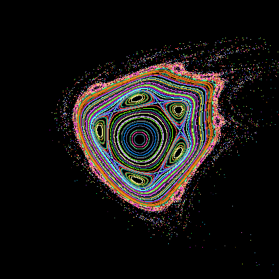
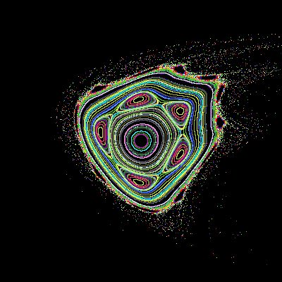


#### 解説

コード中の５行目あたり（以下の部分）の数値を変更すると、描画された結果が変化します。カオス図形がどのように変化するかを見てみましょう。

```python
SIZE = 400   # 作成する画像のサイズを画素数で指定（今回は正方形です）
a = 1.3      # パラメータ この値を少し変えてみると図形が大きく変わる
SYOKI = 200  # 初期値の数を指定 値が少ないとスカスカのカオス図形になる
LOOP = 5000  # 1つの初期値に対して何回計算するかを指定
```

　

まずはパラメータ「 `a` 」を変更してみましょう。

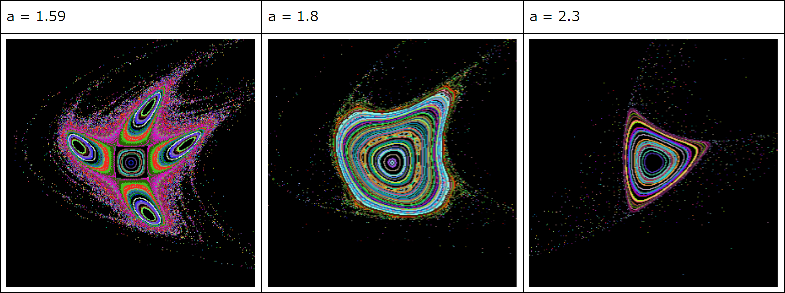

　

パラメータ `a` の値をほんの少し変更することで、カオス図形の形状が大きく変化します。
次に、`a` の値は 1.3 に戻し、初期値のバリエーション数を指定する「`SYOKI`」の値を変更してみましょう。

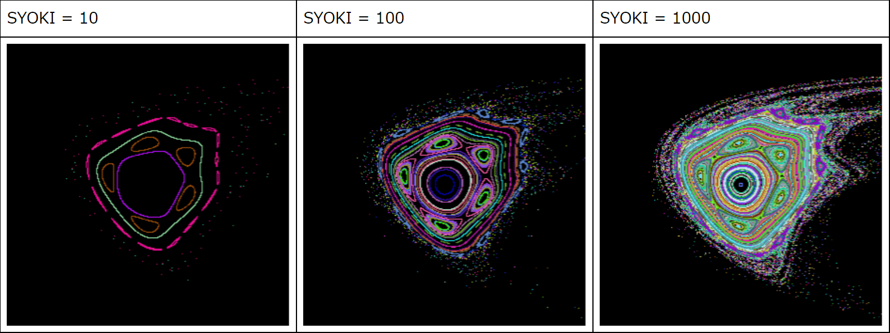

　

初期値のバリエーション数に応じて、描かれるカオス図形がスカスカになったり密になったりする様子が分かります。
残り2つの数値を変更すると次のような変化が起こります。

`SIZE`：　保存される画像サイズを指定します。800 くらいに変更して試してみましょう。 

`LOOP`：　1つの初期値について、漸化式を計算する回数を指定します。100 くらいに変更して試してみましょう。


#### 練習

各種パラメータ変更し、実行してみましょう。


## 式を変更してみよう

先ほどのコードの式をほんの少しだけ変更することで、カオス図形の形状が大きく変わります。


#### エディタにコードを入力


まず、Spyder の画面左上にある“新規ファイル”アイコンをクリックし、新しい Python ファイルを用意します。


以下のコードを入力し、ファイルを保存アイコンをクリックして保存しましょう。今回は `try7_chaos2.py` という名前で保存してみました。

```python
from PIL import Image                           # PillowのImageモジュールのインポート
import math                                     # mathモジュールをインポート
import random                                   # randomモジュールをインポート

SIZE = 400                                      # 作成する画像のサイズを画素数で指定（今回は正方形です）
a = 0.29                                        # パラメータ この値を少し変えてみると図形が大きく変わる
SYOKI = 200                                     # 初期値の数を指定 値が少ないとスカスカのカオス図形になる
LOOP = 5000                                     # 1つの初期値に対して何回計算するかを指定

sin_a = math.sin(a)                             # sin(a) はループ中にずっと同じ値なので、前もって計算しておく
cos_a = math.cos(a)                             # cos(a) も同じく前もって計算しておく

img = Image.new('RGB', (SIZE, SIZE))            # 指定したサイズの Imageオブジェクトを作成 ここに描画する

for j in range(SYOKI):                          # このループが回るごとに初期値が変更される
    x0 = random.uniform(-1, 1)                  # 初期値（x0）をランダムに決める
    y0 = random.uniform(-1, 1)                  # 初期値（y0）をランダムに決める

    r = random.randint(0, 255)                  # 色をランダムに決める（赤の値 0～255）
    g = random.randint(0, 255)                  # 色をランダムに決める（緑の値 0～255）
    b = random.randint(0, 255)                  # 色をランダムに決める（青の値 0～255）

    for i in range(LOOP):                       # このループが回るごとにどんどん点を打っていく
        yxx = y0 - 0.1/x0                       # 漸化式の計算  ●この行が変更点！！！●
        x = x0 * cos_a - yxx * sin_a            # 漸化式の計算
        y = x0 * sin_a + yxx * cos_a            # 漸化式の計算
        if x > 10 or y > 10:                    # あまりにも計算結果が大きくなってしまったら…
            break                               #  この回のループを終了する

        px = int(SIZE/2 + (SIZE/3)*x)           # 計算結果を描画する際の位置と大きさを調整（横方向）
        py = int(SIZE/2 - (SIZE/3)*y)           # 計算結果を描画する際の位置と大きさを調整（縦方向）
        if 0 <= px <SIZE and 0 <= py < SIZE:    # 描画する点は img の範囲内に収まっているか？
            img.putpixel((px, py), (r, g, b))   # 範囲内に収まっていたら点を描画

        x0 = x                                  # 漸化式の次の計算のために、計算結果を x0 に代入
        y0 = y                                  # 漸化式の次の計算のために、計算結果を y0 に代入

img.save("chaosTest02.png")                     # 保存
img.show()                                      # 画像を表示
```


#### 実行


入力したら、画面上部の“ファイルを実行”アイコンをクリックしてみましょう。

しばらくすると作業ディレクトリに 「`chaosTest02.png`」というファイルが保存されます。
先ほどのコードで描いたカオス図形とはまた異なる図形が描かれました。

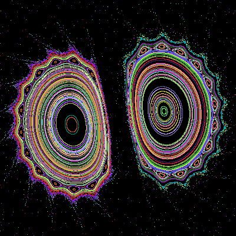
（パラメータ a = 0.29)


#### 解説

このコードは最初に書いたコードの漸化式１行を、以下のように変更しただけです。

変更前：

```python
yxx = y0 - x0 * x0
```

変更後：

```python
yxx = y0 - 0.1/x0
```

　

このように、漸化式を少し変更するだけで大きく見た目が変わります。
この式を用いた場合、パラメータ `a` を変化させるとどのように描かれるカオス図形が変化するかを見てみましょう。

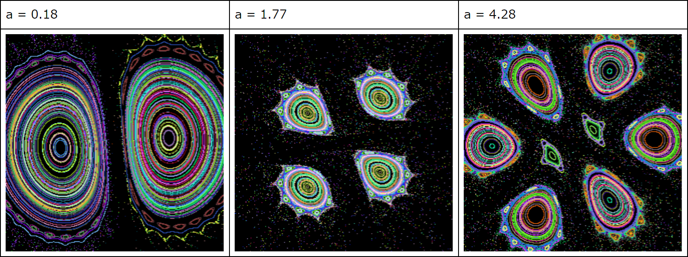

　

さらに、さきほど変更した漸化式を以下のように変更すると、また変わったカオス図形が描けます。

```python
yxx = y0 - math.sin(x0) * x0
```


この漸化式で、パラメータ a を変化させてみた例です。

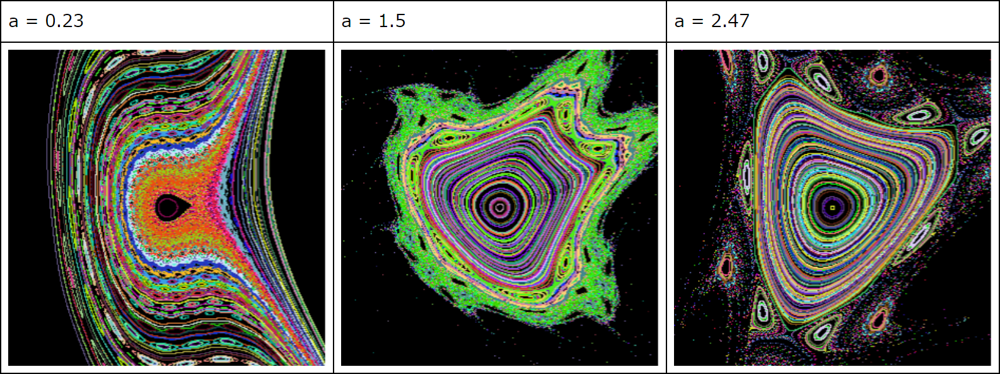


#### 練習

各種パラメータ変更し、実行してみましょう。

漸化式を適当に変えてみて、実行してみましょう。

　

---

これでやってみよう画像処理のコーナーはおしまいとなります。いかがでしたでしょうか？

最後の2回（フラクタルとカオス図形）は画像処理というよりはコンピュータグラフィックスの領域でしたね。
今回は Python を使っての画像処理でしたが、他のプログラミング言語でもこれらの知識は応用できるはずです。

今後もしメディアアートやゲームなどを制作することがあった際に、何かのとっかかりになってもらえれば幸いです。

　

[< 戻る](../)