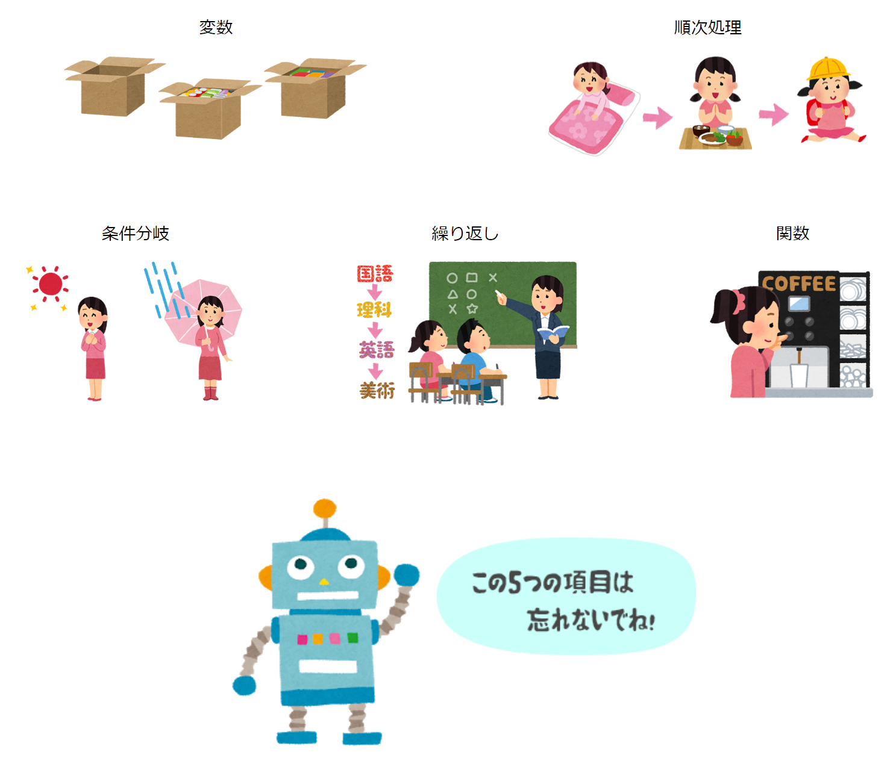

# 第１３回：最終課題

[< 戻る](../)

　

今回は最終課題です。

簡単に感じる人、難しく感じる人がいると思いますが、これまでのテキストを見返しつつ、挑戦してみてください。いつも通り質問OKです。

　

提出締め切りは、 **2022/8/6（土）**です。

また、以前の課題が未提出の場合も、**2022/8/6（土）**までに提出してください。

## 今日の内容

- [最終課題](kadai/)

## おわりに

さて。これで、「プログラミング入門」の授業は終了となります。

新型コロナウイルスの影響で、通常とは全く違う状況で、ほぼ自習のような形でここまで来るのには、凄まじい忍耐が必要だったと思います。

プログラミング入門の内容的には、目標としていた５つの項目は全て終えることができました。また、やってみよう画像処理コーナーやGUI、アプリ化を取り入れたことで、ある程度実践的な内容まで踏み込めたと思っています。
とはいえ、最初のうちは「やっぱり分からない…」ということも多いはず。この先 Python を使う際、分からないことがあれば、Teamsのチャットや、メール（Teamsに書きます）で連絡をください。Python 以外の言語でも質問いただければ、できるだけ対応します。

