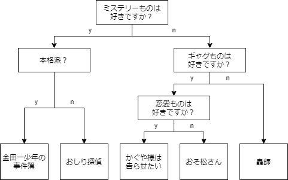
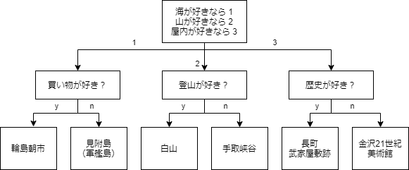
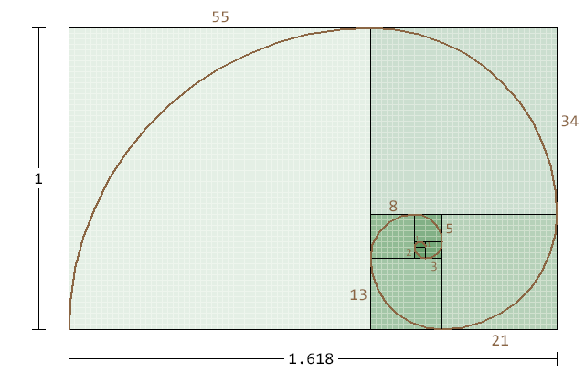
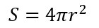
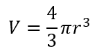
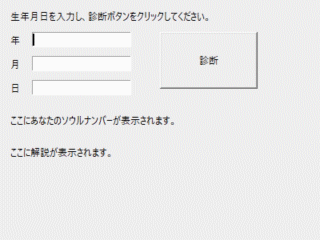

# 最終課題

[< 戻る](../)

　

以下の課題１〜４を行ってください。
課題４は、４-A、４-B、４-Cの３つのうち、どれか１つを行ってください。

課題の提出方法：
**提出用pptファイルに、コードだけをコピー＆ペーストで貼り付け**て提出してください。
Spyderの画面のスクリーンショットは必要ありません。
また、**課題４については、アプリ化したファイルもチャットで内田宛に送ってください**。

　

## 課題１：Yes/No診断（２段以上のif文を使用）

各ブロック内に書かれた質問にYesかNoで答えていき、自分に適したものを判定してくれる「Yes/No診断」、皆さんも一度はやったことがあるかと思います。このYes/No診断を作成してください。

**テーマはオリジナルで、自由に決めてください。何について診断してもOKです。**

**条件として、if文を２段以上にして、最初の問いでYesの場合とNoの場合で、それぞれ２問目が異なる問いになるように作成して下さい。**

イエス「y」とノー「n」以外に、例２のように「1, 2, 3･･･」を入力するようにしてもOKです。
GUIは必要ありません。

具体的には以下のフローチャートの例を参考にして、オリジナルのYes/No診断が出来るコードを作成してください。

コードが完成したら、**コードをまるごと提出用pptファイルに貼り付けて提出してください。**

　

**Yes/No診断の例１**：あなたにお勧めするアニメ診断


表示される質問に対して y か n を入力して答えていくと、お勧めのアニメを教えてくれます。

　

**イエスノー診断の例２**：あなたにお勧めする石川県の観光名所


表示される質問に、1、2、3 や y 、n を入力して答えていくと、お勧めの石川県観光名所を教えてくれます。

　

　

## 課題２：フィボナッチ数列の 50番目の数 × 100番目の数

[第12回の授業で行ったやってみよう画像処理７](../../12/try7/)では「フィボナッチ数列」をご紹介しました。
フィボナッチ数列とは以下の数字の並びのことを言うのでしたね。

```
0, 1, 1, 2, 3, 5, 8, 13, 21, 34, 55, 89, ... 
```

　

一見でたらめな数字の並びに見えますが、「ある数字はその1つ前と2つ前の数字の足し合わせ」になっているのでした。
例えば 55 は、その1つ前「34」と、2つ前「21」を足し合わせた数になっていますね。

日本語の式で書いてみると

```
欲しい数 ＝ 1つ前の数 ＋ 2つ前の数 
```

　

です。
さて、もう一度フィボナッチ数列を見てみましょう。

| 0番目 | 1番目 | 2番目 | 3番目 | 4番目 | 5番目 | 6番目 | 7番目 | 8番目 | 9番目 | ・・・ | 50番目 | ・・・ | 100番目 |
| ----- | ----- | ----- | ----- | ----- | ----- | ----- | ----- | ----- | ----- | ------ | ------ | ------ | ------- |
| 0     | 1     | 1     | 2     | 3     | 5     | 8     | 13    | 21    | 34    |        | ？     |        | ？      |

　

このように番号を付けたとして、**50番目と100番目の数をそれぞれ求め、それらを掛け合わせた数を求めてください**。何になるでしょうか？

このコードでは **繰り返しの構文** を使います。
フィボナッチ数列の最初の「 0 」については、1つ前の数も2つ前の数もありません。
そして、２つ目の数「 1 」 については、2つ前の数がありません。
ですので、「0番目は0、1番目は1」というのだけは、最初から決めておきます。
それ以降の数は、繰り返しの構文を使って計算し、50番目と100番目の数をそれぞれ求め、それらの数字を掛け合わせて、その結果を表示するコードを作成してください。

コードが完成したら、**コードをまるごと提出用pptファイルに貼り付け**、それからコードを実行して**得られた答え（50番目の数 × 100番目の数の答え）も、pptファイルに記入してください。**


フィボナッチ数列をこのような図にしてみると、黄金比（1 : 1.618)が現れます。神秘的ですね！

　

　

## 課題３：球の表面積と体積を求める

中学校の数学の授業では球の表面積や体積を求める公式を学習しました。
公式は以下の通りでしたね（覚えていますか？）。



球の表面積


球の体積

これら２つの公式を関数にしてみましょう。
以下の２つの関数を作成してください。円周率（π）は 3.1416 とします。

- **引数として球の半径を渡すと戻り値として球の表面積を返す関数**
- **引数として球の半径を渡すと戻り値として球の体積を返す関数**

そして関数が２つ完成したら、 それらの関数を使って、
**球の半径をキーボードで入力すると表面積と体積を表示するコードを作成してください。**


このアニメーションを参考にしてください。

コードが完成したら、**コードをまるごと提出用pptファイルに貼り付けて提出してください。**

　

## 課題４：GUIツール制作

第１０回、１１回、１２回のテキストでは、GUIの組み立て方やアプリ化にチャレンジしました。
GUI、アプリ化についてはおまけ的な内容でしたが、これらを利用してオリジナルのツールを作るためには「変数」「順次処理」「条件分岐」「繰り返し」「関数」の全てを理解する必要がありました。

課題４では、GUIツールを制作します。
以下に**課題４‐A、４‐B、４‐C の３つを提示してありますので、そのどれか１つ**を選んで行ってください。


### 4-A：ソウルナンバー診断ツール（難易度：中）

第９回の練習問題では何度かソウルナンバーを表示する、ということを行ってきました。→ [練習問題](../../09/rensyu/#!index.md#問題７：ソウルナンバー（チャレンジ問題）) [解答例](../../09/09_ans/ans7/)

今まではコンソールから生年月日を入力し、コンソールに結果が表示されていましたが、**これをGUIのあるツールにしてみましょう**。

以下のアニメーションのように、 **生年月日を入力し、ボタンをクリックするとソウルナンバーと解説を表示するツールを作成し、アプリ化してください。**
パーツの配置は自分の好きなように変更してOKです。
また、解説ももっとアレンジするなどもOKです。



　

| ソウルナンバー | 解説                             |
| -------------- | -------------------------------- |
| 1              | 明朗快活で才能と強運の持ち主     |
| 2              | 冷静沈着で頭の回転が速いキレ者   |
| 3              | 面倒見がよく、クリエイティブ     |
| 4              | 働き者でクールなリーダータイプ   |
| 5              | 落ち着いた堅実なタイプ           |
| 6              | 愛情深く、ユーモアあふれる社交的 |
| 7              | 感受性が強く、パワフル           |
| 8              | 純粋で一途、几帳面               |
| 9              | 寂しがり屋な圧倒的天才肌の持ち主 |
| 11             | 鋭い直感と感受性と強運           |
| 22             | 人類を導くリーダー               |
| 33             | 人々を魅了するカリスマ性         |
| 44             | 頭脳明晰で問題解決のプロ         |

参考：https://se-ec.co.jp/uranai-surveyteam/soulnumber

　

コードが完成したら、**コードをまるごと提出用pptファイルに貼り付けて提出してください。**

また、**アプリ化したファイルをチャットで内田宛に送ってください。**
（Macでアプリ化したファイルをチャットで送ろうとすると、ファイルが分割される、ということが起きるようですので、圧縮したものを送ってください。圧縮の方法は、ファイルを２本指でタップ（もしくはマウスで右クリック）するとメニューに「〇〇〇〇.app を圧縮」のような項目があるはずですので、それを選択すれば圧縮できます。）

　

### 4-B：カオス図形描画ツール（難易度：高）

第１２回のテキストの「[やってみよう画像処理７](../../12/try7/)」では、カオス図形を描きました。
カオス図形を描くためには、漸化式をどんどん計算させつつ～ …と小難しい感じでしたね。
ただ、テキストのコードをコピペすることで、中身は理解していなくても、カオス図形を描画させることはできましたし、以下の４つの値を変化させることでカオス図形を変化させることもできました。

```python
SIZE = 400    # 作成する画像のサイズを画素数で指定（今回は正方形です）
a = 1.3       # パラメータ この値を少し変えてみると図形が大きく変わる
SYOKI = 200   # 初期値の数を指定 値が少ないとスカスカのカオス図形になる
LOOP = 5000   # 1つの初期値に対して何回計算するかを指定
```

　

**この４つの値をGUIから変更し、ボタンをクリックすることでカオス図形を描くツールを制作**してみましょう。

以下のアニメーションは制作例になります。
この例は保存ボタンも付いており、描画したカオス図形をPNG画像として保存させることも可能になっています。
画面のレイアウトやスライダー部品を使うか、文字入力部品を使うかなどなどは自由です。また、このアニメーションにある機能以外の機能を付けてもOKです（例えば式を変更する機能を付けてみる、とか出来そうですね！）。


　

なお、小数点のスライダーは以下のように記述することで作成できます。

```python
import tkinter

window1 = tkinter.Tk()
window1.title("小数点のスライダーテスト")
window1.geometry("300x100")

# 小数点ありのスライダー部品作成
s1 = tkinter.Scale(window1, length=200, orient="horizontal", from_=0.1, to=0.5, resolution=0.01 )
s1.set(0.3)      # 最初のつまみの位置を指定
s1.place(x=50, y=20)
 
window1.mainloop()
```

上記コードでは、0.1 ～ 0.5 を 0.01 刻みで動かすことができるスライダーを作成しています。
`from_`で下限値、`to`で上限値、`resolution`で刻み幅を指定しています。


　

コードが完成したら、**コードをまるごと提出用pptファイルに貼り付けて提出してください。**

また、**アプリ化したファイルをチャットで内田宛に送ってください。**
（Macでアプリ化したファイルをチャットで送ろうとすると、ファイルが分割される、ということが起きるようですので、圧縮したものを送ってください。圧縮の方法は、ファイルを２本指でタップ（もしくはマウスで右クリック）するとメニューに「〇〇〇〇.app を圧縮」のような項目があるはずですので、それを選択すれば圧縮できます。）

　

### 4-C：完全自作のツール（難易度：低～高）

**完全オリジナルのツールを制作**してみてください。
例えば以下のようなものが考えられると思います。

- ボタンをクリックすると１～６がランダム表示されるサイコロツール
- ランダムなクイズが表示されて答えていくクイズツール
- やってみよう画像処理で試した機能を盛り込んだ画像処理ツール

簡単なものから、複雑なものまで、何でもOKです！
今の自分の実力から一歩上を目指して、色々とトライしてみてください！


コードが完成したら、**コードをまるごと提出用pptファイルに貼り付けて提出してください。**

また、**アプリ化したファイルをチャットで内田宛に送ってください。**
（Macでアプリ化したファイルをチャットで送ろうとすると、ファイルが分割される、ということが起きるようですので、圧縮したものを送ってください。圧縮の方法は、ファイルを２本指でタップ（もしくはマウスで右クリック）するとメニューに「〇〇〇〇.app を圧縮」のような項目があるはずですので、それを選択すれば圧縮できます。）

---

　

[< 戻る](../)