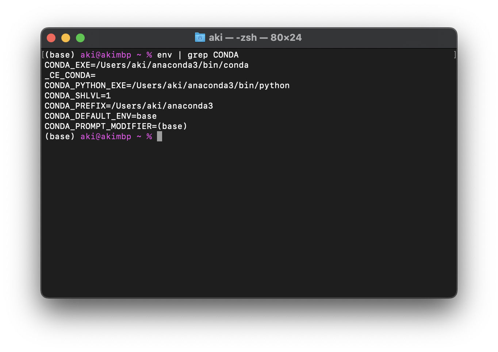
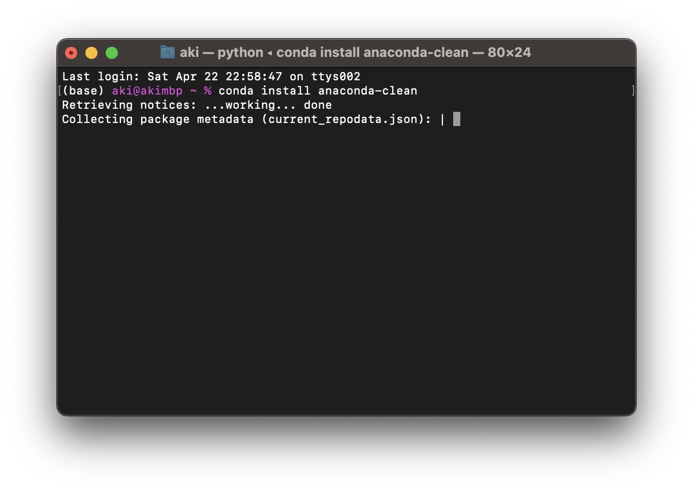
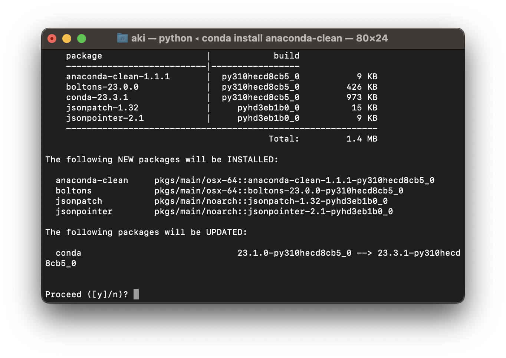
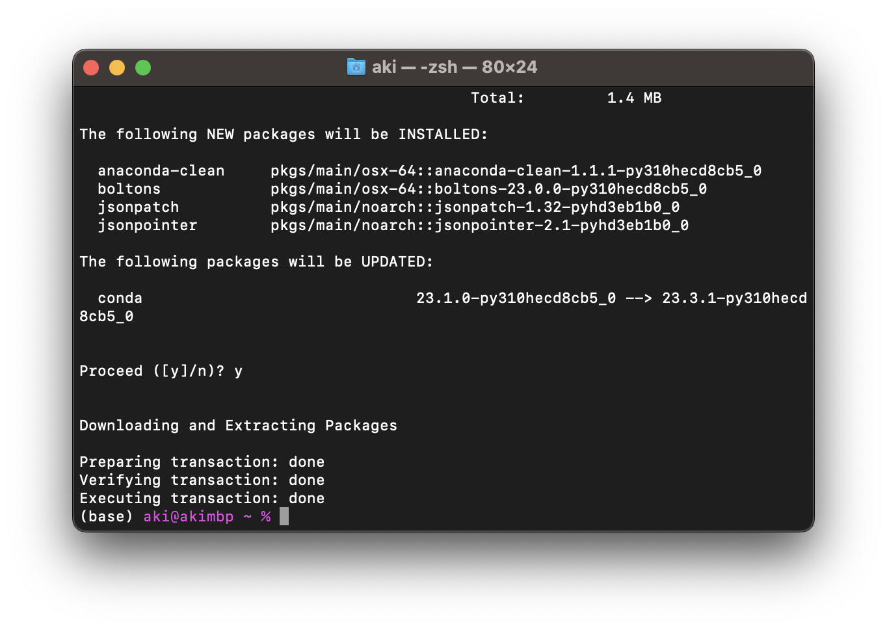
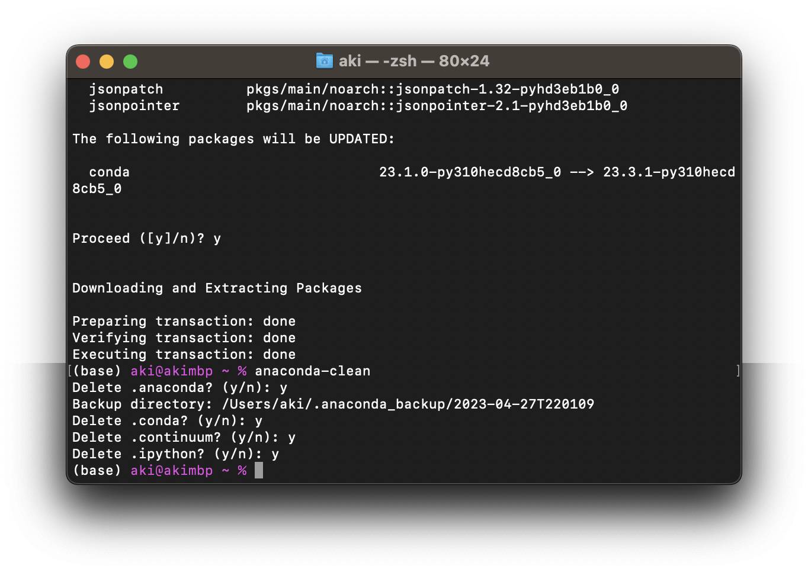
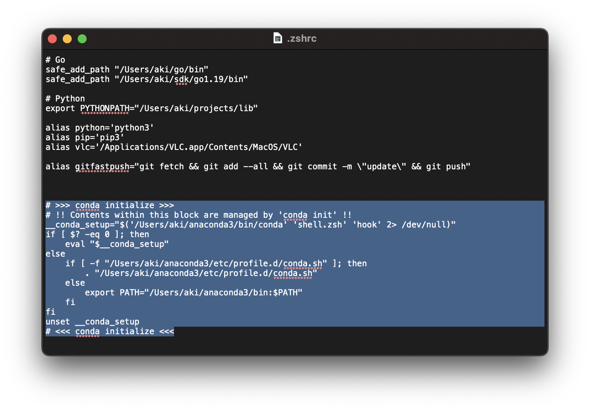
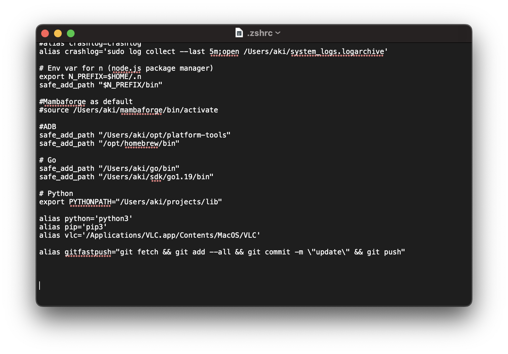

# Anacondaを完全にアンインストールする手順（for Mac）

## 準備

### 1. 「ターミナル」アプリを開く

アプリケーションの一覧から「ターミナル」アプリを開いてください。

### 2. `conda`コマンドが正常に使えることを確認する

ターミナルに`conda`と入力してエンターを押します。
この画像と同じような文字がずらっと表示されれば、`conda`コマンドが正常に使える状態なので、次に進んでください。
このような文字が表示されず、errorと表示される場合は、一緒に解決方法を探る必要があるのでチャットで連絡をください。

### 3. Anacondaをインストールした場所を確認する

テキストに沿って、デフォルトから何も変えずにインストールしていれば、ホームディレクトリの中にある`anaconda3`フォルダにAnacondaがインストールされています。

確認するには、ターミナルで`env | grep CONDA`と入力してエンターを押します。この中の`CONDA_PREFIX`というのがAnacondaをインストールした場所です。

ターミナルで、conda install anaconda-cleanと打ってエンターを押してください。最初はこんな感じに何行か表示されて、

